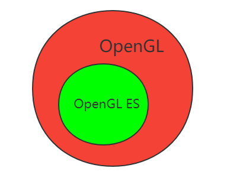
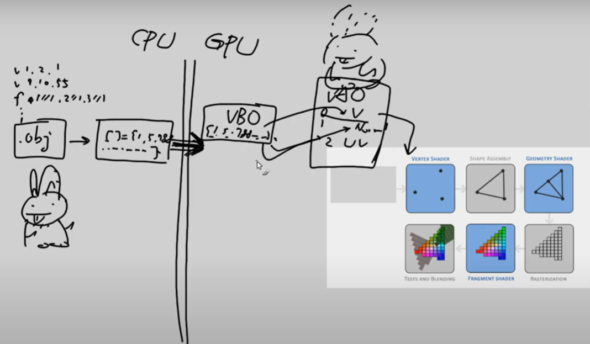
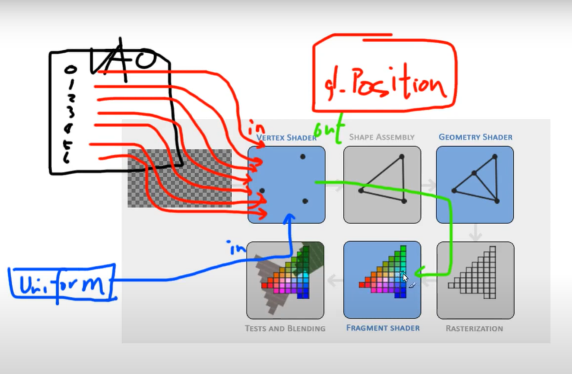

# 目录


# 环境搭建

## 运行opengl的环境

clion：https://blog.csdn.net/weixin_62264287/article/details/134716198     【OpenGL】Clion配置  -------->没试过

VsCode：https://www.bilibili.com/video/BV1BX4y1g7R6/?spm_id_from=333.337.search-card.all.click&vd_source=3eebd10b94a8a76eaf4b78bee8f23884           VsCode下配置OpenGL开发环境

AS： 直接使用AS，调用NDK接口


## 实时预览shader(GLSL)的环境

vscode安装插件：

> GLSL：用来编译
>
> glsl-canvas：用来显示


```
// test.frag
precision mediump float;

void main()
{
    vec3 color = vec3(1,0,0);
    gl_FragColor = vec4(color, 1);
}
```

------------>  运行： ctrl + shift + P ，搜索 show  glslcanvas

参考：

https://www.bilibili.com/video/BV1LV411b7uE?p=1&spm_id_from=pageDriver&vd_source=3eebd10b94a8a76eaf4b78bee8f23884

## 机器环境确认

EGL有1.0、1.1、1.2、1.3、1.4这几个版本，Android中使用的是1.4，EGL提供了查询版本的API，以下为Android中例子：

具体见：https://blog.csdn.net/qq_32067045/article/details/51044918?utm_medium=distribute.pc_relevant.none-task-blog-2~default~baidujs_baidulandingword~default-8-51044918-blog-45131113.235^v43^pc_blog_bottom_relevance_base7&spm=1001.2101.3001.4242.5&utm_relevant_index=11


# 基本概念

## OpenGL ES 与 OpenGL 




OpenGL ES 是 OpenGL 的子集（删除了一些**低效能的操作方式**）

## 图形渲染管线（Graphics Pipeline）

一个输送<font color='red'>管道</font>: 图形数据 到 屏幕过程

作用：

> 1、平面化：将3D坐标 ------> 2D坐标
>
> 2、光栅化：2D坐标  ------>  像素(实际的有颜色的)

注意：坐标是精准表达

渲染管线流程：

> 
>
> ~~图片来源:https://learnopengl-cn.github.io/01%20Getting%20started/04%20Hello%20Triangle/~~

数据流：



（1）建模型（比如兔子）： 顶点数据  +   面数据  ~~三角形面数据（面1基于点：点1 点3  点5）~~  

（2）序列化为数组[] int = {1,5，........}

   必然有：~~(3) 序列化的东西跨越到GPU~~

   （4）存到GPU的VBO（<font color='red'>一块buffer</font>）上

```
unsigned int VBO;
glGenBuffers(1, &VBO);
```

（5）VBO中的数据，反序列化为结构数据，VAO： 顶点数据  + 面数据 

  ----------------->  即兔子模型


（6）VAO中，顶点数据 -------------> 灌入，即vertext


# 一些接口/效果

## window

创建window（对于安卓，不需要）

参考：https://www.youtube.com/watch?v=ZoXqI2gOugs&list=PL0luF_aDUOooIB56NOFVTS4ahMzBHS_6z&index=2


## Triangle


# 着色器shader


## 输入



图：https://youtu.be/AL3W2JfVVgw?list=PL0luF_aDUOooIB56NOFVTS4ahMzBHS_6z&t=441


输入来源：
1、GPU可以从voa中挖数据（比如 从顶点数据中直接接收输入）
layout (location = 0)  -------> 0顶点的位置
layout (location = 0) in vec3 aPos;  ---->  赋值给aPos

2、从CPU获取（比如时间），uniform 通道：

（1） uniform 全局唯一
（2） 是更新一个uniform之前你必须先使用程序（调用glUseProgram)： glUseProgram(shaderProgram);

3、前面的shader的输出，可以作为后面shader的输入。比如：


## 输出：

片段着色器，必然有一个vec4颜色输出变量，作为最终颜色（RGBA）
推论：自然，这个颜色赋值，很可能计算于顶点着色器，最后传给片段着色器


https://blog.csdn.net/CodeWorld1999/article/details/134863461    一篇搞懂OpenGL中的着色器和如何使用


https://blog.csdn.net/u010281924/article/details/105309340   **OpenGL ES 3. 着色器 shader 的编译和使用**

--------->  图


## 补充 纹理

### cpp侧 构造纹理

加载纹理：

```
// 使用 stb_image.h
int width, height, nrChannels;
unsigned char *data = stbi_load("container.jpg", &width, &height, &nrChannels, 0);
```


创建纹理：

```
unsigned int texture;
glGenTextures(1, &texture);
glBindTexture(GL_TEXTURE_2D, texture);

glTexImage2D(GL_TEXTURE_2D, 0, GL_RGB, width, height, 0, GL_RGB, GL_UNSIGNED_BYTE, data);
--------------> 当前绑定的纹理对象texture就会被附加上纹理图像data
```

应用纹理：

> 新增纹理坐标------即截取：
>
> ```
> float vertices[] = {
> //     ---- 位置 ----       ---- 颜色 ----     - 纹理坐标 -
>      0.5f,  0.5f, 0.0f,   1.0f, 0.0f, 0.0f,   1.0f, 1.0f,   // 右上
>      0.5f, -0.5f, 0.0f,   0.0f, 1.0f, 0.0f,   1.0f, 0.0f,   // 右下
>     -0.5f, -0.5f, 0.0f,   0.0f, 0.0f, 1.0f,   0.0f, 0.0f,   // 左下
>     -0.5f,  0.5f, 0.0f,   1.0f, 1.0f, 0.0f,   0.0f, 1.0f    // 左上
> };
> ```
>
> 告诉OpenGL新的顶点格式（**顶点属性**）：
>
> ```
> glVertexAttribPointer(2, 2, GL_FLOAT, GL_FALSE, 8 * sizeof(float), (void*)(6 * sizeof(float)));
> glEnableVertexAttribArray(2);
> ```
>
> 

### glsl侧 接收纹理

顶点着色器新增：

```
#version 330 
....................
layout (location = 2) in vec2 aTexCoord;

out vec2 TexCoord;


void main()
{
   ....................
    TexCoord = aTexCoord;
}
```

把TexCoord输入给片段着色器：

```java
#version 330 core
............

................
in vec2 TexCoord;

uniform sampler2D ourTexture; // 【】cpp侧赋值 采样器

void main()
{
    FragColor = texture(ourTexture, TexCoord);
                        采样器         纹理坐标
}
```


【】cpp侧赋值 采样器ourTexture：-----> TODO

```
glBindTexture(GL_TEXTURE_2D, texture);
glBindVertexArray(VAO);
glDrawElements(GL_TRIANGLES, 6, GL_UNSIGNED_INT, 0);
```


TODO：

(为什么`sampler2D`变量是个uniform，我们却不用glUniform给它赋值)[https://learnopengl-cn.github.io/01%20Getting%20started/06%20Textures/#_8:~:text=%E4%B8%BA%E4%BB%80%E4%B9%88sampler2D%E5%8F%98%E9%87%8F%E6%98%AF%E4%B8%AAuniform%EF%BC%8C%E6%88%91%E4%BB%AC%E5%8D%B4%E4%B8%8D%E7%94%A8glUniform%E7%BB%99%E5%AE%83%E8%B5%8B%E5%80%BC]

### 混合色 TODO：


```
纹理颜色*顶点颜色
```


# 网站

正规的学习网站

> https://learnopengl.com/         学习网站
>
> https://learnopengl-cn.github.io/  对应的中文翻译网站


https://www.youtube.com/watch?v=1TVFHIQKCR0&list=PL0luF_aDUOooIB56NOFVTS4ahMzBHS_6z    视频教程

https://www.youtube.com/watch?v=W3gAzLwfIP0&list=PLlrATfBNZ98foTJPJ_Ev03o2oq3-GGOS2    英文视频教程

 API网站：

> https://docs.gl/             API网站  es2  es3 gl2 gl3 gl4
>
> https://blog.csdn.net/linjf520/article/details/106434989   中文


https://blog.csdn.net/junzia/category_6462864.html         湖广午王  OpenGLES系列文章（21篇）

https://blog.csdn.net/u010281924/category_7841161.html   OpenGL 基础


https://github.com/KentTJ/AndroidOpenGLDemo/tree/master   我的openGL  demo


https://edu.csdn.net/course/detail/19367?spm=1001.2101.3001.6650.14&utm_medium=distribute.pc_relevant.none-task-course-2%7Edefault%7EBlogCommendFromBaidu%7ERate-14-19367-blog-88880831.235%5Ev43%5Econtrol&depth_1-utm_source=distribute.pc_relevant.none-task-course-2%7Edefault%7EBlogCommendFromBaidu%7ERate-14-19367-blog-88880831.235%5Ev43%5Econtrol&utm_relevant_index=21         Android C++ OpenGL 视频课程

https://www.bilibili.com/video/BV1yx41187GN/?spm_id_from=333.337.search-card.all.click&vd_source=3eebd10b94a8a76eaf4b78bee8f23884               Android OpenGL ES教学视频

--------------------->  TODO: 这里有教蒙板


https://blog.csdn.net/a360940265a/article/details/88600962          OpenGL.Shader：1-重新认识Android上OpenGL（纯Cpp）


https://www.bilibili.com/video/BV1LV411b7uE?p=1&spm_id_from=pageDriver&vd_source=3eebd10b94a8a76eaf4b78bee8f23884   中文视频教程，shader的画法


https://blog.csdn.net/qq_43331089/article/details/124200849         西川善司的3D图形技术概念和渲染管线的处理


# TODO：

opengl 与surface的关系，尤其是opengl  与 **GLSurfaceView** 的关系