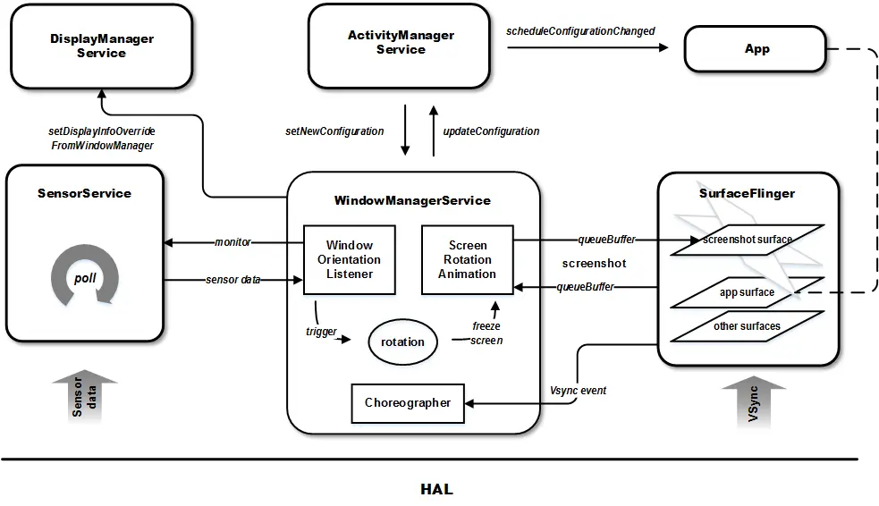
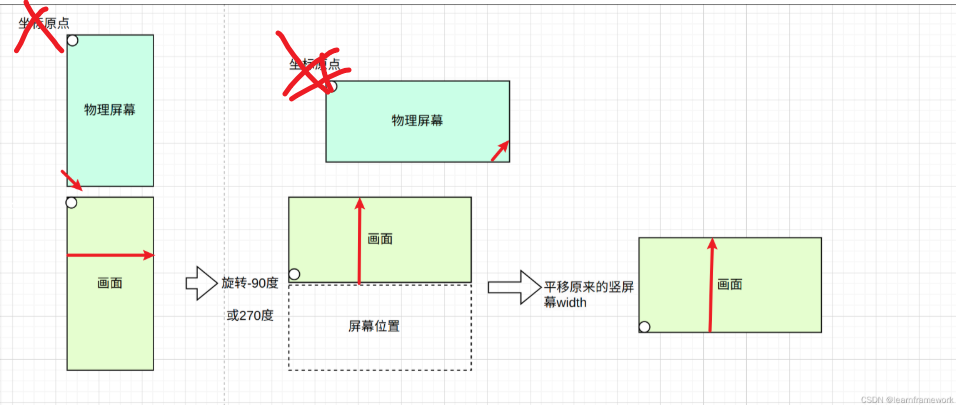

# 目录

# WMS动画系统

分类：

> 窗口动画
>
> 过渡动画
>
> 屏幕旋转动画

TODO: 区别

# Android 动画原理

Android中动画的工作过程：
在某一个时间点，调用getTransformation()，根据mStartTime和mDuration，**计算出当前的进度，**在根据mInterpolator计算出转换的进度，然后计算出属性的当前值，保存在matrix中。 再调用Matrix.getValues将属性值取出，运用在动画目标上。

## Animation 和 Transform


Animation ：

​           给定了初始状态、结束状态、启动时间与持续时间  ------>  **用于计算 Transformation**

Transformation：

​             Transformation 描述了一个变换，即：透明度和一个二维变换矩阵


补充Animation 子类：

> 子类：TranslateAnimation，ScaleAnimation，RotateAnimation，AlphaAnimation

## Choreographer

VSync信号驱动动画


# 窗口动画


# 过渡动画


# 屏幕旋转动画

参考：https://juejin.cn/post/7026611124482670600

触发点（自然时机）： 

​       屏幕旋转<font color='red'>之后</font>   注意：此时动画还没开启

代码触发点：

> TODO: 具体哪个模块？
>
> OrientationListener#onProposedRotationChanged
>
> ​         -------> WMS#updateRotation

## 0层框架



图片来源： https://www.jianshu.com/p/217d0239ca19


## 0层纵向

基于0层框架，不得不：

1、**屏幕旋转的核心 -----> 必然是wms**：承载了window的新建，以及动画

2、when： 旋转的信号是谁通知的wms？传感器 ----> SensorService   ----> WMS

3、what：做了啥事？


## 动画素材来源----截图

动画启动的最基本元素

来源， 截图：

```java
// ScreenRotationAnimation

final SurfaceControl.Transaction t = mService.mTransactionFactory.get();
SurfaceControl.LayerCaptureArgs args =
    new SurfaceControl.LayerCaptureArgs.Builder(displayContent.getSurfaceControl())
    .setCaptureSecureLayers(true)
    .setAllowProtected(true)
    .setSourceCrop(new Rect(0, 0, mWidth, mHeight))
    .build();
SurfaceControl.ScreenshotHardwareBuffer screenshotBuffer =
    SurfaceControl.captureLayers(args);

// 这一大段就是抓取截图绑定到mScreenshotLayer
GraphicBuffer buffer = GraphicBuffer.createFromHardwareBuffer(
    screenshotBuffer.getHardwareBuffer());
t.setBuffer(mScreenshotLayer, buffer);
```


承载的surface：

```java
 // mScreenshotLayer是真正用于旋转动画的surface           
mScreenshotLayer = displayContent.makeOverlay()
```


setRotationTransform 中  mScreenshotLayer承载的数据，被旋转
        t.setPosition(mScreenshotLayer, x, y);
        t.setMatrix(mScreenshotLayer,
                mTmpFloats[Matrix.MSCALE_X], mTmpFloats[Matrix.MSKEW_Y],
                mTmpFloats[Matrix.MSKEW_X], mTmpFloats[Matrix.MSCALE_Y]);

```java
    t.setAlpha(mScreenshotLayer, (float) 1.0);
    t.show(mScreenshotLayer);
```


截图获取bitmap方法：

```java
final SurfaceControl.ScreenshotHardwareBuffer screenshotBuffer =
    SurfaceControl.captureDisplay(captureArgs);
screenshot = screenshotBuffer == null ? null : screenshotBuffer.asBitmap();
// 参考： https://blog.csdn.net/weixin_46297800/article/details/131939823


// 转成png
Bitmap bitmap = screenshotBuffer.asBitmap();
OutputStream os = new FileOutputStream("/sdcard/screen.png");
bitmap.compress(Bitmap.CompressFormat.PNG, 100, os);
os.flush();
os.close();
```


```
Bitmap bitmap = null;
Class<?> cls  = Class.forName("android.view.SurfaceControl");
Method method = cls.getMethod("screenshot", Rect.class, int.class, int.class, int.class);
Object obj = method.invoke(null, new Rect(0, 0, 500, 1000), 500, 1000, 0);
bitmap = (Bitmap) obj;
```


```java
String  name = "app2";
File cacheDir = context.getCacheDir();
Log.i("liuhongliang","cacheDir" + cacheDir.toString());
cachePath = "/sdcard/" + name + ".png";
String cmd = "screencap -p /sdcard/" + name + ".png";
// 权限设置
Process p = Runtime.getRuntime().exec("sh"); //Process process = rt.exec("su");
// 获取输出流
OutputStream outputStream = p.getOutputStream();
DataOutputStream dataOutputStream = new DataOutputStream(
    outputStream);
// 将命令写入
dataOutputStream.writeBytes(cmd);
// 提交命令
dataOutputStream.flush();
// 关闭流操作
dataOutputStream.close();
outputStream.close();

```

TODO:  

**冻屏动画**或者**无缝动画**


最开始截图，需要调整一下**初始位置**：



参考： https://blog.csdn.net/learnframework/article/details/129972954

TODO：补充画面重新加载，方向变化的图


几个结论：

1、物理屏幕的旋转，是<font color='red'>基于物理世界的</font>，（想象是<font color='red'>黑屏下</font>）没有旋转中心 或者  以任意旋转中心    ------> 所以，对代码没有任何影响

​     **物理屏幕没有 坐标原点的概念**

2、没有重新加载的画面的旋转：-----><font color='red'> 即是动画截屏的第一帧</font>

​    （1）图片相对于屏幕完全静止

​    （2）有坐标原点的概念：基于物理屏幕，坐标原点是物理屏幕的左上角   ----------->  给代码模型用的

​      

3、1和2本质上是一个操作，即物理屏幕旋转 + 画面相对于物理屏没动

4、基于3，截图开始动

5、新的画面重新加载，方向也变化了


```java
04-05 16:16:41.723   565   586 I WindowManager: createAnimationLeash type = screen_rotation
04-05 16:16:41.723   565   586 I WindowManager: java.lang.Exception
04-05 16:16:41.723   565   586 I WindowManager: 	at com.android.server.wm.SurfaceAnimator.createAnimationLeash(SurfaceAnimator.java:458)
04-05 16:16:41.723   565   586 I WindowManager: 	at com.android.server.wm.SurfaceAnimator.startAnimation(SurfaceAnimator.java:184)
04-05 16:16:41.723   565   586 I WindowManager: 	at com.android.server.wm.SurfaceAnimator.startAnimation(SurfaceAnimator.java:213)
04-05 16:16:41.723   565   586 I WindowManager: 	at com.android.server.wm.ScreenRotationAnimation$SurfaceRotationAnimationController.startAnimation(ScreenRotationAnimation.java:697)
04-05 16:16:41.723   565   586 I WindowManager: 	at com.android.server.wm.ScreenRotationAnimation$SurfaceRotationAnimationController.startDisplayRotation(ScreenRotationAnimation.java:580)
04-05 16:16:41.723   565   586 I WindowManager: 	at com.android.server.wm.ScreenRotationAnimation$SurfaceRotationAnimationController.startScreenRotationAnimation(ScreenRotationAnimation.java:563)
04-05 16:16:41.723   565   586 I WindowManager: 	at com.android.server.wm.ScreenRotationAnimation.startAnimation(ScreenRotationAnimation.java:422)
04-05 16:16:41.723   565   586 I WindowManager: 	at com.android.server.wm.ScreenRotationAnimation.dismiss(ScreenRotationAnimation.java:440)
04-05 16:16:41.723   565   586 I WindowManager: 	at com.android.server.wm.WindowManagerService.doStopFreezingDisplayLocked(WindowManagerService.java:6157)
04-05 16:16:41.723   565   586 I WindowManager: 	at com.android.server.wm.WindowManagerService.stopFreezingDisplayLocked(WindowManagerService.java:6116)
04-05 16:16:41.723   565   586 I WindowManager: 	at com.android.server.wm.RootWindowContainer.performSurfacePlacementNoTrace(RootWindowContainer.java:890)
04-05 16:16:41.723   565   586 I WindowManager: 	at com.android.server.wm.RootWindowContainer.performSurfacePlacement(RootWindowContainer.java:784)
04-05 16:16:41.723   565   586 I WindowManager: 	at com.android.server.wm.WindowSurfacePlacer.performSurfacePlacementLoop(WindowSurfacePlacer.java:177)
04-05 16:16:41.723   565   586 I WindowManager: 	at com.android.server.wm.WindowSurfacePlacer.performSurfacePlacement(WindowSurfacePlacer.java:126)
04-05 16:16:41.723   565   586 I WindowManager: 	at com.android.server.wm.WindowSurfacePlacer.performSurfacePlacement(WindowSurfacePlacer.java:115)
04-05 16:16:41.723   565   586 I WindowManager: 	at com.android.server.wm.WindowSurfacePlacer$Traverser.run(WindowSurfacePlacer.java:57)
04-05 16:16:41.723   565   586 I WindowManager: 	at android.os.Handler.handleCallback(Handler.java:942)
04-05 16:16:41.723   565   586 I WindowManager: 	at android.os.Handler.dispatchMessage(Handler.java:99)
04-05 16:16:41.723   565   586 I WindowManager: 	at android.os.Looper.loopOnce(Looper.java:201)
04-05 16:16:41.723   565   586 I WindowManager: 	at android.os.Looper.loop(Looper.java:288)
04-05 16:16:41.723   565   586 I WindowManager: 	at android.os.HandlerThread.run(HandlerThread.java:67)
04-05 16:16:41.723   565   586 I WindowManager: 	at com.android.server.ServiceThread.run(ServiceThread.java:44)

```


## 横竖屏切换动画时间优化方案

https://zhuanlan.zhihu.com/p/265291842


## 旋转屏幕的一些认知

1、<font color='red'>横向永远是x</font>（即旋转后，x值更大）

2、更新surface位置   <------------>  布局窗口relayoutWindow  何时？

**最终逃不过的点，不得不：** 

> SurfaceControl.setPosition

```java
setPosition:2756, SurfaceControl$Transaction (android.view)
lambda$new$1$WindowState:854, WindowState (com.android.server.wm)
accept:-1, WindowState$$ExternalSyntheticLambda3 (com.android.server.wm)
updateSurfacePosition:5547, WindowState (com.android.server.wm)
updateSurfacePositionNonOrganized:3042, WindowContainer (com.android.server.wm)
prepareSurfaces:5491, WindowState (com.android.server.wm)
prepareSurfaces:2445, WindowContainer (com.android.server.wm)
prepareSurfaces:2445, WindowContainer (com.android.server.wm)
prepareSurfaces:2445, WindowContainer (com.android.server.wm)
prepareSurfaces:644, DisplayArea$Dimmable (com.android.server.wm)
prepareSurfaces:4879, DisplayContent (com.android.server.wm)
applySurfaceChangesTransaction:4335, DisplayContent (com.android.server.wm)
applySurfaceChangesTransaction:1068, RootWindowContainer (com.android.server.wm)
performSurfacePlacementNoTrace:844, RootWindowContainer (com.android.server.wm)
performSurfacePlacement:797, RootWindowContainer (com.android.server.wm)
performSurfacePlacementLoop:177, WindowSurfacePlacer (com.android.server.wm)  ------>  这里，所有
performSurfacePlacement:126, WindowSurfacePlacer (com.android.server.wm)
relayoutWindow:2386, WindowManagerService (com.android.server.wm)
relayout:235, Session (com.android.server.wm)
onTransact:735, IWindowSession$Stub (android.view)
onTransact:169, Session (com.android.server.wm)
execTransactInternal:1184, Binder (android.os)
execTransact:1143, Binder (android.os)
```


#  View动画 

https://www.youtube.com/watch?v=S20kdGUOnAw


# 参考

https://blog.csdn.net/SSSxCCC/article/details/119324066    转屏动画 - 安卓R

https://juejin.cn/post/6982153383880687624#heading-7     Android R WindowManagerService模块(7) 屏幕旋转流程(2)


https://www.cnblogs.com/dyufei/p/8081936.html    [Android 7.1 WindowManagerService 屏幕旋转流程分析 ](https://www.cnblogs.com/dyufei/p/8081936.html)


# 抛开动画代码


# 动画背后的思想