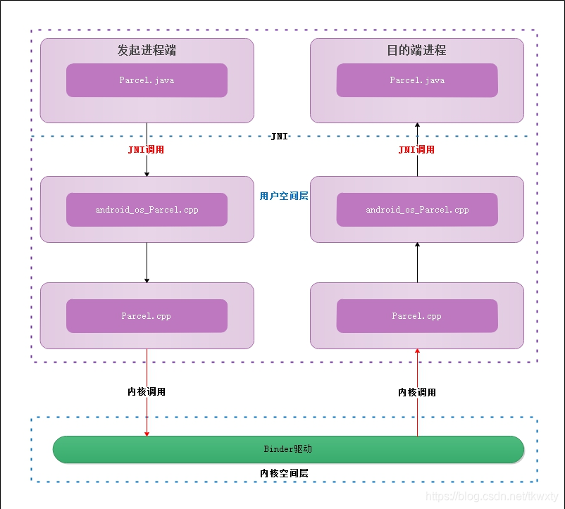

# 目录

[TOC]


# IPC前提 序列化

## **序列化的本质是啥？**

**Java序列化的本质是将Java对象保存为二进制字节码。-----> 进而可以传输 +  存储**

传输有哪些，传输为什么要序列化？
传输：网络传输、进程间通信IPC
为什么？---->
本质在于：同一进程间，对象的传递 <------> 传地址内存。。。同一进程有统一的内存
                    不同进程间，内存是独立的

存储为什么序列化？？（-----> 电脑上存储都是二进制的）

一座大厦好比一个对象，你要把这座大厦搬到另外一个地方去，你想直接挪肯定不行吧？(一般来说，只有传值，没有传对象)但我可以搬砖头吧，一个一个搬，然后搬到目的地重新组合成一个大厦，而序列化就起到了将大厦分成砖头的作用.

TODO：最底层逻辑，如何做到的呢？？？
TODO：为什么会很高效？？？没有序列化结构，只是序列化数据


补充:HW笔记


序列化结果:  字节序列


TODO:

> 序列化，底层的承载是啥？一个buffer吗？还是？


## 安卓序列化源码分析

--->Parcel序列化

### 0层

https://blog.csdn.net/tkwxty/article/details/107916160   内核




Todo：内核调用怎么理解？？？--->系统调用
           用户空间与内核空间怎么理解？？？


### J_parcel的获取与recycle()


```java
 //parcel.java
private static final Parcel[] sOwnedPool = new Parcel[POOL_SIZE];//1  6个对象的对象池

    public static Parcel obtain() {
        final Parcel[] pool = sOwnedPool;
        synchronized (pool) {
            Parcel p;
            for (int i=0; i<POOL_SIZE; i++) {
                p = pool[i];
                if (p != null) {
                    pool[i] = null;// 2 用了之后，引用置空--->但是有其他引用
                    if (DEBUG_RECYCLE) {
                        p.mStack = new RuntimeException();
                    }
                    p.mReadWriteHelper = ReadWriteHelper.DEFAULT;//todo:作用？？？
                    return p;
                }
            }
        }
        return new Parcel(0);//3 新建，没加入对象池里面！
    }
```

//1 用了对象池：1、由于parcel对象创建+释放的非常频繁---->消耗资源 2、不是轻量级对象

// 3 自然的，没加入代表在使用---->recycle时，有可能加入对象池（前提：有空位）,见#3_1

```java
    public final void recycle() {
        if (DEBUG_RECYCLE) mStack = null;
        freeBuffer();

        final Parcel[] pool;
        if (mOwnsNativeParcelObject) {
            pool = sOwnedPool;
        } else {
            mNativePtr = 0;
            pool = sHolderPool;
        }

        synchronized (pool) {
            for (int i=0; i<POOL_SIZE; i++) {
                if (pool[i]  null) {
                    pool[i] = this;// #3_1
                    return;
                }
            }
        }
    }

```

###   构造的过程是怎样的？


```java
//Parcel.java
    private Parcel(long nativePtr) {
        if (DEBUG_RECYCLE) {
            mStack = new RuntimeException();
        }
        init(nativePtr);
    }
```


### parcel与Ibinder的关系？？？

