# 目录

[TOC]


# 写在前面

读代码，最核心的核心，在于：

1、识别架构  ------->   从代码中抽出模块。<font color='red'>抽象出模块交互图</font>

2、架构的背后  ------->  **抛开代码**，理解架构的背后，<font color='red'>理解交互图的背后</font>

3、了解背后的自然法则 -------->  走向生活


不要将自己限于，知道接口怎么使用，这种low的水平

`规定：每一技术文章，必须有的点：`

> 架构  ---->  <font color='red'>架构背后的思想</font>  ---->  <font color='red'>自然法则，生活化 </font>  
>
>  ---->  <font color='red'>基于自然法则的扩展</font>（走向具体）


-<font color='red'>生活，是理解抽象的  唯一手段</font>   代码亦如是


<font color='red'>代码的合理性，永远在代码之外</font>


# 待整理TODO:


面向对象精髓：

1、对象+关系  （全局视角）

2、入口与出口（个体视角）


代码的精髓：流（小蝌蚪的涌动）


时时刻刻把握住入口和出口！ + 时刻把握位置 + 时刻要有对象的思想（就是一个人！！！！！）

一个模块的入口和出口

一个类的入口和出口

同理，任何系统无非干两件事：输入和输出，接收到外部输入信号后经过操作系统处理后输出信息。


位置：

哪个线程、哪个模块、哪个层！！！！

看代码，按照功能块来看。。。。比如一个类太大，森林太大=>功能块总是

相对独立的，我们看一个功能块就行。。比如森林里的一块池塘，比如人体的消化系统

识别了类的一个功能块，就ok了，心里不要慌

看代码一定要有层的概念。。。比对象概念高一级

其实有对象的地方，就有层

比如，应用和我们以及内核--------->就是层的概念


提升工程架构思维，软件工程思想都是相通的，境界会得到提升！！！！只要一个领域做到极致， 换新领域你也能做到极致。


好奇心比雄心走得更远：很多人对未来空有满腔的雄心壮志，往往不如对技术要有一份好奇心，一份探索欲，再加上一份执着的人。

思考，问题，好奇心


一个类的主要功能，接口


不要做很详细的笔记，很烂，因为很具体，你根本记不住

干事的进展，要记录下来。这样有叠加性，后期可以追溯。关键写在纸上，可以分析

常常问一下你能说出个123嘛？

说出123，倒逼你了解细节，以输出倒逼理解

要重视你的话，称呼，反应了你对事物的理解：

比如Z无障碍，你可以把它称为Z无障碍服务（Z的adpter+A的无障碍服务）

contentview粒度

systemui，空指针，会重启

lunyin

surface是内存，是内存的数据结构，理解为像素

canvas是抽象的画布

client，sendEvent那条路，你没有说清楚

命令的多句并列执行

价值，问题有没有价值,xuji

差异化，改动，才能认识深刻

比如，改变颜色，看看。改动大小

通过问题，熟悉代码很快

冲突，问题，差异化都是好东西

冲突，问题，差异化，不要死磕，先一定思考+求助别人>最后反思成文

调用别人接口，

1、会不会耗时，

2、多线程调用


把握住入口和出口：1、理解代码。2、记忆。3、打log也是。     最好是唯一的入口和出口，任何bug都可以倒逼

出口和入口表现为：

模块的

类的，即public


如何提高调试的效率和精确度？技巧：

1、在log里设置起始标志，之前log的全删

2、所有view里的log，加地址+宽高>区分

对于应用，设置不同颜色

3、分层


分层，

代码，应用与底层，社会

为什么要分层？


为啥做编写代码时，整一个空的接口？

1、先搭架子   2、符合计算机思维，拆解问题   3、`本质原因：人脑子有限，只能想清楚一个调用frame里的逻辑`

注意：上一frame定义了getNextString   ------>`该接口功能必须定义清楚`，下一frame实现起来才清楚
                                                                        ------->规定：必须文字写上


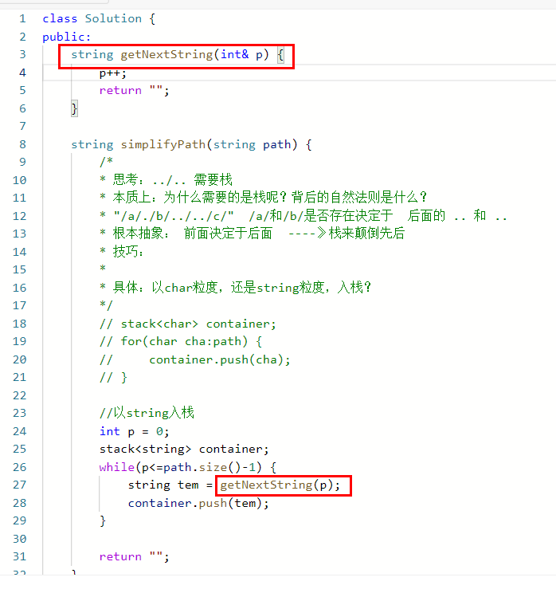


# 理解代码架构


## **代码就是一片很多岔路口的森林**

**又如人之间**

我们如何认识森林，就如何理解代码

（0）如果有现成的地图----架构图（文档），先看地图

如何理解人物，就如何理解代码。类即是人！！！！

如何认识一个新类？----->如何认识一个新人？？先看表象：

（1）先看长的怎么样：对外接口-------->猜测做啥的，人物关系

对于陌生代码，先画地图，然后跟着地图分析具体过程

画地图---->调用栈+plantUml，可以无脑画

看log，第一步，一定是用空行分层

不要用人脑直接对抗机器

（2）看源码目录结构

为什么输出不了xuji的0层图？？？--->即静态的架构图？？？
原因在于：
你只走了地图中的一条路，只熟悉了一条路。你看不到其他路是怎么样的

## **为什么我记不住代码？**

-------->如何记忆代码

永远不要记代码，因为你也永远无法记忆一片森林，记的是：

​        (1)自己的话！！！！！！！！，而非英文代码

​        (2)记忆森林中关键路，关键路上的一些关键标志，比如凉亭：要记关键流程的 时序图。注意：记忆时序图，也只是记忆关键类的关键方法（最大限度的抽象，才能成为记忆之锚，理解之锚）。。。

（3）记忆流程按照块来记，模块指定了流程的方向，不得不

规定：一个流程，必须回答：

- 从进程角度看整个：

  > ​    进程树中的位置（谁启动，启动谁）  
  >
  > ​    运行态的进程交互、线程交互

-   核心类是啥，在哪个进程里？？？主要功能是啥？？？有哪些对外接口 =>不要记忆动态的流程！！！

​         动态的调用流程太长，你记不住的！！！！！------> 记忆每个类的功能，方向是自然的！！！不得不的！！！！

-   做了啥（做事的直接时机是啥？间接时机？与主干哪个时机挂钩？---> 记忆之锚）
-    业务场景是啥（用户点击等）
-   入口在哪，交互点
-   该流程的启动时机
-   涉及哪几个进程----->即模块架构
-   模块之间的通信是怎样的？
-   有哪些关键流程点
-   时机：何时新建的？初始化时机比较重要
-   变量的流转流程
-   是否是单例？--->为什么要用单例？
-   不断去抽象，**更高层、更高层、更高层（方向）**！！！！！！！=>甚至0层！！更容易记忆

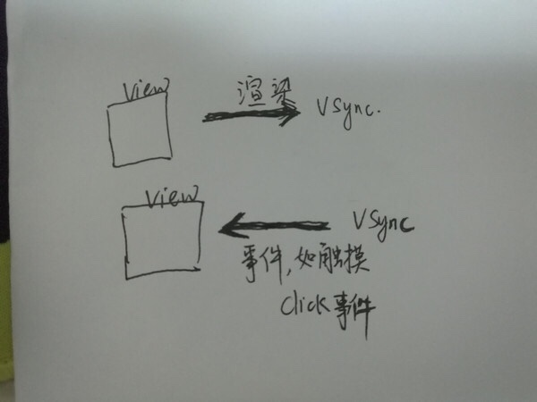

-   主干的生命周期是啥？（其实任何一个事物都是一个对象，都有生命周期）对象的生命周期，线程的生命周期，模块的生命周期
-   <font color='red'>极度化简</font>
-   反馈-----------网上搜面试题（相当于课后题）


## 多画0层图、1层图


体会：**<font color='red'>如果要真正理解一个东西，一定要走向抽象、走向简单、甚至走向忘记</font>**。~~无论是知识、方法、习惯、、、、、、、、~~

包括画图本身，也是抽象过程：具体代码 ---> N层 ---> 2层 ---> 1层 ---> 0层 

注意：没必要N层很熟悉了，再画0层；对于一个`新项目，先画0层（根据接口），后期再修正`

​             `对于设计，一定是抽象走向具体`：设计0层 ---> 设计1层 --->........具体代码

​			封装性，也体现了代码实现过程，抽象到具体：leetcode 在主要函数里，先加空实现函数A(), 之后再实现


记忆与理解的关键做好链接：
0层代码与0层图的链接（其实是映射）
1层代码与1层图的链接（其实是映射）

0层代码与1层代码的链接
0层图与1层图的<font color='red'>链接： </font>

链接方向：
实际物体—0层架构-1层架构（0层放大）-1层流程图
TODO:  反过来呢？是不是应该让实际依附0层架构呢？

<font color='green'>**规定**</font>：0层时序，必须有方向简化
**<font color='green'>规定</font>**：研究完0层时序（纵向），必须横向看

**<font color='green'>规定</font>：**借鉴土木画图的方法，<font color='green'>1层架构图必须基于0层架构图</font>，放大版（<font color='red'>保证方向</font>和形状不变）！！！！！否则，认为无效


## 0层之纵向运行时0层

对于多线程的流程，运行时0层，`从进程、线程的角度去分析，更本质` 
------>  <font color='red'>线程结构 + 数据流转 才是 真正意义上的 0层架构，表达了运行时的0层</font>

EX1:

 

**`0层需要关注（需要回答的问题）`：数据运行在哪个进程的线程**


EX2:

IMM-IMMS-IMS 之间关系


问题： 图中，以线还是 框  代表线程呢？
           如果<font color='red'>以框，一定要在框里区别，这是IMS还是IMS线程！！！！！！  </font>


## 0层之子系统间关系图

0层之子系统间关系，`即系统功能划分`---->当前模块在整个系统中的位置，与其他的联系

例子1，xu view框架---0层

具体技巧：对于一个`新项目，先画子系统间关系（根据接口），后期再修正`

例子2：


## 0层之模型图/结构图

我们记忆的是模型，而不是代码实现
面试讨论的也是模型
你要增长的核心能力，也是理解模型能力（更甚者，发展模型，建立模型的能力）

`模型的本质就是数据结构(模型是更生活化的语言)：` 
(1)、什么样的模型：一堆数据，如何组织起来

比如，flutter的三棵树

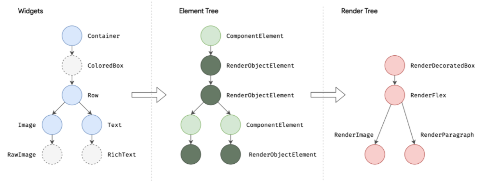

(2)模型承载了啥、主要作用是啥------>从层的角度来看

比如：

(2)模型(数据结构)的建立过程

(3) 模型的维护过程

(4) 模型的生命周期

(5)`基于模型`，分析其他重要流程


问题在于：TODO: `对于现有代码，如何在代码里抽象出最核心的模型？`

TODO:<font color='red'> 每个子系统都有模型图吗？输入法有吗？</font>


程序的本质：<font color='red'>信息沿着 结构图流动</font>


结构图的`缺陷`：能展现正常运行态，但是展示不了，搭建结构的过程
补齐能力：0层时序

## 0层时序图

一般时序不是0层。但是需要一个`0层时序，串起来整个系统`（至少多个子系统）。`串起来所有模块，保证所有模块有条不紊`。

方式一：
A- uiTask- IOTask- GPU Task

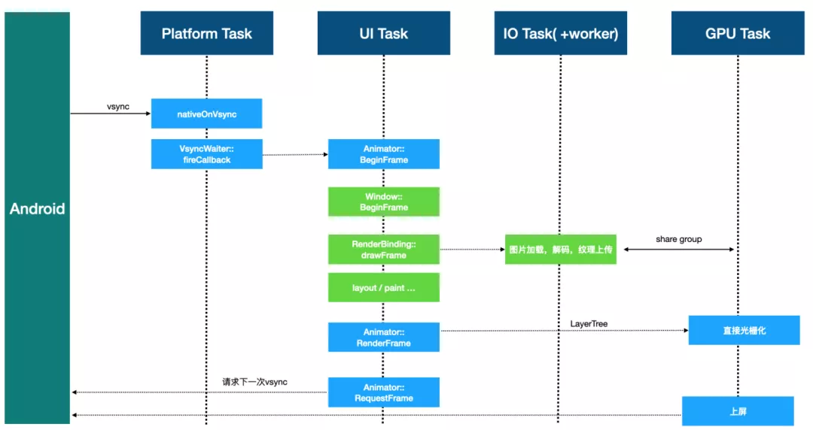


方式二（**推荐方式**）：用思维导图方式
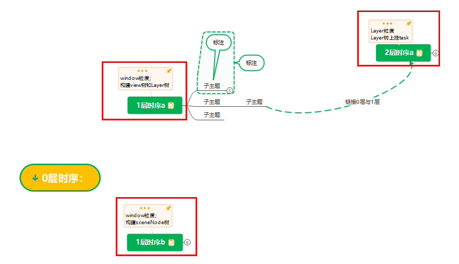

优点：
1、`折叠起非1层------> 便是0层大的时序，不会陷入细节`:  1层时序a ---> 2层时序a ---> 1层时序b

0层的<font color='red'>几个绿色框---->记忆之锚</font>，即使是不能折叠的情况下，也只关注0层的几个绿框关系，<font color='red'>锚要牢记</font>

2、展开情况下，又能看到0层与其他层的链接关系。**在方式1做不到这一点，要么过于细致，要么只有0层，没有链接其他层**


3、很好的`契合了人脑的思维+记忆方式`：frame + 链接。三个frame + 链接

4、`方向性要比方式1好，易于记忆`：<font color='red'>信息的流动总是 先向右再向下</font>

5、很好地链接了代码

6、折叠性解决了调用栈的复杂性


总之：思维导图画时序图核心在于，<font color='red'>善于利用折叠，牢记0层的锚点顺序。</font>

**规定：**（1）0层时序第一个子主题必须用中文描述，干了啥
            （2）看0层时序时，必须想着0层架构图或实际图。。。**<font color='red'>让0层时序依附0层架构图或实际场景--》原因在于，时序图不适合用于记忆？</font>**


## 1层之核心类图+作用

例子，xu view框架---Native简图

## N层之核心类继承关系

## N层之模型图拆解（注释）


## N层之基础设施

`基础设施是桥梁`，拿来用的，`你知道怎么过桥就行`;  但是 `至少有一次要了解桥怎么搭建的`

基础设施，比如：IPC桥梁、JNI桥梁、高低软注册桥梁

1、怎么过桥：(1)怎么写代码   (2)怎么快速索引代码，比如上述三个

2、桥怎么搭建：背后机制具体实现


## N层之使用

从`开发者`或者`新开发一个控件`角度去看，如何使用一个已经有的框架：需要做哪些

比如，xu  view框架---无障碍、事件和手势

## TODO:其他

关于进程，区分在哪一张图里呢？？还是每一张图

如何了解一个类做了啥？接口+doc，看public API（包括.h）

如何了解一个模块做了啥？找两个模块之间的API （统一的interface，比如aidl、interface；非统一的，A调B的public函数）----->  **抽象：横向看调了哪些方法，不看某一方法实现细节**


关于<font color='red'>模型，关于自然法则，一定要找到物理模型（生活模型），这样才更好理解</font>

## 自然法则：

给出上述每一张图背后的自然法则：

为什么会是这样？背后的美学在哪里？必然性在哪里？生活(哲学)原理在哪里？
有没有不好的地方？违背自然法则的地方？


设计模式----------无模式，不代码

像解答 证明题一样，证明代码为什么是这样写的   


##  给出0层设计、一层设计、二层设计

`规定:`任意一个项目，至少给出0层设计、一层设计！！！！


按照提交人，看代码---->剥离出特定功能

记忆：主要类图（静）和主要时序图（动）------>相辅相成


时刻把类想象成一个人

一个人，有哪些东西

一个人，可以有哪些能力


其实，任何事情都是？ 有没有深刻理解，一定要看有没有回答很多问题，尤其是本质的一些问题！！！！！！！！以问题驱动理解

那么，如何提一些常见性问题、以后后续的本质问题？


避免模糊性词语，会欺骗你

比如安卓画的>就把所有细节掩盖过去了，欺骗了你自己

安卓进程还是z进程？

安卓的类？还是z的类？

安卓的哪个进程？

具体怎么画的？哪个类负责的？

画在哪个surfaceview上？

怎么画的？

如果是在A的view上，怎么处理与Z的surface view关系？遮挡

## 更深的理解来源于本质的实现

比如bep一致性；再比如 进程的理解：进程实体、

------>所以，深入理解计算机系统非常重要！！！！

需要了解到什么程度？具体技巧：理解了一个`功能`的`实现机制`，并能画出实现机制的`模型图`。。。比如：


## 用面向对象的语言去描述事情！

永远不要说，A类调了B类的 **onTouchEvent**(MotionEvent event)接口！！！！！！！

而是：

（1）A将事件（MotionEvent）让B处理了（**onTouchEvent**）

（2）或：A分发事件给B，让B去处理

-------->可见，整个代码体系，从来都没有代码，只是背后的对象本质

## **为什么我不能从代码中抽象出xu的图？**

**---->如何从代码中提炼主要类图和主要时序图？-->即如何寻找主干？**

寻找代码主干的方法：

（0）你无法在森林里找到主路的，除非你有地图：

找他人，网上要地图：设计文档，流程图

但是有一点你要保证： 别人告诉了你路的大致方向后，只有你自己走一遍路，路才是你的！！！！！否则记忆别人说的，不可靠！！！！！

什么叫走一遍：沿着log，回答上面问题

（1）初步用ea自动生成类图，找出主要类（以及主要调用方向）    

一群人干了几件事情

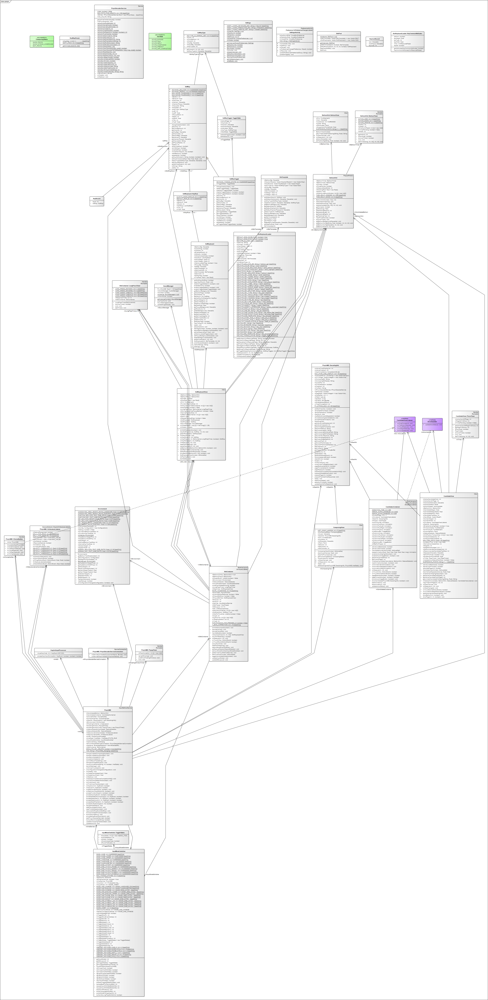

**（2）运行起来，打调用栈及log------->无法识别主干**

技巧：网上下载的项目，如何运行起来？？？？？很多报错

尤其是版本对不上。。。。。代码和sdk和手机版本对

----->比较好的方法是：注释掉！！！   因为版本错位的代码都非主干代码！！！

比如编译时报错：           错误：找不到符号 类XXX 位置：程序包 com.xxx.xxx

3、为什么我听不懂别人说话？

**大致方向：**

阅读代码有两种模式: top-down和bottom-

upo

Top-down模式,就是先设定一个use case,

比如说打开一个文件。然后静态跟着代码看,

或者用debugger跟着看。每次出现函数识m

的时候,把函数的执行层次纪录下来。大

下:

func1( )

​      func2(

​          func3(

**具体方法：**

优先级：断点调试----->调用栈----->log----->走读（静态）


如何看发消息的log？？？

因为有很多同类的消息，一条消息会调整个流程 >多条消息会造成log错综复杂

方法：

1、先挑一条典型的消息，串好整个流程

2、再广度：看一组消息是怎样的，有哪些（用过滤器）


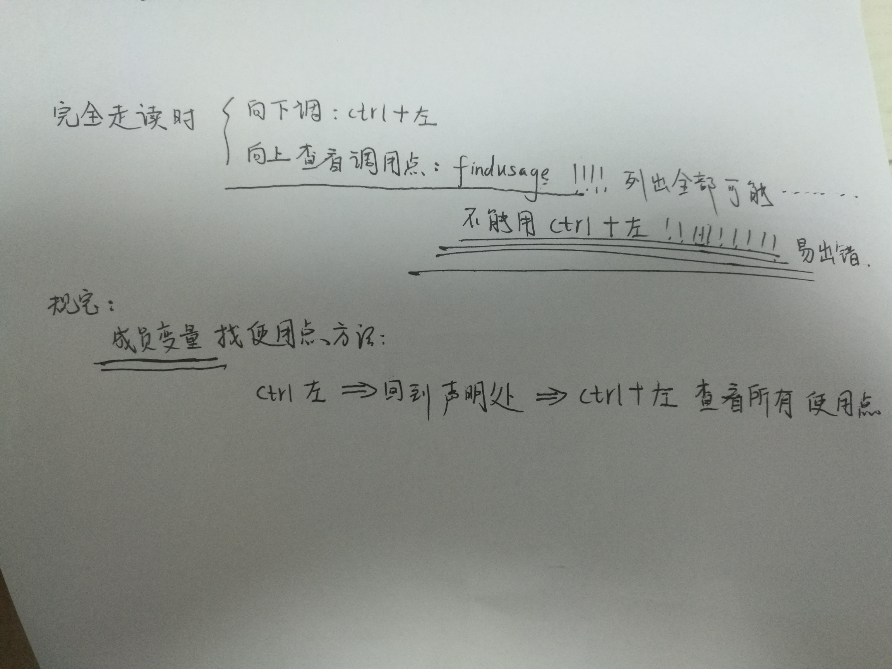


## 一些经验：

### 覆写的作用，

（1）完善子类功能，比如TextView覆写view方法，完善自己特有的，然后调用super方法
（2）恶意阻断，屏蔽父类方法：子类将父类方法重写，直接return出去。那么开发者调用这个方法永远失效！！！！！
（3）把调用流程和参数拦截到子类里


### **类的本质**：

即对外功能的总和，即一切方法的总和（是方法的抽象）
推论：**通过对外API来认识一个新的类**（横向看所有类）


一对多，一定是模型，尝尝是一定要画图的


### **画结构图技巧**：

1、	`结构为主+重点信息方向`
画图，重点在画方向，关键流程的方向，核心信息的流转方向！！！！大的箭头流动
为什么要这样子？**因为信息流动的是要依靠结构流动的**
举例子：Y侧graphic图

### 实现了某个接口，即拥有某种能力

！！！！！！---->实现了Parcelable接口，就有了打包的能力
接口的另一个作用：协议    --->我实现了某个接口，你便可以用这个接口实现类


### 工具类

**工具类都是静态方法**

比如：Utils

安卓的Process.java

```
/**
 * Tools for managing OS processes.
 */
public class Process {
..........
}
```


##  知全局而做局部

------>如果你没有全局的视野，做局部毫无意义！！！！！！（因为你理解不深刻，做了也是很快忘记！！！！！）


## 代码框架的收集


## 如何阅读别人的代码

https://www.yinwang.org/blog-cn/2020/02/05/how-to-read-code    -----wangyin

比起阅读代码，我更喜欢别人给我讲解他们的代码，`用简单的语言或者图形来解释他们的思想。有了思想，我自然知道如何把它变成代码`，而且是优雅的代码。很多人的代码我不会去看，但如果他们给我讲，我是可以接受的。

如果有同事请我帮他改进代码，我不会拿起代码埋头就看，因为我知道看代码往往是事倍功半，甚至完全没用。我会让他们先在白板上给我解释那些代码是什么意思。我的同事们都发现，把我讲明白是需要费一番工夫的。因为我的要求非常高，只要有一点不明白，我就会让他们重新讲。还得画图，我会让他们反复改进画出来的图，直到我能一眼看明白为止。`如果图形是 3D 的，我会让他们给我压缩成 2D 的，理解了之后再推广到 3D。我无法理解复杂的，高维度的概念，他们必须把它给我变得很简单。`

很多人都不知道，有一天我用不到一百行 Scheme 代码就写出了一个「深度学习框架」，它其实是一个小的编程语言。虽然没有性能可言，没有 GPU 加速，功能也不完善，`但它抓住了 PyTorch 等大型框架的本质——用这个语言写出来的函数能自动求导`。<font color='red'>这种洞察力才是最关键的东西，只要抓住了关键，细节都可以在需要的时候琢磨出来</font>。几十行代码反复琢磨，往往能帮助你看透上百万行的项目里隐藏的秘密。

很多人以为看大型项目可以提升自己，而没有看到大型项目不过是几十行核心代码的扩展，很多部分是低水平重复。几十行平庸甚至晦涩的代码，重复一万次，就成了几十万行。`看那些低水平重复的部分，是得不到什么提升的。`造就我今天的编程能力和洞察力的，不是几百万行的大型项目，而是小到几行，几十行之短的练习。`不要小看了这些短小的代码，它们就是编程最精髓的东西。反反复复琢磨这些短小的代码，不断改进和提炼里面的结构，磨砺自己的思维`。逐渐的，你的认识水平就超越了这些几百万行，让人头痛的项目。

注：<font color='red'>目的性要明确</font>  ----> 比如了解view显示，那么事件的流程就不要考虑  <font color='red'>解耦思想</font>


## 如何搜索代码？

1、赋值点： 核心：搜 "不得不"

​           对于基本数据类型  A a;      --------->   赋值点搜  “a = ”

​          容器 ArrayMap<String, InputMethodInfo> mMethodMap    ------->  <font color='red'>搜  "ap.put("    </font>

​                                 因为 容器可以传引用，搜 <font color='red'>mMethodMap，很可能搜不到</font>

2、


# 文章TODO: 链到你的文章结构里

## gitYUan

https://mp.weixin.qq.com/s/saps9pV-HEAon4majH1-aQ

Android系统之博大精深，包括Linux内核、Native、虚拟机、Framework，通过系统调用连通内核与用户空间，通过JNI打通用户空间的Java层和Native层，通过Binder、Socket、Handler等打通跨进程、跨线程的信息交换。  只有真正阅读并理解系统核心架构的设计，解决问题和设计方案才能做到心中无剑胜有剑，才能做到知其然知其所以然。当修炼到此，恭喜你对系统有了更高一个层次的理解，正如太极剑法，忘记了所有招式，也就练成了太极剑法。

再回过头去看看那些API，看到的将不再是一行行代码、一个个接口的调用，而是各种信息的传递与交互工作，而是背后成千上万个小蝌蚪的动态执行流。记得《侠客行>里面的龙木二岛主终其一生也无法参透太玄经，石破天却短短数日练成绝世神功，究其根源是龙木二岛主以静态视角去解读太玄经，而石破天把墙壁的图案想象成无数游动的蝌蚪，最终成就绝世神功。一言以蔽之，程序代码是死的，系统运转是活的，要以动态视角去理解系统架构。


我们看代码时，要抱着的一个<font color='red'>目的就是弄懂它的骨架和脉络</font>，**<font color='green'>细节无需记忆</font>**。毕竟对于一个系统来说，它是有很多细节的，我们无法在短时间把它们都完全吃透。但是主要我们掌握了它的骨架和脉络，以后无论是要了解它的什么细节，都可以很轻轻地找到相关的源文件，并且可以很容易进入主题。

似懂非懂的感觉，实际上就是不懂！

理念总结：

​    **1. 从代码中找答案——Read The Fucking Source Code。**

​    **2. 以不变应万变——坚持看一个版本的代码直至理清它的骨架和脉络。<font color='green'>细节无需记忆</font> **


对于优秀的开源项目来说，不去读一下它的源代码，简直就是暴殄天物啊。读代码有什么好处呢？太多了，除了可以学到别人的优秀代码、架构之外，最重要的是，我们能从中找到答案，从而可以解决自己项目上的燃眉之急。

拿Android系统来说，你在至少得懂点Linux内核基础吧！


## 罗升阳

对Linux内核有大概的了解之后，就开始学习Android应用开发，因为我觉这是学习Android系统的切入点：知道怎么用一个东西之后，才能更好地知道它是怎么实现的。
-------->所以，测试demo以及测试demo比源码实现重要！！！！ ---->要经常写demo
                             = 输出比输入重要！！！！

我一直相信潜意识这种东西：只要你相信你能解决一个问题，并且坚持住不放弃，潜意识就会帮助你去加工和组织各种信息。因此，自信很重要，它是一种软实力：有自信不一定能成功，但是没有自信就很难成功。

淡定。淡定是一种人生态度，它能使人不功利，不浮躁，从容地面对得与失，找到一条更合适自己长远发展的路。往往梦想都是一个比较长期的东西，不是短期内就能看到效益的。


## wangyin

### Talk is not cheap

https://www.yinwang.org/blog-cn/2019/09/11/talk-is-not-cheap

## xu

CHEN:  https://www.jianshu.com/p/37370c1d17fc 这个文章很好。但是又长又臭,过一两年后可能就忘记了。作为技术专 家, 到底记得的是啥? 如果要记得这么多知识点,又该怎么化简做减法呢? 越能做减法,cover的知识树越大。我是这样理解的

 XU:

看软件先看<font color='red'>架构、再看关键流程</font>,它们是软件的<font color='red'>骨架</font>,**支撑起**组件和无数实现细节。这个帖子介绍了关键流程、细节满满,你可以跳过细节看大纲, 然后尝试去解释每个启动步骤的合理性。解释通了就算初步理解了, 至于**流程的 细节不用看**,看了不用也记不住的。 

大纲 cache 在脑子里,有需要知道怎么去查,  就够了

CHEN:
解释每个步骤的合理性。这是一个不错的想法。如果解释的很合乎自然,  就不用记忆力,  靠逻辑、靠自然


**理念总结，只有一个关注点就是骨架自然性：**
1、**骨架： 架构图、关键流程图**     肉：组件、具体代码实现细节

**无论什么时候**(新项目第一次看，还是老项目复习知识点)，**都是 关注骨架、忽略细节**。<font color='red'>不看代码，更不记忆！</font>

看帖子，也要跳过细节

2、对于骨架，也不记忆！！！

（1）尝试去**解释每个步骤的合理性**，如果解释的很合乎自然,  就不用记忆力,  靠逻辑、靠自然

 （2）编故事，生活化模型去理解，在生活模型中找不得不！

3、不能有复杂的图，复杂的图，只能当做字典
自然，~~代码是最大的字典~~


## 以信息流的方式理解代码结构：<span id="xinxiliu">：</span> 

信息流 ---->是代码的本质

1、类是一个信息流-->类信息流的流向，决定了类的持有关系

2、方法也是一个信息流  ----->决定了方法的调用关系

方法信息流查看ide：alt + F7 ，调用关系

3、变量是信息流 --->决定变量的信息传递流向

变量信息流：双击选中 --->会给你信息流  （计算机的本质）  --->x信息最终给到了touchBounds

​                                                                                --->在此之前x信息被getScrollx改写了


**利用信息流的例子：**

1、问题：view.setTranslationX(float translationX) ---->(1)这个接口会造成view显示变化了，那么touch时的热区变化了嘛？
                                                                              ----> (2)如果没变化，那么又是如何做到的？？

​                                                                              ---->（1)可以通过event的x,y来断定


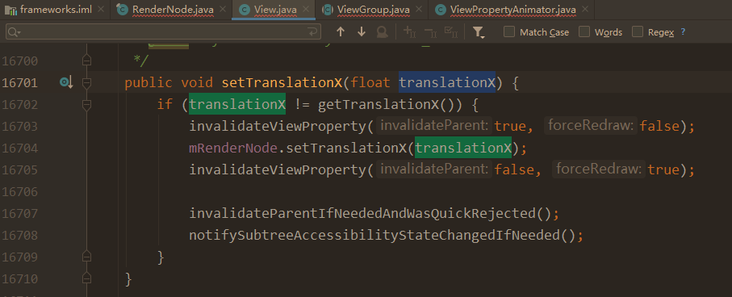

下面分析（2）：

信息流思维：translationX 信息只流向了类mRenderNode，没有停留在view里        ------>所以最后要用，只能由mRenderNode流出

------->方法1：查看mRenderNode方法调用点

------->方法2：用trace暴力，看调到RenderNode哪个方法

------>方法3：反向，不得不 ---->从event入手，event的x,y需要translationX 信息 ----->跟踪event的x, y ，必然会找到拿到translationX的地方


只抓一点，不及其余！！！！！！！比如这里的位置，只看event的位置！！！！

------>虽然调用栈很深、方法很多、方法体很长 ------->但是某一问题，关心的量只有一个，死盯着一个量，只跟踪一个量的信息流！！！！！！！

----->这样就容易很多

这里，追踪MotionEvent ev的,x与y，便可以跟踪到方法：


## AS 中引入其他盘的java代码作为source

1、进步:云帆引入方法，可以将其他盘代码引入As工程源码作为source
基于进步的拓展:那么可以做的事情就非常多了，比如将Z侧计算云代码引入source断点调试，依赖源码

再拓展: 打通ndk调试（A侧和Z侧），以同样方法引入cpp


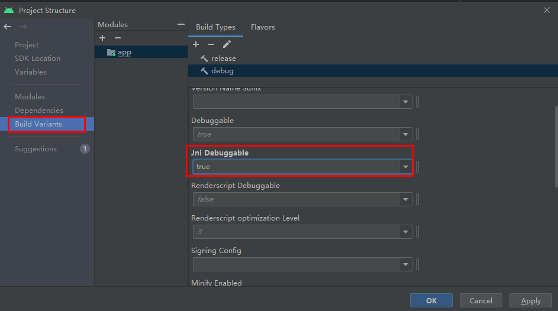


## 解bug体会、查找：

### 看问题，都要正向看+反向看

每前进任何一步，都要正向看+反向看，然后再下一步（方法便可以指数增长）

----》 <font color='red'> 基于这一进步，我们可以做很多事情  </font>。

以bug为例子:
正向: 不断找crash来源
反向: 对比正确的例子，寻找差异点
         主动制造冲突: 修改某一个量，比如，增加颜色，改变view大小（as可以临时）、view相同大小获取其父亲
          找到任何一个差异点后，1，都可以尝试用as去修正（反向）  2，追踪差异点来源（正向）


**例子：无障碍下手表应用commonDialog无法触摸获得焦点**

------>反向可以对比的元素：无障碍+非、手表+手机、Dialog+ ability、无法触摸焦点+可以触摸焦点

手表的Dialog window没有liearlayout ------>1、正向   断点加在构造函数里    
                                                                              2、反向：
结果，有swipelayout
正向:何时生成 （反向:在冲突点修改值，看能否正常）
反向，与其他手表应用对比？

改好，改差
这个不行，对比其他
正向:把这个改好
反向:把其他改差

多个因素对比，比如手表手机，dialog和ability


非代码区别:describtion，打印父子关系
代码中区别:hash


一心只为提高自己，偏离这个即使有利益，放弃
xuji


反面看事物=>提问题，去怀疑
如何理解深刻？>要问的尖锐深刻+回答得清晰

跳出代码看问题

过年的影响0:消费


投资和个人一样，本质都是价值

如果你想要变得聪明，你必须不停地追问的问题是“为什么，为什么，为什么”

严格分析——使用科学方法和有效的检查清单能够最大限度地减少错误和疏忽

耐心——克制人类天生爱行动的偏好 

 “复利是世界第八大奇迹”（爱因斯坦），不到必要的时候，别去打断它

### 如何识别一个对象，唯一化？

在log中---->内存地址

非log中---->直观：增加颜色，改变view大小（as可以临时）、view相同大小获取其父亲

断点调试中--->比如在xml里，给一个控件一个ID 


### 对于快速变化的问题

---->一大利器就是：放慢！！！！

放慢例子1：快速变化的代码---->log 
放慢例子2：快速变化的代码---->断点调试
放慢例子3：对于动态快速变化的显示现象 ------->手机拍视频 + virtualbud一帧帧放慢
放慢例子4：基于1和3  ---->现象的时间序列 与 log的时间序列  一一对应了！！！！！

基于3，可以做：
现象的时间序列----->如果足够细，可以预测每个现象变化的时刻点（无法精准）（从而预测每段现象的时间段！！！！）


**例子**：

问题描述：commonDialog在销毁的时候很快闪了一下（就像闪屏一样）
规定<font color='red'> ，记忆：永远不要用模糊性词语，欺骗人，更欺骗自己！！！  </font>
--->要求精准描述，才发现自己的问题，根本答不上来，什么叫闪了一下？？？？？？完全是忽悠人的词！！！！！
----->快速变化，必须用拍视频放慢----->从而才有精准描述：Dialog先消失（1、销毁时刻点），然后隔了50ms后，又出现了（2、再次显现时刻点）又隔了10ms，又消失（3、又消失时刻点）
比起正常流程，多了2和3时刻


TODO：上面的例子，已经分析到了各个现象时间 + log是正常的 ---->可我为什么没有想到这时就可以断定一部有问题？？？？
逻辑链条断了？？？


## 永远不要用模糊性词语，

**欺骗人，更欺骗自己----->时刻要有感性词(模糊词) + 理性语句**

感性词用于理解与记忆《------->理性语句，用于精确描述，翻译感性词
规定：<font color='red'> 任何时候，都要有 感性+理性 ------------>尤其感性词，绝不允许感性词单独存在！！！  </font>  

​           感性词<font color='red'> 容易骗自己。。。。。。。理性语句又不够抽象，不能记忆  </font>  

**例子1:**  数学：极限、无线逼近  《--------->ε，无论正整数N为多少，都存在某个n>N，使得|xn-a|≥ε 语言

**例子2:** 计算机：dialog闪一下 《----------->隐藏后，50ms又显示，又过了10ms隐藏了

## 思考问题，一定要闭上眼睛  

1、换脑子

 2、  留在脑子里的是本质  

3、 眼睛传入的信息，会障碍人


记忆与理解，也要闭上眼睛。。想图像（避免注意力停留在文字上）


## 答案永远在代码之外

1、一个线程可以有几个Looper？可以有几个Handler？

从模型角度： ~~Looper.looper() 是**驱动整个线程运行的 拉磨驴**~~---->  自然，只有一个

​                       ~~Handler是对外接口，send.msg和处理msg~~，自然，可以有多个

从代码角度：Looper.prepare()创建Looper之前，会判断当前线程的Looper是不是存在，存在会抛异常

--------> <font color='red'>  所以，问题的深层次答案，只能从模型中得出（代码只能给出浅显的答案）</font>


## 代码脑中简化技巧

### 0层综述

`解决混乱的方法就是，化简`。----》找出主次

上面画图、0层都是化简 
化简<font color='red'>有多简单，决定领悟有多深刻。 化简有多简单，决定能hold得住多大代码量</font>


规定：
看源码，第一件事情，就是超级化简、之后大化简（超级化简弄懂后）、化简（大化简弄懂后）、不化简
----->  `大流程遵守上述、小流程遵守上述、函数级（行数多的）也要遵守上述`


为啥要化简？1层剖析：
1、纵向：点击代码跳转过多，脑子内存不够用！！！！！！！堆栈溢出   ----》自然，另一种方法：增加脑子内存，截图
2、横向：脑子里的类过多，脑子内存不够用    ----》自然，另一种方法：增加脑子内存，截图
3、横向关联：一个函数里，四五百行，if else 嵌套过深刻, 造成逻辑过于复杂 -----》 挑选重要的if else 分支，那如何挑选重要的呢？


### 记忆之房间：


例子：

```java
//SystemServer.java

// 具体启动核心代码
        ActivityTaskManagerService atm = mSystemServiceManager.startService( // cg: ATMS
                ActivityTaskManagerService.Lifecycle.class).getService();
        mActivityManagerService = ActivityManagerService.Lifecycle.startService( // cg: AMS
                mSystemServiceManager, atm);
```


SystemServer.java 房间中, 有两个人 mSystemServiceManager和Lifecycle


### 化简之框架：逻辑上舍弃已知框架

总结框架，桥梁  --------->  见 《代码框架的收集》

--------->  已知框架，桥梁，作为化简工具。      高低软架构----》 如何索引，如何添加新接口

### 化简之  大概就是、大部分情况就是

即，把握主要：

```java
//viewGroup.java
protected int getChildDrawingOrder(int childCount, int drawingPosition) {
	return drawingPosition;
}
```

该方法，只有少数子类复写了，所以认为，大部分情况，返回值就是输入值 --->  忽略掉小量

### 化简之包裹

简化之包裹（主次之包裹），那么内核是。。。为什么包裹，要一层皮

### 化简之内部类（次要类）：

内部类是次要结构，可以被简化掉

`逻辑上，内部类是外部类的一部分`，调用内部类，就认为是调用外部类。

比如：

```java
// 具体启动核心代码
    ActivityTaskManagerService atm = mSystemServiceManager.startService(  // cg：ActivityTaskManagerService
            ActivityTaskManagerService.Lifecycle.class).getService();
    mActivityManagerService = ActivityManagerService.Lifecycle.startService(
            mSystemServiceManager, atm);

    mPowerManagerService = mSystemServiceManager.startService(PowerManagerService.class); // cg：PowerManagerService
```

AMS和ATMS通过 Lifecycle（SystemService） 传参给 SystemServiceManager

PMS 传的是本身 PowerManagerService（SystemService）

----》 本质上，两者是一样的，<font color='red'>因为 Lifecycle是内部类，即等同于外部类。</font>
                         Lifecycle抽出了 生命周期相关的方法（onStart），感觉更集中


### 化简之内部类2（解决java单继承问题）：

java只能单继承，如何在功能上实现多继承呢？


### 化简之同胞类

 内部类在逻辑上，可以认为是一个类

功能相同的`同包类 可以认为都是一个核心类`（核心类拆出来的：比如：ATMS、栈管理、生命周期同步器.........等等，<font color='red'>脑子中都认为是AMS，见小了逻辑链</font>

自然，持有关系，如果功能相近，认为是一个类 ------> 减小逻辑链


### `函数化简之 信息流`

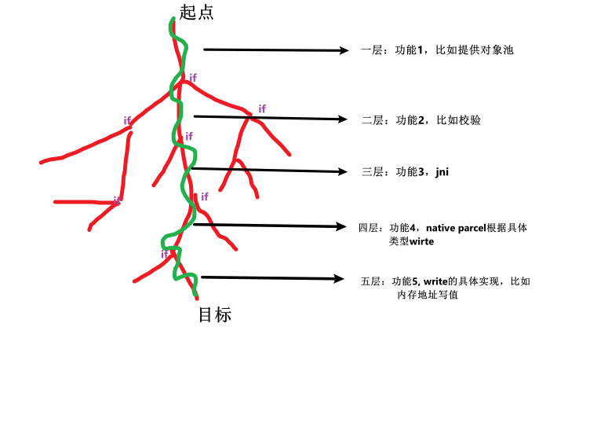

图：

1、目标应该是非常明确的  

2、起始点应该也是非常明确的


------------->3、（<font color='green'>绿色</font>）连接 起始点 和 目标点  就是  0层纵向主干  （<font color='red'>化简1</font>）

4、如何阅读 纵向主干？   

   找到起始点 和 目标点<font color='red'>确定要跟踪的主要信息，比如Inputconnection</font>，   **<font color='red'>只阅读 含有 Inputconnection 的代码！！！！！！</font>**    ------> （<font color='red'>化简2: 函数的主要阅读方法</font>）

```cpp
status_t Parcel::writeAligned(T val) { // val信息流
    COMPILE_TIME_ASSERT_FUNCTION_SCOPE(PAD_SIZE_UNSAFE(sizeof(T)) == sizeof(T));

    if ((mDataPos+sizeof(val)) <= mDataCapacity) {
restart_write:
        *reinterpret_cast<T*>(mData+mDataPos) = val; // val这里必然是核心主干
        return finishWrite(sizeof(val));
    }

    status_t err = growData(sizeof(val));
    if (err == NO_ERROR) goto restart_write;
    return err;
}
```

5、两个节点间，是一个层，一个功能。可以只读一部分层（<font color='red'>化简3</font>）


其他：

> 所有的**节点if都是一个分支**
>
> 


如何找函数中<font color='red'>核心代码</font>？
思想：`高亮重要入参，重要入参流淌的代码就是重要代码`。
**因为核心代码就两三行，这样看代码就省事多了**

例子：
比如InputMethodManager.startInputInner() 方法，总共两百行
-------》  softInputMode表征IMS的一个重要参数
-------》  核心必然是mService.startInputOrWindowGainedFocus()

一个推论？两个核心函数之间，变量是怎么演变的？？


**优点（使用场景）：** 快速找到主要调用栈
缺点：忽略的太多，比如if条件等


### 函数化简之 return 

可以找到绝对的主干，<font color='red'>而且是从上至下找（优）：</font>  （调用栈是从下往上）


EX1: 

```java
//ActivityStarter.java
private int startActivity(final ActivityRecord r, ActivityRecord sourceRecord,
                IVoiceInteractionSession voiceSession, IVoiceInteractor voiceInteractor,
                int startFlags, boolean doResume, ActivityOptions options, TaskRecord inTask,
                ActivityRecord[] outActivity, boolean restrictedBgActivity) {
        int result = START_CANCELED;
        final ActivityStack startedActivityStack;
        try {
            mService.mWindowManager.deferSurfaceLayout();
            result = startActivityUnchecked(r, sourceRecord, voiceSession, voiceInteractor, // 【1】cg:
                    startFlags, doResume, options, inTask, outActivity, restrictedBgActivity);
        } finally {	
        ...........
        return result; //【2】
    }
```

从return点的result，跟踪result，找到赋值点，就是主干


补充：

>  **return err 分支可以必然次要，可以不读**


### 化简之透传（可大量化简）

透传的，逻辑上直接可以忽略掉


因为核心代码只有一两行，那么：<font color='red'>90%的代码都是透传，都可以从逻辑上删掉</font>


**<font color='red'>记忆与关注点：</font>**
**非透传的核心代码**  +  核心代码的外面一层层洋葱皮（判空、其他分支）


-<font color='red'>规定。技巧：</font>  
透传函数不能注释齐功能，只能注释   // 透传
**只有扎到根，才是非透传代码**


EX1: 比如  startSystemServer、forkSystemServer 都是透传，只能注明 // 透传


### 化简之合理性（围绕目标的）

适用范围：

1.  `这一条，适合理解、记忆软件的整体架构`
2. **延拓，记忆、理解任何流程性的东西都合适** ----> **<font color='red'>天生适合记忆0层 纵向流程</font>**

步骤：

1. 目标（目的）功能是啥？这个对于软件来说，一般是明确的

2. 关注目标， 给出存在合理性、时序合理性 -----》  便可以删除了，仅仅留下目标

   <font color='red'>这个合理性，本质上 是路径（实现手段），便是代码流程</font>


**EX1:**   炒菜

流程：不需要记忆去买菜（买菜之前还去拿钱、拿钱后还对比了与网上菜贵还是便宜）、买酱油、砍价、回来的路上还买了锅

炒菜还查了教程、洗菜、切菜、炒菜五分钟、然后加水.............

-----》<font color='red'>所以，炒菜流程远比软件流程复杂的多</font>    
<font color='red'>你是如何记炒菜的，你就应该如何记忆代码流程：</font>

1、我没有记忆流程，一点也没有

2、提到炒菜，我的第一印象（目标）就是 菜在锅里炒

3、其他的都是 <font color='red'>合理性推出来的 （这是人的天性，只是面对代码，迷失了本性）</font>


**EX2:**  


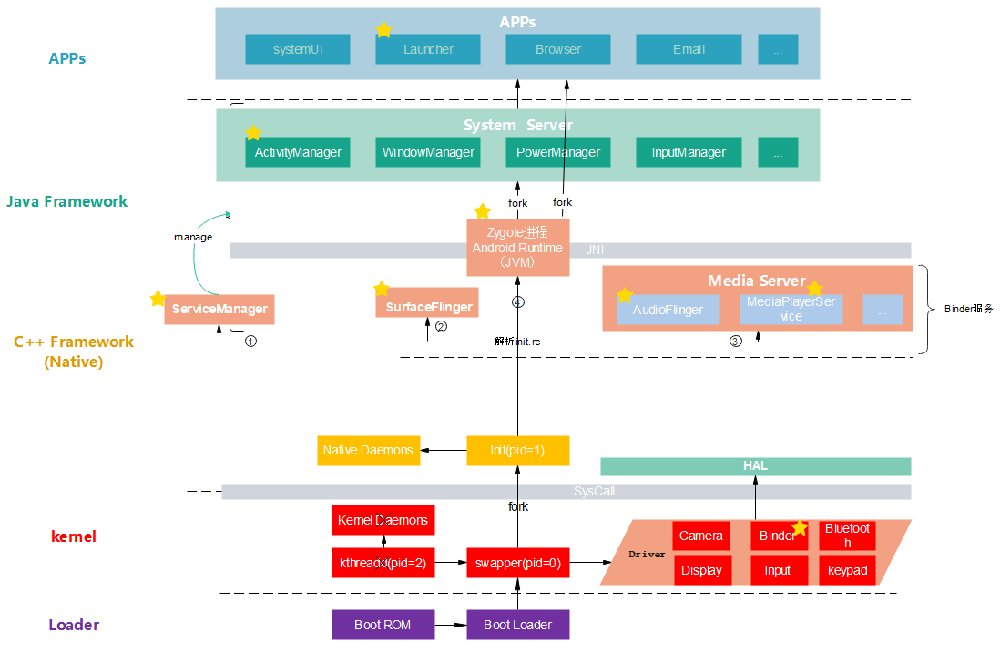

图：startApp.eddx

**总结：**

1. 化简：**init进程与zygote是一样的**，~~一个拉起cpp的服务进程，一个孵化Java的进程~~  --->  ~~zygote可删~~

2. 化简之合理性：整张图，**目标**就是启动native和java的服务

   ​                         自然：~~先启动native服务，之后java~~

   ​                         自然： ~~启动native众多服务之前，自然要先启动serverManager来管理  --->  ~~serverManager可删~~

   ​		                  自然：~~启动java 服务之前，自然要 树立起java-native的墙jvm、搭建好梯子jni ---->  ~~Runtime 自然，可删~~         

​                                 自然：~~zygote只是为了 fork  java服务进程而存在的 ---> ~~zygote可以删掉~~

**总之：**

1、启动自下而上；调用，自上而下（~~最终内核驱动~~，自然）

2**、只需要记：整张图，目标就是启动native和java的服务**。**其他的都可以删了**（是合理性下的必然）。


### <font color='red'>化简之目标</font>

永远不要按照调用栈 或者  时间顺序 去理解，尤其是记忆代码流程

而是  先想着核心点（一行代码、一个功能结果），反推其他辅助流程（这才是真正的理解，不得不在里面）
------》这和  合理性  是一个思想


比如：视频11 activity启动流程  ---》 重新看


### 化简之if  else

`一般情况下，if  else下是两个对等的分支`，只要看一个就可以！！！

### 化简之名词

IMM是InputMethodManager化简。不要小看名词化简：方便搜索；且方便记忆


### 化简之类比

核心：理解与记忆时，找寻已有的东西类比 。<font color='red'>书写时，亦如此</font>

禁止用Y的类名，为啥，因为类名这种情况下不重要了，没必要用两套。基于A来记忆Y的。
Y_IMS

### 化简之 减少逻辑调用链

如何减少? 
1、多个函数调用,只关注一行代码 (基本上是底层函数的) 
2、回看最外层函数,一行代码逻辑挂到最外层函数 
3、关注点:入口---关键函数,链接 
规定：强制删减 ?


### 如何识别模块的主类：


### 如何识别类的主方法:

即这个类的主要职责：

1、横向看看对外函数: h文件/public 接口(无法区分主次要)
2、索引属性, 属性做了哪些事情?------>牵强,属性太多,用处太多
3、看被谁持有。在持有的类中,索引改属性,看属性生命周期图谱中,怎么用的这个类
上层类主要流程怎么用这个类
4、类之间明显存在一对多的情况
规定:画类图,只允许添加关键属性、关键方法
但:如何识别一个类的关键属性,关键方法呢------>`用于画图`, `用于理解和记忆`
        1、`次要属性之透传`: 横向索引属性, 只有透传------>排除掉（这也是`逻辑化简的方法`）
        2、主要方法:一个属性创建地方, 最终传递到的地方(该类的主要属性)      


### 化简之`解耦思想`

解耦方法的应用场景:

1、对于不理解的东西,  `先记忆为框架能力`,  后面再弄懂。

2、对于复杂的耦合问题（AB相互影响），`假装一部分是正确的、 已经验证过了的框架`,  先记忆。等其他的弄明白了,` 再来理解框架原理`。 

举例子：看代码的时候，遇到AIDL架构，链接直接用  AIDL.stub，先忽略背后的架构


-<font color='red'>解耦 延拓</font>:   frame+ 链接-的记忆,  所以，记忆本身就是解耦

​                   0层 ---->  1层局部放大,  本身就是解耦。 举例子：土木结构的放大、代码结构 0层-1层的放大


`解耦的根本思想`就是把两个相关联的问题，强行拆解成不相关的，一一击破;<font color='red'> 解耦的具体办法，1、就是先假定（假定没有关系，假定是正确的）</font>    2、<font color='red'>解耦的最后，一定要回到这个假定上来，考虑这个假定的正确性</font>

举例子：力学中很常见，比如10N的力推动一个  三角结构：A和B之间一定是相互影响的（力和位移）

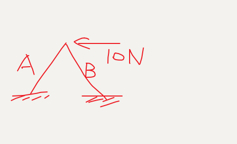

----------> 解耦具体办法：**先假设AB没有关系**，A有一个位移；B有一个位移


**后面再考虑关系：**  A的位移 = -B的位移


### 化简之设计模式

很多代码为啥这样写，就是设计模式规定死了的


### 化简之  <font color='red'>功能逻辑  驱动 函数记忆</font>

记忆也如此：
以功能，驱动函数（不能反过来）
-<font color='red'>注意力一定在功能上，不是在函数和类上。</font>

比如：
Activity起来之后（window也准备好了），那么如何与view绑定  -----》setContentView
不是去记忆 setContentView，反推绑定关系


写文章也是如此。。。。各个章节标题永远都是 功能点，而不是 setContentView这种函数
比如： Activity绑定viewTree，setContentView


### 化简之按功能点拆解（写技术文章方法）

按功能点去拆解，小功能点单独列一节
-------》
原因：1、 因为一个功能点的内部，在逻辑上天然 链接的

​            2、防止小功能点，阻碍主要流程的  思考、书写、画图

例：
handler机制，主要功能：
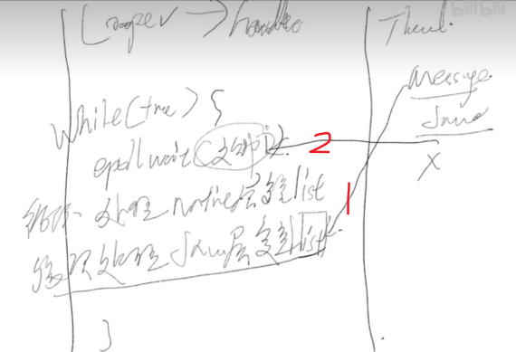

至于：`次要功能 when、epollwait详细在另外章节里讲、在另外的图里画！！！！`！


TODO：
看代码、思考也是如此；；；；说话更是如此

### 化简之 按照变量抽离

按照变量来抽离
按照变量抽离------变量代表功能点，实际上是按照功能抽离


### 化简之大流程

**起点----目标反推法：**

1、其他函数都是次要的，都理解为透传 ---->逻辑上   删除所有 调用链

2、<font color='red'>同函数下，其他代码都是 为 核心代码服务的(逻辑上可以推断出来，不得不的)  --->可以删除</font>      ----> 逻辑上删除


-<font color='red'>规定：</font>

1、直接保留核心代码，删除其他所有   ---》  逻辑上、**记忆上**、画图上

2、**以  核心代码替代 最外层函数  来记忆**    

​     写技术文章时，以核心代码  替代 最外层函数 作为 标题

原因：最外层函数 太空，而且做了很多件事情
          突出核心的话，其他的可以逻辑推导


-<font color='red'>总结，起点----目标反推法：</font>

1、一个大流程，<font color='red'>永远只有一行代码是核心代码</font>  ------》目标

​                              用文字描述，永远不超过十个字

2、其他代码都逻辑上删除。<font color='red'>要用的时候反推</font>，基于起点与目标


TODO: 一些推论：

**按照时间线记忆， 流程性东西，害死人！！！！**


方法优点：

1、记忆量就一行，十几个字

2、以始为终：一切自然。否则是看不懂代码的

3、说到一个大流程，脑子第一时刻就知道这个流程主要做了啥。不会陷入细节

4、记忆长久


例子：

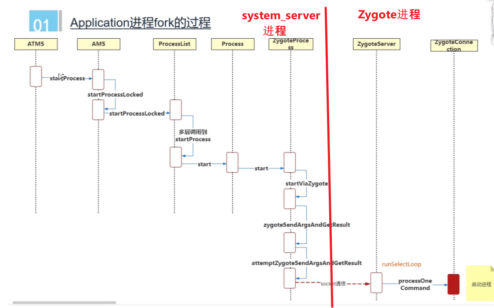


我以  runSelectLoop作为章节标题，因为 runSelectLoop是fork最外层函数  ------》很有问题，长时间只记得looper，不知道looper里面做了啥
但是突出核心  fork就不一样
----》记得fork，逻辑上~~必然以后死循环Looper读取消息~~， 必然~~有fork之前，参数解析~~
                           必然有fork之后，基础建设 runtime和binder驱动  
                           最后的目的，也是逻辑上必然： 反射主线程的main函数


### 化简之小函数

也用   起点----目标反推法


### 化简之函数调用栈Tree

我们可以画全量调用栈图：比如图形的 ----》  当做字典
但是记忆与理解：
1、记忆关键大流程，作为锚点（一定要足够大，足够关键）   
2、基于锚点，记忆其他关键函数（即核心代码）
3、<font color='red'>逻辑上删除</font>所有其他函数调用

---->  总结，以上是对调用栈Tree的化简


### 化简之忽略 handler

知道 跨线程，忽略  handler  转换

尤其是Binder线程的转换


### 化简工具 之BookMarks

（1）保存一份固定不变的源码，不更新

（2）重要的纵向流程中，关键分支、核心函数，用BookMarks标记  

-------> <font color='red'>  作为记忆的锚点、也是快速查询的锚点、经常复习的锚点</font>

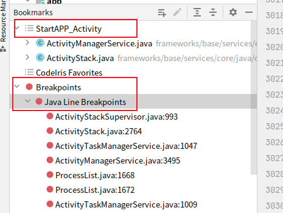

补充：

breakpoint和BookMarks的点不一样：

> 前者尽量在边界处、最底层------>  方便得到完整得调用栈
>
> 后者 在关键函数和关键分支处 -----> 锚点处


BookMarks 好处在于  锚的好处： 1、快速查找  2、利用它支撑起整个框架


### 化简之持有

持有一个类，可以认为是一个类的扩展

前提：

> 两个类的名字很相似（因为还持有其他）

比如： AppWindowToken 持有 IApplicationToken token

所以  AppWindowToken 扩展了 IApplicationToken 


### 化简之new bing

让chatGpt给你：

1、先给出模块框架

2、再给出主要功能点

3、指出沿着功能点的关键函数

~~4、函数每一行代码的解释~~


### 化简之 设置的值

C语言的阅读：
设置（挂表）与运行

共同点：
1、找一个变量（指针）来源，会有栈  ----》  需要记忆
这是经常用的，脑子内存不够用了？有啥办法呢----》 截图屏幕、txt作为缓冲
2、信息流


### 跳转化简之AIDL

全局搜II...........

> IInputMethodPrivilegedOperations ops = mOps.getAndWarnIfNull()
> 要找下游跨进程的调用（即定义处）:
>
> **搜IInputMethodPrivilegedOperations**：
>  extends IInputMethodPrivilegedOperations.Stub


### 化简之  <font color='red'>不断提取公因式</font>

使用场景：

>  <font color='red'> 记笔记、记忆</font>


你的关注点，决定了你hold能力：

```java
 开机自启设置：systemctl enable service_name
 禁止开机自启设置：systemctl disable service_name
```


--------------> 关注点： systemctl enable

超级化简（<font color='red'>提取公因子------只关注差异点</font>）

```java
 设置：
     开机自启：systemctl enable service_name      禁止disable
```


### 化简之 删减之特殊情况

**删减**之特殊情况(**只要是概率不大的，都认为是特殊情况，即使重要**)


## 秒解技巧


## 常见代码框架

### TODO:  为什么框架是这个样子？何时要用这个框架？

很多时候，看完代码，即使理解了其调用的结构，也不明白其中框架
-------》不明白为什么框架是这个样子？  如何解决这一类问题呢？
         -<font color='red'>即：回答不出来，不得不！！！！</font>


### 解决JAVA不能多继承问题

java语言只能单继承，如何支持多继承呢?

方法：通过内部类 继承另一个  。<font color='red'>因为：内部类，等同于外部类。</font>

例子:  AMS与其内部类lifecycle extends SystemServer
实际上，希望AMS  extends SystemServer  ,  但是  AMS 涉及到 与APP通信，所以也要继承 stub


-<font color='red'>不得不：</font>  AMS 涉及到 与APP通信，所以要继承 stub。也要继承 SystemService 。 
---->     涉及到多继承，所以，只能取一个。
EX1：AMS  extends stub， 内部类Lifecycle extends SystemService, 
EX2，也可以反过来：PowerManagerService extends SystemService，其内部类继承 stub


## 方法集key  (清单)

--—>常看、内化

1、正反角度

2、信息流（本质）  [跳转](#xinxiliu)

3、不得不 （最次：很可能）---->然后拦截

4、动态调试万能方法：trace，搜索所有类((已知类的时候) + 所有方法

5、简化demo--->唯一性

6、放慢 ：放到最慢看 --->放到次慢看 --->放到快看

7、方法： 对比、差
好的与不好的

8、动态断点调试方法： 修改-----夸张、弄坏、抛异常、激化矛盾。

9、log方法：绑定

10、方法：步步推进

11、断点调试：动态一般方法 ---->很容易走岔，得一行行调试

纲要性的东西，每天看  

迁移： **在不同的事物上，迁移推广相同的机制。**与比喻类似，但比喻是已知存在的两个物体，迁移是一个OK，另一个待迁移。。。。。。比如：嗑瓜子理论，迁移到学习上

13、本质

14、自然法则

技巧：规定，对于技巧集、本质集，**剥离出原文，经常单独复习**

自信（说话感觉离两米）

精力十足。管理

假装。1、以假装是主管，以主管的视角看问题，说话，解决问题  2、模仿技术达人所做的事情。所呈现出的总结

知识立体化。多个角度

代码技巧： 对于经常要看 + 稳定不变的源码，可以在代码中注释关键分支和核心函数。比如aosp源码。**为什么要这样做？ 1、因为你要看千百遍的aosp，下一次看，一定要站在前一次的肩膀上。否则浪费大量精力！！！！！！**  **2、代码最垃圾的地方就是 没有重点，通过注释标记重点、核心代码、关键分支**

框架，桥0梁

化简


观察角度：   触发点（是一个锚点）------从调用栈能获得

观察角度： 0层结构、核心结构（对应关键函数）

观察角度：**任何一个系统**（系统、模块、类、函数、测试用例、老化......生物系统、地球.......），都是可以从  **I/O角度分析**，即一个系统的输入与输出分析

规定：为了体现主次：对主要调用栈， 标注：  cheduleTransaction(clientTransaction);// main process  


比喻

5w法

洞察力（观察人、观察事务，观察知识）

分层思想。。。精髓在于：隔层之间，不能有交集。分层看待，结构分层

搭积木思想。。。。。积木架构图+木块原理图（更重要）

帧+链接。。。链接，一定要以逻辑为链接。如果以记忆为链接，很容易忘，而且很难记忆

依附与链接：窗口级的。。。

闭眼睛

读大师的事迹、文章

解耦思想：先假装。。回头考虑假装的东西

过河弃筏思想
思想上，已经过河，就要弃筏（负担）
例子：架构是桥梁，过了河，就要放弃？？？？


记忆方法之 扫词（单词、知识点、题目）--- >   对于大量知识点的方法

记忆方法之：逻辑链、不得不


一句话总结（最强简化）。1、锚点：一句话是 无招 ，一切演化的锚点   2、检验标准：真传一句话    所以，你要是不能总结到一句话。那么你没有真正理解

化简一切（减法）:  通过链接一切，做到极致化简

大方向

延拓、推广

优秀实践

心置一处，身置一处

写文字性东西，给出关键词。比如：技巧层面，理解层面，功能层面，本质：

从.....角度，例子

​       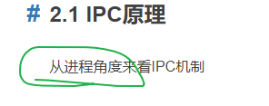

​       

穿针引线，串起来

层

提纲文章：如何写复杂技术文章？ ---->  用一整篇文章，来做提纲，说明引用关系： http://gityuan.com/2015/10/31/binder-prepare/

背后是啥：干任何事情，看到任何事情，都想一下背后是啥

图解一切（理解之后的事情，便于记忆+整体结构的理解）

降低难度---否则会痛苦。例子：技术博客看不懂，看视频

看评论区

按功能拆解

可复制：模板可复制、搭建环境流程可复制、知识点可复制 --->  任何能力，做到可复制，`尤其容易复制`

​        

> 可复制之应用：免安装版本 (就是 安装后copy的版本)
>
> 免安装版本，好处在于：----> 基于可复制、可迁移思想
> 1、持久化-----独立于系统（即使系统重装）
> 2、最关键的是设置，可以持久化。优点： 不同电脑无需重新配置
>
>
> 规定：
> 1、免安装版本库 需要及时更新。对本地做了设置，要及时更新到  免安装版本库里
> 2、对于  安装复杂  或  配置复杂 的软件，规定必须 同步到免安装库里
>
> 规定： 
> 有些软件如果做不到免安装，但是设置复杂 ---->  尽量把设置导出来，做持久化


学习上建立正反馈机制：成瘾的**根本原因**是：有一套反馈机制在里面。。。。例子，写技术文章，写到所有知识点，都是不得不的逻辑链接（不存在记忆链接时）-----> 好文章；是一个大奖励；超越了所有人；幻想


化简之精力管理： 最简单的，才是最有效的(也才是最节省精力的)

方法之闭眼： https://www.campzhe.com/archives/1440    我闭上眼睛，目的是为了看

给出关注点

清单：避免犯错的利器。例子：方法集、交付checkList、购物清单

笔记：1、给大脑减压的工具  2、达到`可复制`的目的   ----->  大脑永远留给用来思考与理解，记忆不应该是大脑做的事情！！！！！！在思考的过程中，人的大脑其实一边维持记忆，一边进行分析，两面开战。而笔记，能够释放掉大脑记忆所占用的精力，专注思考。我看见，优秀的思考者，往往善于使用笔记本、白纸和白板。摘自： https://www.campzhe.com/archives/551

结构化：思考更全面&表达更清晰。EX： 树状图

及时激励： 比如  思想世界中，工具的个数

兴奋点：又得到了一个思想工具

commit方法：任何事情，过了一个阶段要commit，像git一样。人生也是如此，基于上一个commit，做下一个 ------》 如果两个阶段之间没有传承，那你肯定走不深

合理性要求(设计合理性、存在合理性)：对于代码架构： 解释每个步骤的合理性，如果解释的很合乎自然,  就不用记忆力,  靠逻辑、靠自然

生活化模型 ---->  任何知识点都可以，大利器

时间利用方法：并行化。但是要警惕，**不能切换太多，消耗精力**。主要思考（学习、工作）  与   **耗时无需操作**过程（下载、docker 加载jar等）并行化
                           夜间运行：人要多休息，计算机不要休息

主次应用之主要路径：考虑软件性能要在主要（高频）路径上。不是关键路径上

学习要非常重视纵向：1、入门可以沿着一条线先熟悉   2、能串起来很多知识点！！！（否则，知识是零散的）

旋涡中心  +  链接

要多角度： 比如回答问题：1、从模型角度（本质）  2、从代码角度


眼睛是障碍、文字也是：文字障碍事物表面、眼睛障碍事物本质
---------->  规定：<font color='red'>看了文字(尤其核心知识点)，就眼睛，</font>在脑袋里想 。目的: 消灭文字！

理解、行文工具：出发---目标----不得不

对于传递，文字是竹筏

对于进步，文字是障碍

问题、知识点，睡醒前想、洗澡想、吃饭想 ----->   为什么要这样做？  对境生迷 ，所以只能离开境
这一点有个问题，违背了活在当下


洗脑：每天反复给自己洗脑。我爱代码架构，我爱原理。我爱控场的感觉

数学是一种修身养性的方式-------柳智宇。。。。。。代码也应如是（虽然差很多）

大脑最害怕的就是凌乱。比如：1、有多处记忆点，记忆点之间没有任何联系（办法：链接和锚点）   2、介绍AMS的内容，分散到不同的技术文章里 （解决办法：一个专门文章AMS，然后引用）3、


0层（模型、记忆的锚点）---》1层（具体业务场景、面试要回答一层内容，比如Activity切换时生命周期）----》	N层，技术细节  ---》代码  ---》相关面试问题（衡量标准、反馈）


给出观察主干的固定角度。
----》1、观察枝叶。越来越乱  2、对一类事物有固定角度，那么 对新事物分析，就完善了。比如，一个新的设计模式


角度：  核心类做了什么（属性+方法）  ，更重要的是，核心模块做了什么（模块的接口）


技巧：
~~认识~~  记忆核心类的主要功能的方法：
把核心类的 主要功能  归结到其属性，记忆其属性（与周边的关系）  ----》反推类的功能，自然无需记忆
例子：

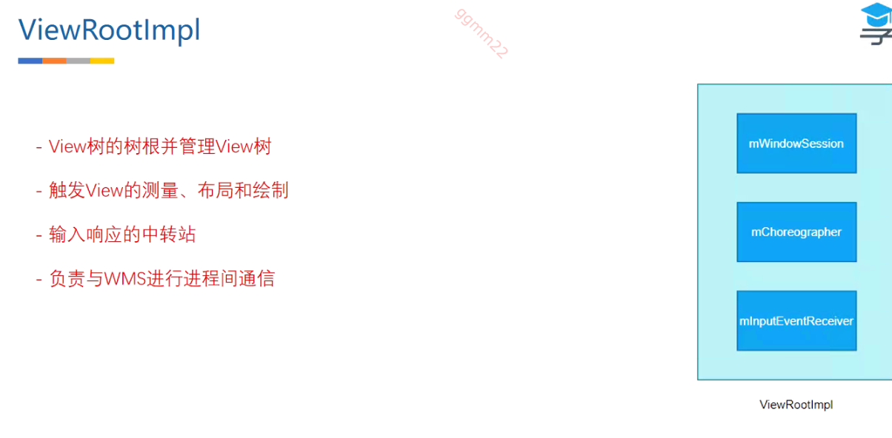

TODO: 认识核心类可以吗？


### 仅限于代码的方法 list

代码分析的**三角度**：1、运行态（内存）   2、文件系统（编译后在真机中的结果、可执行文件）  3、源码

进程视角、模块视角

不要使用无意义的名词、术语：比如0号进程，鬼知道0号进程干啥的，`名字至少要体现本质`，就像给小孩纸起名字一样，要有所寓意

技术文章的引用：为了链接更聚焦，**规定：** 不同技术文章之间的引用，只能引用总结部分。


### 生活

走路在练功、吃饭也在练功

走路在当下（冥想）、吃饭也在当下（冥想）


### 文章\文字

-<font color='red'>无提示，不写字</font>：任何文字、文章，必须要加   **提示词**

EX: 

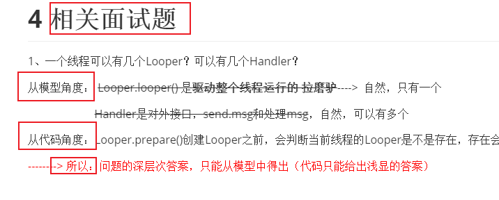

#### 技术文章目录，要呈现代码架构

不能让文章目录，破坏  代码架构

比如： window、WMS是一个级别的东西

​            view只是window的一部分 填充，所以：   1、不能和window、WMS一个目录级别     2、如果想要 详细写view,  当前文章插桩。链接另一篇view文章

​            --------》 `跟搭积木一模一样：`（1）不要破坏整体结构   （2）要详细了解的，<font color='red'>另起一个视角</font>

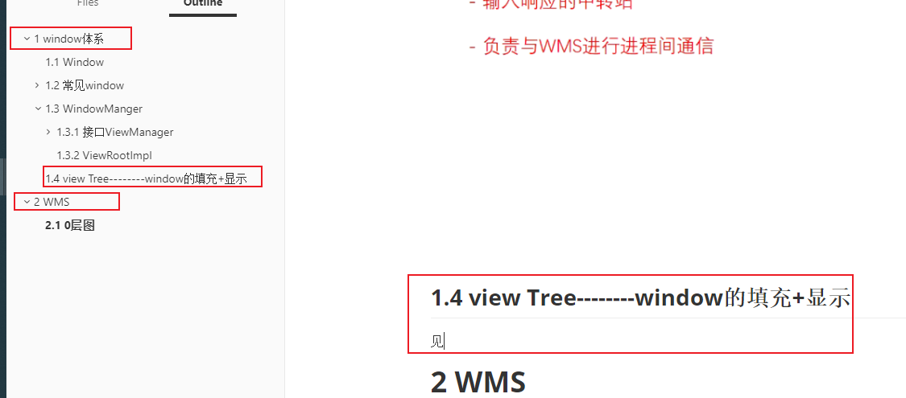


#### 化简

不仅代码需要化简才能记忆，生活需要化简

文章需要化简。小到一句话也要化简，规定，技术文字写法：

**规定：主要动作五六个字说完**。（其他内容，加括号补充说明）


注意：

这个技巧，很像英语语言


# 格式

 规定<font color='red'>，记忆：永远不要用模糊性词语，欺骗人，更欺骗自己！！！  </font>


