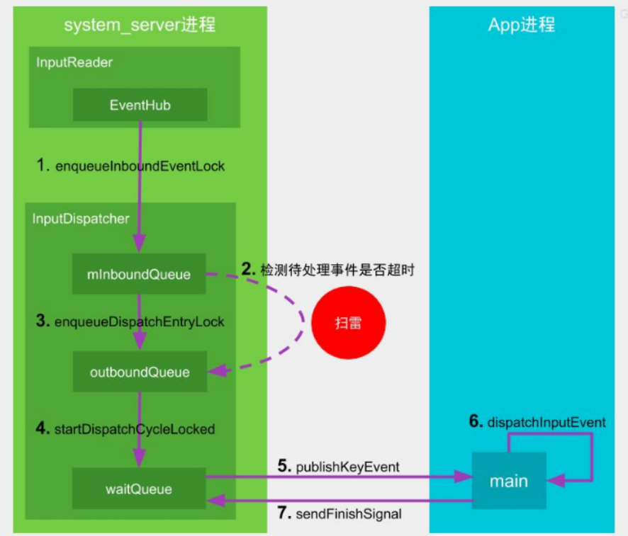
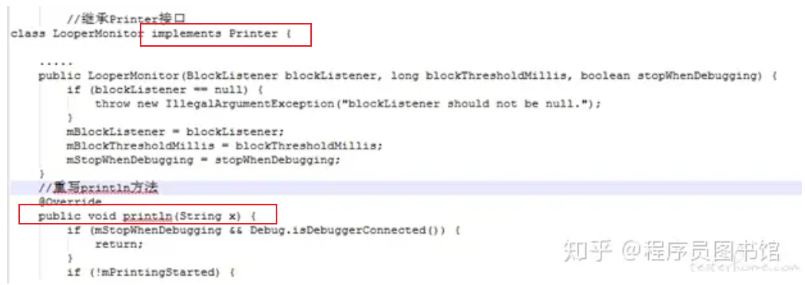

# 目录

[TOC]


# ANR

参考：  ANR问题的产生机制.pdf

## 监控方式一（安卓系统侧）

目的： ANR ------->  Application Not responding  ------->  响应：希望事情在**一定的时间内**完成

事情的特征： 有一定耗时的， 比如：

> **输入类ANR：**
>
> > InputDispatching Timeout：输入事件分发超时5s，包括按键和触摸事件
>
> **组件类ANR:**
>
> > - Service Timeout：前台服务在20s内未执行完成；
> > - ~~BroadcastQueue Timeout：前台广播在10s内未执行完成~~
> > - ~~ContentProvider Timeout：内容提供者在publish过超时10s;~~

-------------> 都有一个特点： 不可见，却要给用户一个反应！

TODO:

> ANR 与 阻塞是否等价呢？有什么区别与共同点？设计的模型

## Input ANR

流程图：

> 
>
> del：见《ANR问题的产生机制.pdf》

功能主体：

> InputDispatcher：
>
> InputDispatcher分发的时候，记时间
>
> APP进程分发完毕的时候，**会直接知会给InputDispatcher**  【1】
>
> 超时了，~~执行工作自然交给AMS去处理，报错，弹窗~~

注【1】：

> 如何知会？

TODO:

> https://juejin.cn/post/7010319858118164510#heading-27     常见实例  + 关键字眼

## ANR爆炸现场的保存

system_server会马上去抓取现场的信息：

> 将am_anr信息输出到EventLog，也就是说ANR触发的时间点最接近的就是EventLog中输出的am_anr信息
>
> 收集以下重要进程的各个线程调用栈trace信息，保存在data/anr/traces.txt文件
>
> > 当前发生ANR的进程，system_server进程以及所有persistent进程
> >
> > audioserver, cameraserver, mediaserver, surfaceflinger等重要的native进程
> >
> > CPU使用率排名前5的进程
>
> 将发生ANR的reason以及CPU使用情况信息输出到main log
>
> 将traces文件和CPU使用情况信息保存到dropbox，即data/system/dropbox目录

​                  -----------------------> TODO: 看一下具体的log以及文件

> https://www.jianshu.com/p/f624266c8424     Android 性能优化——ANR监控与解决
>
> https://zhuanlan.zhihu.com/p/654699274  android程序中,产生ANR原因与分析解决
>
> ```java
>  CPU usage from 0ms to xxx ms later with xx% awake:
>  
>  14% 1673/system_server: 8% user + 6.7% kernel / faults: 12746 minor
>  13% 30829/tv.danmaku.bili: 7.3% user + 6.2% kernel / faults: 24286 minor
>  6.6% 31147/tv.danmaku.bili:ijkservice: 3.7% user + 2.8% kernel / faults: 11880 minor
>  6% 574/logd: 2.1% user + 3.8% kernel / faults: 64 minor
>  ..
>  TOTAL: 6.4% user + 8.2% kernel + 0% iowait + 0.6% irq + 0.1% softirq
>  
>  CPU usage from xxms to xxxms later
>  73% 1673/system_server: 49% user + 24% kernel / faults: 1695 minor
>    33% 2330/AnrConsumer: 12% user + 21% kernel
>    15% 1683/HeapTaskDaemon: 15% user + 0% kernel
>    9.2% 7013/Binder:1673_12: 6.1% user + 3% kernel
>    6.1% 1685/ReferenceQueueD: 6.1% user + 0% kernel
>    6.1% 2715/HwBinder:1673_5: 6.1% user + 0% kernel
>    3% 2529/PhotonicModulat: 0% user + 3% kernel
>  25% 30829/tv.danmaku.bili: 4.2% user + 21% kernel / faults: 423 minor
>    25% 31050/thread_ad: 4.2% user + 21% kernel
>    ...
>    ...
>  27% TOTAL: 10% user + 14% kernel + 0.3% iowait + 0.9% irq + 0.3% softirq
> ```

ANR对话框：

> 对用户可感知的进程则弹出ANR对话框告知用户，对用户不可感知的进程发生ANR则直接杀掉

## 监控方式二：应用自身监控-------WatchDog方式

> 前提：同进程
>
> **APP  同进程监控ANR** --------> WatchDog方式   ：https://blog.csdn.net/qq_30379689/article/details/129056033

原理：

> 应用自己新建 WatchDog 线程 ------> 类似于  系统侧的watchDog

缺点：

> https://blog.csdn.net/qq_30379689/article/details/129056033

## ~~del：监控方式三：应用自身监控-------log时间差~~

参考： https://zhuanlan.zhihu.com/p/119293585?utm_id=0

项目-------BlockCanary：

原理：

> 在主线程的Looper.loop中 dispatchMessage 前和后  ------>  监控时间差    注： 【1】日志安卓原生已经加了
>
> ----------> 从模型角度，**本质：监控一次loop的时间**
>
> TODO:  画个图

因为【1】，自然，**只需要继承  Printer 移花接木**：

> ~~图片： 见  https://zhuanlan.zhihu.com/p/119293585?utm_id=0     //继承Printer接口   class LooperMonitox implements Printer~~
>
> 

优点：

**缺点很明显：**

> 检测不到长久的block： ~~没有启动另一个线程，对于长期block的线程   ------->  没有一次完整的loop，检测不到第二次print ------> 不会有反应~~
>
> -------> **根本原因**：自己的线程检查自己

## ~~del：监控方式四：应用自身监控-------**FileObserver**~~

原理：

> 检测系统侧ANR的结果
>
> https://zhuanlan.zhihu.com/p/119293585?utm_id=0


# crash


