# 目录


[TOC]


# 序列化

## **序列化的本质是啥？**

Java序列化的本质是将Java对象保存为二进制字节码。-----> 进而可以传输 +  存储

传输有哪些，传输为什么要序列化？
传输：网络传输、进程间通信IPC
为什么？---->
本质在于：同一进程间，对象的传递 <------> 传地址内存。。。同一进程有统一的内存
                    不同进程间，内存是独立的

存储为什么序列化？？（-----> 电脑上存储都是二进制的）

一座大厦好比一个对象，你要把这座大厦搬到另外一个地方去，你想直接挪肯定不行吧？(一般来说，只有传值，没有传对象)但我可以搬砖头吧，一个一个搬，然后搬到目的地重新组合成一个大厦，而序列化就起到了将大厦分成砖头的作用.

TODO：最底层逻辑，如何做到的呢？？？
TODO：为什么会很高效？？？没有序列化结构，只是序列化数据


补充:HW笔记


序列化结果:  字节序列


## 安卓序列化源码分析

--->Parcel序列化

### 0层

https://blog.csdn.net/tkwxty/article/details/107916160   内核


Todo：内核调用怎么理解？？？--->系统调用
           用户空间与内核空间怎么理解？？？

### J_parcel的获取与recycle()


```java
 //parcel.java
private static final Parcel[] sOwnedPool = new Parcel[POOL_SIZE];//1  6个对象的对象池

    public static Parcel obtain() {
        final Parcel[] pool = sOwnedPool;
        synchronized (pool) {
            Parcel p;
            for (int i=0; i<POOL_SIZE; i++) {
                p = pool[i];
                if (p != null) {
                    pool[i] = null;// 2 用了之后，引用置空--->但是有其他引用
                    if (DEBUG_RECYCLE) {
                        p.mStack = new RuntimeException();
                    }
                    p.mReadWriteHelper = ReadWriteHelper.DEFAULT;//todo:作用？？？
                    return p;
                }
            }
        }
        return new Parcel(0);//3 新建，没加入对象池里面！
    }
```

//1 用了对象池：1、由于parcel对象创建+释放的非常频繁---->消耗资源 2、不是轻量级对象

// 3 自然的，没加入代表在使用---->recycle时，有可能加入对象池（前提：有空位）,见#3_1

```java
    public final void recycle() {
        if (DEBUG_RECYCLE) mStack = null;
        freeBuffer();

        final Parcel[] pool;
        if (mOwnsNativeParcelObject) {
            pool = sOwnedPool;
        } else {
            mNativePtr = 0;
            pool = sHolderPool;
        }

        synchronized (pool) {
            for (int i=0; i<POOL_SIZE; i++) {
                if (pool[i]  null) {
                    pool[i] = this;// #3_1
                    return;
                }
            }
        }
    }

```

###   //3构造的过程是怎样的？


```java
//Parcel.java
    private Parcel(long nativePtr) {
        if (DEBUG_RECYCLE) {
            mStack = new RuntimeException();
        }
        init(nativePtr);
    }
```


### parcel与Ibinder的关系？？？


# 进程设计的意义/初衷

我们谈到IPC，那么其实就有疑问了，不要有那么多进程不就行了？不就不存在进程隔离了吗？

## 进程天然内存隔离，系统为什么采用多进程呢？

----安全(隔离)/稳定/内存分配


## APP的多进程

一个APP为啥要做成 多进程？见下图：
主要（<font color='red'>也是开发技巧</font>）：

1、突破522M内存限制（虚拟机给一个java进程的）

2、稳定：将  <font color='red'>需要稳定的重要代码</font>与不稳定的分离开，<font color='red'>不至于一起crash</font>

​                 比如 微信的消息 接受功能。不能因为微信界面进程crash，而收不到消息！！！！！！，<font color='red'>不然信息丢掉了</font>


举例子：

QQ等应用就是多线程


 


## 总结 涉及到IPC的场景


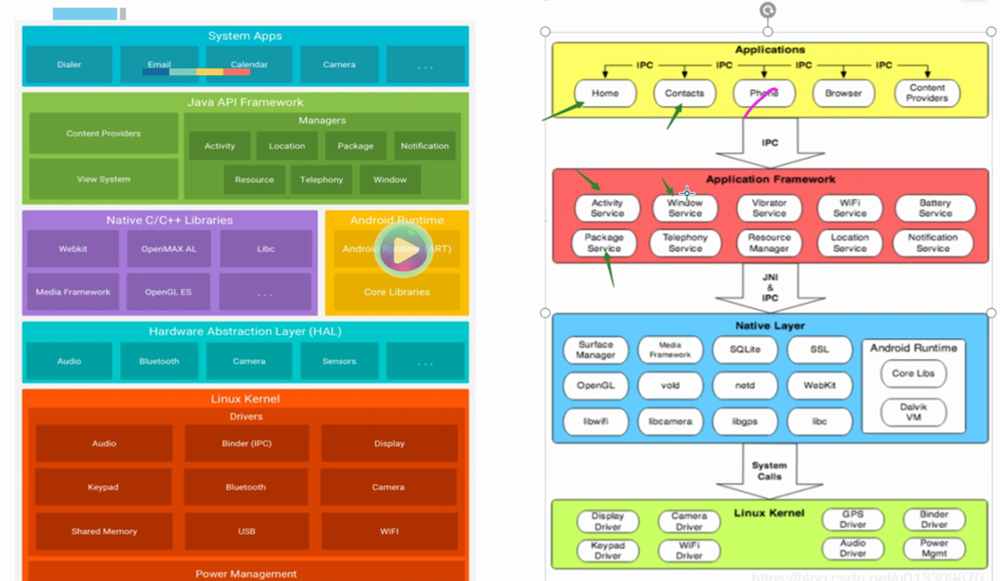


APP进程间、APP进程与FrameWork的系统进程、FrameWork的系统进程与native（部分是jni）

native 与 kernel进程之间（<font color='red'>TODO: 跨了进程？</font>）


# 进程间通信（IPC）---Binder

## 前戏

`因为要谈论andriod的Binder，不得不`：

2、为啥不用linux本身的，为啥andriod自己要开发一套Binder机制？（即优缺点）

1、-----> 自然，先要列举一下Linux本身的IPC通信方式 


### Linux IPC通信方式的种类：


1、2、3、4、5、6

注意：c嵌入式开发，经常使用信号量


<font color='red'>如何遍历记忆？:</font>


#### 内存共享


生活化模型，合租房子：

> 我家的客厅就是你家的客厅。。。注意：内存共享，没有使用内核空间


共享内存的缺点：

> 我家的客厅就是你家的客厅，那还有安全可言嘛 ---->  官方：<font color='red'>没有同步控制</font>：1、访问出现紊乱   2、信息安全没有保障


注：由图知道，进程地址空间，全部地址----------》 只是映射到 <font color='red'>物理内存</font>

​       所以，`从本质物理上看`，共享内存，就是共享的物理内存（地址空间相同）


#### 管道


生活化模型，管道走线：

> 一边人塞进去，另一边人拉出来


管道，利用文件作为中间介质（利用了**内核空间**）

TODO,  注意：管道的方向是一定的？单向的


**缺点：**
1、两次复制    A ---》 管道 ----》 B （模型:  一推一拉）
2、管道会阻塞（管道有多大）


#### 消息队列


消息队列（<font color='red'>存在于内核中</font>）-------》 也是利用内核空间内存
消息的发送方和接受方，要约定好消息体的类型（和大小）


生活化模型，快递模型：

`快递公司`， 内核中的消息队列：负责接收、存储、发送快递包裹（消息）。

`快递包裹`，消息：有一个唯一的标识号（消息类型），发件人（发送方）将包裹交给快递员（消息队列），然后快递员将包裹存储到快递公司的仓库（消息队列缓冲区）中。

自然：

收件人（接收方）需要从快递公司的仓库中取出包裹，只能取走属于自己的包裹：  `根据唯一标识取`（**实际上就是发取双方的协议**）

如果没有属于自己的包裹，收件人需要等待，直到快递员把包裹送到仓库中。


#### socket 


这个图和 管道  很相似 -------》  感觉没啥区别？


与管道区别:

1. 方向性不同：Socket通信是**双向的**，而管道通信是单向的。
2. 应用范围不同：Socket通信可以在**不同的机器之间（网络）**进行通信，而管道通信只能在同一个机器上的进程之间进行通信。
3. 传输方式不同：Socket通信是面向连接的，而管道通信是面向数据流的。


缺点：

两次copy


#### 信号量


#### 为啥安卓要重新做一个Binder呢（对比）？

进程通信对比

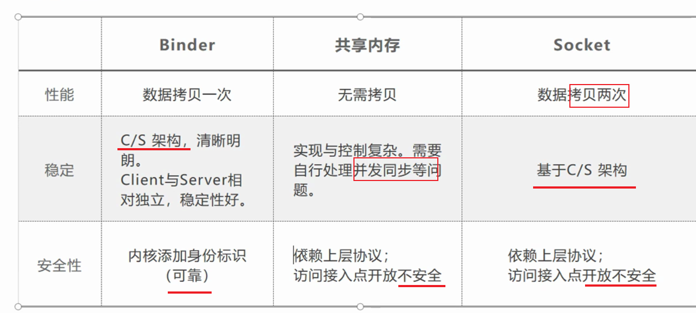

 

2、或者说， 共享内存和 Socket的一个  <font color='red'>中间态</font>：取Socket的copy + 共享内存的内存映射


补充：

后面几种（除了共享内存），都有一个特点：  必须通过内核空间


### Parcel + Parcelable

模型：图 TODO

目的在于：

>  拆解成基本类型，通过内核（IoCtrl）

本质：Parcel + Parcelable  。`与类没有任何关系， 已经拆解成基本类型了`

​			`可以打包的数据，自然`：~~Parcelable(Intent、Bundle) +  基础数据类型 + list + map~~ + Binder（TODO: 如何做的？？？）     

推论：Parcel作用就是拆解     类---->  基本数据类型序列

应用场景：跨进程传输，打包解包必须（必须int传输）


## 0层流程-----一次Binder通信

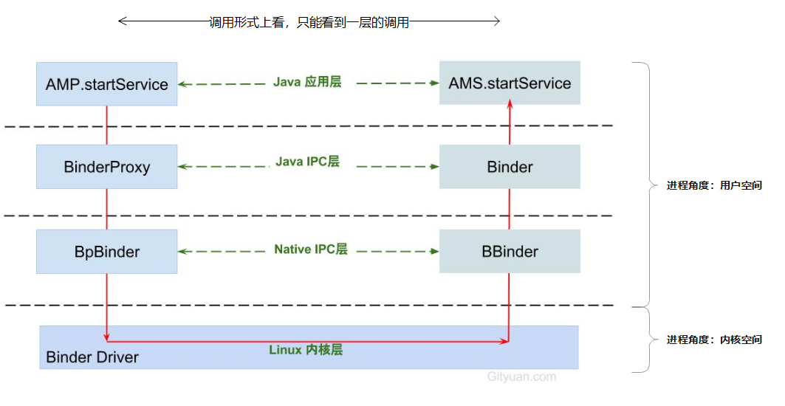

IPC.eddx

**分层设计思想**：类比于 五层TPC/IP协议体系，见 http://gityuan.com/2016/09/04/binder-start-service/

好处：

-   **从功能实现角度看，层与层具有独立性**,  例如应用层可以使用传输层提供的功能而无需知晓其实现原理;
-   设计灵活, 层与层之间都定义好接口, 即便层内方法发生变化,只有接口不变, 对这个系统便毫无影响;
-   结构的**解耦合**, 让**每一层**可以用更适合的技术方案,  **更合适的语言;**
-   **从维护角度看，方便维护,** 可**分层调试**和定位问题; 


## 0层结构-----Binder架构（存在三个ipc）

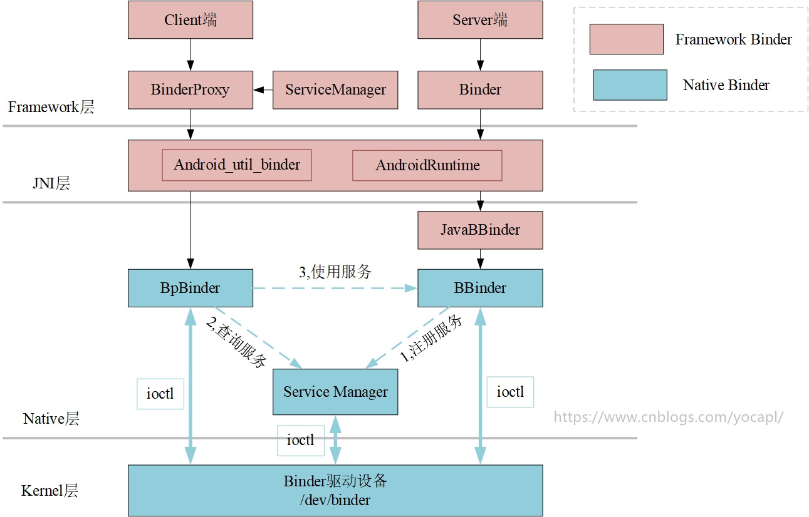

参考：  https://www.cnblogs.com/yocapl/p/12422617.html


逻辑化简：


1、上图中**步骤1、2、3是虚线的**，并不是直接调用。<---- 通过ioctl` 系统调用Binder驱动`完成的

2、上图存在三个进程：client进程、server进程、Service Manager进程  ---> <font color='red'>任意两个之间的交互都是通过Binder？</font>

3、从应用角度：应用层只需要实现client 和 server；

~~4、对于应用层来说，看到的 就是  client调用 server~~


5、背后的架构：C/S架构

6、从实现机制上看，有点儿类似linux共享内存

7、从数据拷贝次数来看，Binder只需要进行一次内存拷贝，而管道、消息队列、Socket都需要两次。共享内存不需要拷贝，Binder的性能仅次于共享内存。---> 为什么不用共享内存？共享内存需要处理并发同


基于0层的生活化模型：


床柜挪房间模型：

> 两个房间：两个进程。进程内存隔离
>
> 两个房间之间有个客厅： 内核，通往客厅的门只能通过小的基本类型数据
>
> 拆床说明书（即组装床说明书）Parcelable、同样拆柜子说明书：Bed implements Parcelable  --------> 这个其实不是AIDL。不得不：两边有一模一样的
>
> 拆哪个东西的约定：AIDL协议-------->  即int code表征执行哪个方法。。。不得不：两边有一模一样的AIDL
>
> 

目标：床柜挪房间

---------- 》  不得不：

  1、这边房间需要拆床 ，拆完的 基本部件才能通过门，到另一个房间

  2、到另一个房间后，怎么知道这次拆的是床的 ------》AIDL协议


## 功能实现之管理结构(后面拆除掉)

`0层结构图中的：`


一般C/S架构必然有  管理者，server用来注册；client端用来查询

所以，`ServiceManager 一句话本质`： 维护了  binder名-------Binder列表： 比如 “Activity” -----  AMS的Binder 


AMS的Binder 何时注册到 ServiceManager呢？见《系统启动流程》中的publishBinderService流程


Q：  ServiceManager本身底层也是 Binder, 他怎注册呢？

A:  **自然**，必然是固定的，不注册。 ServiceManager对应的handle为0，取到对应binder


TODO:   如果是APP开发者自己定义的Service，binderService时，走的是AMS，没有注册到ServiceManager嘛？


注意：后面看流程，先把管理serviceManager给去除了


### ~~管理模型，类似于其他C/S架构~~

再比如：DNS	服务器，也是维护了 域名----IP的列表


## 功能实现之核心结构

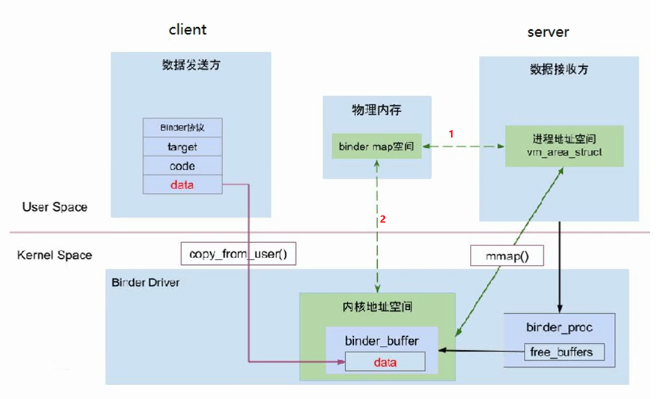

 <a id='binder_wulibenzhi'><font color='red'>Binder的物理本质 :</font>  </a>

> 一个词总结： 共享内存
>
> 一句话总结： Binder 是在 共享内存的基础上， `以性能（增加copy）为代价，换取了 安全性`   

注意：1、上图是在 共享内存 图的基础演化而来。差别在于：

​           （1）内存映射 的双方不同： 共享内存是两个APP进程 ；Binder是 内核进程 与 server端

​           （2）mmap()功能的物理实现 即 图中1和2

 

数据流：
client 发送数据 ---->  kernel ( kernel 内核空间地址，映射到了物理内存，则server能感受到)

从数据的流转来看（数据结构的变化）,  Binder的本质：

经过内核，不得不： 
1、传输的数据，不得不拆解成int、string等基本类型（TODO: 经过内核时，是不是更基本？） 
----->  **所以，parcel拆解，是不得不的**

2、AIDL协议也是不得不的，<font color='red'>AIDL要做两件事情</font>：  
（1）保证 触发与接收函数一致，通过code           
（2）~~保证拆合，原则一致，有同一套说明书~~ （Parcelable保证的！！！！！不是AIDL） 

<a id='aidl_moxing'>AIDL从模型的角度的本质：即上面保证（协议）</a>  


官方描述：

mmap() 是操作系统中一种内存映射的方法。
内存映射就是<font color='red'>将用户空间的一块内存区域映射到内核空间</font>。映射关系建立后，用户对这块内存区域的修改可以直接反应到内核空间；反之内核空间对这段区域的修改也能直接反应到用户空间。


基于上图，一句话： <font color='red'>整个Binder机制，唯一核心的就是映射1（ kernel内存地址  和 物理内存 的映射）创建</font>

------->   在server端 ， Binder的创建流程中，见下


## Binder的创建

目<font color='red'>标：</font>整个Binder机制唯一核心------- 映射的创建

### Binder是什么

不同角度：

机制:   Binder是一种进程间通信机制;  ---->  这个角度来看： Binder 是 安卓的 **神经系统** 

从<font color='red'>功能看：Binder就是一种服务</font>（虽然可能不是service，比如主线程的Binder）。所以，天生的，Service，底层必然是Binder

应用层:  Binder是一个能发起通信Java类;  --->  ~~对外的接口~~

Framework/Native: ~~Binder Client、 Server、 Service Manager和Binder驱动程序,   形成一套C/S的通 信架构~~

驱动:   Binder是一个虚拟物理设备**驱动**;  ---->  真正实现功能的地方

物理角度：Binder的<font color='red'>本质</font> [见上](#binder_wulibenzhi)


-------->  记忆锚点： 应用层来看、Framework/Native、驱动、物理角度


### Binder驱动的创建时机

进程创建的时候，一般就创建了。比如：


问题1：为啥要在APP创建时，要第一时间初始化Binder驱动呢？

> A:   ~~因为创建APP进程之后，会将自己的Binder给到AMS来管理（后续，AMS让APP创建Activity）~~ -----> 见APP启动流程
>
> ​     自然，~~在这之前，要创建Binder~~


问题2：zygote进程有自己的 binder嘛？ video7

> A：没有。
>
> linux角度：因为主要功能是生孩子（fork）。linux不允许fork的有多线程，会产生死锁  ---->  规则
>
> 代码角度：TODO


### Binder的注册时机

（1）0号引用  ServiceManager  的Binder不需要注册

（2）对于一个普通的APP定义的service，何时注册到  ServiceManager 的？  


## AIDL


aidl 目的：

> 就是  对外接口 Proxy和stub，自动生成。不用APP开发者自己写
>
> 为啥不能纳入framework呢？没办法，因为AIDL里面的具体接口函数，不清楚


所以，AIDL是封装

​           AIDL也是没能纳入framework层的妥协，利用编译抽取公共功能--------》  TODO: 背后的背后： 收集这个技巧！！


核心的核心就是 Ibinder如何传递的


注意： 

两个 APP源代码，必须有相同的 .aidl文件 文件 

推论：~~虽然Server端有Proxy，但是没有用到~~


TODO:  AIDL编译也可以生成native的proxy和stub？？？？？？


从APP开发者来看：

AIDL<font color='red'>是接口 </font>----->  自然，server和client都要（复制一份一模一样的  或者  编译共用一个）

AIDL<font color='red'>的本质，一句话：</font> 

​       1、从代码角度：对proxy和stub进行封装   ------> 通过编译.aidl文件，自动生成 proxy 和 stub文件

​        2、从模型角度：    [见上](#aidl_moxing)


## 分析一次Binder调用(核心)

前提条件：

默认 client 已经持有 server端的 binder了（物理上持有的是啥？）通过 manger

### client--->BinderProxy--->binder驱动

即0层架构图的

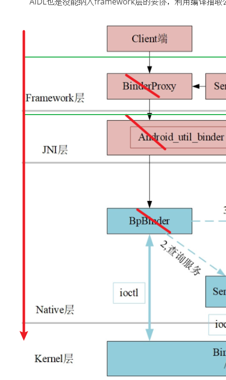

以 APP 获取AMS服务为例子，即ServiceManager.getService方法   ：

前提，已经持有ServiceManager对应的Binder了

角色：

> client  ---- APP
>
> BinderProxy ---- **ServiceManagerProxy**  
>
> jni
>
> BpBinder
>
> Binder驱动 ------- 即 ServiceManager对应的0号 Binder


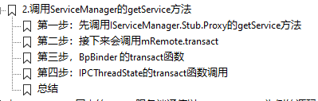


### binder驱动--->BinderProxy--->server

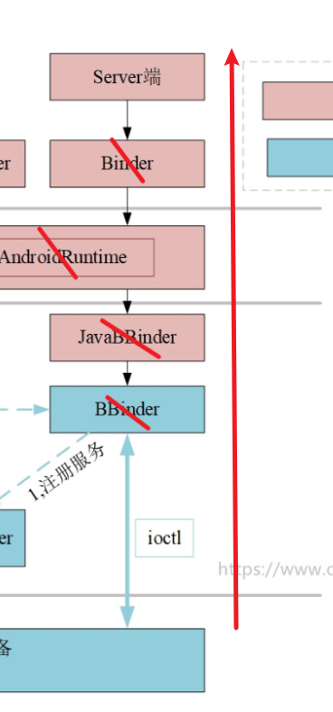

以ServiceManager.addService为例子：


## binderService流程

注：~~如上所说，Binder本质就是体现一个服务 (但不一定都是Service)~~


原图：


化简：

1、2、5、6删除。~~Client 通过 AMS 、Server也通过AMS，~~自然 ，先必须找ServiceManager


触发点：

```java
MainActivity.bindService(intent, mServiceConnection, Context.BIND_AUTO_CREATE);  // 唯一核心代码
```


唯一一行核心代码：

> AMS把 Service的Binder给到 Client端： onServiceConnected() 之前流程。调用栈：

**也是上图的一句话总结**

总结：

> 上图总共 8次跨进程 通信！！！！


~~繁琐的展开流程如下：~~

> 1）Activity作为Client发起bindService，最终会调度到AMS 去执行bindService。在这个过程中，Client要去调用
> AMS的代码，所以此时就会涉及到跨进程调度，基于第三章的Binder通信模型我们不难知道，Client会先和
> ServiceManager通信，从ServiceManager中拿到AMS的IBinder。
> 2）Activity拿到AMS的IBinder后，跨进程执行AMS的BindService函数；
> 3）由于AMS管理所有的应用进程，因此AMS中持有了应用进程的Binder，所以此时AMS可以发起第4步也就是跨进
> 程调度scheduleBindService();
> 4)Server端会在收到AMS的bindService的请求后，会将自己的IBinder发送给client，但是Server必须通过AMS才能
> 将Binder对象传过去，所以此时需要跨进程从ServiceManager中去拿到AMS的binder；
> 5）Server端通过AMS的binder直接调用AMS的代码publishService(),将service的Binder发送给AMS；
> 6）经过层层调用，最终AMS讲Server端的binder通过回调connect函数传递给了Client端的Activity；
> 以上就是bindService的全流程，这个流程主要的目的是将Server端的Binder对象发送给Client端。从此以后，Client
> 端就可以通过Server端的binder与Server端像调用自己的代码一样完成跨进程通信了  


## Binder的 同步调用 / 异步调用

结论：默认都是同步调用

​         ~~即 A 应用调 B应用，等待B应用的返回结果~~

同步调用，图：

> 
>
> 关注<font color='red'>点：</font>（1）client 休眠（ 在等待结果时）； （2）Server端  是在binder线程上 （非主线程）


为什么默认都是同步？同步为何是自然的？

1、同步是自然的

2、很多情况，Client调Server是需要 获取结果（reply）的： 比如BOOK中例子，获取Server端的getBookList()

​     从模型角度：

>  要等待结果，必须休眠 

​    从代码角度：

> ```java
>     // Client 端 
>       public java.util.List<com.example.aidl.Book> getBookList() 
>       {
>         android.os.Parcel _data = android.os.Parcel.obtain();
>         android.os.Parcel _reply = android.os.Parcel.obtain();
>         java.util.List<com.example.aidl.Book> _result;
>         try {
>           _data.writeInterfaceToken(DESCRIPTOR);
>           boolean _status = mRemote.transact(Stub.TRANSACTION_getBookList, _data, _reply, 0); //【1】
>           ............
>           _result = _reply.createTypedArrayList(com.example.aidl.Book.CREATOR); //【2】
>         }
>           ............
>         return _result;
>       }
> ```
>
> 必须等【1】执行完，\_reply才有数据，【2】才能用\_reply
>
> 


### 异步


异步调用，图：

> 
>
> **对比同步**，异步注意点： client不会休眠（自然也不会等待结果）


代码层面的区分点：

> ```java
> //Proxy中：
> 
> mRemoteBinder.transact(REQUEST_CODE, _data, _reply, 0);// flag = 0
> ```
>
> // flag = 0 表示同步调用（默认），~~1 表示表示异步调用~~（自然， ~~异步调用\_reply必须为null~~）
>
> 补充：1即  IBinder.FLAG_ONEWAY


从aidl的接口定义角度：

> 自然，~~oneway的aidl的接口定义是<font color='red'>不能有返回值的</font>  （返回值都是由\_reply承载的）~~
>
> ​         比如： oneway interface IApplicationThread{..........}
>
> <font color='green'>使用方法：</font>   oneway关键字，决定了 代码中  flag = 1


IPCThreadState角度：

> TODO:   https://www.jianshu.com/p/db2df0a4e037


线程角度：  TODO

> 对于ONEWAY接口，所有调用在server端都被串行化(尽管不同应用发起请求是并行的)


#### 例子：

onesay主要用于系统服务向应用端发起binder调用：

```java
scheduleLaunchingActivity: 系统服务向应用端发起oneway binder调用，让应用端启动acitvitiy
IWindow：WMS向应用端发起oneway binder调用
IServiceConnection: 应用端bindService完成时，AMS向应用端发起的oneway  binder调用
IIntentReceiver：AMS发起oneway binder调用 分发广播
```


具体例子：

```java
// IApplicationThread.aidl
oneway interface IApplicationThread{
	void scheduleTransaction(........); // 同步生命周期的。即启动应用侧 acitvitiy
    // 所有方法，不能有返回值
} 
```

结论：

> **系统侧---->  APP侧，必须是 oneway 的aidl**    
>
> ​                                TODO: APP侧绝不能阻塞系统侧
>
> APP侧 ---->  系统侧，一般可以是 同步aidl： 自然，APP里AIDL一般不加oneway 


## 优缺点：

oneway binder 优点：

```
1，异步：应用端处理这些oneway binder调用，如果很耗时，也不会阻塞系统服务
2，串行化，系统会逐个分发binder 调用
```


## 实现机制

TODO:


## 参考： 

https://www.jianshu.com/p/db2df0a4e037   Android Framework学习之Binder的oneway机制

https://blog.csdn.net/yu8fei/article/details/109389362?spm=1001.2101.3001.6650.1&utm_medium=distribute.pc_relevant.none-task-blog-2%7Edefault%7ECTRLIST%7ERate-1-109389362-blog-123662130.235%5Ev32%5Epc_relevant_default_base3&depth_1-utm_source=distribute.pc_relevant.none-task-blog-2%7Edefault%7ECTRLIST%7ERate-1-109389362-blog-123662130.235%5Ev32%5Epc_relevant_default_base3&utm_relevant_index=2    Binder的同步与异步


## 其他细节

### binder安全机制

上面说binder比其他IPC机制更加安全，体现在内核 对  UID/PID进行有效性检测。

TODO: 具体如何校验的？


### 一些函数

```java
Binder.getCallingPid(); //获取 调用binder的进程pid（自然是在 在服务端 ）
```


## 参考

http://gityuan.com/2016/09/04/binder-start-service/

http://gityuan.com/2015/10/31/binder-prepare/

https://blog.csdn.net/carson_ho/article/details/73560642 

https://developpaper.com/principle-and-use-of-android-binder/


https://blog.csdn.net/carson_ho/article/details/73560642  -->Binder优质文章


一些结论：
一个Binder就是一个线程。比如： AMS实现了Ibinder接口，是一个Binder, 所以也是一个binder线程


Binder机制：https://blog.csdn.net/carson_ho/article/details/73560642

这3大过程每一次都是一个完整的BinderIPC过程
http://gityuan.com/2016/09/04/binder-start-service/    <-----彻底理解Android Binder通信架构


《Binder预习资料.pdf》


## 面试题

https://blog.csdn.net/xuyin1204/article/details/118546330?ops_request_misc=%257B%2522request%255Fid%2522%253A%2522162599351116780274143599%2522%252C%2522scm%2522%253A%252220140713.130102334.pc%255Fblog.%2522%257D&request_id=162599351116780274143599&biz_id=0&utm_medium=distribute.pc_search_result.none-task-blog-2~blog~first_rank_v2~rank_v29-2-118546330.pc_v2_rank_blog_default&utm_term=binder&spm=1018.2226.3001.4450         Binder相关面试题目


# 线程间通信-----Handler


## 前言---从应用角度

### 使用目的：

Handler的存在就是为了解决在`子线程`中无法访问UI的问题（~~自然，进程间不可以~~），~~多用于切换主线程~~  

从线程<font color='red'>模型</font>的角度（抛开安卓、UI）来看，Handler本质就是线程

所以，Handler本质与主线程 没关系、与UI没关系


常见的使用场景：
非子线程想要界面操作，比如：

网络交互后切换到主线程进行UI更新

Binder通信后，Binder线程切换到主线程进行UI更新


由此引发的问题：
1、如何使用？ 
2、如何完成切换线程的呢？机制
3、

### 其他 线程通信的方式


### Handler场景例子详解

EX 1:

比如：
Toast服务给Toast回调，为什么要用message？为什么不直接回调呢？
< ------Toast服务回调show是个`Binder线程`，切换到main线程去真正show《------因为界面变化必须在主线程

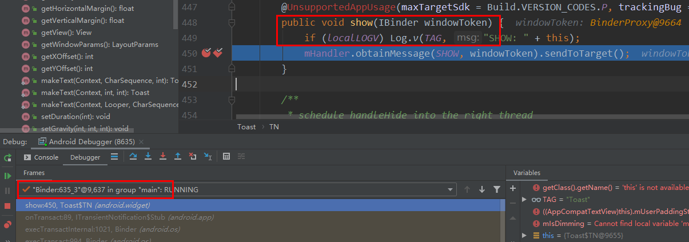


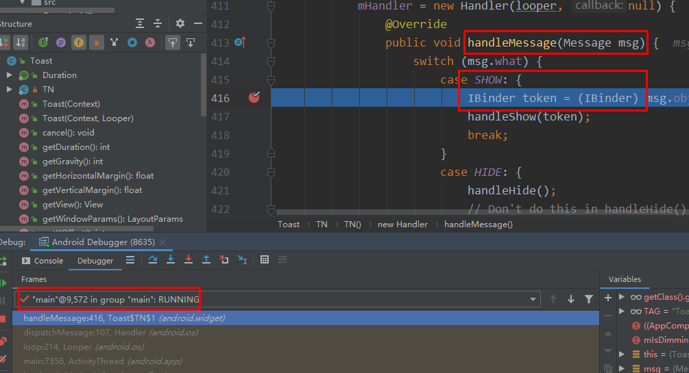


EX 2：

TODO: 输入法的六个桥梁之间，有哪些是用了Handler 转Binder线程 为主线程的？why？


EX 3：

在子线程里发送：


主线程里接收：

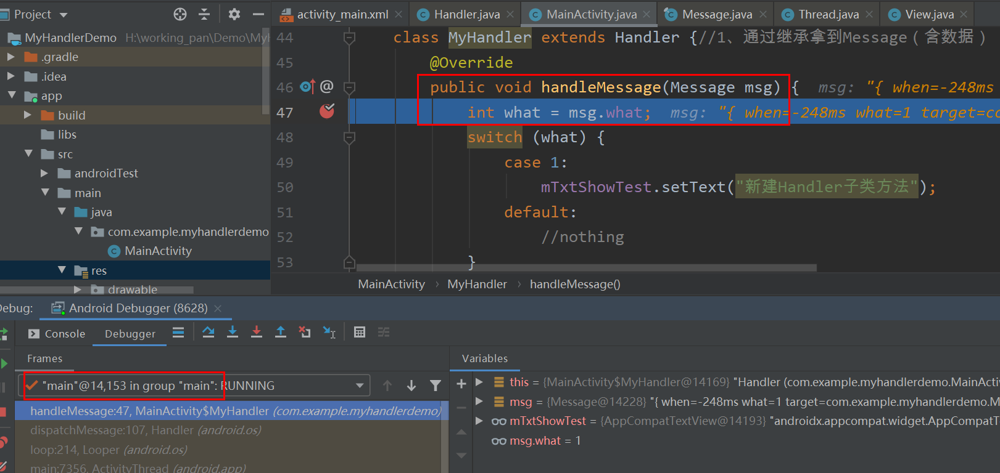

如果要msg携带多个参数呢？


一些细节：

```
Message msg = Message.obtain();
与
new Message()
```


### 使用逻辑： 


一句话描述：子线程用了主线程的Handler发消息（补充，含有looper的线程都可以）

例子：

```java
public class MainActivity extends AppCompatActivity {

    TextView mTxtShowTest;
    Button mBtn1, mBtn2, mBtn3;

    //2、在主线程里new Handler.------->为什么这样???
    private MyHandler myHandler = new MyHandler();

    @Override
    protected void onCreate(Bundle savedInstanceState) {
        super.onCreate(savedInstanceState);
        setContentView(R.layout.activity_main);

        mTxtShowTest = (TextView) findViewById(R.id.mTxtShowTest);
        mBtn1 = (Button) findViewById(R.id.mBtn1);

        mBtn1.setOnClickListener(new View.OnClickListener() {
            @Override
            public void onClick(View v) {
                new Thread(new Runnable() { //3、在子线程里发消息
                    @Override
                    public void run() {
                       Message msg = Message.obtain();
                       msg.what = 1;//要传递的数据

                       myHandler.sendMessage(msg);
                    }
                }).start();
            }
        });
    }

    class MyHandler extends Handler {//1、通过继承拿到Message（含数据）
        @Override
        public void handleMessage(Message msg) {
            int what = msg.what;
            switch (what) {
                case 1:
                    mTxtShowTest.setText("新建Handler子类方法");
                default:
                    //nothing
            }
        }
    }
}


```

## 0层模型----锚点

切换线程，**不得不的**模型： `注意忽略掉类名，与代码无关`

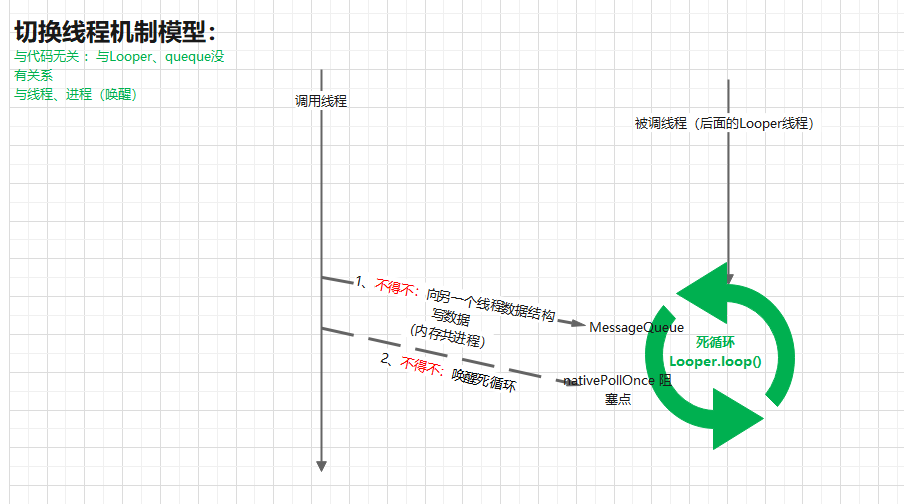

~~见 handler.eddx~~


生活化<font color='red'>的模型： 磨玉米模型</font>   

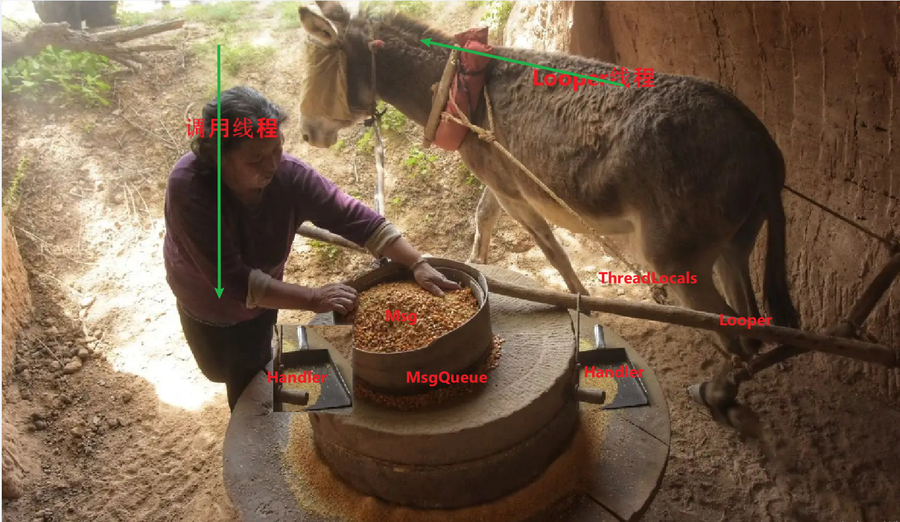


人物：

> 人（调用线程）：人，可以有多个人 ----》 一般来说是 **非主线程**
>
> 驴（Looper线程）：干活线程(有些活，必须这个线程干，**就像磨一般都是驴来拉**)
>
> 旋转杆：Looper，负责旋转整个线程  ---->  Looper的旋转，才导致玉米msg不断被取出next()，<font color='red'>是永恒的动力</font>
>
> 绑绳： ThreadLocal---------<font color='red'>绑绳，是线程相关量，让Looper与对应线程绑定</font>  
>
> 装玉米的磨：msgQueue(自然,一个线程一个)
>
> 磨洞：取玉米，一个一个取的
>
> <font color='red'>一个个排队的</font>玉米： msg，注意：**玉米之间是线性的，一个一个网磨的洞里漏**
>
> ​                     玉米的排队顺序：<font color='red'>是人指定的</font>，  **按照玉米的 着急程度排序 （质量高的 玉米， 人给 赋了值when，安排靠前 加工）**
>
> Handler：是添加玉米/<font color='red'>取玉米</font>的瓢(添加msg的工具/<font color='red'>处理msg的工具</font>), 有多个, 绑在磨上(自然,1、一个线程可以多个2、自然,在Looper 线程里生成,与Looper绑定3、自然各个调用线程都能用)
>
> 
>


自然的结论：

> 1、  一个线程可以有多个Handler(瓢),只有一个Looper(驴子),只有一个MessageQueue(磨)
>
> 2、Handler(瓢)的生成，必须在Looper线程下--------驴子的瓢，给人用
>
> 3、所有的一切都是主线程的（Looper线程），是一个输入系统。调用线程没有任何东西。


纵向流程：

> 1、正常情况下，驴子看自己的磨里（Looper线程的queue）没有玉米（msg），不需要磨，驴子就睡地上了（Looper线程阻塞，挂起？）
>
> ​      人也在干自己的事情（调用线程做自己的事情）
>
> 2、**人通知驴去干活**，两件事情：
>
> （1）**人用瓢 往磨里 填加 玉米**： 调用线程 通过Handler 往 Looper线程的queue里加 msg    ---->  <font color='red'>这一步是简单的</font>，因为人和驴的磨之间，没有墙（共进程），可以直接加（共内存）
>
>  （2） 人把驴弄醒wake


由此可见，最核心的是（2），如何弄醒驴子


xaingxue的模型：


## 1层架构图：


~~见 handler.eddx~~


对外接口：

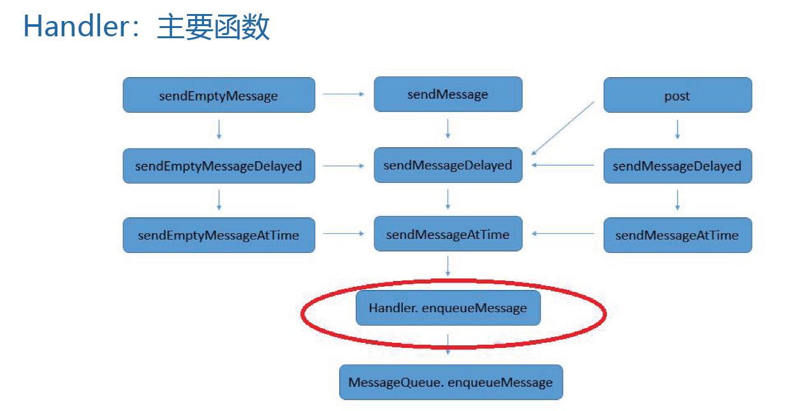

最终都归结为：~~Handler. enqueueMessage~~     Queue. enqueueMessage 即消息入队列


## 串线之驴子：Looper.loop()--基于0层模型图

基于0层模型图中，<font color='red'>最核心的</font>就是 死循环

```java
 // Looper.java
   public static void loop() {
        final Looper me = myLooper();
        final MessageQueue queue = me.mQueue;
        for (;;) { // 死循环：for内部没有return或break
            ...........
            Message msg = queue.next(); // might block 【1】获取下一个msg block线程的地方，见下
            try {
                msg.target.dispatchMessage(msg); //  【2】分发msg 给target处理，见下
            } 
            ...........
            msg.recycleUnchecked(); //  用完的msg回收消息池 TODO
        }
    }
```


时机：~~由 0层模型图，自然：Looper.loop() 自然是被 Looper线程调起来的---->  对于主线程，是ActivityTread的main里Looper.loop()~~

作用：做了两件事情，`同 0层模型图一致`：

>   【1】[获取下一个msg   ( block线程的地方，见下](#block)) 
>
>   【2】~~分发msg 给target处理~~  自然


<a id='block'>补充【1】  queue.next()获取下一个msg block线程的地方</a>

链接: 基于0层模型图，为什么一定要有 Looper线程的block?

A: <font color='red'>不得不：</font> 

1、如果没有block，那么主线程一直在Loop里循环跑，根本不会有其他代码会被执行。<font color='red'>驴子在空跑</font>
~~2、主线程还需要处理其他很多事情，比如Input、view等等~~     ------>  似乎不是理由？


```java
// MessageQueue.java
    Message next() {
        for (;;) {   // 遍历queue，获取下一个msg，不是死循环
            //【1】阻塞操作，当等待nextPollTimeoutMillis时长，或者消息队列被唤醒，都会返回。见下
            nativePollOnce(ptr, nextPollTimeoutMillis);

            synchronized (this) {
                // Try to retrieve the next message.  Return if found.
                Message prevMsg = null;
                Message msg = mMessages;
                if (msg != null && msg.target == null) { //cg: 【消息屏障】 syncBarrier
                    // Stalled by a barrier.  Find the next asynchronous message in the queue.
                    do {
                        prevMsg = msg;
                        msg = msg.next;
                    } while (msg != null && !msg.isAsynchronous()); //cg: get asynchronous msg，找到异步消息
                }
                ...........
                // Got a message.
                mBlocked = false;
                if (prevMsg != null) {
                    prevMsg.next = msg.next;
                } else {
                    mMessages = msg.next;
                }
                msg.next = null;

                msg.markInUse();
                return msg;  // 【2】获取头节点
    }
```

【1】阻塞block操作 nativePollOnce()：

其中参数 nextPollTimeoutMillis 代表下一个消息到来前，还需要等待的时长（-1一直等）

**（1）作用**

nativePollOnce()<font color='red'>阻塞Looper线程</font>。 ~~自然：只有当nativePollOnce()返回后，next()从`mMessages`中提取一个消息~~

（2）具体做了啥？

见   技术点pollOnce与~~wake~~


（3）何时nativePollOnce()会有返回？


## 不得不之  Looper线程唤醒（核心）

pollOnce与~~wake~~~----最核心代码，线程间通信


这里就是Android系统的Handler消息机制的消息循环的核心实现，使用了Linux的epoll事件处理机制。当消息队列为空时，常规的循环实现是调用sleep/usleep释放cpu，当时间到了之后，会获得CPU资源进行一次消息检查；Handler的消息循环采用Linux kernel的epoll机制，当消息队列为空时，会挂起释放CPU资源，只有当消息队列有新消息到来时，才会重新获得CPU资源，进行消息处理。

相比常规实现，Android系统的Handler消息机制更加节省系统资源(CPU资源)。

相比常规实现，Android系统的Handler消息机制的生产者，把消息放入消息队列的同时，可以通知(唤醒)消息处理者。

链接：https://juejin.cn/post/6856366890936827911


最<font color='red'>核心：</font>epoll机制：epoll导致睡眠

​                  往文件里写字符，唤醒epoll流程继续      
注意 wake() 绝对不够本质！！！！！！


##  串线之人：Handler.sendMessage流程---为死循环提供玉米（数据）+唤醒（驴子）：

链接：基于0层模型图，<font color='red'>存在的理由（不得不）</font>：
1、死循环需要被提供数据   2、死循环需要被唤醒

```java
//发消息在子线程
sendMessage:611, Handler (android.os)// 对外API
sendMessageDelayed:673, Handler (android.os)
sendMessageAtTime:703, Handler (android.os)
   enqueueMessage:754, Handler (android.os)
      enqueueMessage:556, MessageQueue (android.os)// 队列
          ------------------native---------------------
             NativeMessageQueue::wake() 
                 Looper::wake()  // 【1】最终真正唤醒的地方
```

流程，子线程中：
Handler.sendMessage(msg)   (msg通过obtain获得，见补充[msg](#msgObtain))
       最终是调了链表MessageQueue.enqueueMessage方法(<font color='red'>自然，不得不</font>)，将msg加入链表 （新消息入队规则：见[次要补充1：新消息入队规则](#xinxiaoxirudui)） 

**<font color='green'>一句话总结</font>：**发送消息，实际上就是消息入队（链表）


### 问题：**何时切的主线程呢？？**？

答：looper.loop()在主线程一直循环（for循环）,  感受到了链表里有新的msg

0层图

结构：looper也持有MessageQueue

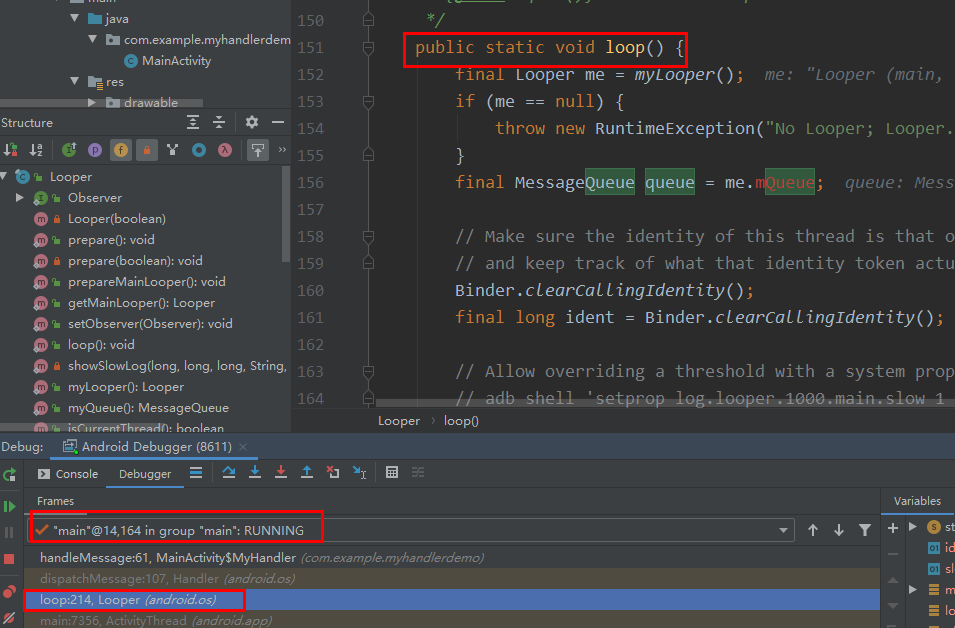

```java
// Looper.java 
public static void loop() { //#4 loop()是在主线程main方法里被调起来的！！！！！！
        final Looper me = myLooper();
        final MessageQueue queue = me.mQueue;

        boolean slowDeliveryDetected = false;

        for (;;) {  //这里就是一直说的looper循环！！！！！
            Message msg = queue.next(); // might block  //#3
            if (msg  null) {
                // No message indicates that the message queue is quitting.
                return;
            }

```


问题：关于for循环：
(1) for 循环确定一直在循环嘛，即使queue没有东西？？？

[跳转A](#for1)

  **（3）对于#4，如果for是一直循环，那么 main函数之后的流程理应走不到！！！！！！**----》确实是，Looper.loop()是最后一行代码

**（4）App如何退出呢？**


### <span id="for1">for 确定一直在循环嘛</span> 

----》即使queue没有东西？？？

A:

总结：

list为空，是block状态------》#1、线程如何block？？？？

list不为0 ，被唤醒，读取-------》#2、如何被第二个线程唤醒？？？？


TODO：
Looper的wake机制升级
https://cloud.tencent.com/developer/article/1639805


#1 、线程如何block？？？？
epoll


### 次要补充： <a id="msgObtain">msg获取</a>   

obtainMessage

### 次要补充： <a id="xinxiaoxirudui">新消息入队规则：</a>   


https://blog.csdn.net/u013008419/article/details/80001310 

注意：与普通链表不同，不是添加在最后  ，而是  **按照玉米的 着急程度排序 （质量高的 玉米， 人给 赋了值when，安排靠前 加工）**

自<font color='red'>然：</font>~~原始的消息队列顺序是按照消息执行时间when排序的。新msg也是按照when大小插入：when小，插前面~~


## 机制 --> 如何完成线程切换的：

https://blog.csdn.net/wsq_tomato/article/details/80301851

## 补充1：准备消息循环looper

因为handler里有Looper


问题：
1、循环Looper是啥？
2、Looper的主线程无限循环，为什么没有造成ANR呢？


循环Looper是啥？：

1、消息处理机制中，消息都是存放在一个消息队列中去，而应用程序的主线程就是围绕这个消息队列进入一个无限循环的，直到应用程序退出。

2、如果队列中有消息，应用程序的主线程就会把它取出来，并分发给相应的Handler进行处理；如果队列中没有消息，应用程序的主线程就会进入空闲等待状态，等待下一个消息的到来。

Looper初始化流程：

```java
//ActivityThread.java  
public static void main(String[] args) {
        ........
        Looper.prepareMainLooper(); //#1

		........
        ActivityThread thread = new ActivityThread();// (1)
        thread.attach(false, startSeq);

        if (sMainThreadHandler  null) {
            sMainThreadHandler = thread.getHandler();
        }

        ........
        Looper.loop();// (2)
       
        throw new RuntimeException("Main thread loop unexpectedly exited");


    }
```

这个函数做了两件事情， (1)一是在主线程中创建了一个ActivityThread实例， (2)二是通过Looper类使=主线程进入消息循环中，这里我们只关注后者。

什么叫使主线程进入消息循环里？
----> 


Looper.prepareMainLooper(); //#1流程

静态函数


TODO：

ThreadLocal，表示这是一个线程局部变量------》如何做到的????


注意：变量、类是没有线程概念的！！！！----》本质是内存，内存是进程级的！！！！


## 从架构师 角度看Handler

从设计模式角度： 属于生产者、消费者模式。见: 《设计模式》

从系统角度看：有进无出。1、所有的一切都是主线程的。 2、调用线程，只是用Handler做了调用，即输入

~~从功能角度： 发号命令的人（之后不用管事了），与干活的驴。~~

从本质角度：内存共享原理  ---->  共享的是哪一块内存？ msgQueue（人可以往这里添加玉米，驴子可以从这里拿玉米）

ThreadLocal原理  


## 关于 MessageQueue 

持有mMessages,  mMessages 有 next属性指向下一个msg 

-----》 msg本身就是链表了        所以,    MessageQueue只是对链表的封装,   提供一个管理功能 add, remove操作


## Handler容易导致的内存泄漏

参考：  https://mp.weixin.qq.com/s?__biz=MzA5MzI3NjE2MA==&mid=2650238704&idx=1&sn=ad334840afdc2d9bdb8215e9f942e54e&chksm=88639f9fbf1416898edfc3615a7ea25f6798e3bb6f3089ca720e18b92ce67328c623561cf35e&scene=27  好文   内存泄漏全解析     [郭霖](javascript:void(0);) *2017-02-28 08:00*

视频： 19. Handler内存泄漏的GCRoot到底是谁-fS.vep


例子1：

```java
// MainActivity.java

Message msg = Message.obtain();
msg.what = 1;//要传递的数据
myHandler.sendMessage(msg);

class MyHandler extends Handler {
        @Override
        public void handleMessage(Message msg) {
            int what = msg.what;
            switch (what) {
                case 1:
                    //mTxtShowTest.setText("新建Handler子类方法");// 【表达1】
                    MainActivity.this.mTxtShowTest.setText("新建Handler子类方法"); // 【表达2】MainActivity.this 代表外部类的实例
                    break;
                default:
                    //nothing
                    break;
            }
        }
    }
```


```java
// 持有关系
static sThreadLocal -> Looper-> MessageQueue ->  Message -> handler -> MainActivity.this外部类的当前实例
因为sThreadLocal是静态的，与APP同生命周期。所以是GcRoot
```

(1) 这里  handler -> Main2Activity.this 
原因：内部类（非静态）持有外部类引用 , <font color='red'>见【表达2】</font> -----》 **自然的**，~~如果没有外部，怎么找到内部类？~~ TODO: 根本原因，要到JVM里找

(2)  Message -> handler:

每个Message 有处理对象 handler

(2~)  记忆：持有链： 瓢handler 《----玉米Message  《----磨MessageQueue 《-----旋转杆Looper 《 ------绑绳： ThreadLocal

-------------》 最终结果，造成  MainActivity.this 与APP同周期**？<font color='red'>错误！！！！</font>**

**A:   玉米Message  《----磨MessageQueue 这一环链接时间最短，决定了 内存泄漏时间。** 
       例子1是造成的内存泄漏时间可能很短。
       所以，需要一个**前提： Message 尚未被处理，长时间在MessageQueue** ，比如，**延迟5分钟** 执行的消息 Message

即：例子2：

```java
        myHandler.postDelayed(new Runnable() { // 延迟执行
            @Override
            public void run() {
                Message msg = Message.obtain();
                msg.what = 1;//要传递的数据
                myHandler.sendMessage(msg);
            }
        }, 50000); // 设定指定的时间time,此处为20000毫秒
```

  


解决办法：

Handler 声明为<font color='red'>静态</font>内部类     -----》   自然，static的  与外部类没有关系了，不会再持有外部类。同时，【表达2】MainActivity.this 编译也报错，引不到外部类了

改动导致的<font color='cornflowerblue'>不得不</font>：静态内部类要使用 外部类，只能 弱引用了。。。其实自然的，因为此时**内部类是静态的，外部类不一定实例化了，所以编译上一定过不去**


即修改为：

```java
    private static class MyHandler extends Handler {
        private WeakReference<MainActivity> mReference;

        public MyHandler(MainActivity mainActivity) {
            this.mReference = new WeakReference<>(mainActivity); //【表达3】只能通过弱引用，来引用外部类，肯定无法直接
        }

        @Override
        public void handleMessage(Message msg) {
            int what = msg.what;
            switch (what) {
                case 1:
//                    mTxtShowTest.setText("新建Handler子类方法");
//                    MainActivity.this.mTxtShowTest.setText("新建Handler子类方法");

                    this.mReference.get().mTxtShowTest.setText("新建Handler子类方法");
                    break;
                default:
                    //nothing
                    break;
            }
        }
    }
```


工具：

> Android内存泄漏的检测工具——LeakCanary。 TODO: 原理： https://blog.csdn.net/a820703048/article/details/112849983

应用举例：https://blog.csdn.net/weixin_35924765/article/details/117505874

实操： TODO


一句话总结：

普通内部类  +   **延迟** 执行的消息 Message，容易造成内存泄漏


## ThreadLocal机制


要是我来设计，我肯定这样设计：一个**进程级别Map**，以ThreadId为key

-----》问题在哪里呢？
1、**进程级别Map** 做不到 只对一个线程开放，对其他线程封闭

2、用是可以用的------>  多线程同时操作 Map,  存在并发问题，需要枷锁


官方设计：

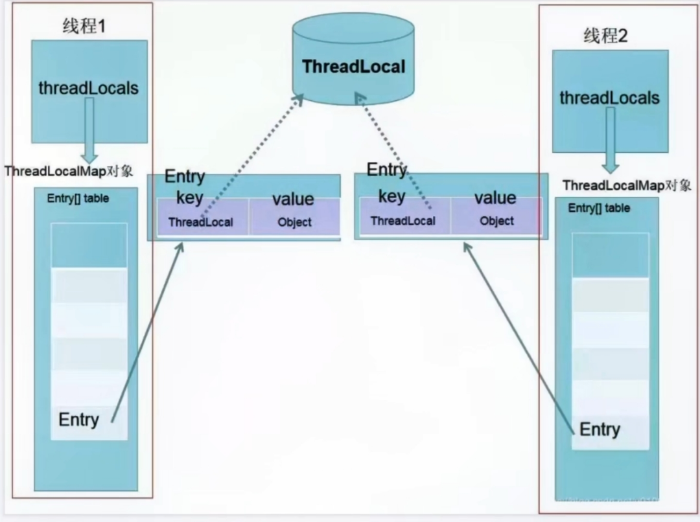

本质：1、  <font color='red'>map线程级</font>，  2、Map本身是Thread的<font color='red'>私有属性 </font> 3、key是 ThreadLocal<类型>,  ~~value是存储值~~

从物理内存角度来看：~~map对象肯定是在堆里（进程都可以访问），但是因为是<font color='red'>线程 私有 属性 </font>----》  达到对其他线程的封闭~~

​                                    即`一句话：`物理上，可以访问，但是没有索引

化简：

从本质上，可以看出，<font color='red'>只需要Thread的Map就行了，真正干活的</font>。那为啥还要Treadlocal呢？ 见下：


从功能角度：

1、存储（ 线程级） 是在线程里Thread ，真正干活的  自然，~~区分线程也是这里区分的~~

2、Treadlocal存在的必要性：

​      （1）不得不1：封装map，对外提供功能。因为map是私有的，不能直接对外 ---->  `工具类的作用`
​                                推论：<font color='red'>自然，是静态的，进程级别</font>

```java
static final ThreadLocal<Looper> sThreadLocal = new ThreadLocal<Looper>();
```

​      （2）不得不2：~~~map里面存了很多数据，如何快速找到，需要一个key来标志数据类型~~，自然  ---->   key的标志作用，指定要存啥类型

​        （3）优秀的点： 封装了Map，自然不用传参key。----> 从而，安全性，其他线程不能访问


使用：

1、存放Looper，使用new ThreadLocal<Looper>()

​      存放Intent，使用 new ThreadLocal<Intent>()


使用场景：

并发问题中， 同时使用的共享资源，可以被拆解成一个个独立的  线程级变量


补充：
~~任何用 ThreadLocal保存的变量，都是线程单例。比如  可以说 Looper 是线程单例~~ ----》 自然的，新的说法而已

### 相关问题

弱引用？


## 消息屏障

生活化模型，基于封路模型：

马路上一个个 汽车（msg ），一个个排队 走。这个时候，xin 的车(异步msg ) 要来了，
屏障msg是 警察。<font color='red'>警察插入队伍中某个位置（when），封住后面所有的车</font>  。  

基于封路模型：一些自然的不得不：
1、警察是不动的（屏障msg是不被执行的，因为处理的Target = null）

2、警察封住后面所有的车，对前面的车不封。即：前面的msg可以正常运行

3、~~之前 人将玉米加入 磨里，会唤醒驴子（子线程发送msg，唤醒主线程）。。。。。~~但是  屏障消息不会 唤醒主线程，~~因为本身就不需要执行~~ ，自然

​         代码证明：没有nativeWake()


本质：屏障消息就是为了确保异步消息的优先级，~~即：设置了屏障后，只能处理其后的异步消息，同步消息会被挡住~~

三种消息：

> 同步消息
>
> 异步消息
>
> 屏障消息


机制要解决的业务问题（背景）：

为 xin的车（VSync消息？？？）开路： VSync 16ms一次，如果用户同步消息（<font color='red'>多个，很可能</font>）没有执行完成，无法执行VSync消息，无法画用户界面。在用户角度，出现了掉帧或卡顿的情况。


 同步屏障（自然和异步消息一起） 使用场景，很少：

> ViewRootImpl接收屏幕垂直同步信息事件用于驱动UI测绘
> ActivityThread接收AMS的事件驱动生命周期
> InputMethodManager分发软键盘输入事件
> PhoneWindowManager分发电话页面各种事件


基于模型，代码：

```java
class MessageQueue{
	public int postSycnBarrier() {
        return postSyncBarrier(SystemClock.uptimeMillis());
	//currentTimeMills()系统当前时间，即日期时间，可以被系统设置修改,时间值会发生跳变
	//uptimeMills() 自开机后，经过的时间，不包括深度休眠的时间
	//sendMessageDelay，postDelay也都使用了这个时间戳
	//意思是指，发送了这条消息，在这期间如果设备进入休眠状态(如息屏后长时间不操作手机)那么消息是不会被执行的，
	//设备唤醒后到了时间才会执行
	}
	private int postSyncBarrier(long when) {
		synchronized (this) {
	    	final int token = mNextBarrierToken++;
	        //屏障消息和普通消息的区别是屏障消息没有tartget
	        //也就不会被分发处理(执行)
	        //可以理解为是一个标志位flag
	        final Message msg = Message.obtain();
	        msg.markInUse();
	        msg.when = when;
	        msg.arg1 = token;
	
			Message prev = null;
	        Message p = mMessages;
	        //【】根据时间顺序将屏障插入到消息链表中适当的位置
	        if (when != 0) {
	        	while (p != null && p.when <= when) {
	            	prev = p;
	                p = p.next;
	            }
			}
	        if (prev != null) { // invariant: p == prev.next
	        	msg.next = p;
	            prev.next = msg;
	        } else {
	        	msg.next = p;
	            mMessages = msg;
	        }
	        //【】返回一个序号，通过这个序号可以撤销屏障，见removeSyncBarrier(int token) 
	        return token;
		}
	}
}
```


异步消息：msg.setAsynchronous(true);  即 FLAG_ASYNCHRONOUS标致


屏障如何工作的？见 取函数next() 中  【消息屏障】


### 从设计角度，看 消息屏障

因为msg是个队列，所以，设计者想要 调节一下  msg执行顺序

> 小调节：when
> 大调节：消息屏障


## 使用注意事项

1、Handler使用前，一定要在looper线程先执行

```java
Looper.prepare()  //----> 为线程创建Looper
Looper.loop()     // 磨转起来
```

为啥主线程不要？

A：要的。主线程，在main流程中，系统侧已经做了


## 疑问

### 子线程发一个消息 

（1）何时主线程处理？？？----》按道理在主线程的messgeQueue排队
（2）如果主线程在执行其他流程呢 ---》按道理要等着现在流程走完（即：一个msg引发的操作执行完）
（3）一直走不完呢？ -----》在。。。。。会引发ANR？？？（TODO）

（4）ANR的机制是啥？


## 相关面试题

### 一个线程可以有几个Looper？可以有几个Handler？

从模型角度： ~~Looper.looper() 是**驱动整个线程运行的 拉磨驴**~~---->  自然，只有一个

​                       ~~Handler是对外接口，send.msg和处理msg~~，自然，可以有多个

从代码角度：Looper.prepare()创建Looper之前，会判断当前线程的Looper是不是存在，存在会抛异常

-------->  所以：<font color='red'>问题的深层次答案，只能从模型中得出（代码只能给出浅显的答案）</font>


### 线程安全问题：

### 多对一、多对多

case1：多个子线程 使用 同一个Handler    

case2：多个子线程使用 多个Handler       如何保证多线程安全？


-------->  case1不需要枷锁， 因为  **函数栈sendMsg（包括局部变量） 是线程级别的，两个线程，有两套**   ----->  一句话：函数栈的封闭性
               堆（对象）是进程级别的，所有线程共用一个对不对？

  **结论**：

> （1）case1， 两个线程可以更改  Handler对象，
>                                           但是更改不了   sendMessage(msg) 里的msg  ----->  虽然对象在堆里，但是引用是局部变量，另一个线程拿不到
>
>  （2）case1， 从 Handler角度来看，两个线程可以同时使用一个对象而不加锁。前提，自然：~~不改变他~~


总结，从代码的角度看：

> 一个线程能不能改变一个 对象，主要看 **整个线程 有没有拿到这个对象的引用**
> ------》自然，推论：1、两个线程都持有Handler 引用，站在handler角度看，两个线程若改变handler，会有冲突  -----》  好在sendmsg没有修改handler
>
> ​                                  2、整个过程两个msg是被各自 线程引用的，所以不会有线程间冲突     -----》  **如果msg 被保存成 Handler 的属性，就会有冲突**
>


结论：
       多线程问题，该在代码何处枷锁呢？
--------》规定原则：1、 <font color='red'>从代码内存改动的角度</font>，临界区最小化原则，比如修改了mMessages


TODO:  为啥mQuitting也要 锁进去？？？

**从代码 依赖角度， 最好不能依赖 属性，因为属性不可靠！！！**（可能被其他线程所更改）


2、从模型角度，大致判断：
多个人同时用 一个瓢（极其副本），没有事情（只要不改造）。但是到磨时，就改了磨了，磨被改动了
-------》 技巧：死定着改动发生点！！！


### 取消息函数next（）为啥也加锁了？

按道理， 存是多个线程并发，而取只是在主线程，**只有一个线程，为啥还要加锁？**


因为其他线程的存  要与  主线程的取互斥。。。取只有主线程，不会自己和自己互斥


### Todo 以什么样的模型  来思考并发编程呢？何处该加锁呢？

1、什么样的模型

2、类要不要再复制一份

3、注意力放哪里？ base 于一个类， 索引 可能改变的属性。  想象不同线程  穿过？

4、结论： 需要   索引的量 ：静态变量、类的属性

5、图中的属性，其实也代表一个函数（因为一定在函数内被改变）

5、this  锁、与  object锁、静态锁， 可以用一个模型来思考嘛？


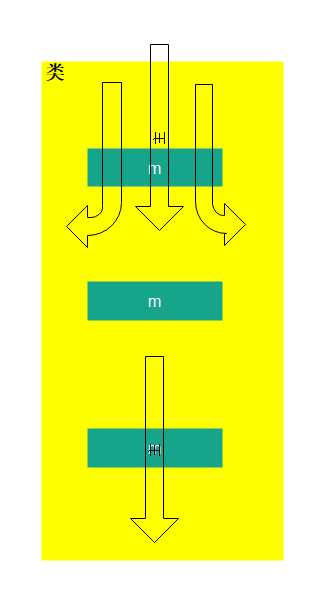

从数学上，证明，一个函数要不要加锁，以及枷锁的位置：
    1、如果调用栈上游枷锁了，自然不用
    2、找出多个函数（不同线程），或者一个函数（不同线程），  找出所有  涉及修改属性  以及 依赖的属性（可变的）
按道理，这些都应该加锁


### Handler 内存泄漏原因是什么？为什么其他的内部类没有说过有这个问题？


3、为何主线程可以new Handler？如果想要在子线程中new Handler要做哪些准备？
4、子线程中维护的Looper，消息队列无消息的时候的处理方案是什么?有什么用？
5、既然可以存在多个Handler往MessageQueue中添加数据(发消息时各个Handler可能处于不同线程)，那它内部是如何确保线程安全的？
6、我们使用Message时应该如何创建它？

###  Looper死循环为什么不会导致应用卡死？会消耗大量资源嘛？-----Done

当然不会，反而是Looper驱动（looper用消息驱动的）

### Handler 消息阻塞  为什么不会导致应用卡死？

先技术语言翻译：

> 阻塞指的是 取一个消息，next() 函数中 sleep了-----》线程阻塞
>
> 卡死： ANR (todo： 一定是嘛)


一句话：
ANR是因为处理input消息处理超时了(其中之一)。
而 线程阻塞，正是由于queue里没有消息过来，说明没有Input，自然不会ANR了


TODO做笔记：
ANR 产生的四个原因   以及  主要原理
ANR实际例子：


8、Binder有什么优势？（字节跳动）
9、Binder是如何做到一次拷贝的？（腾讯）

service manager进程与Binder的关系


10、MMAP的原理讲解；（腾讯）
11、为什么Intent不能传递大数据？（阿里）限制多少? Binder驱动在哪限制?
12、描述AIDL生成的Java类细节；（字节跳动）
13、四大组件底层的通信机制；（字节跳动）


为啥不用  wait/notify  ？


### handler实现延时任务 VS  Timer延时任务(计时器)

~~参考： https://blog.csdn.net/fenjiehuang/article/details/65937794~~


Timer实现： 延迟与循环  【1】

```java
Timer myTimer = new Timer();
myTimer.schedule(new TimerTask() { // 【】schedule方法！
    @Override
    public void run() {
        ...........
    }
}, 3000, 4000);  // 延时3000毫秒开始计时，每隔4000毫秒计时一次  ---》可循环

// }, 3000);  // 延时3000毫秒开始  ---》不可循环
```


handler实现：【2】      <font color='red'>本质：for 循环方法</font>

```java
//定义msg.what常量
private static final int TIMER_TASK = 101;

//使用handler发送延时消息：【】sendMessageDelayed方法！
mHandler.sendMessageDelayed(mHandler.obtainMessage(TIMER_TASK), 3000);

//在handler的处理方法中处理消息任务
public boolean handleMessage(Message msg) {
    switch (msg.what) {
        case TIMER_TASK:
            //do something you want
            //mHandler.sendMessageDelayed(mHandler.obtainMessage(TIMER_TASK), 3000); 【】核心：加上是循环，不加是定时任务
            break;
        default:
            break;
    }
    return true;
}
```


1、**从原理上看：**~~schedule与sendMessageDelayed方法，计时器基准时间不一样~~~  【3】和【4】

```java
public void schedule(TimerTask task, long delay, long period) {
	.........
    sched(task, System.currentTimeMillis()+delay, -period); //【3】基于系统时间 System.currentTimeMillis
}
```


```java
public final boolean sendMessageDelayed(Message msg, long delayMillis)
{
    if (delayMillis < 0) {
        delayMillis = 0;
    }
    return sendMessageAtTime(msg, SystemClock.uptimeMillis() + delayMillis); //【4】 基于SystemClock，系统时钟，即：开机 时钟统计的时间 
}
```

结论：自然，~~当系统时间改变，肯定会影响Timer的任务的执行。而handler不受影响~~


2、Handler的任务周期可调整（优点）

原因：~~Handler使用即for循环，每次改变delay值即可~~


一句话总结：

> 计时器不同：系统时间 和 时钟时间的区别


补充:

发送消息屏障，也是用的 **SystemClock**


### 总结

推荐使用handler使用定时任务


##  TODO: epoll与select区别


## 安卓系统根本动力

安卓系统根本动力-----事件（事件驱动）
事件是玉米（是驴要干的事情），没有事件，拉磨驴looper不会去干活。整个系统是事件驱动的


 


# 线程、进程（抛开安卓、抛开语言）

基于线程模型，

> 线程之间关系： 同步、通信、
>
> 一个线程状态： 休眠.....


## 线程同步/异步（功能）

线程同步sync------<font color='red'>协同两个线程，即sync</font>：通过同步建立起执行顺序的关系。 比如 你先说完，我再说。。。。。。。常见场景： A线程等待B线程执行结果

线程异步-------没有等待，同时执行。**就是正常情况。两个线程各自运行各自的**

--------->  区别的标准：<font color='red'>同一时间（不是时刻）</font>，两个线程有没有做到并发


**本质区别：**

> 有没有等待结果


### 与 互斥的区别：


同步与互斥 的  生活化模型理解 ：


临界资源：盘子

女儿等吃爸爸放置的苹果。一起完成一件事情------>  同步

妈妈和爸爸之间，竞争关系   ------>  互斥


安卓中的例子： TODO


补充： 同步调用/异步调用是**调用关系上**的概念。

### 支撑 线程同步 功能的结构

1、信号量


2、锁

例子1：

> 对于java，用synchronized 关键字（<font color='red'>是自动锁</font>）
>
> ~~synchronized 方法和 synchronized 块~~
>
> ```java
> public synchronized void synMethod(){
>   //方法体
> }
> 
> public Object synMethod(Object a1){
>     synchronized(a1){
>      //一次只能有一个线程进入，将其他线程锁在外面
>   }
> }
> ```

注意：不用纠结是同步锁 还是 互斥锁，认为是同一个东西。~~比如，java的synchronized就是 同步锁，也是互斥锁~~


例子2： 

> 
>
> 在C++ 11里面，通过std::mutex的加锁和解锁来保证 同步 （ ~~参考 https://baike.baidu.com/item/%E7%BA%BF%E7%A8%8B%E5%90%8C%E6%AD%A5/4855164~~）
>
> ```cpp
> #include<mutex>
> #include<thread>
>  
> usingnamespace std;
>  
> mutexm;
>  
> void threadFunc(int i)
> {
>     m.lock();
>     //在这里写上你需要的代码
>     m.unlock();
> }
>  
> int main()
> {
>     threadt1(threadFunc,1);
>     threadt2(threadFunc,2);
>     t1.join();
>     t2.join();
>     return0;
> }
> ```
>
> 

例子3：

c语言中，


#### 关于锁的深入

参考：https://blog.csdn.net/liuwg1226/article/details/119900991

从第一性原理理解锁：

锁的实现要处理的大概就只有以下4类问题：

“谁拿到了锁“，这个信息存哪里（可以是当前 class，当前 instance 的 markword，也可以是某个具体的 Lock 的实例）

谁能抢到锁的规则（只能一个人抢到 - Mutex；能抢有限多个数量 - Semaphore；自己可以反复抢 - 重入锁；读可以反复抢到但是写独占 - 读写锁……）

抢不到时怎么办（抢不到玩命抢；抢不到暂时睡着，等一段时间再试/等通知再试；或者二者的结合，先玩命抢几次，还没抢到就睡着）

如果锁被释放了还有其他等待锁的怎么办（不管，让等的线程通过超时机制自己抢；按照一定规则通知某一个等待的线程；通知所有线程唤醒他们，让他们一起抢……）
有了这些选择，你就可以按照业务需求<font color='red'>组装</font>出你需要锁 (可见，作者是从第一性原理来理解锁的)


### 线程同步与线程通信的关系

线程同步 体现了 ？

线程通信  体现了 多个线程的 **合作性**（类似于 A线程调用B线程，去完成一件事情），比如Handler机制


## 线程互斥/非互斥（功能）

互斥，是指对于**共享的进程系统资源**，在各单个线程访问时的**排它性**

非互斥---------没对共享的做保护


### 支撑线程互斥功能的结构

信号量、锁........见上


## 线程通信(功能)

参考：https://blog.csdn.net/qq_45453784/article/details/124157666

what： 多个线程间的一种**协作机制**： 比如Handler机制

### 支撑线程通信功能的结构

信号量、锁........见上


# TODO: 上面Handler和Binder分析方式完全不一样

Binder： FMSR 分析方法。基于功能解释  ---->  注意力在功能上

​             优点：有章法。知道为啥这样做

Handler: 基于生活化模型，解释  ----->   注意力生活化模型上

​            优点：如果模型非常能反映 代码，那么更容易记忆与理解

​            缺点：Handler 行文之间，明显缺乏链接


# 框架的背后


# 自然法则


# 格式

## <a id="jump2">使用逻辑：</a> 

[跳转使用逻辑](#jump2)

