# 目录


[TOC]


# 官方文档


1、 https://source.android.google.cn/docs/core/display/multi_display/displays?authuser=0&hl=zh-cn#focus

**官方文档是最快搭建知识框架的方式！！！**

**重要的事只有一件，同样重要的文档只有一个-------官方文档**

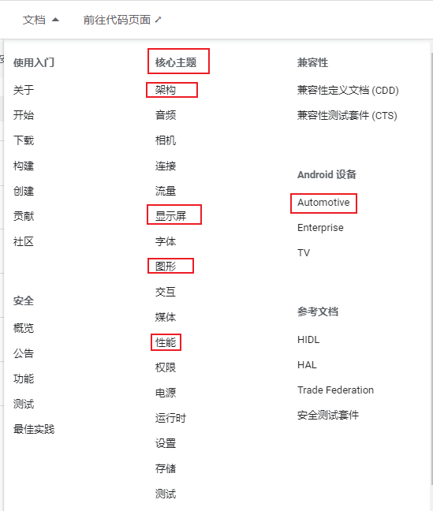

从哪些角度理解安卓？以上


2、[Android 开发者](https://developer.android.com/?hl=zh-cn)

```
https://developer.android.com/guide?hl=zh-cn
```

3、Google git  查找提交记录

https://android.googlesource.com/platform/frameworks


# 对系统的理解与疑问

系统是status在时间上的流淌，即status(t)-----> 以帧来理解系统

那么多status，抓主status（次要status为主要服务）

如何理解dump？即一帧status

规定：

> 1、**每一个status都要只要adb 设置的的方法，和get的方法** ，比如 perDisplayFocusEnabled设置是xml，获取是 WindowManagerService#mPerDisplayFocusEnabled debug可以看
>
> 2、永远不相信任何一个set（只有经历get之后，才能确定）


疑问：

那么多进程与线程，如何做到协调？ -------》 一定是有大的结构协调（小协调依附于大协调）

​                                                                        抛开代码不谈，事物的本质？

如何协调硬件资源？


安卓是一个大的Binder应用

> APP-----系统服务


#    0层

https://mp.weixin.qq.com/s/saps9pV-HEAon4majH1-aQ


注：**<font color='red'>所有的知识，必须脱离纸面、脱离文字</font>**！！！！！！！！

## 静态0层


Android底层内核空间以Linux Kernel作为基石，上层用户空间由Native系统库、虚拟机运行环境、框架层组成，通过`系统调用(Syscall)`连通系统的内核空间与用户空间。对于用户空间主要采用C++和Java代码编写，通过JNI技术打通用户空间的Java层和Native层(C++/C)，从而连通整个系统。


## 动态0层  ---> 以进程的视角


**系统启动架构图**：

见 《系统启动流程》


## 知识点0层


注意点： RunTime 和  异常原理


# 源码地图：即分层，细化

## framework基础框架，0层

见 AndriodSystem_Others

## 其中，WMS 1层

见 AndriodSystem_Others


# 系统启动流程（纵向主线）

见《InitSystem.md》

# APP启动流程（纵向主线）

见《startAPP.md》


# window

## 0层

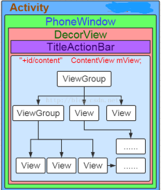

注意：这里并没有statusBar的window


（G:\working_pan\doc_my\Draw\Activity_window_dialog.eddx）

1、每个window结构都如此，dialog亦如此

2、activity的本质是 context

3、dialog本质是 window。。。new的时候需要传入context，即activity，必须依赖activity


1、Z的dialog包了A的window ，A的window里又塞了A的surfaceview（Z画图的地方）   ------》2、给window里再塞一块view，置于surfaceview之上。Z dialog有两块surface了

-------》todo：

第二块surface和canvas啥关系？ 如果说为啥surface换了，canvas没换？地址

todo：status bar 属于哪个widow，哪个进程


SurfaceView有自己的窗口 。所以，如果一个Activity有一个SurfaceView，它将有多个窗口。


关于dialog：

TODO： dialog里面的window也是phoneWindow ！！！！自己new出来的

```java
final Window w = new PhoneWindow(mContext);
```

PhoneWindow持有WindowManagerImpl（即是WindowManager）


## setAttributes流程：

dialog -》被塞到了Window(PhoneWindow)里，mWindowAttributes记录，-》PhoneWindow.dispatchWindowAttributesChanged()


注意：linearLayout，`没有包statusBar`  ----> (1) linearLayout包含的是statusBar和navigationBar的`背景`, 因为 statusBar本身透明，需要下一层的window显示颜色？？？（TODO: 为什么要这样设计？？）   （2）statusBar和navigationBar在另一个window上（TODO: 一个还是两个？？？）
----》对于dialog类型的呢？？？


Dialog：


（https://ericchows.github.io/Android-Window-Mechanism/）


带你彻底理解 Window 和 WindowManager


Surface是一个对象，用于保存与屏幕合成的像素。 

每个窗口（对话框，全屏活动，状态栏）都有自己的绘图表面surface。（todo：如果没有view，surface还能显示嘛？Z dialog证明不能？）

Window Manager creates a Surface for each window and gives it to the application for drawing.

Todo：验证。  应用指的具体是啥，哪个类

wm哪个进程？

Surface Flinger会以正确的Z顺序将这些窗口渲染到最终显示

关于view：

1、A View is  an interactive UI element inside of a window. 交互用的

2、A window has a single view hierarchy attached to it, which provides all of the behavior of the window. 

独一的view体系


下面有四个window，对应四个surface ----》有几个canvas？？？？


TODO:
surface、canvas
画图往这个上画————》最终怎么呈现的？

谁创建的surface？（window粒度的）最终用作什么了？

## vSync - surface -window-view 0层：

见 AndriodSystem_Others


## 参考的博客资料：

https://ericchows.github.io/Android-Window-Mechanism/   --->优


# View/ViewGroup

view


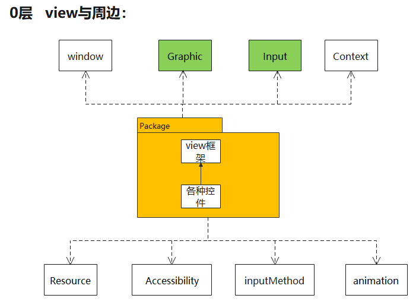

（G:\working_pan\doc_my\Draw\view_viewGroup.eddx）

其中，`Graphic与Input`是核心 ,  与用户交互的两个功能点：看和触摸

## 功能点0层

见li 11


## UI刷新 -invalidate

### 流程图：


`关键函数：vsync信号`

> 1、必然有请求：   ~~invalidate -----> scheduleTraversal~~： 请求vsync、设置同步屏障。
>
> 2、必然有执行:    ~~perform................~~           绘制、 取消同步屏障？


新增枝叶：
1、为了给 vsync信号 带来的 vsync msg  让道， 请求vsnc的同时（自然），插入同步屏障：

--------》见handler 同步屏障


必然：

1、所有 控件的 invalidate操作，最终都  转接到 ViewRootImpl的invalidate   (设计模式上，单一职责)

### 调用栈角度：

1、请求：

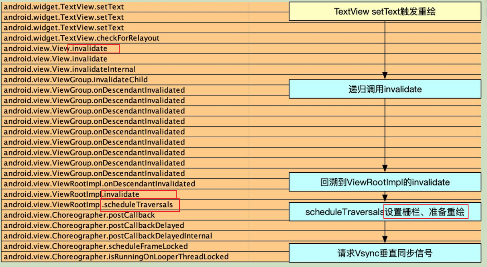


2、vsync信号来后，执行：

等到VSYNC到来后， 会移除同步栅栏 ----- 》  TODO: 具体哪里？


todo：很奇怪，这里为啥涉及到两次 消息？


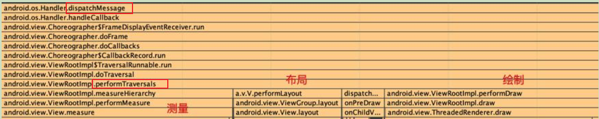


### 关于首帧


#### 首次 View 的绘制流程是在什么时候触发的?----> 即首帧的触发

Activity  Resume时-> WindowManagerImpl.addView -> WindowManagerGlobal.addView-> ViewRootimpl.setView -> ViewRootimpl.requestLayout ->ViewRootImpl.scheduleTraversals 


####  onResume函数中度量的高有效?

 Activity第一次调用onResume的时候是无效的 

Activity第二次之后调用onResume是有效


因为首次request vysn是在addwindow过程中（viewrootimpl的setview）
下一帧，才真正绘制（包括测量、layout、draw）


## 性能方面的优化：

房间中椅子坏了，不会换整个房子
局部刷新：dirty脏区


## 面试题：

### 多次invalidate  会刷新几次？

代码上： 有标致


设计上：是不得不的。 因为vsync信号，从上到下隔离


```
1.onResume函数中度量的高有效?


2.Activity, Window,View三者的联系和区别? 

3. 首次 View 的绘制流程是在什么时候触发的?

 
4.我们调用invalidate()之后会马上进行屏幕刷新吗?

5.我们说丢帧是因为主线程做了耗时操作,为什么主线程做了耗时操作就会引起丢帧?

问题1和问题3和问题4，是一个东西
因为首次request vysn是在addwindow过程中（viewrootimpl的setview）
下一帧，才真正绘制（包括测量、layout、draw）
```


### Activity, Window,View三者的联系和区别? 


### 关于首帧问题

见《关于首帧》


### 我们调用invalidate()之后会马上进行屏幕刷新吗?


### 我们说丢帧是因为主线程做了耗时操作,为什么主线程做了耗时操作就会引起丢帧?

### 都有消息屏障，为什么还会掉帧呢？

因为消息屏障之前的消息（具体指哪些？），还会执行的
主线程加的消息屏障


# Grapics


## 0层框架-----系统数据流向：


参考:  https://blog.csdn.net/qq_45254908/article/details/125449470


0层框架中的角色：

1、~~image stream produceers  图像流生产者（见图）~~ ， 即生成BufferData的：

> <font color='red'>OpenGL ES</font>、NDK(即<font color='red'>Skia)</font>、Canvas 2D 、 mediaserver等。
>
> 例：  draw方法把  绘制指令 通过canvas传递给framework层的RenderThread线程，`在buffer上绘制`

  两种生产方式：

（1）   NDK（Skia），OpenGL ES是通过自身的绘制能力生产的图像数据

（2）   MediaPlayer和Camera Preview是通过直接读取图像源来生成图像数据

2、 ~~image stream consumers 图像流消费者~~，消费 BufferData的：

> **SurfaceFlinger：** 消耗当前可见的Surface（对应的buffer数据）+  不同buffer数据  合成到屏幕 （**自然，是根据图中 WMS 提供的window信息**）
>
> OpenGL ES 应用也可以消费：例如相机应用会消耗相机预览图像流 ------>  TODO: 证明 并没有经过 SurfaceFlinger


显示子系统的硬件抽象实现，在HAL中：

> 负责协助消费者把图形数据展示到设备屏幕。


图形[内存分配](https://so.csdn.net/so/search?q=内存分配&spm=1001.2101.3001.7020)器 (Gralloc) ：

> 分配图像生产方请求的内存


缓冲区 Buffer Queue：

TODO: 这个到底是啥？  下面图到底是个啥？


可以大概看到BufferQueue的工作过程：  TODO

BufferQueue 类是 Android 中所有<font color='red'>图形处理操作的核心</font>。它的作用很简单：将生成图形数据缓冲区的一方（生产方）连接到接受数据以进行显示或进一步处理的一方（消耗方）。

即：Android中的图像生产者OpenGL，Skia，Vulkan将绘制的数据存放在图像缓冲区中，Android中的图像消费SurfaceFlinger从图像缓冲区将数据取出，进行加工及合成


https://www.androidperformance.com/2020/02/14/Android-Systrace-SurfaceFlinger/#/BufferQueue-%E9%83%A8%E5%88%86


注意：

1、 一个可见APP对应一个BufferQueue（有backBuffer和frontBuffer）

2、frontButter是要 经过 SurfaceFlinger合成  TODO: 证明


## 硬件框架

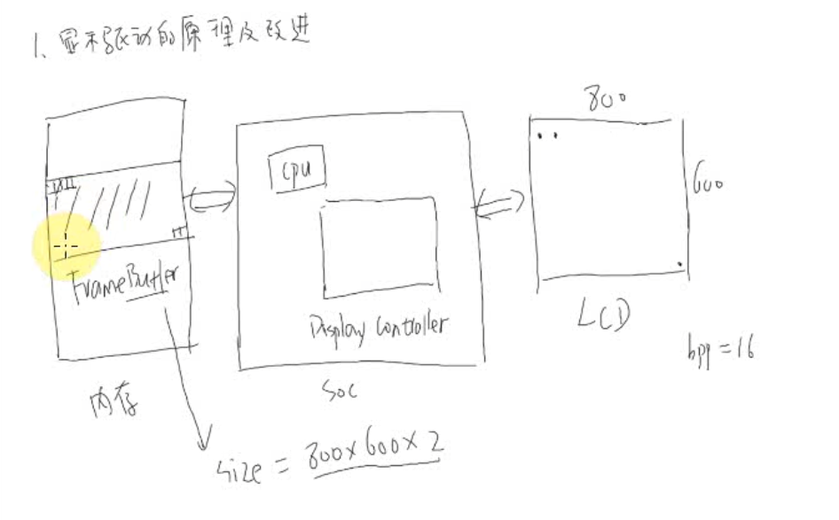

出自：《1-1_11_显示系统框架_framebuffer原理及改进.wmv》


TODO: DisplayControl的作用？ 操纵LCD去读取FrameBuffer？


屏幕：内存的关系：

> 屏幕上一个像素16位 ，即 2字节   ----> 内存Buffer： 800\*600\* 2字节  


## 0层框架

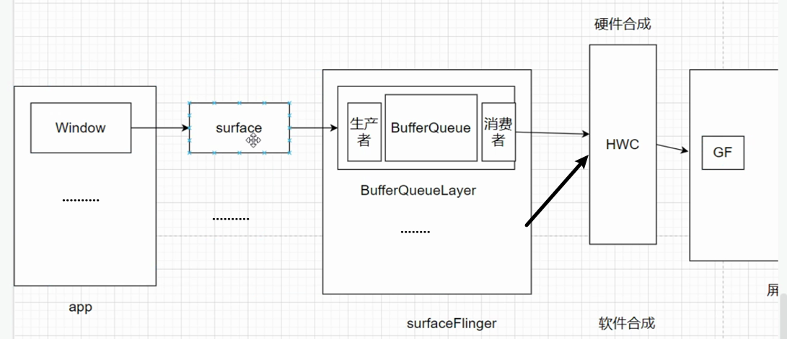

1、贯穿0层框架的**主线buffer：**

buffer的获取，填充完的buffer流转过程


2、基于0层框架，自然：

（1）数量关系：

1个 window ： 1个surface：一个bufferQueue（三个buffer）：一个bufferQueueLayer

注意：给到surface的 是一个buffer

即surface是对buffer的封装 ，一个surface内部具有多个buffer


TODO: 上述的buffer与frameBuffer什么关系？frameBuffer应该是一个屏幕大小

frameBuffer有几个？


三缓冲，处于0层框架什么位置？

> <font color='red'>BufferQueue中</font>:  **SurfaceFling 消费 FrontBuffer，GPU 使用一个 BackBuffer，CPU使用一个 BackBuffer**  ----->  TODO: GPU在软件上是怎么调用的？CPU 怎么调用的？
>
> 硬件图：

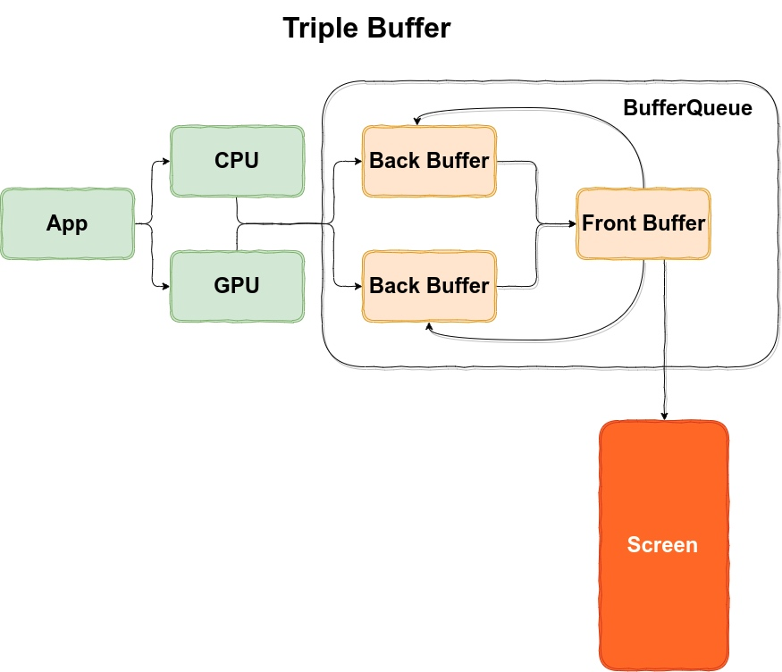

出自： https://androidperformance.com/2019/12/15/Android-Systrace-Triple-Buffer/#/Android-%E7%89%88%E6%9C%AC-lt-Android-P


TODO:

0层架构图  与 硬件图中  CPU和GPU 什么关系？ 如何整合到一起表达？？？？？？？？？？】


## 0层纵向


自然：

1、Render线程--> SurfaceFlinge进程： 跨了进程

所以，不得不：BufferQueue中的<font color='red'> backBuffer </font> 通过Binder的形式提供给了<font color='red'>APP的Render</font>线程
（TODO，核心:Binder 如何流转给APP的？！！！！）

2、App 是**生产者**，负责填充显示缓冲区（Buffer）；SurfaceFlinger 是**消费者**，将各个进程的显示缓冲区做合成操作。

3、触发点：vsync信号过来，view.onDraw


## 1层框架


来自： https://www.jianshu.com/p/37370c1d17fc

## 三缓冲+vsync：从显示屏显示讲起，为什么要这么设计

### 背景：

**屏幕刷新率（即屏幕读取速率）：**

1、<font color='red'>固定</font>是16.67ms （永恒不变的）

2、<font color='red'>其 物理本质就是 逐行扫描 的时间</font>：显示器并不是一次性将<font color='red'>显存里的数据</font>显示到屏幕上，而是从左到右边，从上到下逐行扫描，顺序显示整屏的一个个像素点（硬件 晶体管），不过这一过程快到人眼无法察觉到变化。

沿着帧缓冲区  逐行扫描： 注意，这里的内存实际上是显存（GPU的）


vsync信号 ： 

> 1、<font color='red'>硬件天然存在</font>的（在硬件侧可能不叫vsync），与是否发给软件无关。注意区别 vsync信号 与vsync机制
>
> 2、<font color='red'>标致</font>着屏幕开始扫描


**系统帧速率FPS（即CPU+GPU 合成数据速率）：**  代表了<font color='red'>系统在一秒内合成的帧数</font>,    该值的大小由系统算法和硬件决定   (没有vsync时，其实不是固定的)


两者的关系造成的问题（没有vsync和双缓冲机制的话），**胖子吃面包模型**：

①屏幕刷新速率比系统帧速率快  

胖子吃的很快，面包不够  ------>   「造成一帧显示多次,也就是**卡顿。**」

②系统帧速率比屏幕刷新率快

胖子吃的慢，面包很多就吃了一半  ------>     「造成屏幕上显示多帧,也就是**屏幕撕裂**。」

③系统帧速率 快很多

胖子很多面包没吃就跳过了   ------>      **跳帧**

------------------》 **一句话总结vsync**：  卡顿、撕裂、跳帧  就是<font color='red'>Vsync设计的初衷</font>


为啥绘制阶段，也用到了GPU?  Todo

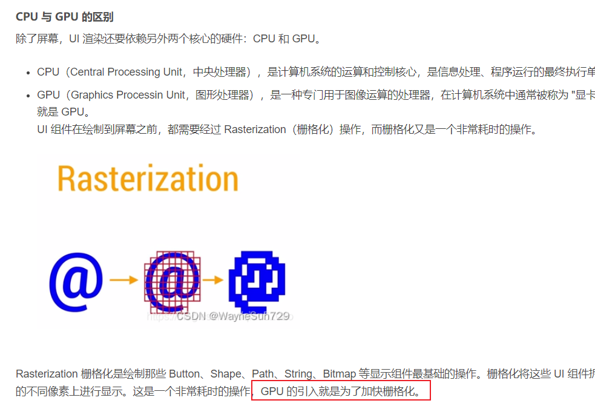

### 问题1：帧缓冲区同时读写，会造成画面的撕裂

问题1：并发问题（存在临界资源 竞争问题）


解决问题1，不得不：

>  双缓冲机制： fontBuffer、backBuffer   -------》 并发，性能高：<font color='red'>可以一个写一个读，之后，两个交换指针</font>
>
> 加锁： 太耗费性能，而且 不能同时 读和 写 ----》 不是并发

引入<font color='red'>双缓冲机制：</font>

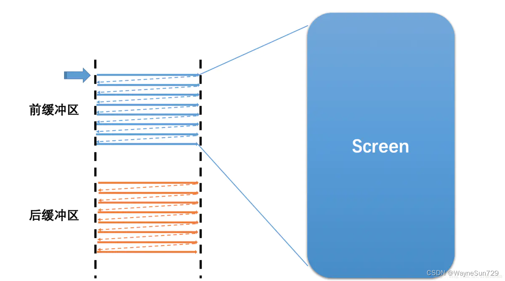


双缓冲的位置（线程）： fontBuffer、backBuffer 在bufferQueue里面嘛？  与 屏幕进行交互的，我理解只有一个buffer(所有APP的)

所以，上面图有没有问题？？？？？？？？？？？？？？是不是少了合成这一步？？？


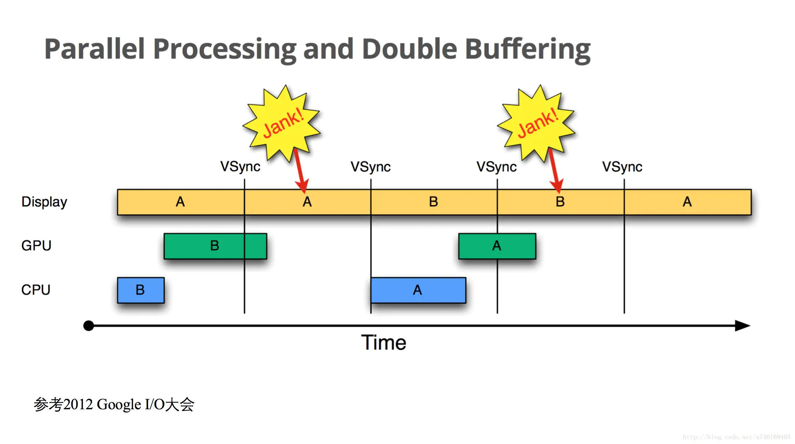

基于双缓冲区，<font color='red'>不得不的结论，铁律：</font>

即使没有vsync机制，<font color='red'>交换指针的时机，就是 vsync时机</font>（因为这个时候，前刚被用完，后填充完）：这个因为此时刚好扫描完，硬件决定的

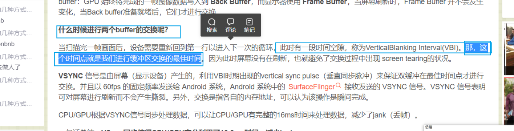


（注：1、图中vsync只是固有的硬件信号，还没有vsync机制

​            2、图中`蓝、绿都是指backBuffer，时间先后`

​            3、后的1 在下个扫描时，交换给了Display

​            4、这里Display即屏幕，**即屏幕刷新速率** ， 自然

​            5、图中GPU+CPU 即  系统帧速率

​           6、注意：<font color='red'>图中的 0和1理解为 内容数据 ，而不是内存</font>，下同  内存是框起来的部分，两个

​           7、不得不，CPU+GPU准备好数据为一帧数据，显示display <font color='red'>必然在下一帧</font>显示  这个数据）


### 基于双缓冲机制，问题2：

存在的问题2：

>  卡顿：`因为vsync机制，CPU+GPU 绘制数据不是vsync触发，而是APP自己触发的`，很可能backBuffer没准备好（即上面  **屏幕刷新率快 问题**）  ----->  导致，Display用的上一帧数据,  屏幕平白无故地多显示了一次第1帧。
>
> TODO: 这不是丢帧呀？？？？ https://blog.csdn.net/qq_45254908/article/details/125449470


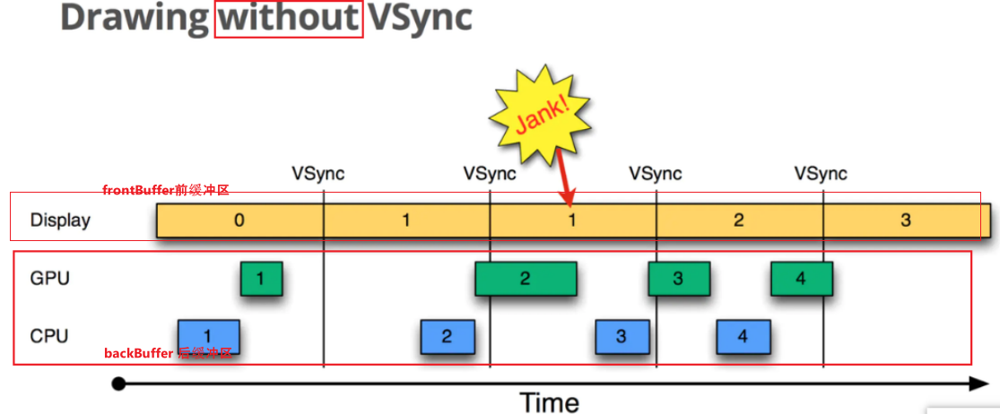

假设图中是双缓冲的（1234明显不是）


解决问题2的方法，<font color='red'>引入vsync机制：</font>

把硬件信号，给到软件，**触发 软件绘制backBuffer(即CPU+GPU 填充backBuffer)**

-----》  结果：自然，如果性能ok，后必然在 16.67ms内准备ok。不存在问题


**一些不得不：**

1、vsync信号是CPU执行的起点，即view.draw  --------->  **软件设计保证的**

2、vsync信号 是 指针交换时刻   --------->  **硬件决定的，此时刚好 扫描完，必须交换**

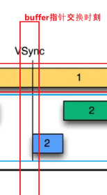


### 基于双缓冲机制+Vsync机制，问题3：


双缓冲机制+Vsync机制   **其实已经非常好了，解决大部分情况**。

问题3：
双缓冲机制+Vsync机制 好的前提是  ，CPU + GPU 在16ms内完成了工作  

极端情况下，CPU + GPU 没能及时完成工作，导致下一帧显示数据没准备好：


解决办法，让CPU多多跑起来（三缓冲）：

红框处 GPU 占据着 BackBuffer，CPU没有填充的内存，所以单独给其一个BackBuffer

  -----》  注意<font color='red'>：三缓冲本质： 让CPU多多跑起来，所以只是一个优化，</font>不是一个大的机制变动

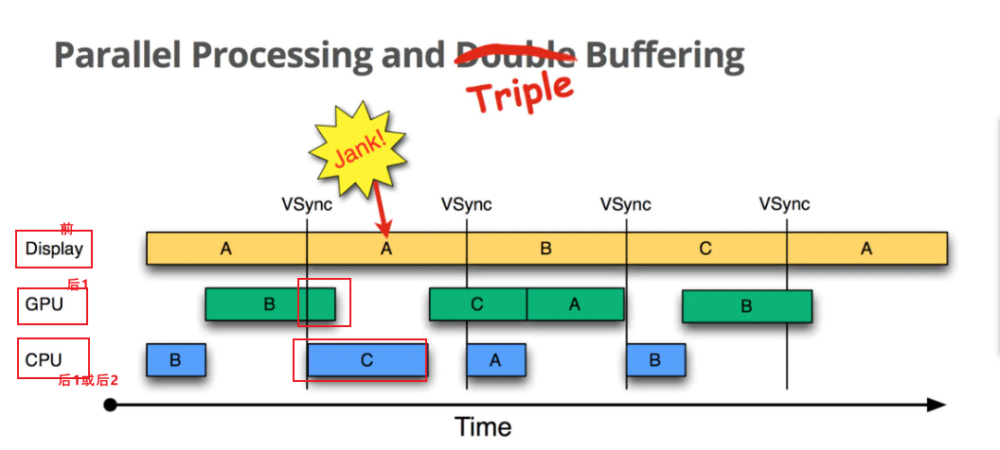

最左边，三块内存; A B C是 内容


#### Q&A环节：

 1、三缓冲 + Vsync机制： CPU开始用 新的C内存，生成C数据（注意：<font color='red'>C数据两帧之后才显示</font>），那么


​                                   

#### 补充： 三缓冲，可以关闭

所以，不是必须的

https://blog.csdn.net/wjky2014/article/details/117962861


## SurfaceFlinger  图形合成者

### 功能（what）

从进程角度：SF是整个Android系统渲染的核心<font color='red'>进程</font> ----->  TODO:  什么是渲染？渲染到底做了啥？I

从功能角度：将所有Surface到Framebuffer  ----->  todo： Surface的buffer与 Framebuffer  数据转换上什么关系？ 个数上是什么比例？


从信息流角度：信息的传递：

> 1、以Surface为图元数据
>
> 2、SurfaceFlinger： 所有 图层(Surface数据 )合成。
>
> 3、最终交给CPU和GPU 绘制-----> 绘制是什么概念？跟view的draw是什么区别？   绘制的结果又是啥？          


设计模式：生产者-消费者

Queue：BufferQueue


这里表达不清


TODO:  

surface对应buffer去画，跨进程到 surfaceflinger？

图元数据到底是进程级别？还是 surface？ 区别很大

surface属于应用进程，那么在 surfaceflinger端是什么数据结构？


硬件合成与软件合成，理解TODO：

> 软件合成：软件将多个surface合成一个屏幕图像，给到屏幕
>
> 硬件合成：


实操：

```java
adb  shell dump System surfaceFlinger
```


## 解决屏幕撕裂、卡顿、掉帧问题

三缓冲机制 + vsync

## 关于掉帧的实操


## 申请surface的流程(~~APP向surfaceFlinger~~)

**目的：**

> 解决在哪里绘制问题？


图出自：  https://www.jianshu.com/p/7a18666a43ce   Android画面显示流程分析(4)


主要：WMS去申请的

触发时机：

> viewRootImpl.performTraversals时 ---->  relayoutWindow  TODO
>


三个进程，APP，system_server, surfaceflinger


### Q&A：

Q：为什么要经过wms?    APP直接 向 surfaceflinger 申请呢？

--------->A：  不行，wms要管理surface   TODO:  具体如何管理的？

Q: app侧的java  surface就是一个空壳子

​    WMS surfaceControl 是surface的包装类，无法直接控制surface


## 关于draw：

主线程与render线程之间数据同步：绘图指令集  （主产生，render利用canvas去 执行 指令集，结果：buffer上）

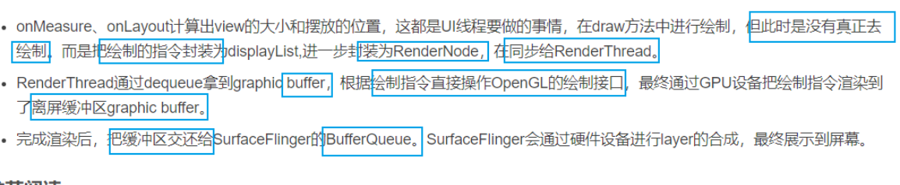


见 《0层纵向》

TODO:   卡顿、掉帧 -----》  这些概念对应的  物理解释！！！

## 面试问题：

问题
丢帧(掉帧) ，是说 这一帧延迟显示 还是丢弃不再显示 ？
答：延迟显示，因为缓存交换的时机只能等下一个VSync了。
布局层级较多/主线程耗时 是如何造成 丢帧的呢？
答：布局层级较多/主线程耗时 会影响CPU/GPU的执行时间，大于16.6ms时只能等下一个VSync了。
16.6ms刷新一次 是啥意思？是每16.6ms都走一次 measure/layout/draw ？
答：屏幕的固定刷新频率是60Hz，即16.6ms。不是每16.6ms都走一次 measure/layout/draw，而是有绘制任务才会走，并且绘制时间间隔是取决于布局复杂度及主线程耗时。
measure/layout/draw 走完，界面就立刻刷新了吗?
答：不是。measure/layout/draw 走完后 会在VSync到来时进行缓存交换和刷新。
如果界面没动静止了，还会刷新吗？
答：屏幕会固定每16.6ms刷新，但CPU/GPU没有绘制任务时就不走绘制流程。
VSYNC具体指啥？在屏幕刷新中如何工作的？
答：当扫描完一个屏幕后，设备需要重新回到第一行以进入下一次的循环，此时会发出一个vertical sync pulse（垂直同步脉冲）来保证双缓冲在最佳时间点才进行交换。并且Android4.1后 CPU/GPU的绘制是在VSYNC到来时开始。
屏幕刷新使用 双缓存、三缓存，这又是啥意思呢？
答：双缓存是Back buffer、Frame buffer，用于解决画面撕裂。三缓存增加一个Back buffer，用于减少Jank。
————————————————
版权声明：本文为CSDN博主「贺兰猪」的原创文章，遵循CC 4.0 BY-SA版权协议，转载请附上原文出处链接及本声明。
原文链接：https://blog.csdn.net/u013773608/article/details/125142405


什么是surfaceView'？TODO


## Grapics-----Flutter

### Flutter渲染pipeline


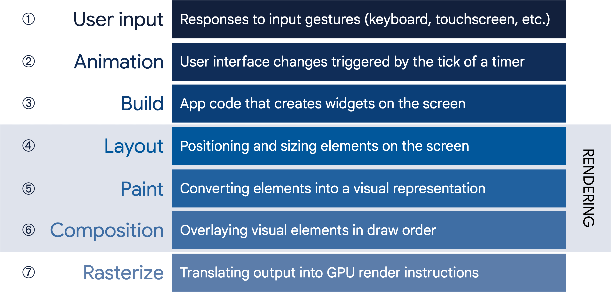

Flutter的渲染管道分为以下七个步骤：

1.  用户输入（User Input）： 响应用户通过鼠标、键盘、触摸屏等设备产生的手势行为。
2.  动画（Animation）： 基于定时器（Timer）更新当前帧的数据。
3.  构建（Build）： 三棵树的创建，更新和销毁阶段，StatelessWidget和State的build方法将在改阶段执行。
4.  布局（Layout）： Render Tree将在该阶段完成各个节点的大小和位置计算。
5.  绘制（Paint）： Render Tree遍历每个节点，生成Layer Tree、RenderObject的paint方法在该阶段执行，生成一系列绘制指令。
6.  合成（Composition）： 处理Layer Tree，生成一个Scene对象，作为栅格化的输入。-->TODO: 这个地方与英文图有差异, 一个是
7.  栅格化（Rasterize）：将绘制指令处理成可供GPU上屏的原始数据（合成的视图数据其实还是一份矢量描述数据，光栅化帮助把这份数据真正地生成一个一个的像素填充数据，即 `矢量描述---> 像素填充`）

### Flutter数据模型---四棵树0层

https://docs.flutter.dev/resources/architectural-overview


TODO: 1、flutter一个widgets会对应非常多的element嘛？（Y是这样）上图没有体现出来   2、flutter的layerTree到底是啥？


#### layout过程：


布局约束

https://www.cnblogs.com/qianxiaox/p/14120511.html

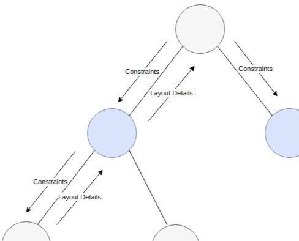

盒子协议：


## 几个概念：

Paint画笔：颜色、画笔宽度、

canvas: 画家画圆、画三角形

bitmap: 位图－－>  存储像素的，初始的时候，是空的

surface (有多于一个的缓冲区（通常是两个）来做双缓冲渲染）：屏幕缓存/墙(比bitMap大很多）一》真正的画布

-------------------->   上述几个概念是类。存在于Skia 图像渲染库中


SurfaceFlinger: 按照它们的Z轴顺序将各个surface渲染出来

view: 是—个舞台，让其他演员演绎的舞台

https://www.cnblogs.com/CreateLight/archive/2012/07/04/2575401.html


好代码设计原则：－－－－＞举例子，所有代码的设计原则，给出总结
1、模块分层合理，类职责清晰，代码可读性强，注释规范
2、模块具有过载流控能力，支持非法输入校验和外部输入防御性拷贝，可靠性强；-----＞状态保存机制，在AZ转换地方，做了大小校验
3、所有参数采用动态配置项，可扩展性强；
4、消息处理过程中，减少不必要的内存复制与对象实例化操作，支持系统高并发；


### 硬件加速（GPU） 与 ~~软件加速(CPU)~~

1、本身没有软件加速这一概念。

2、硬件加速是基于软件加速做的优化（<font color='red'>区分点</font>）：Buffer数据谁来绘制

​     


代码中的分歧点：

```java
//ViewRootImpl.java
performTraversals
    relayoutWindow
    performMeasure
    performLayout
    performDraw
```


TODO: 对应代码的开关在哪里？


#### 面试题：既然硬件加速很好，为啥还要有软件加速？


https://baijiahao.baidu.com/s?id=1709178794607037191&wfr=spider&for=pc  深度好文：理解Android硬件加速原理


### 硬件合成(HWC)  与  软件合成


## 参考文章：

https://www.androidperformance.com/2019/12/15/Android-Systrace-Triple-Buffer   Android Systrace 基础知识 - Triple Buffer 解读

  https://blog.csdn.net/qq_45254908/article/details/125449470 

https://blog.csdn.net/wjky2014/article/details/117962861   Systrace 之 三级缓存 Triple Buffer

Android画面显示流程分析(1)~(5)    https://www.jianshu.com/p/df46e4b39428  

https://androidperformance.com/2019/12/15/Android-Systrace-Triple-Buffer/#/Android-%E7%89%88%E6%9C%AC-gt-Android-P   好文


https://community.nxp.com/t5/i-MX-Processors-Knowledge-Base/Android-Graphic-UI-with-GPU-Hardware-Acceleration/ta-p/1102023   
**Android Graphic UI with GPU Hardware Acceleration**


https://baijiahao.baidu.com/s?id=1709178794607037191&wfr=spider&for=pc  深度好文：理解Android硬件加速原理


https://www.jianshu.com/p/6474297924b6     Android 图形系统（Graphics）


# view-Graphic 纵向0层

即一帧的整体流程：  **纵轴为时间**


出自：  https://www.androidperformance.com/2021/04/24/android-systrace-smooth-in-action-1/#/%E4%BB%8E%E6%89%A7%E8%A1%8C%E9%A1%BA%E5%BA%8F%E7%9A%84%E8%A7%92%E5%BA%A6%E6%9D%A5%E7%9C%8B


为什么选取一帧呢？  一帧即是  for循环中一个


TODO:  上图是一个好的纵向0层图，借鉴其画法：

1、`纵轴是时间、横轴为 空间`（进程、线程、类）  ------->   跟时序图很像

2、只列 最核心函数/功能  +  <font color='red'> 没有调用栈</font>font>           ------->   跟时序图差异


证据+细节：


# SurfaceFlinger


# 无障碍

见  《无障碍.md》


# 应用程序消息处理机制分析

---》（Looper、Handler）分析


总结：Android应用程序是通过消息来驱动的

系统为每一个应用程序维护一个消息队列，应用程序的主线程不断地从这个消息队例中获取消息（Looper），然后对这些消息进行处理（Handler），这样就实现了通过消息来驱动应用程序的执行--------》总结：消息驱动程序！！！！

当ActivityManagerService需要与应用程序进行交互时，如加载Activity和Service、处理广播等，会通过[Binder进程间通信机制](http://blog.csdn.net/luoshengyang/article/details/6618363)来知（TODO:）会应用程序，应用程序接收到这个请求时，它不是马上就处理这个请求，而是将这个请求封装成一个消息，然后把这个消息放在应用程序的消息队列中去，然后再通过消息循环来处理这个消息。
------->总结：1、AMS通过Binder请求应用程序  2、应用程序（TODO:具体哪个）自己发消息，然后自己处理
为什么要有这样的机制？？？好处: 消息的发送方只要把消息发送到应用程序的消息队列中去就行了，它可以马上返回去处理别的事情，而不需要等待消息的接收方去处理完这个消息才返回，这样就可以提高系统的并发性。实质上，这就是一种异步处理机制。（TODO:一个线程还是两个？要是一个，怎么异步的）


**例子：**

程序启动过程中（（TODO:）），要启动的应用程序称为Activity，它的默认Activity是MainActivity:

Launcher来负责启动的，而Launcher又是通过ActivityManagerService来启动的，当ActivityManagerService为这个即将要启的应用程序准备好新的进程后，便通过一个Binder进程间通信过程来通知这个新的进程来加载MainActivity，如下图所示：


# 稳定性专题


## ANR

《什么是ANR_如何避免ANR.md》

《ANR问题的产生机制.pdf》


# 内存泄漏专题

参考：  https://mp.weixin.qq.com/s?__biz=MzA5MzI3NjE2MA==&mid=2650238704&idx=1&sn=ad334840afdc2d9bdb8215e9f942e54e&chksm=88639f9fbf1416898edfc3615a7ea25f6798e3bb6f3089ca720e18b92ce67328c623561cf35e&scene=27  好文   内存泄漏全解析     [郭霖](javascript:void(0);) *2017-02-28 08:00*

原因：

> 1、对于cpp：内存泄漏就是new出来的对象没有 delete -------》 <font color='red'>例子：</font>**阎王 让你出生，忘记 让你死了**
>
> 2、对于 java ：就是 new 出来的 Object 放在 Heap 上无法被GC回收
>                     无法GC的原因：长生命周期的对象持有短生命周期对象的引用，尽管短生命周期的对象不再使用  ----》 <font color='red'> 例子：</font>**父子之间 同生共死 ，明显不合理**
>
> 补充：目前java 常见GC，是可达性分析（还有计数引用）

​                


注意：

> 对于java，一般**关心比较消耗内存的类**，比如Activity;  不占内存的类，发生泄漏，其实没太大关系

疑问：

> cpp会产生类似于java那种嘛？  
> A：不会，cpp对象的销毁由程序员自己去delete。 如果存在 父子之间 同生共死，那么就是  程序员自己delete 时机出了问题。


例子：见Handler导致的内存泄漏


规定：

在 Android 开发中，为了防止内存溢出，**在处理一些占用内存大并且生命周期较长的对象的时候，可以尽量地使用 软引用 和 弱引用 技术。**


# 内存抖动专题

见设计模式---复用原则


# 安卓资源：

## 见config需求分析

## 资源目录结构

### symbols.xml 系统私有资源

（不对app公开)


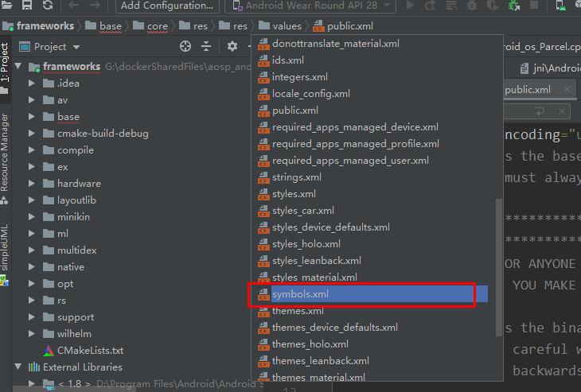


### public.xml公共资源

（可以在app中访问）

注意：公共资源在xml里给定了id值。但。。没有
public.xml的作用：1、显示对外了
                                     2、给配了唯一的id

**---》TODO:public为什么要配固定ID？？？**
**https://blog.csdn.net/joby1981/article/details/16809869**


AOSP添加资源的方法：

如果要添加的资源是私有的，则加上 <java-symbol type="drawable" name="test" />（不需要id），如果是公共的则先找到最后一个type为 drawable 的 public 项，4.2.2系统中最后一项为<public type="drawable" name="dialog_holo_light_frame" id="0x010800b3" />，然后添加一句 <public type="drawable" name="test" id="0x010800b4" />，即id为最后一个的id+1（为了避免 id 冲突）
原文链接：https://blog.csdn.net/ganzhijie/article/details/38489957


### attrs.xml 

--><font color='red'>**基于类， **</font>定义了其属性

1、定义了类的有哪些xml配置属性：--->导致IDE编辑时xml联想
比如：view类，有属性id、padding..........
            Theme类 


再比如：include类以及ViewGroup类：

```java
 <declare-styleable name="Include">        <attr name="id" />        <attr name="visibility" />    </declare-styleable>    <declare-styleable name="ViewGroup">        <!-- Defines whether changes in layout (caused by adding and removing items) should             cause a LayoutTransition to run. When this flag is set to true, a default             LayoutTransition object will be set on the ViewGroup container and default             animations will run when these layout changes occur.-->        <attr name="animateLayoutChanges" format="boolean" />        <!-- Defines whether a child is limited to draw inside of its bounds or not.             This is useful with animations that scale the size of the children to more             than 100% for instance. In such a case, this property should be set to false             to allow the children to draw outside of their bounds. The default value of             this property is true. -->        <attr name="clipChildren" format="boolean" />        <!-- Defines whether the ViewGroup will clip its children and resize (but not clip) any             EdgeEffect to its padding, if padding is not zero. This property is set to true by             default. -->        <attr name="clipToPadding" format="boolean" />        <!-- Defines the layout animation to use the first time the ViewGroup is laid out.             Layout animations can also be started manually after the first layout. -->      
```

2、TODO：attrs.xml 与public.xml什么关系？？？

### 以attr为例子：

java中引用：android.R.attr.absListViewStyle

<------sdk中：android.jar

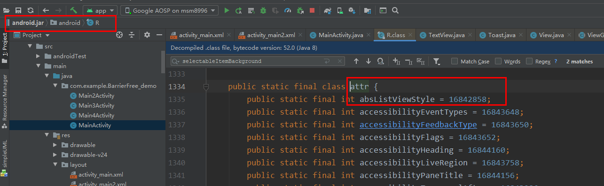

<-------xml中                  （1） <font color='red'>**结论：attrs.xml **</font>：<attr ----定义资源的地方

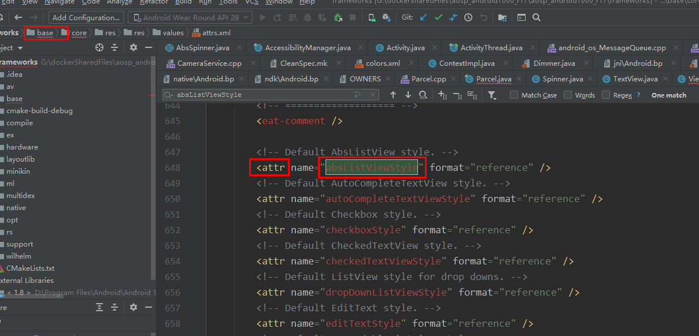

​        （2）<attr ----值来源哪里？？     java中id：16842858

注意：format即类型，比如reference、boolean、dimension、integer、color。。。。。。。
format="reference"是指这个类型是引用类型：引用某一资源id！！！  

```java
1. //reference：参考另一资源ID。    
    （1）属性定义：    <declare-styleable name="名称">      
    <attr format="reference" name="background" />    </declare-styleable>    
    （2）属性使用：    <ImageView        android:layout_width="42dip"       
        android:layout_height="42dip"        android:background="@drawable/图片ID" />   //这里引用资源Id!!!!!!           
```


```java
3. boolean：布尔值。    
    （1）属性定义：    <declare-styleable name="名称">        <attr format="boolean" name="focusable" />    </declare-styleable>     （2）属性使用：    <Button        android:layout_width="42dip"        android:layout_height="42dip"        android:focusable="true" />
```

​      （2）<attr ----值来源哪里？？    
 java中id：16842858  
引用了id值为16842858  的资源：
《-------值来源public.xml中值：<public type="attr" name="absListViewStyle" id="0x0101006a" />


《-------到底对应什么资源？？？


todo:

### style

-style是可以继承的，并且子类可以修改父类的属性值

4行是继承
12行是修改

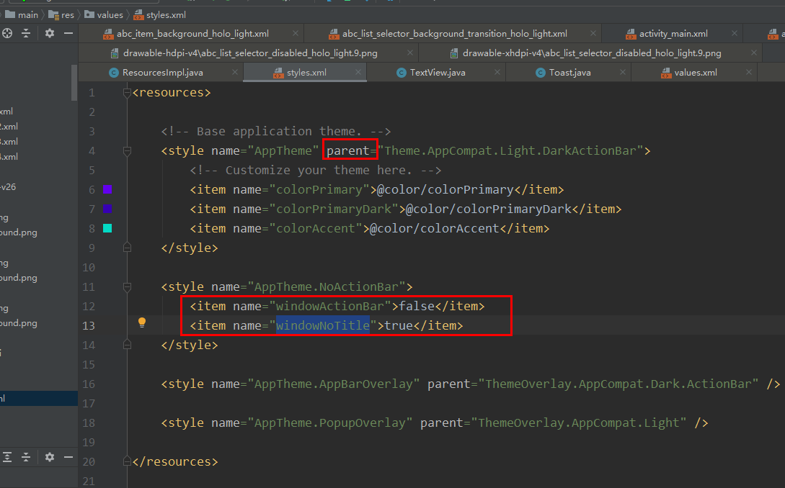


----》这一点非常好：结论：资源本身对开发者也是public的！！！！
-----》所以，我理解，开发者是能够改变系统默认获焦效果（灰色）的！！！！！！！！！！


自定义主题：

```java
G:\working_pan\Demo\BarrierFree_demo\app\src\main\res\values\styles.xml<resources>    <!-- Base application theme. -->    <style name="AppTheme" parent="Theme.AppCompat.Light.DarkActionBar">        // 这里自定义        <!-- Customize your theme here. -->        <item name="colorPrimary">@color/colorPrimary</item>        <item name="colorPrimaryDark">@color/colorPrimaryDark</item>        <item name="colorAccent">@color/colorAccent</item>         // 注意:这里必须用android: 才能覆盖--->跳转的地方不一样        <item name="android:selectableItemBackground">@drawable/my_item_background</item>    </style>    <style name="AppTheme.NoActionBar">        <item name="windowActionBar">false</item>        <item name="windowNoTitle">true</item>    </style>    <style name="AppTheme.AppBarOverlay" parent="ThemeOverlay.AppCompat.Dark.ActionBar" />    <style name="AppTheme.PopupOverlay" parent="ThemeOverlay.AppCompat.Light" /></resources>
```


# ViewOverlay

ViewOverlay中的view或者drawable不会响应任何触摸事件
----》本质：ViewOverlay是另一个抽象层（只显示，不响应）
---》用途：动画


# 安卓面试题目

## Activity生命周期？

onCreate() -> onStart() -> onResume() -> onPause() -> onStop() -> onDetroy()

## Activity的启动过程

注意：（不要回答生命周期）


app启动的过程有两种情况，第一种是从桌面launcher上点击相应的应用图标，第二种是在activity中通过调用startActivity来启动一个新的activity。

我们创建一个新的项目，默认的根activity都是MainActivity，而所有的activity都是保存在堆栈中的，我们启动一个新的activity就会放在上一个activity上面，而我们从桌面点击应用图标的时候，由于launcher本身也是一个应用，当我们点击图标的时候，系统就会调用startActivitySately(),一般情况下，我们所启动的activity的相关信息都会保存在intent中，比如action，category等等。我们在安装这个应用的时候，系统也会启动一个PackaManagerService的管理服务，这个管理服务会对AndroidManifest.xml文件进行解析，从而得到应用程序中的相关信息，比如service，activity，Broadcast等等，然后获得相关组件的信息。当我们点击应用图标的时候，就会调用startActivitySately()方法，而这个方法内部则是调用startActivty(),而startActivity()方法最终还是会调用startActivityForResult()这个方法。而在startActivityForResult()这个方法。因为startActivityForResult()方法是有返回结果的，所以系统就直接给一个-1，就表示不需要结果返回了。而startActivityForResult()这个方法实际是通过Instrumentation类中的execStartActivity()方法来启动activity，Instrumentation这个类主要作用就是监控程序和系统之间的交互。而在这个execStartActivity()方法中会获取ActivityManagerService的代理对象，通过这个代理对象进行启动activity。启动会就会调用一个checkStartActivityResult()方法，如果说没有在配置清单中配置有这个组件，就会在这个方法中抛出异常了。当然最后是调用的是Application.scheduleLaunchActivity()进行启动activity，而这个方法中通过获取得到一个ActivityClientRecord对象，而这个ActivityClientRecord通过handler来进行消息的发送，系统内部会将每一个activity组件使用ActivityClientRecord对象来进行描述，而ActivityClientRecord对象中保存有一个LoaderApk对象，通过这个对象调用handleLaunchActivity来启动activity组件，而页面的生命周期方法也就是在这个方法中进行调用。


## Broadcast注册方式与区别


此处延伸：什么情况下用动态注册

Broadcast广播，注册方式主要有两种.

第一种是静态注册，也可成为常驻型广播，这种广播需要在Androidmanifest.xml中进行注册，这中方式注册的广播，不受页面生命周期的影响，即使退出了页面，也可以收到广播这种广播一般用于想开机自启动啊等等，由于这种注册的方式的广播是常驻型广播，所以会占用CPU的资源。

第二种是动态注册，而动态注册的话，是在代码中注册的，这种注册方式也叫非常驻型广播，收到生命周期的影响，退出页面后，就不会收到广播，我们通常运用在更新UI方面。这种注册方式优先级较高。最后需要解绑，否会会内存泄露

广播是分为有序广播和无序广播。

### HttpClient、HttpUrlConnection

两者区别：

此处延伸：Volley里用的哪种请求方式（2.3前HttpClient，2.3后HttpUrlConnection）

首先HttpClient和HttpUrlConnection 这两种方式都支持Https协议，都是以流的形式进行上传或者下载数据，也可以说是以流的形式进行数据的传输，还有ipv6,以及连接池等功能。HttpClient这个拥有非常多的API，所以如果想要进行扩展的话，并且不破坏它的兼容性的话，很难进行扩展，也就是这个原因，Google在Android6.0的时候，直接就弃用了这个HttpClient.

而HttpUrlConnection相对来说就是比较轻量级了，API比较少，容易扩展，并且能够满足Android大部分的数据传输。比较经典的一个框架volley，在2.3版本以前都是使用HttpClient,在2.3以后就使用了HttpUrlConnection。

###  java虚拟机和Dalvik虚拟机的区别

Java虚拟机：

1、java虚拟机基于栈。 基于栈的机器必须使用指令来载入和操作栈上数据，所需指令更多更多。

2、java虚拟机运行的是java字节码。（java类会被编译成一个或多个字节码.class文件）

Dalvik虚拟机：

1、dalvik虚拟机是基于寄存器的

2、Dalvik运行的是自定义的.dex字节码格式。（java类被编译成.class文件后，会通过一个dx工具将所有的.class文件转换成一个.dex文件，然后dalvik虚拟机会从其中读取指令和数据

3、常量池已被修改为只使用32位的索引，以 简化解释器。

4、一个应用，一个虚拟机实例，一个进程（所有android应用的线程都是对应一个linux线程，都运行在自己的沙盒中，不同的应用在不同的进程中运行。每个android dalvik应用程序都被赋予了一个独立的linux PID(app_*)）

### 进程保活（不死进程）

此处延伸：进程的优先级是什么

当前业界的Android进程保活手段主要分为** 黑、白、灰 **三种，其大致的实现思路如下：

黑色保活：不同的app进程，用广播相互唤醒（包括利用系统提供的广播进行唤醒）

白色保活：启动前台Service

灰色保活：利用系统的漏洞启动前台Service

黑色保活

所谓黑色保活，就是利用不同的app进程使用广播来进行相互唤醒。举个3个比较常见的场景：

场景1：开机，网络切换、拍照、拍视频时候，利用系统产生的广播唤醒app

场景2：接入第三方SDK也会唤醒相应的app进程，如微信sdk会唤醒微信，支付宝sdk会唤醒支付宝。由此发散开去，就会直接触发了下面的 场景3

场景3：假如你手机里装了支付宝、淘宝、天猫、UC等阿里系的app，那么你打开任意一个阿里系的app后，有可能就顺便把其他阿里系的app给唤醒了。（只是拿阿里打个比方，其实BAT系都差不多）

白色保活

白色保活手段非常简单，就是调用系统api启动一个前台的Service进程，这样会在系统的通知栏生成一个Notification，用来让用户知道有这样一个app在运行着，哪怕当前的app退到了后台。如下方的LBE和QQ音乐这样：

灰色保活

灰色保活，这种保活手段是应用范围最广泛。它是利用系统的漏洞来启动一个前台的Service进程，与普通的启动方式区别在于，它不会在系统通知栏处出现一个Notification，看起来就如同运行着一个后台Service进程一样。这样做带来的好处就是，用户无法察觉到你运行着一个前台进程（因为看不到Notification）,但你的进程优先级又是高于普通后台进程的。那么如何利用系统的漏洞呢，大致的实现思路和代码如下：

思路一：API < 18，启动前台Service时直接传入new Notification()；

思路二：API >= 18，同时启动两个id相同的前台Service，然后再将后启动的Service做stop处理

熟悉Android系统的童鞋都知道，系统出于体验和性能上的考虑，app在退到后台时系统并不会真正的kill掉这个进程，而是将其缓存起来。打开的应用越多，后台缓存的进程也越多。在系统内存不足的情况下，系统开始依据自身的一套进程回收机制来判断要kill掉哪些进程，以腾出内存来供给需要的app。这套杀进程回收内存的机制就叫 Low Memory Killer ，它是基于Linux内核的 OOM Killer（Out-Of-Memory killer）机制诞生。

进程的重要性，划分5级：

前台进程 (Foreground process)

可见进程 (Visible process)

服务进程 (Service process)

后台进程 (Background process)

空进程 (Empty process)

了解完 Low Memory Killer，再科普一下oom_adj。什么是oom_adj？它是linux内核分配给每个系统进程的一个值，代表进程的优先级，进程回收机制就是根据这个优先级来决定是否进行回收。对于oom_adj的作用，你只需要记住以下几点即可：

进程的oom_adj越大，表示此进程优先级越低，越容易被杀回收；越小，表示进程优先级越高，越不容易被杀回收

普通app进程的oom_adj>=0,系统进程的oom_adj才可能<0

有些手机厂商把这些知名的app放入了自己的白名单中，保证了进程不死来提高用户体验（如微信、QQ、陌陌都在小米的白名单中）。如果从白名单中移除，他们终究还是和普通app一样躲避不了被杀的命运，为了尽量避免被杀，还是老老实实去做好优化工作吧。

所以，进程保活的根本方案终究还是回到了性能优化上，进程永生不死终究是个彻头彻尾的伪命题！

### 讲解一下Context

Context是一个抽象基类。在翻译为上下文，也可以理解为环境，是提供一些程序的运行环境基础信息。Context下有两个子类，ContextWrapper是上下文功能的封装类，而ContextImpl则是上下文功能的实现类。而ContextWrapper又有三个直接的子类， ContextThemeWrapper、Service和Application。其中，ContextThemeWrapper是一个带主题的封装类，而它有一个直接子类就是Activity，所以Activity和Service以及Application的Context是不一样的，只有Activity需要主题，Service不需要主题。Context一共有三种类型，分别是Application、Activity和Service。这三个类虽然分别各种承担着不同的作用，但它们都属于Context的一种，而它们具体Context的功能则是由ContextImpl类去实现的，因此在绝大多数场景下，Activity、Service和Application这三种类型的Context都是可以通用的。不过有几种场景比较特殊，比如启动Activity，还有弹出Dialog。出于安全原因的考虑，Android是不允许Activity或Dialog凭空出现的，一个Activity的启动必须要建立在另一个Activity的基础之上，也就是以此形成的返回栈。而Dialog则必须在一个Activity上面弹出（除非是System Alert类型的Dialog），因此在这种场景下，我们只能使用Activity类型的Context，否则将会出错。

getApplicationContext()和getApplication()方法得到的对象都是同一个application对象，只是对象的类型不一样。

Context数量 = Activity数量 + Service数量 + 1 （1为Application）


### 理解Activity,View,Window三者关系

这个问题真的很不好回答。所以这里先来个算是比较恰当的比喻来形容下它们的关系吧。Activity像一个工匠（控制单元），Window像窗户（承载模型），View像窗花（显示视图）LayoutInflater像剪刀，Xml配置像窗花图纸。

1：Activity构造的时候会初始化一个Window，准确的说是PhoneWindow。

2：这个PhoneWindow有一个“ViewRoot”，这个“ViewRoot”是一个View或者说ViewGroup，是最初始的根视图。

3：“ViewRoot”通过addView方法来一个个的添加View。比如TextView，Button等

4：这些View的事件监听，是由WindowManagerService来接受消息，并且回调Activity函数。比如onClickListener，onKeyDown等。

### 四种LaunchMode及其使用场景

此处延伸：栈(First In Last Out)与队列(First In First Out)的区别

栈与队列的区别：

1.  [队列](http://www.so.com/s?q=队列&ie=utf-8&src=internal_wenda_recommend_textn)[先进先出](http://www.so.com/s?q=先进先出&ie=utf-8&src=internal_wenda_recommend_textn)，栈先进后出

\2. 对插入和删除操作的"限定"。 栈是限定只能在表的一端进行插入和删除操作的线性表。 队列是限定只能在表的一端进行插入和在另一端进行删除操作的线性表。

\3. 遍历数据速度不同

standard 模式

这是默认模式，每次激活Activity时都会创建Activity实例，并放入任务栈中。使用场景：大多数Activity。

singleTop 模式

如果在任务的栈顶正好存在该Activity的实例，就重用该实例( 会调用实例的 onNewIntent() )，否则就会创建新的实例并放入栈顶，即使栈中已经存在该Activity的实例，只要不在栈顶，都会创建新的实例。使用场景如新闻类或者阅读类App的内容页面。

singleTask 模式

如果在栈中已经有该Activity的实例，就重用该实例(会调用实例的 onNewIntent() )。重用时，会让该实例回到栈顶，因此在它上面的实例将会被移出栈。如果栈中不存在该实例，将会创建新的实例放入栈中。使用场景如浏览器的主界面。不管从多少个应用启动浏览器，只会启动主界面一次，其余情况都会走onNewIntent，并且会清空主界面上面的其他页面。

singleInstance 模式

在一个新栈中创建该Activity的实例，并让多个应用共享该栈中的该Activity实例。一旦该模式的Activity实例已经存在于某个栈中，任何应用再激活该Activity时都会重用该栈中的实例( 会调用实例的 onNewIntent() )。其效果相当于多个应用共享一个应用，不管谁激活该 Activity 都会进入同一个应用中。使用场景如闹铃提醒，将闹铃提醒与闹铃设置分离。singleInstance不要用于中间页面，如果用于中间页面，跳转会有问题，比如：A -> B (singleInstance) -> C，完全退出后，在此启动，首先打开的是B。

#### View的绘制流程

自定义控件：

1、组合控件。这种自定义控件不需要我们自己绘制，而是使用原生控件组合成的新控件。如标题栏。

2、继承原有的控件。这种自定义控件在原生控件提供的方法外，可以自己添加一些方法。如制作圆角，圆形图片。

3、完全自定义控件：这个View上所展现的内容全部都是我们自己绘制出来的。比如说制作水波纹进度条。

View的绘制流程：OnMeasure()——>OnLayout()——>OnDraw()

第一步：OnMeasure()：测量视图大小。从顶层父View到子View递归调用measure方法，measure方法又回调OnMeasure。

第二步：OnLayout()：确定View位置，进行页面布局。从顶层父View向子View的递归调用view.layout方法的过程，即父View根据上一步measure子View所得到的布局大小和布局参数，将子View放在合适的位置上。

第三步：OnDraw()：绘制视图。ViewRoot创建一个Canvas对象，然后调用OnDraw()。六个步骤：①、绘制视图的背景；②、保存画布的图层（Layer）；③、绘制View的内容；④、绘制View子视图，如果没有就不用；

⑤、还原图层（Layer）；⑥、绘制滚动条。

#### View，ViewGroup事件分发

\1. Touch事件分发中只有两个主角:ViewGroup和View。ViewGroup包含onInterceptTouchEvent、dispatchTouchEvent、onTouchEvent三个相关事件。View包含dispatchTouchEvent、onTouchEvent两个相关事件。其中ViewGroup又继承于View。

2.ViewGroup和View组成了一个树状结构，根节点为Activity内部包含的一个ViwGroup。

3.触摸事件由Action_Down、Action_Move、Aciton_UP组成，其中一次完整的触摸事件中，Down和Up都只有一个，Move有若干个，可以为0个。

4.当Acitivty接收到Touch事件时，将遍历子View进行Down事件的分发。ViewGroup的遍历可以看成是递归的。分发的目的是为了找到真正要处理本次完整触摸事件的View，这个View会在onTouchuEvent结果返回true。

5.当某个子View返回true时，会中止Down事件的分发，同时在ViewGroup中记录该子View。接下去的Move和Up事件将由该子View直接进行处理。由于子View是保存在ViewGroup中的，多层ViewGroup的节点结构时，上级ViewGroup保存的会是真实处理事件的View所在的ViewGroup对象:如ViewGroup0-ViewGroup1-TextView的结构中，TextView返回了true，它将被保存在ViewGroup1中，而ViewGroup1也会返回true，被保存在ViewGroup0中。当Move和UP事件来时，会先从ViewGroup0传递至ViewGroup1，再由ViewGroup1传递至TextView。

6.当ViewGroup中所有子View都不捕获Down事件时，将触发ViewGroup自身的onTouch事件。触发的方式是调用super.dispatchTouchEvent函数，即父类View的dispatchTouchEvent方法。在所有子View都不处理的情况下，触发Acitivity的onTouchEvent方法。

7.onInterceptTouchEvent有两个作用：1.拦截Down事件的分发。2.中止Up和Move事件向目标View传递，使得目标View所在的ViewGroup捕获Up和Move事件。

#### 保存Activity状态

onSaveInstanceState(Bundle)会在activity转入后台状态之前被调用，也就是onStop()方法之前，onPause方法之后被调用；

#### Android中的几种动画

帧动画：指通过指定每一帧的图片和播放时间，有序的进行播放而形成动画效果，比如想听的律动条。
 补间动画：指通过指定View的初始状态、变化时间、方式，通过一系列的算法去进行图形变换，从而形成动画效果，主要有Alpha、Scale、Translate、Rotate四种效果。注意：只是在视图层实现了动画效果，并没有真正改变View的属性，比如滑动列表，改变标题栏的透明度。
 属性动画：在Android3.0的时候才支持，通过不断的改变View的属性，不断的重绘而形成动画效果。相比于视图动画，View的属性是真正改变了。比如view的旋转，放大，缩小。

#### Android中跨进程通讯的几种方式

Android 跨进程通信，像intent，contentProvider,广播，service都可以跨进程通信。
 intent：这种跨进程方式并不是访问内存的形式，它需要传递一个uri,比如说打电话。
 contentProvider：这种形式，是使用数据共享的形式进行数据共享。
 service：远程服务，aidl
 广播

#### AIDL理解

此处延伸：简述Binder

AIDL: 每一个进程都有自己的Dalvik VM实例，都有自己的一块独立的内存，都在自己的内存上存储自己的数据，执行着自己的操作，都在自己的那片狭小的空间里过完自己的一生。而aidl就类似与两个进程之间的桥梁，使得两个进程之间可以进行数据的传输，跨进程通信有多种选择，比如 BroadcastReceiver , Messenger 等，但是 BroadcastReceiver 占用的系统资源比较多，如果是频繁的跨进程通信的话显然是不可取的；Messenger 进行跨进程通信时请求队列是同步进行的，无法并发执行。

Binde机制简单理解:
 在Android系统的Binder机制中，是有Client,Service,ServiceManager,Binder驱动程序组成的，其中Client，service，Service Manager运行在用户空间，Binder驱动程序是运行在内核空间的。而Binder就是把这4种组件粘合在一块的粘合剂，其中核心的组件就是Binder驱动程序，Service Manager提供辅助管理的功能，而Client和Service正是在Binder驱动程序和Service Manager提供的基础设施上实现C/S 之间的通信。其中Binder驱动程序提供设备文件/dev/binder与用户控件进行交互，
 Client、Service，Service Manager通过open和ioctl文件操作相应的方法与Binder驱动程序进行通信。而Client和Service之间的进程间通信是通过Binder驱动程序间接实现的。而Binder Manager是一个守护进程，用来管理Service，并向Client提供查询Service接口的能力。

#### Handler的原理

Android中主线程是不能进行耗时操作的，子线程是不能进行更新UI的。所以就有了handler，它的作用就是实现线程之间的通信。
 handler整个流程中，主要有四个对象，handler，Message,MessageQueue,Looper。当应用创建的时候，就会在主线程中创建handler对象，
 我们通过要传送的消息保存到Message中，handler通过调用sendMessage方法将Message发送到MessageQueue中，Looper对象就会不断的调用loop()方法
 不断的从MessageQueue中取出Message交给handler进行处理。从而实现线程之间的通信。

#### Binder机制原理

在Android系统的Binder机制中，是有Client,Service,ServiceManager,Binder驱动程序组成的，其中Client，service，Service Manager运行在用户空间，Binder驱动程序是运行在内核空间的。而Binder就是把这4种组件粘合在一块的粘合剂，其中核心的组件就是Binder驱动程序，Service Manager提供辅助管理的功能，而Client和Service正是在Binder驱动程序和Service Manager提供的基础设施上实现C/S 之间的通信。其中Binder驱动程序提供设备文件/dev/binder与用户控件进行交互，Client、Service，Service Manager通过open和ioctl文件操作相应的方法与Binder驱动程序进行通信。而Client和Service之间的进程间通信是通过Binder驱动程序间接实现的。而Binder Manager是一个守护进程，用来管理Service，并向Client提供查询Service接口的能力。

#### 热修复的原理

我们知道Java虚拟机 —— JVM 是加载类的class文件的，而Android虚拟机——Dalvik/ART VM 是加载类的dex文件，
 而他们加载类的时候都需要ClassLoader,ClassLoader有一个子类BaseDexClassLoader，而BaseDexClassLoader下有一个
 数组——DexPathList，是用来存放dex文件，当BaseDexClassLoader通过调用findClass方法时，实际上就是遍历数组，
 找到相应的dex文件，找到，则直接将它return。而热修复的解决方法就是将新的dex添加到该集合中，并且是在旧的dex的前面，
 所以就会优先被取出来并且return返回。

####  Android内存泄露及管理

（1）内存溢出（OOM）和内存泄露（对象无法被回收）的区别。
 （2）引起内存泄露的原因
 (3) 内存泄露检测工具 ------>LeakCanary

内存溢出 out of memory：是指程序在申请内存时，没有足够的内存空间供其使用，出现out of memory；比如申请了一个integer,但给它存了long才能存下的数，那就是内存溢出。内存溢出通俗的讲就是内存不够用。
 内存泄露 memory leak：是指程序在申请内存后，无法释放已申请的内存空间，一次内存泄露危害可以忽略，但内存泄露堆积后果很严重，无论多少内存,迟早会被占光
 内存泄露原因：
 一、Handler 引起的内存泄漏。
 解决：将Handler声明为静态内部类，就不会持有外部类SecondActivity的引用，其生命周期就和外部类无关，
 如果Handler里面需要context的话，可以通过弱引用方式引用外部类
 二、单例模式引起的内存泄漏。
 解决：Context是ApplicationContext，由于ApplicationContext的生命周期是和app一致的，不会导致内存泄漏
 三、非静态内部类创建静态实例引起的内存泄漏。
 解决：把内部类修改为静态的就可以避免内存泄漏了
 四、非静态匿名内部类引起的内存泄漏。
 解决：将匿名内部类设置为静态的。
 五、注册/反注册未成对使用引起的内存泄漏。
 注册广播接受器、EventBus等，记得解绑。
 六、资源对象没有关闭引起的内存泄漏。
 在这些资源不使用的时候，记得调用相应的类似close（）、destroy（）、recycler（）、release（）等方法释放。
 七、集合对象没有及时清理引起的内存泄漏。
 通常会把一些对象装入到集合中，当不使用的时候一定要记得及时清理集合，让相关对象不再被引用。

#### Fragment、Activity通信的方式

1.直接在一个Fragment中调用另外一个Fragment中的方法
 2.使用接口回调
 3.使用广播
 4.Fragment直接调用Activity中的public方法

#### Android UI适配

字体使用sp,使用dp，多使用match_parent，wrap_content，weight
 图片资源，不同图片的的分辨率，放在相应的文件夹下可使用百分比代替。

#### app优化

app优化:(工具：Hierarchy Viewer 分析布局  工具：TraceView 测试分析耗时的)
 App启动优化
 布局优化
 响应优化
 内存优化
 电池使用优化
 网络优化

App启动优化(针对冷启动)
 App启动的方式有三种：
 冷启动：App没有启动过或App进程被killed, 系统中不存在该App进程, 此时启动App即为冷启动。
 热启动：热启动意味着你的App进程只是处于后台, 系统只是将其从后台带到前台, 展示给用户。

介于冷启动和热启动之间, 一般来说在以下两种情况下发生:

(1)用户back退出了App, 然后又启动. App进程可能还在运行, 但是activity需要重建。
 (2)用户退出App后, 系统可能由于内存原因将App杀死, 进程和activity都需要重启, 但是可以在onCreate中将被动杀死锁保存的状态(saved instance state)恢复。

优化：
 Application的onCreate（特别是第三方SDK初始化），首屏Activity的渲染都不要进行耗时操作，如果有，就可以放到子线程或者IntentService中

布局优化
 尽量不要过于复杂的嵌套。可以使用<include>，<merge>，<ViewStub>

响应优化
 Android系统每隔16ms会发出VSYNC信号重绘我们的界面(Activity)。
 页面卡顿的原因：
 (1)过于复杂的布局.
 (2)UI线程的复杂运算
 (3)频繁的GC,导致频繁GC有两个原因:1、内存抖动, 即大量的对象被创建又在短时间内马上被释放.2、瞬间产生大量的对象会严重占用内存区域。

内存优化：参考内存泄露和内存溢出部分

电池使用优化(使用工具：Batterystats & bugreport)
 (1)优化网络请求
 (2)定位中使用GPS, 请记得及时关闭

网络优化(网络连接对用户的影响:流量,电量,用户等待)可在Android studio下方logcat旁边那个工具Network Monitor检测
 API设计：App与Server之间的API设计要考虑网络请求的频次, 资源的状态等. 以便App可以以较少的请求来完成业务需求和界面的展示.
 Gzip压缩：使用Gzip来压缩request和response, 减少传输数据量, 从而减少流量消耗.
 图片的Size：可以在获取图片时告知服务器需要的图片的宽高, 以便服务器给出合适的图片, 避免浪费.
 网络缓存：适当的缓存, 既可以让我们的应用看起来更快, 也能避免一些不必要的流量消耗.

#### 图片优化

(1)对图片本身进行操作。尽量不要使用setImageBitmap、setImageResource、BitmapFactory.decodeResource来设置一张大图，因为这些方法在完成decode后，
 最终都是通过java层的createBitmap来完成的，需要消耗更多内存.
 (2)图片进行缩放的比例，SDK中建议其值是2的指数值,值越大会导致图片不清晰。
 (3)不用的图片记得调用图片的recycle()方法

#### HybridApp WebView和JS交互

Android与JS通过WebView互相调用方法，实际上是：
 Android去调用JS的代码

1.  通过WebView的loadUrl(),使用该方法比较简洁，方便。但是效率比较低，获取返回值比较困难。
2.  通过WebView的evaluateJavascript(),该方法效率高，但是4.4以上的版本才支持，4.4以下版本不支持。所以建议两者混合使用。
     JS去调用Android的代码
3.  通过WebView的addJavascriptInterface（）进行对象映射 ，该方法使用简单，仅将Android对象和JS对象映射即可，但是存在比较大的漏洞。

漏洞产生原因是：当JS拿到Android这个对象后，就可以调用这个Android对象中所有的方法，包括系统类（java.lang.Runtime 类），从而进行任意代码执行。
 解决方式：
 (1)Google 在Android 4.2 版本中规定对被调用的函数以 @JavascriptInterface进行注解从而避免漏洞攻击。
 (2)在Android 4.2版本之前采用拦截prompt（）进行漏洞修复。

1.  通过 WebViewClient 的shouldOverrideUrlLoading ()方法回调拦截 url 。这种方式的优点：不存在方式1的漏洞；缺点：JS获取Android方法的返回值复杂。(ios主要用的是这个方式)

(1)Android通过 WebViewClient 的回调方法shouldOverrideUrlLoading ()拦截 url
 (2)解析该 url 的协议
 (3)如果检测到是预先约定好的协议，就调用相应方法

1.  通过 WebChromeClient 的onJsAlert()、onJsConfirm()、onJsPrompt（）方法回调拦截JS对话框alert()、confirm()、prompt（） 消息
     这种方式的优点：不存在方式1的漏洞；缺点：JS获取Android方法的返回值复杂。

#### JAVA GC原理

垃圾收集算法的核心思想是：对虚拟机可用内存空间，即堆空间中的对象进行识别，如果对象正在被引用，那么称其为存活对象
 ，反之，如果对象不再被引用，则为垃圾对象，可以回收其占据的空间，用于再分配。垃圾收集算法的选择和垃圾收集系统参数的合理调节直接影响着系统性能。

#### 27、ANR

ANR全名Application Not Responding, 也就是"应用无响应". 当操作在一段时间内系统无法处理时, 系统层面会弹出上图那样的ANR对话框.
 产生原因：
 (1)5s内无法响应用户输入事件(例如键盘输入, 触摸屏幕等).
 (2)BroadcastReceiver在10s内无法结束
 (3)Service 20s内无法结束（低概率）

解决方式：
 (1)不要在主线程中做耗时的操作，而应放在子线程中来实现。如onCreate()和onResume()里尽可能少的去做创建操作。
 (2)应用程序应该避免在BroadcastReceiver里做耗时的操作或计算。
 (3)避免在Intent Receiver里启动一个Activity，因为它会创建一个新的画面，并从当前用户正在运行的程序上抢夺焦点。
 (4)service是运行在主线程的，所以在service中做耗时操作，必须要放在子线程中。


# 安卓基础知识

## aidl

### aidl的理解

见AndriodSystem_Others

### Android中Parcelable接口：

记忆，实现了某个接口，即拥有某种能力！！！！！！----》实现了Parcelable接口，就有了打包的能力

#### 何时使用？使用例子

是一种序列化（反）手段：其本质：将对象转换为二进制流
-----》为什么要转？： 为了传输，网络传输或者保存到本地  》TODO：不转不能完成这些？？？？怎么证明？？？

应用场景：进程间通信IPC、网络传输、保存到本地、Activity之间？？。。。。。。TODO：补充并验证


```java
//Book类的序列化
public class Book implements Parcelable {
    private String name;
    private int id;
    private String classify;

    protected Book(Parcel in) {
        name = in.readString();
        classify = in.readString();
        id = in.readInt();
    }

    public Book(String classify, String name, int id) {
        this.name = name;
        this.id = id;
        this.classify = classify;
    }

    /**
     * （2）CREATOR负责反序列化过程：从Parcel中新建对象
     */
    public static final Creator<Book> CREATOR = new Creator<Book>() {
        @Override
        public Book createFromParcel(Parcel in) {
            return new Book(in);
        }

        @Override
        public Book[] newArray(int size) {
            return new Book[size];
        }
    };

    @Override
    public int describeContents() {
        return 0;
    }

    /**
     * （1）序列化过程
     *
     * @param dest
     * @param flags
     */
    @Override
    public void writeToParcel(Parcel dest, int flags) {
        dest.writeString(name);
        dest.writeString(classify);
        dest.writeInt(id);
    }


    @Override
    public String toString() {
        return "name : " +
                name + "\"" + "id : " + id + "\"" + "classify" + classify;
    }
}
```

---》那么拥有序列化能力的book如何使用？？？？

#### parcel

https://www.cnblogs.com/ldq2016/p/8469334.html

（1）parcel读写能力：

```java
        Parcel parcel= Parcel.obtain();

        //写入，即是write
        parcel.writeString("111111");  //#1
        parcel.marshall(); //#2 (1)序列化过程--》没有这一步，后面read为null  (2)这一步返回byte
        parcel.setDataPosition(0); // #3 在将数据写入之后，需要将指针手动指向到最初的位置

        //#4 read
        String s = parcel.readString();
```

为什么没有#2 #3, 步骤#4 read出来的是null？？？？？？
《-------必须回答#123做了啥，4又具体做了啥？？


##### #1 parcel.writeString


(2)parcel的复制


#### 如何转的？？？

具体的序列化原理：Parcelable的序列化需要借助Parcel


最后对Parcelable的序列化做一个总结：

-   Parcelable的序列化需要借助Parcel。
-   Parcel通过JNI把序列化数据写入到进程的共享内存中，或从进程共享内存中读数据。
-   Parcel推荐使用Parcel.obtain()方法获取可用实例。
-   与Serializable相比，Parcelable避免了大量反射操作，在效率上有很大提升。
-   Parcelable仅仅是IPC的高效实现方案，其他场景慎用。


#### 复杂化：Book类里面有其它对象

#### Parcelable与Intent或者Bundle

#### 与Serializable对比，优劣势？

Parcelable属于安卓，Serializable是java的

Parcelable比Serializable快十倍--------》证明？？？？？
本质原因在于：Serializable保存了整个类------》消耗极大
                        **Parcelable只是保存了数据结构的值**，<font color='red'> 没有保存数据结构</font>，而数据结构仍然在开发者手中（恢复时用！！！）


Serializable具有可继承性，Parcelable虽然也具有，但是仍然需要完善实现，因为CREATOR是静态的。 


### 状态保存分析，待合并


```
序列化： 
(1)ActivityThread 去做的
(2)场景：activityStopped时机
（3）序列化最终去向：内存(证据：parcel底层是内存操作函数)，native侧的二进制。。。并非文件？（文件场景：开机重启后仍然能够恢复）
                    java序列化是外部存储器，效率低（证据：？？？？）
（4）序列化的场景比状态保存的场景少！！！！！！！！（activity切换时，前activity保存）
（5）反序列化场景比序列化场景还要少？？？？
writeToParcel:13053, TextView$SavedState (android.widget)
writeParcelable:1801, Parcel (android.os)
writeValue:1707, Parcel (android.os)
writeSparseArray:1085, Parcel (android.os)
writeValue:1732, Parcel (android.os)
writeArrayMapInternal:928, Parcel (android.os)
writeToParcelInner:1584, BaseBundle (android.os)
writeToParcel:1253, Bundle (android.os)
writeBundle:997, Parcel (android.os)
writeValue:1698, Parcel (android.os)
writeArrayMapInternal:928, Parcel (android.os)
writeToParcelInner:1584, BaseBundle (android.os)
writeToParcel:1253, Bundle (android.os)
activityStopped:4505, IActivityTaskManager$Stub$Proxy (android.app)
run:145, PendingTransactionActions$StopInfo (android.app.servertransaction)
handleCallback:883, Handler (android.os)
dispatchMessage:100, Handler (android.os)
loop:214, Looper (android.os)
main:7356, ActivityThread (android.app)
invoke:-1, Method (java.lang.reflect)
run:492, RuntimeInit$MethodAndArgsCaller (com.android.internal.os)
main:930, ZygoteInit (com.android.internal.os)


trace是万能的，但是弊端：必须建立在场景你能复现！！！！！（所有动态调试的弊端）。比如状态保存好复现，但是反序列化很难复现！！！！

nameili思路：
1、网页提示

已知存在native和java -----》找流程:


1、先save流程，下发空Bundle 66，填充  ----->注意：这个接口也开给开发者了！！！！！！
Activity.onSaveInstanceState(@NonNull Bundle outState)

2、旋转之后，onCreate----->注意：这个接口开给开发者了！！！！！！(但用处是啥)

Activity.onCreate(Bundle savedInstanceState)  Bundle 66 
------》怎么协调这个与Ability的关系呢？

3、Activity.onRestoreInstanceState(@NonNull Bundle savedInstanceState)  ----->注意：这个接口开给开发者了！！！！！！

----》这个Bundle 66


------>上述问题，可以把转换代码挪到元解决（目前问题，转换问题）

目前上述所有问题，都是Activity去对接的，责任主体是元？？？？


------->两边SE定的是元透传给安卓AcitivityTread。现在有对外接口，数据开发者能拿到，所以，必须元去转数据！！！！！！！！！！！！！
后期挪动，现在这个需求仍然这么做，不影响我们
元目前接口有问题
-------》最后没有问题，把恢复和反序列化分开！！！！！！！！


安卓还有接口：

 public void onPostCreate(@Nullable Bundle savedInstanceState)
 
 

 * public class Activity extends ApplicationContext {
 *     protected void onCreate(Bundle savedInstanceState);
 *
 *     protected void onStart();
 *
 *     protected void onRestart();
 *
 *     protected void onResume();
 *
 *     protected void onPause();
 *
 *     protected void onStop();
 *
 *     protected void onDestroy();
 * }


----------》总揽这个事情，给一个大反思： 
   为什么之前没想到是元去转？？？因为之前定的是透传！！！！！
                    一度把他的对外接口给忘记了！！！！！！
```


关于容器Bundle的由来：

```
// ActivityThread.java
   ActivityClientRecord r = mActivities.get(tmp.token);
```

ActivityThread里维护了所有activity的记录Record，Record持有记录activity状态的Bundle

最开始，Bundle是为null的----》问题：问题在于为什么每次取到的都是null？（即使你修改了这个值）

```java
// ActivityThread.java
private void callActivityOnSaveInstanceState(ActivityClientRecord r) {
        r.state = new Bundle(); // 这里赋值的！！！（初始化时，默认mParcelledByNative = false），时机：在Save流程最开始的时候
        r.state.setAllowFds(false);
        if (r.isPersistable()) {
            r.persistentState = new PersistableBundle();
            mInstrumentation.callActivityOnSaveInstanceState(r.activity, r.state,
                    r.persistentState);
        } else {
            mInstrumentation.callActivityOnSaveInstanceState(r.activity, r.state);
        }
    }
```

即使初始化时修改mParcelledByNative = true-----》也无用----》序列化开关不是这里。到底是哪里？？？？？？


关于序列化：

```java
// （1）PendingTransactionActions.java ---》调用栈见上。具体触发的消息是啥？？
ActivityTaskManager.getService().activityStopped(
     mActivity.token, mState, mPersistentState, mDescription);

//（2） ActivityTaskManagerService.java --->到系统进程
	public final void activityStopped(
// 存储在ActivityRecord里：Bundle  icicle;         // last saved activity state


```

-------》（1）（2）之间跨进程传输，把state跨进程传给ActivityTaskManagerService系统进程了！！！！！！！（本质）所以这是状态保存需要序列化的本质原因（证据：确实可以看到先序列化，后跨了进程）！！！！！！！！！，这是序列化的地方！！！！！！！！！

结论：（1）mParcelledByNative------》不是序列化的原因（TODO:那这个是干啥的？？？？）
（2）不同于Book的跨进程序列化传输，这里系统进程拿到了二进制，没有再反序列化出对象（实际上，系统进程也不可能反序列化出对象，因为类是在App进程里。。。而之前Book demo，是两边都有要传输的类！！！！！，可以做到反序列化！！！！）

证明：ActivityRecord的Bundle持有的是native侧的指针


 


```
addCallback:75, ClientTransaction (android.app.servertransaction)
transactionWithCallback:125, ClientLifecycleManager (com.android.server.wm)
scheduleTransaction:83, ClientLifecycleManager (com.android.server.wm)
scheduleTopResumedActivityChanged:724, ActivityRecord (com.android.server.wm)
updateTopResumedActivityIfNeeded:2318, ActivityStackSupervisor (com.android.server.wm)
setResumedActivity:2610, ActivityStack (com.android.server.wm)
onActivityStateChanged:555, ActivityStack (com.android.server.wm)
onActivityStateChanged:1870, TaskRecord (com.android.server.wm)
setState:1869, ActivityRecord (com.android.server.wm)
startPausingLocked:1686, ActivityStack (com.android.server.wm)
resumeTopActivityInnerLocked:2748, ActivityStack (com.android.server.wm)
resumeTopActivityUncheckedLocked:2575, ActivityStack (com.android.server.wm)
resumeFocusedStacksTopActivities:1158, RootActivityContainer (com.android.server.wm)
startActivityUnchecked:1728, ActivityStarter (com.android.server.wm)
startActivity:1394, ActivityStarter (com.android.server.wm)
startActivity:933, ActivityStarter (com.android.server.wm)
startActivity:583, ActivityStarter (com.android.server.wm)
startActivityMayWait:1288, ActivityStarter (com.android.server.wm)
execute:514, ActivityStarter (com.android.server.wm)
startActivityAsUser:1058, ActivityTaskManagerService (com.android.server.wm)
startActivityAsUser:1032, ActivityTaskManagerService (com.android.server.wm)
startActivity:1009, ActivityTaskManagerService (com.android.server.wm)
onTransact:1486, IActivityTaskManager$Stub (android.app)
execTransactInternal:1021, Binder (android.os)
execTransact:994, Binder (android.os)
```


-----------》首要任务：（1）classLoader
（2） 制造crash


### 关于Binder

https://carsonho.blog.csdn.net/article/details/73560642?utm_medium=distribute.pc_relevant_t0.none-task-blog-2%7Edefault%7EBlogCommendFromMachineLearnPai2%7Edefault-1.control&depth_1-utm_source=distribute.pc_relevant_t0.none-task-blog-2%7Edefault%7EBlogCommendFromMachineLearnPai2%7Edefault-1.control


## 关于线程的理解：

### 什么是线程？

执行的控制流    被包含在进程（进程内存共享）中

### 什么是主线程？

注意：
对于java，主线程指的是启动main函数的线程    ----》TODO：java的进程号，与主线程号？？？？
对于安卓，主线程即是UI线程
----》为什么这么说？启动的main函数线程，1、即是ActivityTread的（即UI？？？？） 2、初始化了线程号，作为后续校验UI操作的线程号？？（TODO：代码）


### 安卓主线程是一个死循环

（在Looper.loop()里取消息时死循环）：

（0）机制： App本身就运行在一个Looper里，以消息驱动。代码证明：？？？？


（1）可能会休眠!!!!!!!!!!？？？？

（2）既然是死循环，为什么没有ANR？
ANR是为安卓的四大组件设置的？？？？

无非也就是是个线程，线程是有生命周期的，任务执行结束，或者在执行任务过程中抛了异常，线程就结束了。在 Android 中，正式由于 Looper 维护的这个死循环才能保证主线程不退出，至于为什么不会被卡死，这个说法本身就不成立，loop 方法一直循环处理任务，如果没有任务，进程会休眠。不是一直在循环。至于程序 anr，不是由于死循环，而是由于在 mainlooper 维护这个线程中，执行耗时任务，在规定时间内没有完成，才触发了 Android 系统的 anr 机制！这个跟这个死循环没有任何关系

（3）既然是死循环，又如何退出主线程？---->TODO：线程的生命周期

（4）UI线程的死循环，会进入休眠嘛？


# 输入法

见InputMethod

# 安卓逆向

目的：

> 1、**有时候，不能确定环境中的jar、apk是否含自己的修改<font color='red'>(非常重要)</font>**   
>
> ---------->  从手机环境中pull出来jar或者apk，反编译看代码
>
> 2、看别人的实现方式


工具一：jadx  

>  https://juejin.cn/post/7168086915445424136
>
> 
>
> 范围：
>
> APK，AAR，JAR，DEX，AAB，ZIP  ------->   Java 类
>
> APK，AAR，AAB，ZIP 中的资源 (**根本原因：在于资源不可能混淆，系统要识别的**)


工具二：

> apktool + dex2jar + jd-gui 组合： https://juejin.cn/post/7158107697907236878


难点：混淆

参考：

> https://juejin.cn/post/7168086915445424136
> https://www.youtube.com/watch?v=aEEYM0QbnO4&list=PLwIrqQCQ5pQlBNwwf9afQNNUChwdYPVLr  视频教程


# 计算机基础

## 操作系统之进程管理

TODO:
https://mp.weixin.qq.com/s/OCtpPLoBUyVBw2wUlEj1Kw


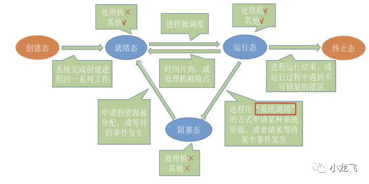

只有三种状态：


# 性能专题

 见AndriodSystem_Others


## 其他

**网络性能优化**、**APK 大小优化**、**App 耗电**

https://www.androidperformance.com/


https://androidperformance.com/2018/05/07/Android-performance-optimization-skills-and-tools/   极好的文章

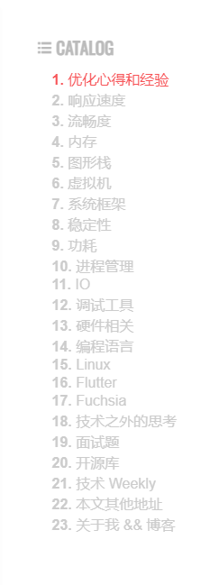

# 面试

安卓系统最新面试题 ------》问题永远是第一位重要的
https://blog.csdn.net/kai_zone/article/details/81117644


## 项目相关问题：


华为IDP流程里，你担任什么角色？遇到需求交不了，你是怎么解决的


### 开发

开发中遇到哪些问题，你是怎么解决的


### 软件经理

软件经理，项目管理方面能力 ：需求管理方面的能力 ---->  技术leader角色
华为的项目线和人力线是两条线：软件经理是项目线角色


#### 所做的事情

组织开发交付，细化并规范化交付流程。定时推动项目进展。

和各个部门协商开发人员，以及开发周期。----->  针对于要求时间过多的？1、让他们解释为什么要这么多时间，代码量评估多少、验证用例多少  2、对于模块开发，固定的，以往开发时间多少  3、**技巧：** 让他们都报多一些，越多越好，**激化矛盾** ，然后拉各地主管，狠狠批斗

技巧：和硬件沟通时间，都会给软件预留一定时间


#### 遇到需求交不了，你是怎么解决的：

1、**首先确保不会有延期的**情况出现。需求的开发过程中，先按功能模块划分待开发代码，评估工作量。按照各功能模块给出计划、以及联调时间计划、转测试时间等。设计桌面也有进度，让他们自己更新，所有人都能看到
   对于重要的项目，每天会议跟踪计划，发日报周报进展
2、**万一有延期的风险**。比如，SE、MDE前期分析不到位等，通过每天会议及时发现风险，知会人力PL。
   要根据风险点，到底是技术难题，还是验证量过大，让PL协调投入技术专家，还是其他普通开发。让他们手中不是那么急的任务优先级放低
  7*24小时

3、等项目风险释放开发后，AAR回溯问题。回溯不针对人，而是针对问题，改进措施。完善checkList


#### 遇到很多领域都没完成的

比如，排查问题、自验证版本。
------>  发邮件通报前三。一直通报前三


#### 对某一个项目中遇到的问题，举一反三

通知其他项目


说的很顺畅，流程很顺畅


## 面试技术问题

### 帧数据的流转

surface对应一个buffer，那么APP进程的Buffer，如何流转到 surfaceFlinger？
----->TODO:   这实际上涉及到两个进程了！！！？

用到了surfaceQueue？，类似于MesseageQueue


### 需要补充的知识点：

linux相关： 内存知识、pss、rss、uss

kernel相关：

安卓相关： AMS、WMS、显示相关、PMS

## 一些好的点

商泰面试答复：
您好，不好意思，这两天公司阳太多人了，一直在处理问题，上次面试的确和我们招聘的需求有点差距，对于上层关联的一些系统源码有阅读和自己的理解，个人的算法意识不错，Android系统框架层深入学习研究的经验可能会欠缺一些，所以还是比较抱歉了

------>  个人的算法意识不错:   这个是由于，`回答算法题之前先说了异常边界情况（优）`

------> Android系统框架层深入学习研究的经验可能会欠缺一些：  应该值得是WMS、AMS那块


## 问面试官的问题

1、让面试官介绍自己的业务

2、


看源码，如何更深刻的理解呢


## 谈薪资

参考视频： 产品老曾


面试谈薪资，这个东西也变成套路了啊，就跟演电影一样，你就照着一个方式演一遍就可以了: 
HR:哎呀，我们家这个晋级大概就这个级别，然后在这个级别下我们已经聊了，可能按照这个薪酬的标准啊。我们大概给你的薪酬是这样，你看要不然你无法接了吧，
我：然后你就说我还**挺喜欢你们公司对我的认可。然后呢我也相信你们帮我去争取过**，但是呢确实因为原来的公司是这样，**如果是只给我涨这么点的。吸引力可能没有那么大**
HR: 未来未来还有奖金呢，是吧？我们还有福利，是不是啊？你就接了吧，这是一个话术，对吧？
我：然后你就说我觉得你对我也挺好的，我们俩这个经历这么长时间我的面试过程，对吧？同学其实对我的支持和帮助这些。这样的话我才能拿到这个，最后能跟你们谈这个，**但是呢因为现在呢还是有其他的一些公司在正在跟我接触**，
而且有一些公司他们开的这个薪酬确实比你们这边给的我还是高比较多，当然了，**我倒不是说只是说因为钱我就非要去他们那儿**，是说我是觉得这个第一呢，这个能证明这个我自己在市场上的一个价值。第二个呢**我也是因为很想去你们公司，所以我才跟你们聊这个事情。**
我们俩反正比较直接坦白的讲。就是您这边也帮我挺多的，你就在帮帮我跟公司再争取争，
HR: 然后这个hr同学就是说这个还是挺为难的，因为我们公司没有这个先例啊，这个一般就定完了以后，其实我也没有办法再去改变，如果你不接的话，你现在外面有一些公司在跟你接触吗？他们开多少呢？
我：你就说啊，巴拉巴拉稍微高一点的。**然后你说他们开的确实也比较有吸引力，但是我还是很想加入你们公司，因为我们我还挺喜欢跟你们交流的**，就不要跟让他变成你的敌对去了啊，注意就是不要让他变成说你们在干嘛呢？不要说这些东西，你说你跟我是一边的。
一直在说这个东西啊，就是说还是希望你能尽力帮我争取一下来回拉扯，现在都是这样，你就照这个来就好了，反正大家都心知肚明，就是肯定要拉扯一两个，你知道这个东西我跟你讲一线的hr的，它确实权限比较小，所以呢如果你的那个薪酬你感觉不满意。
他最多最多能够在他自己权利范围内给你加10%，他看你薪酬的话，比如说假设你原来薪酬是1万多2万，然后他给你加个什么一两千，那就算是他的权限范围超过这个范围，比如说你说我要个30场数。50涨幅，这是一定要向上面的HR的那个老大去申报了，
而那个人在想的就是成本问题，成本性价比，业务那边是不是对你非常认可，那你就有机会，但是有机会你就要还是要跟他讲好话，然后让他愿意去帮你去做这个申请，因为他申请很艰难，他是要跟他老板打报告的
。你不要以为说反正你们就压我这，反正我无所谓，就你自己解决去，那你其实就没有**帮别人提供一个理由来帮你加薪**，你明白了这个东西以后你就要知道说你要给这个跟你聊天的这个圈儿一个合适的理由让他去。
是的，**比如说你在外面有一些其他公司在竞争力这是一种**，对吧，还有就是**我其实对于我们公司做的这个事儿比较了解，我比较胜任，而且业务对我很认可**，这也是一种就是这些东西都是可以给你加成你的性价比，
你注意啊，最终公司给不给你家选不选你**这是性价比问题，**所以他压薪资他一定会压，你一定会争取大家就拉手拉手就跟你在那个菜市场买菜一样的。这个青菜多少钱啊？青菜一块便宜点呗，哎呀，便宜不了，便宜不了，小本生意，便宜不便宜，我拿两把呢，你在送我点算。
哎呀，这个赔不了，就说那这样吧，你拿三把给我三块，然后我再给你两块算，好吧？哎呀。都是牢固主了，对不对？给我便宜点嘛，一般菜市场聊天就这样，大家都是惯例，所以你也按惯例来就行。
最后聊完就是有理有据，把这个圈拉在你自己这一边，请他去帮你去申请给他申请的理由，然后最后你跟他讲你说不申请的结果如何？注意这句话啊，

**不管你帮我申请的结果如何，我都一定会感激你的，**     他的感受就是说你其实比较认可他的工作
但是你不太认可公司的那个决定，我知道你很为难。我也知道是公司决定，你其实是愿意帮我加，但是公司不愿意我加，但是我还是给了你一些理由。让你帮我再争取一下，不管你争取的成功不成功，我都会感激你，我感激你，我也不一定来，听懂了吗？
然后这个圈呢就明白了，他自己会酌情，如果你要求是第一，他可能就回去过来跟你说。他说我就申请了，好不容易再给你加个1000多，那接了吧，如果你还要求更高，你说我要加5000才行，他接受不了，他回去打报告，要不然我们跟业务聊一下吧，这个是不是他们非常喜欢这个东西，
然后呢因为现在这个新城已经超出我们的工资帽了，但是这个同学呢好像确实还不错，然后他在外面。有几家其他公司在挖他，他说那挖多少钱给他高个五六千，你说啊进队里面给这么高吗？那我们再看看其他候选人，哎，其他会员有些人没来，那这个东西好像还是确实还不错，
我们要不然这样我们给他加3000。他又没来好吧，他如果愿意，我就交了。不愿意那就算了，我们在面对的人，他们一般就这样聊完了，聊完了以后回来跟你聊，说那个我们好不容易争取了一下业务，那边呢跟我讲就是说有时候我们为了招一些比较不错的人，
我们还是稍微的可以再增加一点这个额度，但是这已经是最多了，如果你再不接的话，其实我们也没办法。大概就先加个3000左右，你看这个ok，那你自己决定吧，你要接就接，不接就算了，因为这个手摆的就是还是为什么不加5000，就是你的性价比还是不够。
所以很多时候你要把这个所谓的人家压价这个东西归因于我自己的说服人家的那个能力，或者面试的整个过程中表现的状态不够强，还有就是有些东西不在你的控制范围内，就是假设现在有很多候选人。都可以胜任这个岗位，然后背景不是背景设置，是吧？
卷在一起了，你在这里你非要跟别人说我不行，我非要3%涨，不然你你随便，爱去哪去哪**。所以你要对市场本身要有一个概念，我们讲压价这个事情，**说你不要说因为你对我要求的那个钱不满意，就认为你是加价，而是说我尊重一下市场的一个基本情况好不好？
这个怎么去谈的？艺术已经全给你了啊。那你就会发生什么我都告诉你了


# 参考文章

https://blog.csdn.net/carson_ho/article/details/73560642    Carson带你学Android

http://gityuan.com/2016/04/24/how-to-study-android/    

https://jsonchao.github.io/   

https://www.androidperformance.com/2021/04/24/android-systrace-smooth-in-action-1/#/%E4%BA%86%E8%A7%A3%E5%8D%A1%E9%A1%BF%E5%8E%9F%E7%90%86      性能方面的博主

   

# Android开发常用网站

## Android 相关

Android 开发官网：https://developer.android.google.cn/

Android源码在线查看：https://www.androidos.net.cn/sourcecode

Android源码在线查看：http://androidxref.com/

Material Design：https://www.mdui.org/design/|https://material.io/components

Material Design github：https://github.com/material-components

Android 开发者动画：https://github.com/android/animation-samples

Android 开发者ndk：https://github.com/android/ndk-samples

OpenGL学习官网：https://learnopengl-cn.readthedocs.io/zh/latest/intro/

官网镜像：https://developers.google.cn/android/images

Kotlin:https://kotlinlang.org/api/latest/jvm/stdlib/

鸿蒙系统源码：https://codechina.csdn.net/openharmony

鸿蒙开源系统入门：https://blog.csdn.net/qq_33487044/article/details/108560890

Flutter https://flutterchina.club/

springboot:https://github.com/liaozihong/SpringBoot-Learning

图标https://www.iconfont.cn/

protobuf:https://www.tizi365.com/archives/367.html https://www.jianshu.com/p/d4dfe258e796

https://developers.google.cn/protocol-buffers/docs/javatutorial


SVG地图下载
https://www.amcharts.com/demos/

Gradle
https://services.gradle.org/distributions/

贝塞尔曲线在线
https://cubic-bezier.com/#.17,.67,.83,.67


# 格式

*#*  <font color='red'>**自动刷入 -w双清 **</font>: 

## <span id="jump2">使用逻辑：</span> 

[跳转使用逻辑](#jump2)

## 标记

 * IME switching
   * Following APIs are not supported
     * `InputMethodManager#showInputMethodPicker()`
     * `InputMethodManager#showInputMethodAndSubtypeEnabler()`

## 隐藏


