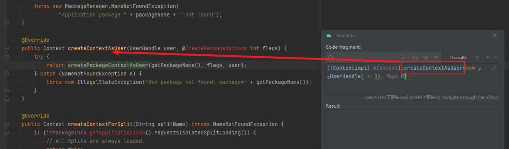
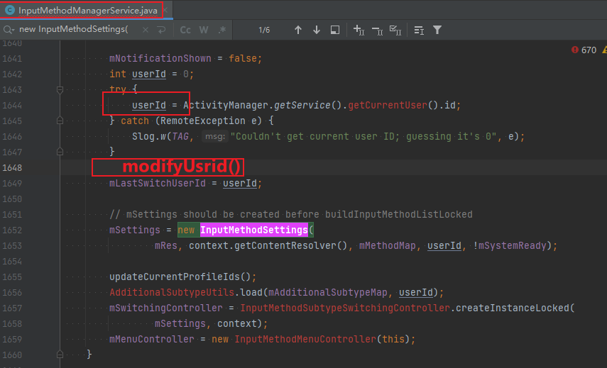

# 一些原则

## 0层：一点点思想

为什么会这样？因为代码的易错性造成的，一个符号都就会造成大问题

---------> 对于易错的东西，最好的办法，就是一点点


## 1层

### 代码一点点增加（然后验证）

极限：每次只增加一行，验证一行........

例子：

写反射的时候，很容易出错

### git commit一点点

每验证好一个小功能，前进一小步，commit一次，且分开

-<font color='red'>规定</font>：基于commit维度：

> 1、保存代码  
>
> 2、保存jar，保证commit级别可以回退
>
> 3、每笔commit，都要验证基本功能OK：
>
> ​    （1）**attach system_server进程，不会挂**   
>
> ​     （2）业务基本功能OK


目标：

> 每一笔commit，做到哪些功能要很清晰
>
> 要可<font color='red'>快速</font>回退


### 写代码第一步：一个干净的环境

一个可以断点的环境


### 能编译OK，极大程度意味着可以运行

为什么呢？**因为编译是协议**  ，协议即通顺，即运行


### 修改bug，尽量限制范围

```java
if (严格条件) {
  //修改
}
```

条件尽量严格，限制不影响其他场景


### 做好备份

最忌讳的是重复劳动，所以**代码备份** ,方式：

一小步一个commit、

**一大步提一个链接**


### 做好jar的备份

1、`每次刷完机，`做一下jar的备份

2、`每次一个比较完整功能的commit`，做一次jar的备份   ------->  可能需要回退


### 技巧：在debug断点中写代码

这是<font color='red'>极优</font>的，因为相当于，<font color='red'>在运行时写代码</font>

不是在代码态写代码，也不是编译态写代码，而是直接运行态

优点：

1、**立刻给出运行结果**-----> 验证代码的正确性

2、**省去了编译的时间**

3、此时 （1）虚浮窗可以跳转 AS代码  （2）AS代码如正常情况一样，可以跳转，back导航..........................

​     ----------------> 总之，**多了一个运行态窗口，其他不变**



4、见 《动态开关的利用》


<font color='red'>规定：</font>

> 只允许在运行态写代码


### 技巧：动态开关的利用

修改的代码，用动态开关

```java
static boolean isSwitchOn = false; 

if (isSwitchOn) {
    //新增代码
}
```

----------> 为啥要这样做？

如果新增代码，验证后是一个无用的代码 ----> 重启便可以恢复新增代码之前，<font color='red'>减少了再次编译的时间</font>


### 利用chatgpt写代码

让它写，它知道哪些接口可以使用，你不知道


# 代码技巧：

子类修改父类的属性值，`关于修改点：可以插到父类任意一行代码位置上！！！！`  <font color='green'>利用复写的截断流程思想</font>



<font color='red'>比如想要在1648行就修改userId：</font>

父类新增一个接口modifyUsrid(), 空实现；子类具体实现去修改

-----------> 好处：

> 1、父不会对子产生依赖  
>
> 2、实现任意点插入