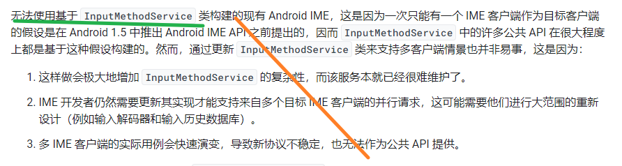

# 输入法

 见AndriodSystem_Others


google文档：

https://source.android.google.cn/devices/tech/display/multi_display/ime-support?authuser=0&hl=zh-cn 


输入法自己隐藏自己：需要向管理者请求（------->  **相当自然**，自己的死不是自己能决定的）

```java
IMS.requestHideSelf ----> IMMS.hideMySoftInput ----> IMS.hideSoftInput()
```

注意：IMS ----> IMMS不是通过sessioncallback（TODO）


## 普通输入法需要支持的功能------功能角度

也是验证角度


基础：

- 支持显示与隐藏功能：

  （1）输入对象侧控制输入法显示与隐藏IMM-->IMMS-->IMS。显示由框架层决定，隐藏由APP侧调框架层接口

  （2）输入法面板自己主动隐藏。IMS--->IMMS--->IMS

- 支持向输入对象提交/删除文本内容。commitText()

   操作：输入法可以向编辑框输入、删除

- 支持从输入对象获得光标信息 。

   操作：手指在编辑框中移动光标，再进行输入，输入文字位置符合预期，则证明输入法获得了正确的光标位置；光标选中一段文字，删除

- 支持提交功能按键事件给输入对象。比如：百度搜索框下，点击输入法ENTER键，自动搜索


高阶：

- 支持根据系统语言类型配置键盘模式（出口国外，必须？）

- 支持向输入对象提交/删除富文本内容

- 支持输入法根据编辑框类型，自动选择不同输入法面板。 比如：姓名框是中文拼音键盘面板；数字框是数字键盘面板；密码框是安全键盘面板，还有语音键盘面板，手写键盘面板等等

- 输入法的全屏模式

- 支持setting中增加输入法设置入口：输入设置、手写设置、隐私设置等等

- 支持硬件键盘输入

  


## 从systrace角度分析输入法

TODO:


# 多屏多会话输入法


## 目前现状：

Android 9 及以前：

> 系统中一次最多只有一个窗口具有焦点

Android 10~12：MultiClientInputMethodManagerService

> （见：https://source.android.google.cn/devices/tech/display/multi_display/ime-support?authuser=0&hl=zh-cn）

google解释了为什么无法通过现有的IMS，做到多会话：

> 


Android 13：

> MultiClientInputMethodManagerService被删除：https://android.googlesource.com/platform/frameworks/base/+/34091a5066f3


## 如何开启

1、框架要支持：

（1）多屏 焦点： ~~将 `config_perDisplayFocusEnabled` 设置为 `true`  （frameworks/base/core/res/res/values/config.xml）~~

（2）非默认屏幕显示输入法：

```java
WMS.setDispalyImePolicy(2, 0)
2---- displayId
0-----WindowManger.DISPLAY_IME_POLICY_LOCAL  //作用：输入法显示在本地，非默认屏
```

等价于？：

```java
DisplayWindowSettings#shouldShowImeLocked()
DisplayWindowSettings#setShouldShowImeLocked()
```

​        

2、应用侧

> 编译MultiClientInputMethod.apk ------> 多会话的安卓demo
>

~~见：https://source.android.google.cn/devices/tech/display/multi_display/ime-support?authuser=0&hl=zh-cn#non-default~~

```shell
//enable:
$ make -j MultiClientInputMethod
$ adb install -r $OUT/system/priv-app/MultiClientInputMethod/MultiClientInputMethod.apk
$ adb root
$ adb shell setprop persist.debug.multi_client_ime \
com.example.android.multiclientinputmethod/.MultiClientInputMethod   ----->  TODO:这行是做什么的？？？
$ adb reboot

//disable:
# Disable multi-client IME again
adb root
adb shell "setprop persist.debug.multi_client_ime ''"
adb reboot
```

核心功能实现：

MultiClientInputMethodManagerService


------------>   支持[每屏幕焦点](https://source.android.google.cn/devices/tech/display/multi_display/displays?authuser=0&hl=zh-cn#focus)是启用此功能的前提（自然，输入法是以窗口焦点为基础的）

​                           自然，~~需要将 config_perDisplayFocusEnabled 设置为 true~~

TODO: 理解焦点的机制（获焦、走焦）：<font color='red'>焦点的本质</font>是为了获取输入（无论键盘、输入法、手指、鼠标。。。。）


## 参考：

《**multi-client-ime.md**》

https://source.android.google.cn/devices/tech/display/multi_display/ime-support?authuser=0&hl=zh-cn#non-default


## 其他一些TODO

规则：键盘（硬件或软件）的输入只能进入最顶层的 activity（最近启动的应用） ---->否则隐藏


# 分布式输入法

 见AndriodSystem_Others

## 分布式输入法流程

 见AndriodSystem_Others


# 输入法的前提----焦点

焦点、焦点窗口、每屏焦点

## 单个display 

焦点 是window级别。在window之间切换

## 多个display  -------焦点窗口

### 单屏焦点

焦点 是display级别，先看是哪个mTopFocusedDisplayId  （关键词------------dump window）

​                                            哪个window？（关键词mCurrentFocus=------------dump window）


即   1、 set：   perDisplayFocusEnabled xml中配置false   

​        2、get： WindowManagerService#mPerDisplayFocusEnabled


dump中如何判定？点击左右屏幕


只有一个focusDisplay，只有一个mCurrentFocus window （ANR的除外，也focus了）


现象：

1、~~分别点击左右框，输入法会切换~~       --------> 自然， 因为焦点只有一个（只能是一个diaplay的一个window）


2、~~如果设置了在非默认屏弹输入法（setPolicy），则输入法会在两边切换~~   -------->自然， 因为焦点只有一个


### 多屏焦点

即   1、 set：   perDisplayFocusEnabled xml中配置false   

​        2、判定get： WindowManagerService#mPerDisplayFocusEnabled值


aosp有问题, 只能切换一次屏幕：


此时，topFocusDisplayId只有一个，但是focuswindow有两个,dump:


## 焦点0层


https://source.android.google.cn/docs/core/display/multi_display/displays?authuser=0&hl=zh-cn#focus


# 预研

## 引用分析

难点：IMMS的对外依赖
IMMS的依赖： ActivityManager              ----> 忽略
             ActivityManagerInternal      ----> 忽略
			 mIPackageManager  ----> 唯一，可以忽略
			 PackageManager  ----> 唯一，可以忽略
			 PackageManagerInternal  ----> 唯一，可以忽略
			 ResolveInfo   ----> 忽略
			 ServiceInfo   ----> 忽略
			 AudioManagerInternal mAudioManagerInternal  ----> 忽略
			 KeyguardManager mKeyguardManager   ----> 忽略
			 StatusBarManagerService mStatusBa  ----> 忽略 
			 
			 
			 

			 InputManagerInternal  ------>忽略
			 InputMethodService ------>忽略，都是引用常量
	
			 InputMethodSettings mSettings;  -----> 这个依赖比较深，设置方面的 +  userId
			 userId = ActivityManager.getService().getCurrentUser().id; -----》有疑问：如果是双开，那么IMMS获取的是啥？
			 updateCurrentProfileIds
			 UserManager mUserManager;   -----> 使用了UserId，需注意
			 UserManagerInternal mUserManagerInternal  ---->  使用了UserId，需注意

WindowManagerInternal mWindowManagerInternal;  ----> WMS真正的内部类，很多调用点！！！！！！

​                           ~~mWindowManagerInternal.getDisplayImePolicy(displayId);~~

​							~~mWindowManagerInternal.isUidAllowedOnDisplay(cs.selfReportedDisplayId, cs.uid)~~------> 不用管

​                ~~mWindowManagerInternal.removeWindowToken~~  ----> 不用管，windowToken来标志           

​				mWindowManagerInternal.getTopFocusedDisplayId()   -----> **这个接口很有问题**

-------------------》 IMMS.setImeWindowStatus需要修改： 1、该接口标注废弃了   2、topFocusedDisplayId 没有阻碍关键路径


IWindowManager mIWindowManager;  -----> 这个是wms，只有两处调用，似乎OK 
 mIWindowManager.addWindowToken(mCurToken, LayoutParams.TYPE_INPUT_METHOD,
                        mCurTokenDisplayId, null /* options */);
			 
			 
			 
transferTouchFocusToImeWindow   ---》 特殊场景，忽略
这个方法仅在需要手动控制焦点转移时使用，一般情况下Android系统会自动处理焦点的转移。此方法通常在特殊的UI交互场景或自定义的文本输入组件中使用。


//IMS这里需要改
mImm = (InputMethodManager)getSystemService(INPUT_METHOD_SERVICE);

mIWindowManager = IWindowManager.Stub.asInterface(
		ServiceManager.getService(Context.WINDOW_SERVICE));
		

### 引用分析之InputMethodManagerInternal

注意： LocalServices.addService(InputMethodManagerInternal.class,  -------> muti框架基本上都没有实现！影响是？？？  InputMethodManagerInternal还是有很多地方引用的
 我们自己新增的service2是不是也可以不实现？？？？

```java
//muti框架实现的，仅仅
userIdToInputMethodInfoMapper.getAsList(userId);
getEnabledInputMethodListAsUser
```


1、RecentsAnimationController最近任务（任务概览）动画的控制和协调。系统级的任务切换动画

​            inputMethodManagerInternal.hideCurrentInputMethod(

​            InputMethodManagerInternal.get().updateImeWindowStatus(   -------> 似乎有些影响

2、   Notifier.java

​         mInputMethodManagerInternal.setInteractive(interactive);

3、AutofillManagerServiceImpl.java ----> AutofillInlineSuggestionsRequestSession.java  内联？

​             onCreateInlineSuggestionsRequest

4、RemoteInlineSuggestionViewConnector.java   remote view相关，把输入事件传给输入法

​         onTransferTouchFocusToImeWindow()

5、~~PhoneWindowManager.java~~

SHORT_PRESS_POWER_CLOSE_IME_OR_GO_HOME：当用户在任何界面（包括应用程序、设置等）中短按电源按钮时, 隐藏输入法或者进入桌面   ------>  现在手机都没有这个现象

mInputMethodManagerInternal.hideCurrentInputMethod(

6、TranslationManagerServiceImpl.java   处理多语言翻译任务和提供相关

​      getEnabledInputMethodListAsUser(mUserId) : 获取输入法列表信息，最终在setting里获取的


---------> 总之，以上不是太重要，所以，multi框架忽略了

所以，新增的service2，不要注册InputMethodManagerInternal.class了！！！！，让主services去实现吧


### 引用分析之INPUT_METHOD_SERVICE

context.getSystemService(Context.INPUT_METHOD_SERVICE)
Activity ----> context


要修改这么多context？


---------> 最终统一追溯到SystemServiceRegistry.getSystemService ？？？


## 参考：multi

```
final boolean perDisplayFocusEnabled = mContext.getResources().getBoolean(
        com.android.internal.R.bool.config_perDisplayFocusEnabled);
```


## 修改


```java

public void onStart() {
      publishBinderService(Context.INPUT_METHOD_SERVICE, mService, false // "input_method2"
 }
```

​		----> 也可以参考multi的


# 一些琐碎的补充


## 关于setting信息的来源

如何知道用户设置的默认的输入法是哪一个？


### mSettings.getCurrentUserId()

<-----------userId = ActivityManager.getService().getCurrentUser().id; 

初始化InputMethodManagerService时，获取的是 

```java
可能存在多个用户同时登录系统的情况。在这种情况下，getCurrentUser()方法返回的是当前正在前台运行的用户的用户ID
```


修正：

```java
WindowManager wm = (WindowManager) getSystemService(Context.WINDOW_SERVICE);
Display[] displays = wm.getDisplays();
if (displays.length > 1) {
    Display secondDisplay = displays[1];
    int userId = secondDisplay.getFocusedWindow().getUserId();
    // ...
}
```


<font color='red'>疑问:</font> 按道理，之前imms2的 userId 是有问题的。

1、用了user0的输入法配置 ？似乎没有呀  ........难道后面复写掉了？

 2、IMMS校验userID，没有校验嘛？

### methodMap.put(imi.getId(), imi)来源 ------queryInputMethodServicesInternal

```java
final InputMethodInfo imi = new InputMethodInfo(context, ri,
       additionalSubtypeMap.get(imeId));
```

<----------------- 从所有包里找（**指定userId下**所有包）：找到有   SERVICE_INTERFACE 或 SERVICE_META_DATA标志的

```
SERVICE_INTERFACE：表示服务的Intent过滤器中包含的Action。在查询服务信息时，可以通过指定该常量值来获取具有指定Action的服务信息。例如，在查询所有输入法服务信息时，可以使用InputMethod.SERVICE_INTERFACE作为查询条件。
SERVICE_META_DATA：表示服务的元数据。在查询服务信息时，可以通过指定该常量值来获取具有指定元数据的服务信息。例如，在查询所有输入法服务信息时，可以使用PackageManager.GET_META_DATA作为查询条件，以获取输入法服务的元数据。
```


比如：下面输入法应用都有   

```java
3929e0d79086:~/workingSpace/aosp_android1000_r28$ grep "android.view.InputMethod"  -rl ./
/development/samples/SoftKeyboard/AndroidManifest.xml
./development/samples/browseable/CommitContentSampleIME/AndroidManifest.xml
./packages/apps/Car/tests/RotaryIME/AndroidManifest.xml
./packages/apps/Car/LatinIME/AndroidManifest.xml
./packages/inputmethods/LeanbackIME/AndroidManifest.xml
./packages/inputmethods/LatinIME/java/AndroidManifest.xml
```


###  指定的输入法是怎么从设置来的？

```java
//startInputUncheckedLocked

InputMethodInfo info = mMethodMap.get(mCurMethodId);//关键mCurMethodId
mCurIntent = new Intent(InputMethod.SERVICE_INTERFACE);
```

《------------setInputMethodLocked 唯一赋值点

​         《------------updateInputMethodsFromSettingsLocked

​                             

```
String id = mSettings.getSelectedInputMethod();
```


```
//另外两个
setInputMethodWithSubtypeIdLocked
switchToInputMethod
```

​                 《-----DEFAULT_INPUT_METHOD = "default_input_method"

​                               《-------   Settings.getStringForUser