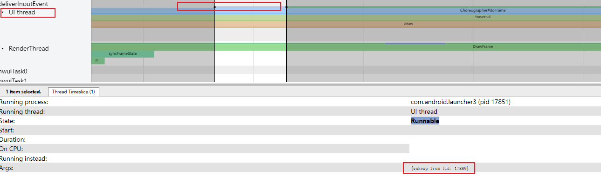
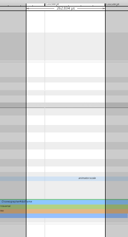

# Android系统性能调优工具介绍

TraceView、Systrace、Oprofile

# TraceView---可以看调用栈

## TraceView应用场景


## TraceView工具的使用


https://www.jianshu.com/p/a14bfdc4109a?utm_campaign=maleskine&utm_content=note&utm_medium=seo_notes&utm_source=recommendation

形成一个图表，从中可以分析出每个方法的执行时间


### 工具原理


# Systrace


## Systrace场景

## Systrace工具的使用

### 代码中触发

```
Trace.beginsection ("onConfigurationChanged"); // systemTrace, 性能
...................
Trace.endSection();


Trace.asyncTraceBegin
...................
Trace.asyncTraceEnd
```


### 命令行

python systrace.py [options] [categories]

目录: 

```java
‪E:\softWare\softWare\systrace\platform-tools_r33.0.0-windows\platform-tools\systrace\systrace.py
```


#### [options]


####  [categories]  哪些模块


```java
	        
my例子：
python systrace.py -o mynewtrace.html  \
-a com.example.aospsourcecode2 com.android.launcher3    \
sched freq idle  am  wm sm input view
```


### 键盘快捷键

https://www.jianshu.com/p/a14bfdc4109a?utm_campaign=maleskine&utm_content=note&utm_medium=seo_notes&utm_source=recommendation


### 使用命令行捕获Systreace报告文件


### 阅读报告

方法一：~~使用 chrome://tracing/~~ 

方法二：~~直接点html，这样有进程名~~，更优


方法三：优选

> https://ui.perfetto.dev/


#### **状态不同的线程**：

参考： https://www.androidperformance.com/2019/07/23/Android-Systrace-Pre/#/%E6%AD%A3%E6%96%87

> ~~绿色 --> 运行中 Running~~
>
> 对于在CPU上执行的进程，需要查看其运行时间、是否跑在该跑的核上、频率是否够等。
>
> 蓝色 --> 可运行 Runnable
>
> 对于在等待序列中的进程，需要查看是否有过多任务在等待、等待时间是否过长等。
>
> 白色 --> 休眠中 Sleeping
>
> 这里一般是在等事件驱动。
>
> 橘色 --> 不可中断的睡眠态_IO_Block Uninterruptible Sleep | WakeKill - Block I/O
>
> 线程在I / O上被阻塞或等待磁盘操作完成。
>
> 紫色 --> 不可中断的睡眠态 Uninterruptible Sleep
>
> 线程在另一个内核操作（通常是内存管理）上被阻塞。

-<font color='red'>上述自然</font>，生活化模型：颜色- 红绿灯颜色


注,也可以点击线程位置,看


#### 线程唤醒者分析

注意:  看似函数一直在走,但是线程已经 sleep了.  说明函数运行 sleep了.


细长条代表线程运行。白色表示sleep**了**


**线程唤醒者:** 
图中:  前蓝后绿部分,很短暂 




**如何找哪个线程唤醒该线程的？**操作：
标尺固定时间段,  找到cpu对应这个宽度的task：必然是四个当中一个

通过看tid 17889确定  --->  是launcher的render线程做的

即结论：render线程唤醒了ui线程


#### 如何找唤醒过程对应的代码级呢？ 


### 看报告操作


### 技巧：

1. 通过在时间间隔周围绘制一个矩形来选择所需的时间间隔。

2. 使用标尺工具标记或突出显示问题区域。

3. 依次点击 View Options > Highlight VSync，以显示每项显示屏刷新操作------->  标出一帧

   

4. 筛选Processes
   


5、加了界限后，立马切换其他模式  ---->  这样界线可以长久保存



## Systrace的原理

参考：

https://blog.csdn.net/feelabclihu/article/details/106247862  好文


简易的流程图：


**具体实现：**


Systrace抓取的trace数据，总体上可以分为两类：
一类是Java和Native在用户层发生的函数调用，一类是内核态的事件信息。


### 开源代码

systrace的生母，谷歌开源项目https://chromium.googlesource.com/catapult。


## 遇到的坑：

1、platform-tools下找不到systrace文件夹  https://www.jianshu.com/p/626eaebaa6a8

## 实战

TODO:  其他章节用systrace来分析

## 参考：

https://www.androidperformance.com/2019/05/28/Android-Systrace-About/#/%E7%B3%BB%E5%88%97%E6%96%87%E7%AB%A0%E7%9B%AE%E5%BD%95       


https://www.jianshu.com/p/a14bfdc4109a?utm_campaign=maleskine&utm_content=note&utm_medium=seo_notes&utm_source=recommendation  


https://blog.csdn.net/qq_23452385/article/details/131567881  Perfetto 命令行工具（Android 10 及更高版本）_android perfetto_xhBruce的博客-CSDN博客


# Oprofile


#  Layout Inspector

最优观察viewTree的工具

-<font color='red'>优点：</font>

（1）图形化 ，更深刻  

（2）图形与 文字相结合，并且可以点击互动 -----> **操作方便**，**对应关系非常明确**

（3）实际上，显示的数据 比xml显示的更加完整。比如这里，显示了  “微博热搜”的小程序按钮。。。。xml没有体现


（4）可以在左边搜索。。。。当页面 view过多时，可以精确区分（图形区域不容易区分）

（5）同dump一样，可以知道 TextView 具体的类


# winscope(快照)---闪屏问题

**winscope本质：**

> -<font color='red'>每一帧</font>，**都给整个系统拍快照**  ----> 这也是理解复杂系统的关键

--------------->  <font color='red'>基于帧，</font>1、所以，才可以解决闪屏问题

​                                     2、TODO: 肯定可以解决其他很多问题


方法一：

> winscope.html + winscope_proxy.py  ----> 直接获取（封装的adb命令）

方法二：直接使用adb命令，见下，官方文档


TODO:

问题的关键在于，如何看？

> 1、每个Task有个Z值，是层级


## 参考：

https://source.android.com/docs/core/graphics/tracing-win-transitions?hl=zh-cn    官方文档

https://www.jianshu.com/p/c28a81dc3a65


## 官方文档

https://developer.android.com/studio/debug/layout-inspector


# 一些环境使用原则：

使用linux下as调试或trace，就不能用win下As

ADB之间影响

# 参考


https://blog.csdn.net/innost/article/details/9008691


https://blog.csdn.net/u011578734/article/details/109497064


# 补充，脚本

```java
adb shell perfetto -o /data/misc/perfetto-traces/trace_file.perfetto-trace -t 20s sched freq idle am wm gfx view binder_driver hal dalvik camera input res memory
网站: https://ui.perfetto.dev/#!/
```


做系统稳定性问题分析，当遇到系统卡死时，我们经常要使用“kill -3 pid”来打印System_Server进程各个线程的Java调用栈，根据线程状态及调用栈来更进一步定位问题点，当然某个应该界面卡顿时间长时也可以通过这个命令来抓取Java调用栈进行分析。
注意native进程是不能用kill -3来打trace的，而是使用debuggerd.

https://droid10.com/Android/Android%E5%9F%BA%E7%A1%80%E6%93%8D%E4%BD%9C/


