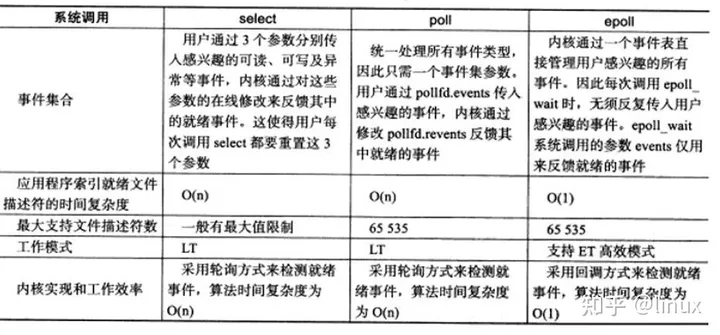

# 目录

[TOC]

recv、select和epoll都是阻塞方法。阻塞方法，不占CPU！！！

# 多个客户端对一个服务端-------多线程实现方式（cpp）

实现方式：  为每个客户端安排一个线程

> ~~通过在服务器端建立两个线程，主线程用来监听客户端的接入，当有新的客户端接入时，服务器为新的客户端建立服务线程，通过服务线程来实现服务器与客户端的通信~~

https://blog.csdn.net/m0_67391521/article/details/124164855?utm_medium=distribute.pc_relevant.none-task-blog-2~default~baidujs_baidulandingword~default-0-124164855-blog-129757444.235^v38^pc_relevant_anti_t3&spm=1001.2101.3001.4242.1&utm_relevant_index=3        C++SOCKET多线程网络编程实现多个客户端与服务器通信

# 多个客户端对一个服务端------epoll实现方式

https://blog.csdn.net/youaremyalllove/article/details/128508470      从socket开始讲解网络模式（epoll）

------------->  **好文:**  代码       +    图片

# TODO: 更底层----socket阻塞的唤醒

https://zhuanlan.zhihu.com/p/366365883   linux网络编程之带你了解epoll的本质（内部实现原理）

--------------------> TODO： 好文！！！！解释了为啥epoll如此高效：

