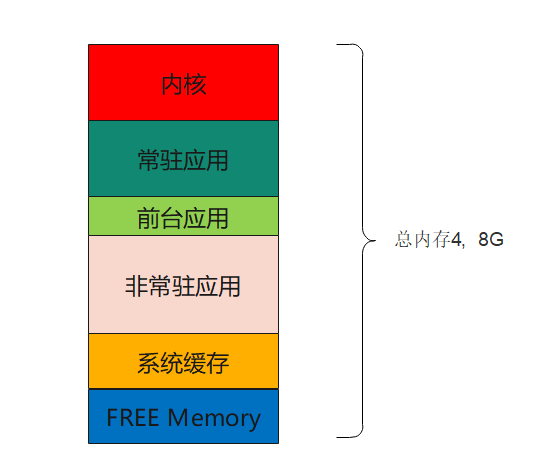
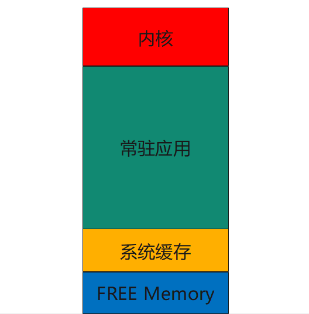

# 目录

[TOC]


# 应用角度：应用的内存分配原理与优化

## 维测：dumpsys meminfo [PID]/进程名

```java
 P13_5G:/ # dumpsys meminfo com.android.settings
 Applications Memory Usage (in Kilobytes):
 Uptime: 1051158931 Realtime: 1051158931
 
 ** MEMINFO in pid 23721 [com.android.settings] **
                    Pss  Private  Private  SwapPss      Rss     Heap     Heap     Heap
                  Total    Dirty    Clean    Dirty    Total     Size    Alloc     Free
                 ------   ------   ------   ------   ------   ------   ------   ------
   Native Heap     9349     9328        0     8470     9648    33840    17957     6181
   Dalvik Heap     5896     5864        0      276     6144     9741     4871     4870
  Dalvik Other     2091     1428        0       50     3056
         Stack      548      548        0      320      552
        Ashmem        8        0        0        0       28
     Other dev       32        0       20        0     1016
      .so mmap     6612      248       52        0    51320
     .jar mmap     1524        0        0        0    31236
     .apk mmap     8612        0     5872        0    30792
     .ttf mmap       70        0        4        0      428
     .dex mmap      206       12      188        0      356
     .oat mmap     1388        0       80        0    13284
     .art mmap     2065     1324        4      572     9552
    Other mmap     1323       28       48        0     8080
    EGL mtrack     3780     3780        0        0     3780
     GL mtrack     5560     5560        0        0     5560
       Unknown      299      296        0      337      360
         TOTAL    59388    28416     6268    10025    59388    43581    22828    11051
 
  App Summary
                        Pss(KB)                        Rss(KB)
                         ------                         ------
            Java Heap:     7192                          15696
          Native Heap:     9328                           9648
                 Code:     6460                         128744
                Stack:      548                            552
             Graphics:     9340                           9340
        Private Other:     1816
               System:    24704
              Unknown:                                   11212
 
            TOTAL PSS:    59388            TOTAL RSS:   175192       TOTAL SWAP PSS:    10025
 
  Objects
                Views:      288         ViewRootImpl:        1
          AppContexts:       12           Activities:        4
               Assets:        7        AssetManagers:        0
        Local Binders:       63        Proxy Binders:       68
        Parcel memory:      345         Parcel count:       76
     Death Recipients:       10      OpenSSL Sockets:        0
             WebViews:        0
 
  SQL
          MEMORY_USED:        0
   PAGECACHE_OVERFLOW:        0          MALLOC_SIZE:        0
```

**关注点：**

> ​    Pss 与 Swap

在ART/Dalvik 虚拟机接口：

> ```java
>  / Returns the maximum amount of memory that the Java virtual machine will attempt to use
>  long maxMemory = Runtime.qetRuntime ().maxMemory();
>  // Returns the total amount of memory in the Java virtual machine
>  long totalMemory = Runtime.getRuntime().totalMemory();
>   Returns the amount of free memory in the Java virtual machine
>  long freeMemory = Runtime.getRuntime().freeMemory();
> ```

----------------> 只是Dalvik Heap，没有太多意义。

不能反映一个应用用的真正内存

## 基础知识：

物理内存最小分配单位：1 个页 (page)，大小通常是 4KB

### 进程的内存占用分为两类：

> Anonymous Memory：例如 Java heap, native heap，从系统分配内存来填充数据
>
> File-backed memory：在磁盘上有对应的文件，以 mmap() 映射， 占用的内存为对文件最近存取的缓存

补充：

> 在磁盘上有对应的文件： （1）C语言的fopen、java的IO   (2) 以 mmap() 映射: 安卓大量使用，比如jar、dex等
>
> mmap方式，优点：见下

### Overcommit机制：

> 当申请内存时， Linux 并非马上就分配内存， 而是延迟到实际存取时，才真正分配内存
>
> ----> 例子：申请400k时：
>
> （1）到实际用的时候，才真正分配
>
> （2）也不是一次性分配400看，而是4kB分配
>
> 优点：
>
> > 代码分配内存后，有些可能分支没走到，没利用到 --------> Overcommit就会更经济
>
> 缺点：
>
> > 代码里使用内存  与  实际内存分配可能不一样，造成分析困难
>
> Q&A：
>
> > 来得及不？应该来的急，分配的效率是o（1）

### 低内存下的系统回收机制（安卓机制）

机制：

> 1、砍进程：退出后台的先后时间
>
> 2、对 File-backed memory 进行释放，因为磁盘中有备份 ------>  先释放，到时候按需加载
>
> 3、将 Anonymous memory swap 出去  ： swap到磁盘上（但是磁盘的速度远低于ddr----->安卓没有使用 ）
>
> 安卓对这些内存压缩。用到时候再解压

常见的 file-backed memory

> APK 文件：映射目录结果与 resources.arsc
>
> 注： apk大部分文件压缩了，resources.arsc文件没有压缩   ----> 补充截图
>
> DEX 文件：DEX 优化后、可由虚拟机执行的代码
>
> so 文件：动态链接
>
> ttf 文件：字体

问题：图片一般使用 file-backed memory 方式分配内存吗？

mmap 映射方式：

> 先开启一个文件得到 fd，再利用 mmap() 将其映射到内存，代码中借由操作指针的方式存取缓存在内存的文件内容
>
> 优点：可以使用指针任意移动读取位置，代码好写。由操作系统处理文件的读取、缓存，以及在低内存、或少用时放掉。还能轻易实现跨进程
>
> 对只读文件的加载共享

# 系统角度：常驻应用与后台服务

常驻应用：

> 因为功能实现需要，必须**长期、或是永久**驻留在后台的应用，可能处于不断运行、也可能处于按需运行

安卓实现后台持续运行的方法：

1. 在 AndroidManifest.xml 设 persistent=true -----> **默认做法**
2. 以 native 进程运行 -----> 安卓对native进程默认不杀。 TODO: 机制是啥？JVM检测不到？
3. 以 start service 运行，不停止
4. 以 start service + startForeground 运行，不停止 -----> startForeground 前台service
5. 间接因素：以 bind service、provider 绑定其他进程不放

自然，~~常驻进程越多，可用内存越少~~

## 安卓系统内存分布



~~图见：《Mem.eddx》~~

各个内存的**作用：**

>  TODO： **以pixel为例，各个大概多大？**
>
> Free Memory：没有被使用的 ----->  用来分配内存的
>
> 系统缓存： 加载的一些系统的so库

**分配内存，规则：**

> 1、分配内存时，**优先**从Free Memory内拿
>
> 2、Free Memory不够时，<font color='red'>需要扩充Free Memory：</font>
>
> （1） 非常驻应用 ----> 被杀应用，这个效果最好
>
> ​                       但 至少**保留刚退到后台**的应用
>
> （2）  释放系统缓存： **不能大量**，否则会造成性能下降（用到的一些so库，不在内存里）

问题： 

> 如果在分配内存的时候，才发现 Free Memory不够，**才去 杀应用释放内存，来不及**  ------>  性能不好
>
> <font color='red'>办法：</font>保证一定的Free Memory， lmk机制


Free Mem 与 非常驻应用 之间有个**平衡**：

> Q: Free Memory越多越好嘛？
>
> A: 会造成系统缓存小 ------> 性能下降
>
> 非常驻应用 刚刚退到后台，就被杀  ----->
>
> Q: 系统缓存越多越好嘛（比如把/system分区所有so库，锁在系统缓存中）？
>
> A:  很多so，平时不会被用到 -----> 对mem的浪费

---------------> 例子：在Free mem充足的情况下，也能保证 非常驻应用有四五个


例子： **总内存查看：**

```java
sailfish:/ #  cat /proc/meminfo
MemTotal:        3855820 kB   // ---------> pixel 手机内存3.67G. 与网上说的4G内存符合
MemFree:         1801968 kB
MemAvailable:    2683916 kB
Buffers:           38320 kB
Cached:           986340 kB
SwapCached:            0 kB
Active:           594956 kB
Inactive:         798328 kB
Active(anon):     465368 kB
Inactive(anon):     2784 kB
Active(file):     129588 kB
Inactive(file):   795544 kB
Unevictable:       96232 kB
Mlocked:           96232 kB
SwapTotal:        524284 kB
SwapFree:         524284 kB
Dirty:               248 kB
Writeback:             0 kB
AnonPages:        464880 kB
Mapped:           335976 kB
Shmem:              3296 kB
Slab:             149716 kB
SReclaimable:      48524 kB
SUnreclaim:       101192 kB
KernelStack:       25808 kB
PageTables:        31964 kB
NFS_Unstable:          0 kB
Bounce:                0 kB
WritebackTmp:          0 kB
CommitLimit:     2452192 kB
Committed_AS:   41658032 kB
VmallocTotal:   258998208 kB
VmallocUsed:      211792 kB
VmallocChunk:   258688724 kB
sailfish:/ #
```

## TODO：维测 上图6种内存查看

## ~~del: 特殊情况：一种特殊的系统设计~~

**设计理念：**

> **把系统所有应用都设计成常驻**



采用的**前提**是：

> 封闭生态，无法安装其他应用  ---->  （软件角度：后期不会增加内存）
>
> 1. 系统应用占用的内存可控 ------> （ 硬件角度： 硬件有余量）

例子：**扶手屏项目**

## 非常驻应用 与 free Memory的博弈---LMK


**博弈：**

> 1、**非常驻应用不能过少**，否则很容易 冷启动
>
> 2、**Free Memory 不能过小**，否则：应用<font color='red'>每次申请新内存</font>，<font color='red'>就需要触发系统机制</font>腾出 free memory， 速度慢


冷启动应用的耗时：加载资源等

安卓的**<font color='red'>设计理念</font>**是：

> 安卓刻意保留最近启动过的进程在后台，避免冷启动，使得下次启动时更快 （在Free Memory足够的情况下）
>
> TODO:  为啥安卓的冷启动，不咋滴？

LMK (Low Memory Killer) ----------满足上面设计理念

> 前提： 保障系统始终有足够多的 free memory
>
> 算法：以进程重要性 (称为 OOM ADJ, Out of Memory Adjustment ) 与内存大小，决定砍的顺

安卓系统没有**墓碑机制**，必须有自己的后台应用进程生命周期的管理------>  **lmk机制**

多任务能力 (Multi-Tasking Capability) -----------即保持后台应用个数的能力，即热启动的能力

> 评测开放生态系统的多任务能力：能驻留多少后装的第三方应用在后台，快速切换
>
> 多任务能力的保持，是安卓系统性能体验重要的一环，因此 LMK 的设计，既要保障有足够多的 free memory，又必须保障**最近使用过**的几个应用能保持在后台

### ~~del: 临时扩展：墓碑（Tombstone）机制~~


使用的系统范围：

> 微软WP7、ios；

-<font color='red'>设计理念：</font>

> ~~微软不允许任何 第三方应用程序]在WP7的后台运行，特定时间内只有一个应用程序的在前台运行，如果你的应用程序没有在前台显示，就表示这些程序并没有运行，这样就不耗费运行内存和处理器资源~~   ---------->  **简言之：** 杀死所有后台应用

墓碑含义：

> 墓碑：应用程序已经**死了**，但是墓碑上记录有**临终前的所有状态**（后面，**新启动新进程**，根据记录，恢复状态）

例子：

> WP7手机： 当用户正在使用一个应用程序，比如游戏或者新闻阅读，这时有电话打进来，来电提示和通话页面将会在前台显示，正在运行的游戏就会消失，WP7不允许后台运行应用，这时候墓碑机制就会触发，游戏的运行状态包括画面、进度等等数据会冻结保存   ----->  杀死后台游戏  ----->  等电话结束，启动游戏   -------->  恢复状态

从任务管理角度：

> 墓碑机制理念：单任务（第三方程序单任务）
>
> ------> 自然，~~多任务的都没有墓碑机制：mac、win、linux、Android~~

从内存角度看：

> ios墓碑机制 与 安卓 lmk机制，是对等的。都是 释放 后台应用内存的机制

比较：

> 墓碑机制，与 Android 状态保存机制，似乎异曲同工    ------>  备忘录模式

从后台应用的生命周期来看：

> 是一种后台应用生命周期管理机制

疑问：

> 墓碑机制，要启动进程（这个会慢嘛？），需要加载资源嘛（保存了数据就不需要了嘛？）
>
> ------------> ios为啥冷启动这么快？

参考：

> https://baike.baidu.com/item/墓碑机制/7558924?fr=ge_ala         墓碑机制

### ~~del: 临时扩展：Q: 内存清理 (一键加速) 能提升性能嘛~~

A:  <font color='red'> 好的系统设计下，不能</font> (反而冷启动，降低启动时间)

**例外：**一些差系统，是可以的

差系统：

> LMK 保留的 free memory 过少，导致需要频繁搜寻可用内存   ------> 系统设计问题
>
> 后台的非常驻应用持续运行，抢占 CPU 等系统资源   ------->  应用+系统问题（系统应该做限制）

------------------->  一键加速，优化的是这两点（**而这两点，系统设计可以解决掉**）

为啥 性能提升**有限**？

> 第三方应用做一键加速，只能 kill，无法 force stop。 以 service 运行的应用，kill 后仍会重启   ----->TODO:  kill 与 force stop区别

一键加速  缺点：

> 冷启动


### OOM SCORE ADJ：LMK 参考的进程重要性

| OOM_SCORE_ADJ | 分类意义    | 通过何种方式达到                                             |
| ------------- | ----------- | ------------------------------------------------------------ |
| -1000         | Native      |                                                              |
| -700 ~ -800   | Persistent  | 在 AndroidManifest.xml 设 persistent=true                    |
| 0             | Foreground  | 目前在前台运行的应用，或者正在运行 onReceive()、Service.onCreate()、onStartCommand() |
| 100           | Visible     | 被常驻应用 bind 住的 service/provider（自然，提升优先级），或者虽非前台、但能看到界面的应用 |
| 200           | Perceptible | startService() 且调用 startForeground()                      |
| 500           | A Service   | startService()                                               |
| 600           | Home        | 桌面在后台时                                                 |
| 700           | Previous    | 前一个退到后台的应用                                         |
| 800           | B Services  | startService() 且运行时间较长                                |
| >900          | Cached      | 单纯只有 activity 、已经执行完 receiver、service、provider   |

1. ADJ < 0 的， LMK 不砍 <-----------> 等价于：Native进程不管

   ​                       注： 极端情况下，ADJ= 0，也会被砍

2. ADJ 根据进程的状态决定， 不参考线程的状态


OOM_SCORE_ADJ 值<font color='red'>影响因素：</font>

> 上面所有、有没有activity、有没有service

visible理解：

> 1、前台应用
>
> 2、虽非前台、但能看到界面的应用   ----> 自然也是可见的

Perceptible 可感知：

> ~~虽然不可见，但是可以感知到~~： 比如播放音乐、录音

下载属于Perceptible嘛？ ------->  TODO:

B services  安卓发展，设计的补坑： --------> TODO: 如何知道历史原因呢？

> 随着版本演进，发现开发者启动的service越来越多 ------> 针对于时间较长的，做进一步区分

**安卓把配置留给了开发者，让开发者给应用分类到上面那个类别里**

### ~~del: 次要： Activity Manager 指派 OOM_SCORE_ADJ 的特殊规则~~

规则：

1、若应用分成不同进程运行，则每个进程根据运行的状态，指派对应的 ADJ

2、提升规则：

> A 应用透过 bind service, provider 方式绑定 B 应用的期间， B 的 ADJ 提升到与 A 相同

3、处罚规则：

> ~~非 foreground service 运行过久，ADJ 改为 cached~~  ---------> **简言之：**A service过久，改为B service；B service过久，改为 cached
>
> 具有 service/provider 的应用运行 activity，ADJ 改为cached

### Q: 系统何时因为内存压力高而卡顿?

| OOM_SCORE_ADJ | 分类意义    |
| ------------- | ----------- |
| -1000         | Native      |
| -700 ~ -800   | Persistent  |
| 0             | Foreground  |
| 100           | Visible     |
| 200           | Perceptible |
| 500           | A Service   |
| 600           | Home        |
| 700           | Previous    |
| 800           | B Services  |
| >900          | Cached      |

1、**<font color='red'>经验</font>：**Cached 应用将被清完时，系统即出现明显的性能下降

​    -------> 原因：

> Cached 应用将被清完时，清Services。因为service 被kill后，又会重启，**重启会抢占CPU资源**（**卡顿----CPU资源**）

2、何时？ <font color='red'>services被大量kill的时候</font>

### 维测：各个进程的OOM adjustment

dumpsys meminfo

```
 Total RSS by OOM adjustment:
   1,861,186K: Native
         164,280K: zygote64 (pid 558)
         144,104K: zygote (pid 565)
         127,234K: surfaceflinger (pid 637)
         113,436K: app_process (pid 19438)
         109,624K: camerahalserver (pid 817)
         101,520K: media.codec (pid 813)
          95,348K: app_process (pid 19459)
          88,416K: logd (pid 323)
          73,848K: mtkfastavm (pid 301)
          40,486K: android.hardware.graphics.composer@2.1-service (pid 598)
          37,896K: webview_zygote (pid 1384)
          27,388K: em_svr (pid 720)
          25,548K: media.extractor (pid 777)
          23,008K: pcmanfm (pid 23480)
          22,792K: vtservice (pid 771)
          22,616K: mediaserver (pid 787)
          21,252K: lxpanel (pid 23477)
          21,012K: android.hardware.automotive.evs@1.0-service (pid 812)
          20,996K: audioserver (pid 630)
          19,448K: cameraserver (pid 751)
          18,380K: smartplatformserver (pid 800)
          15,326K: init (pid 1)
          15,296K: wpa_supplicant (pid 25964)
          12,948K: media.swcodec (pid 834)
          12,688K: openbox (pid 23474)
          12,560K: vpud (pid 833)
          11,204K: vendor.mediatek.hardware.pq@2.2-service (pid 829)
           9,736K: android.hardware.audio.service.mediatek (pid 567)
           9,520K: netd (pid 483)
           8,956K: lxsession (pid 23461)
           8,828K: android.hardware.neuralnetworks@1.3-service-mtk-neuron (pid 742)
           8,776K: android.hardware.graphics.allocator@4.0-service-mediatek (pid 591)
           8,720K: vendor.mediatek.hardware.mtkpower@1.0-service (pid 615)
           8,432K: vendor.mediatek.hardware.gpu@1.0-service (pid 612)
           8,392K: vendor.mediatek.hardware.sfs@1.0-service (pid 341)
           8,308K: adbd (pid 3336)
           8,100K: android.hardware.wifi@1.0-service-lazy (pid 1159)
           8,040K: android.hardware.gnss@2.1-service-mediatek (pid 575)
           7,864K: Xtightvnc (pid 23446)
           7,644K: keystore (pid 776)
           7,364K: wificond (pid 810)
           7,304K: update_engine (pid 849)
           7,212K: ueventd (pid 306)
           7,136K: carwatchdogd (pid 319)
           7,112K: networkmanager (pid 15624)
           7,020K: media.metrics (pid 779)
           6,868K: vold (pid 353)
           6,712K: gpuservice (pid 634)
           6,488K: credstore (pid 633)
           6,484K: gatekeeperd (pid 845)
           6,460K: init (pid 304)
           6,424K: gbe (pid 709)
           6,420K: android.hardware.automotive.vehicle@2.0-service (pid 569)
           6,328K: drmserver (pid 753)
           6,228K: mtkfastcalib (pid 827)
           6,144K: android.hardware.drm@1.3-service.clearkey (pid 572)
           5,904K: hwservicemanager (pid 334)
           5,900K: storaged (pid 805)
           5,896K: android.hardware.vibrator-service.mediatek (pid 622)
           5,628K: android.hardware.sensors@2.0-service-mediatek (pid 814)
           5,548K: android.hardware.lights-service.mediatek (pid 609)
           5,428K: getgameserver (pid 822)
           5,364K: installd (pid 775)
           5,212K: android.hardware.keymaster@4.0-service (pid 408)
           5,068K: android.hardware.gatekeeper@1.0-service (pid 574)
           4,992K: lbs_hidl_service (pid 608)
           4,984K: vendor.mediatek.hardware.nvram@1.1-service (pid 616)
           4,956K: vendor.mediatek.hardware.vpu@1.0-service (pid 618)
           4,952K: android.hardware.bluetooth@1.0-service-mediatek (pid 570)
           4,732K: servicemanager (pid 332)
           4,668K: incidentd (pid 755)
           4,648K: android.hardware.thermal@2.0-service.mtk (pid 603)
           4,640K: android.system.suspend@1.0-service (pid 407)
           4,608K: android.hardware.health@2.1-service (pid 599)
           4,572K: android.hardware.memtrack@1.0-service (pid 600)
           4,544K: statsd (pid 479)
           4,464K: android.hardware.drm@1.3-service.widevine (pid 573)
           4,456K: netdagent (pid 857)
           4,448K: aee_aed64 (pid 399)
           4,424K: dumpsys (pid 8743)
           4,400K: android.hardware.usb@1.1-service-mediatek (pid 606)
           4,344K: android.hardware.boot@1.1-service (pid 359)
           4,252K: com.android.car.procfsinspector (pid 1704)
           4,220K: android.hardware.automotive.audiocontrol@1.0-service (pid 568)
           4,212K: lbs_dbg (pid 743)
           4,172K: vndservicemanager (pid 335)
           4,120K: mlclient_test (pid 348)
           4,108K: batterywarning (pid 1985)
           4,096K: aee_aedv64 (pid 451)
           4,064K: android.hardware.cas@1.2-service (pid 571)
           3,940K: sh (pid 19436)
           3,900K: logcat (pid 27704)
           3,768K: android.hidl.allocator@1.0-service (pid 566)
           3,732K: sh (pid 13765)
           3,708K: timesync (pid 828)
           3,600K: aee_aed (pid 398)
           3,596K: netdiag (pid 792)
           3,556K: aee_aedv (pid 450)
           3,452K: thermal (pid 824)
           3,372K: wlan_assistant (pid 466)
           3,348K: traced (pid 732)
           3,288K: ip6tables-restore (pid 485)
           3,256K: thermald (pid 756)
           3,192K: iptables-restore (pid 484)
           3,180K: menu-cached (pid 23510)
           3,112K: sshd -p 22 [listener] 0 of 10-100 startups (pid 23426)
           3,084K: mobile_log_d (pid 791)
           3,064K: lmkd (pid 326)
           2,988K: traced_probes (pid 723)
           2,772K: thermalloadalgod (pid 826)
           2,744K: tombstoned (pid 460)
           2,684K: fuelgauged (pid 641)
           2,636K: sh (pid 336)
           2,244K: connsyslogger (pid 752)
           2,068K: dbus-daemon (pid 23388)
           1,204K: ssh-agent (pid 23487)
     667,164K: System
         667,164K: system (pid 726)
   1,376,891K: Persistent
         268,079K: com.android.systemui (pid 1189)
         148,336K: com.txznet.txz (pid 2151)
         124,156K: com.android.phone (pid 1493)
         115,260K: com.android.networkstack.process (pid 1323)
         110,260K: com.android.car (pid 1273)
         109,284K: com.android.car.systemupdater (pid 2095)
         101,992K: com.mediatek.entitlement.o2 (pid 1448)
          85,896K: com.mediatek.tbox.dataconnection (pid 3459)
          84,892K: com.mediatek.smartratswitch (pid 1352)
          84,772K: com.pvetec.ctrlcenter (pid 2179)
          74,136K: com.pvetec.carcorder (pid 2082)
          69,828K: com.android.se (pid 1417)
     310,160K: Persistent Service
         110,992K: com.txznet.txz:svr1 (pid 2539)
         110,712K: com.android.bluetooth (pid 1168)
          88,456K: com.txznet.adapter (pid 2435)
     176,876K: Foreground
         176,876K: com.android.settings (pid 23721 / activities)  // ------> 只有settings在前台
     873,773K: Visible
         214,865K: com.pvetec.launcher1 (pid 2254 / activities)
         170,272K: cn.kuwo.kwmusiccar (pid 31863 / activities)
         140,816K: android.ext.services (pid 1942)
         102,868K: cn.kuwo.kwmusiccar:remote (pid 31927)
         100,156K: com.pvetec.carcorderservice (pid 2384)
          75,884K: com.android.settings.intelligence (pid 23756)
          68,912K: com.android.experimentalcar (pid 1705)
     972,156K: Perceptible
         308,052K: com.autonavi.amapauto (pid 3569)
         184,876K: com.iflytek.inputmethod (pid 2045)
         146,792K: com.iflytek.inputmethod.assist (pid 2356)
         121,860K: com.autonavi.amapauto:locationservice (pid 3852)
         109,276K: com.autonavi.amapauto:push (pid 4016)
         101,300K: com.autonavi.amapauto:socol (pid 7468)
     153,692K: Home
         153,692K: com.pvetec.launcher (pid 2290 / activities)
     242,564K: B Services
          98,272K: cn.kuwo.kwmusiccar:pushService (pid 11569)
          73,820K: com.pvetec.carcorder:gdremote (pid 2330)
          70,472K: com.pvetec.presentation (pid 3143)
   1,066,632K: Cached
         145,812K: com.sonelli.juicessh (pid 32018)
         138,064K: com.mediatek.camera (pid 5029)
         134,564K: ru.meefik.linuxdeploy (pid 23046 / activities)
         127,660K: com.example.myapplication (pid 23379)
         119,132K: android.process.media (pid 2217)
          93,724K: com.android.permissioncontroller (pid 29140)
          83,244K: com.android.providers.calendar (pid 3496)
          77,820K: com.google.android.car.defaultstoragemonitoringcompanionapp (pid 11251)
          76,160K: com.android.webview:webview_service (pid 17588)
          70,452K: com.android.dialer (pid 32036)
```


