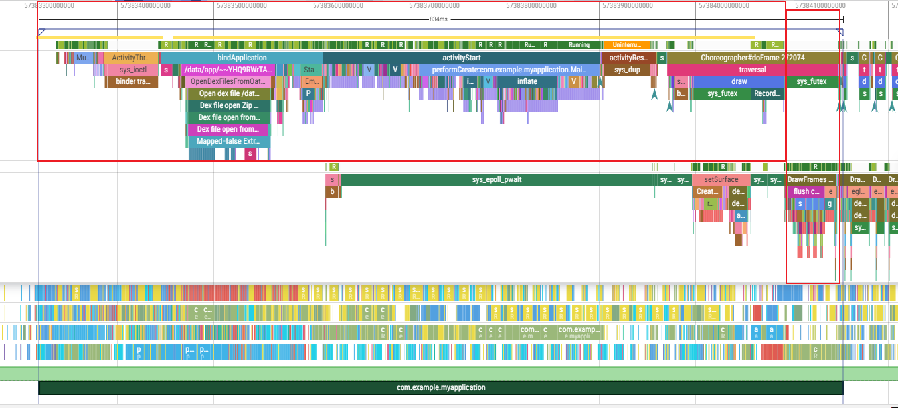
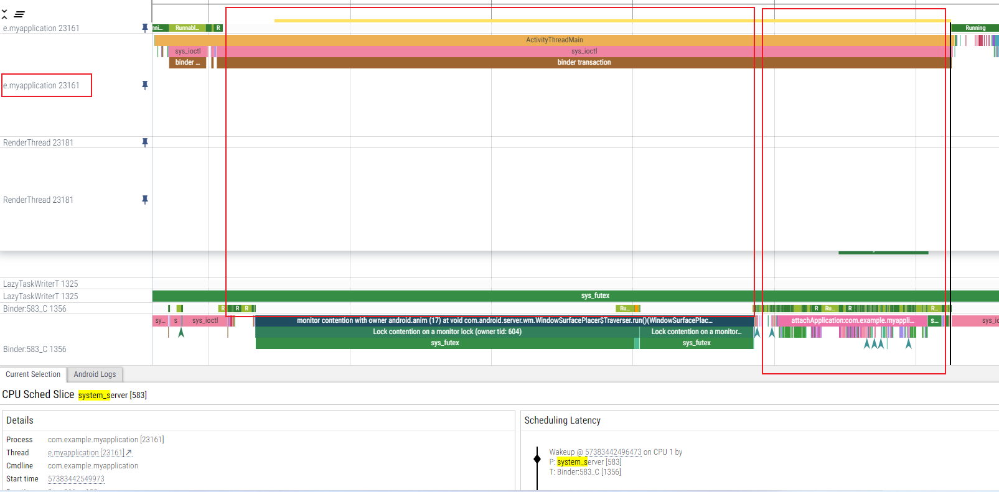
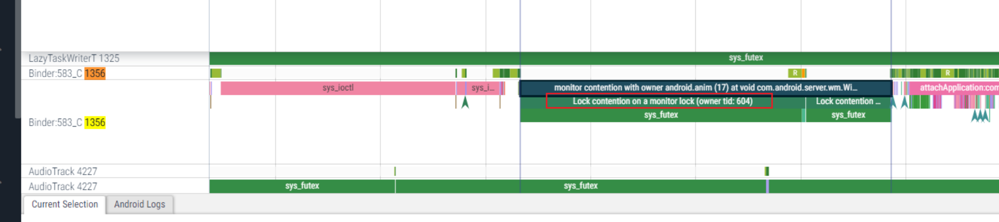
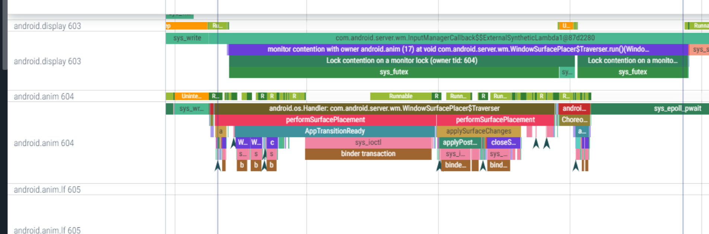
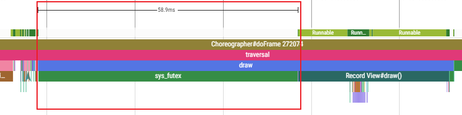
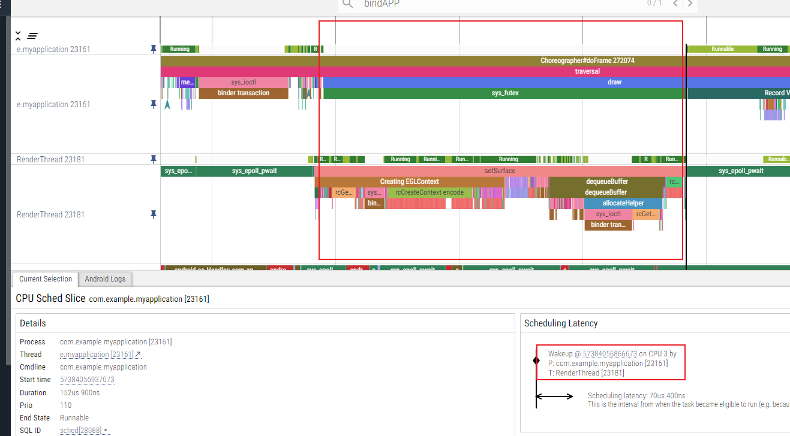
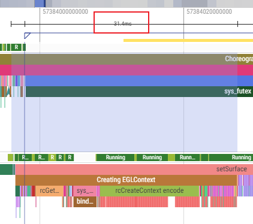
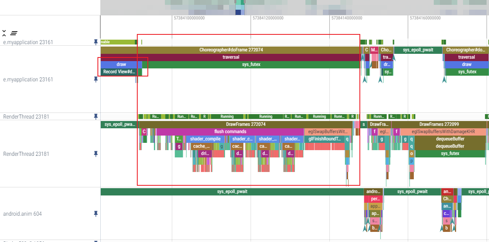
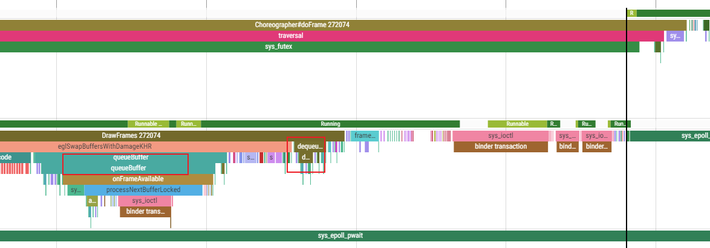

# 稳定性 专题

例子：AS  attach 系统进程，系统直接重启

分析：

## 稳定性问题

问题

# 性能专题

## 疑问

TODO: 如何被认定为性能问题？标准是啥？谁来定？

| wew  | wewe | weewe | ewewe | eweweewewwewe |
| ---- | ---- | ----- | ----- | ------------- |
|      |      |       |       |               |
|      |      |       |       |               |
|      |      |       |       |               |

-大的思想：

> 一切优化，都是资源配置的更加合理化   

------->  所以，从资源的角度，寻找可以优化的点

## 性能问题之咸鱼上位（优先级反转问题）

例子：

> A线程的优先级高，B线程优先级低，但是B线程先拿到了锁。此时，其他线程（进程？）（自然比B线程优先级高）会占用cpu时间多。
>
> -------------->  即：B  cpu执行分配时间少，执行时间长。导致A高优先级，迟迟拿不到锁，一直等待

总之，场景：

> -优先级低的，反而先执行 或者 分配时间多    （原因：因为1、先持有锁、 2、）
>
> -------->即，咸鱼上位

 办法：

> 在虚拟机里，把当前持锁的进程优先级提高，占用cpu就高，很快运行完。。。然后外面高优先级的，拿到锁
>
> 为啥是虚拟机做？因为锁  +  控制优先级 都在虚拟机里 

再举例子：

> Binder的优先级反转  TODO

### 时间优化一：不养闲人

不养闲人：即让空闲的人（进程）提前做事

如何快速启动？针对于高频应用，在bindapplication时，甚至`开始startActivity时，就把surface创建起来`

背后的方法论：

> 让空闲的人提前做事。上述优化，即：妻子炒菜，丈夫去买菜------>  优化，妻子提前把炒菜的承载 锅 刷好
>
> 关键词：1、空闲    2、提前

观测工具：

> trace？

### 时间优化二： 多养鱼思想

线程池、对象池  --------> 虽然没用到，但是早早地**养起来**

好处：内存不会突然增长；复用思想；**快速，拿来就用**

其他例子：

更高频应用，没有startactivity，也创建一个surface，然后进程冷冻  ------->  等真正要用的时候，解冻

养鱼 和  提前做 思想的**区别在于**：

> 提前做只是提前，一定会用得到；
>
> 养鱼，很可能用不到

#### 进程冷冻 引起的问题

------>  TODO: 挪到其他章节

冷冻容易，解冻需要考虑的多。比如，冷冻过程，有tranction过来怎么办？Binder的同步调用怎么办？

### 参考：

https://zhuanlan.zhihu.com/p/348548041

## 线程阻塞优化（sleep时间段）：

线程sleep时间段  很多时候，是在等待其他线程完成某件事情

------------>  如果这件事 能够提前完成，就不够成阻塞

### 例：优化APP冷启动------Creating EGLContext提前

从trace出发：

冷启动时间  = 主线程时间  + render线程 DrawFrames 时间

可能优化的sleep的**三个时间段：**

**1、ActivityTreadMain在等待50ms，在等待：**

（1）被system_server唤醒，等待attachApplication:com.example.myapplication  ------->  可以理解

 （2）但是 system_server也有一段空白sleep。。。这段是在干啥呢？  monitor contention with owner android.anim (17) at void com.android.server.wm.WindowSurfacePlacer$Traverser.run()(WindowSurfacePlacer.java:56)

-Lock contention on a monitor lock (owner tid: 604)    ------>  在等604线程的锁

（3）604是动画线程，现在正在performSurfacePlacement  ------>  

（4）总之：system_server 604 做动画performSurfacePlacement  阻塞了 system_server 1356 binder线程， 主线程又在等待 1356 去 attachAPPlication

TODO： 第一个阻塞，是不是可以优化？为什么要等结果？

**2、（1）draw流程中有个同步调用sys_futex， sleep 60ms，在等待：**

（2）谁阻塞的？ cpu3上的Render线程的setSurface

setSurface是不是一定要在这里呢？可不可以提前呢（优化的方法）

**具体做法：**

> 把Creating EGLContext 提前到 bindAPPlication  （TODO： 其实setSurface本身就可以完全提前）:
>
> 注意：Creating EGLContext不能有返回值， 尤其在 bindAPPlication 时（否则，还是会阻塞主线程，没有任何收益）
>
> 代码：TODO：

优化结果：30ms

3、sleep时间段三：

主线程draw之后一段空白，这段空白，因为 绘图指令集数据给到了 render线程DrawFrame。render线程在绘制  

--------> （1) DrawFrame无法提前，因为必须从主线程拿数据到render线程，无法压缩

### 线程阻塞优化思想的总结：

找空白sleep时间段------> 看哪个线程阻塞了？阻塞的事情是不是可以提前做？

-提前做的事情，不能有返回值（否则还是阻塞）

TODO： 如果有返回值的，如何不阻塞呢？用callback？

## 优化大的思想

线程级优化：结构性优化（非代码级别）、sleep阻塞优化

代码级别优化：UI、native侧统一序列化

#    TODO: 一些基本问题

如何衡量-----> status?

如何实现？

# 关键词大收集

查看displayid：   在display dump中，搜 mDisplayid

#  抛开性能优化

抛开性能优化来看：

> 程序的性能优化的思想，来源于生活。无一例外。     ----> 所以，记录生活的美好，不问用处
>
> 好的程序思想  -------->  应用于生活
>
> 好的生活中思想 -------> 应用于程序

