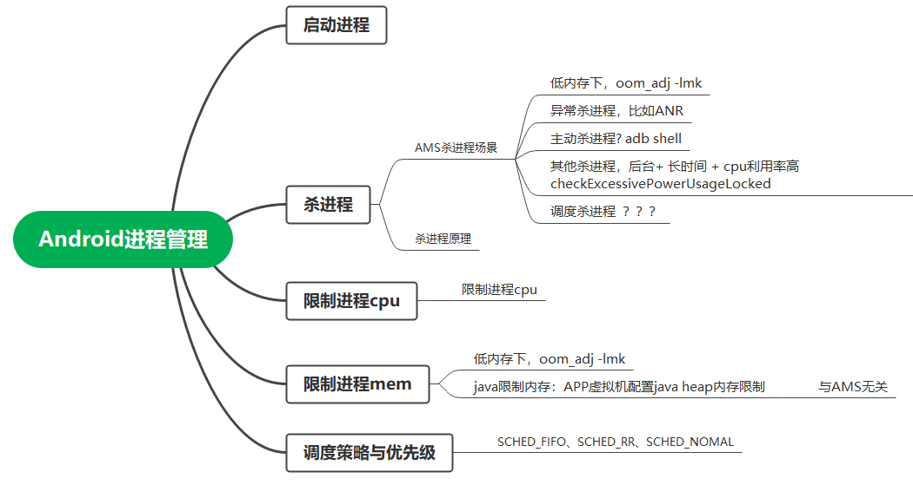
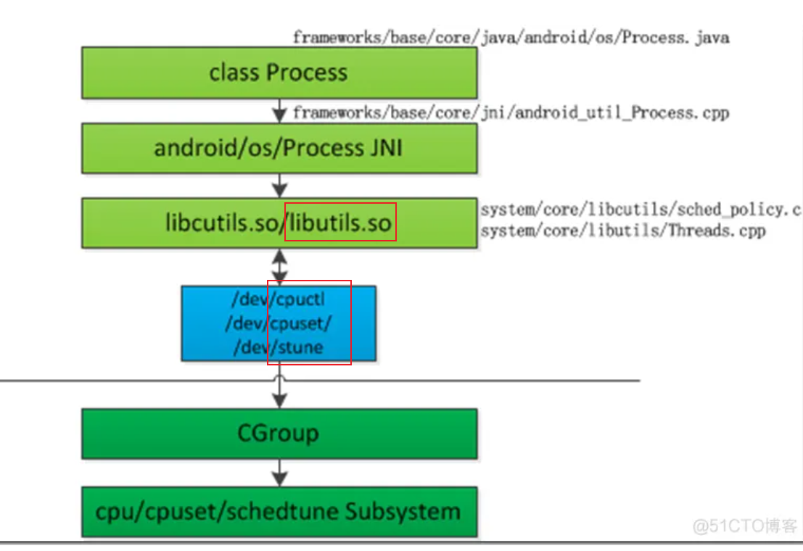
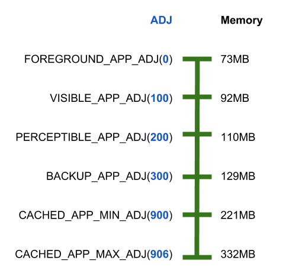
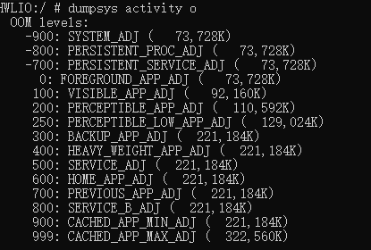
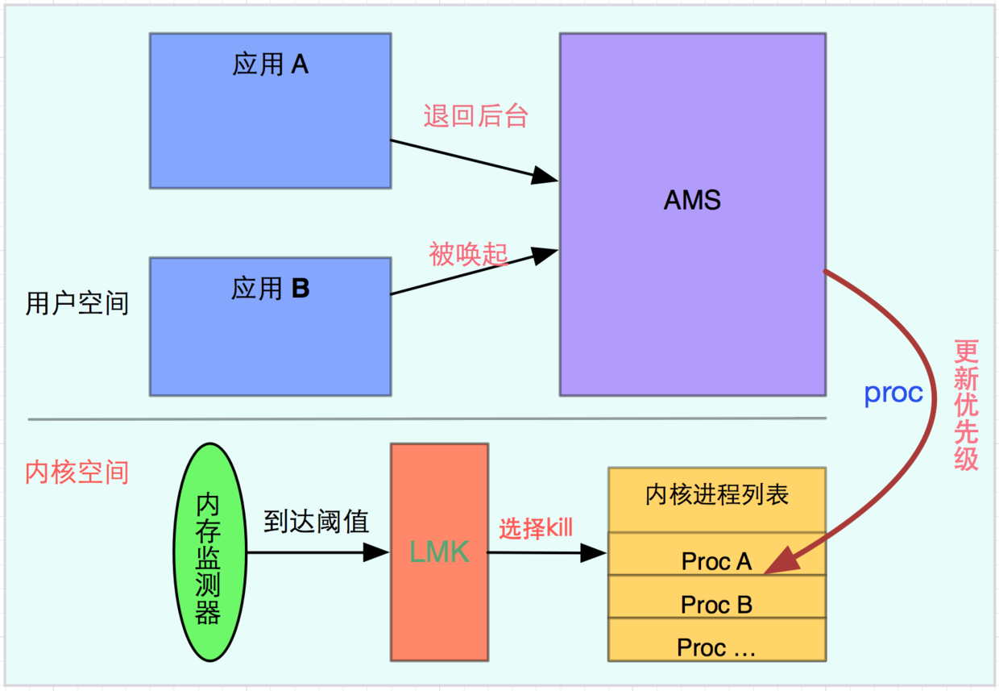
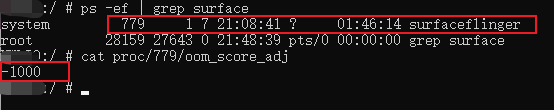
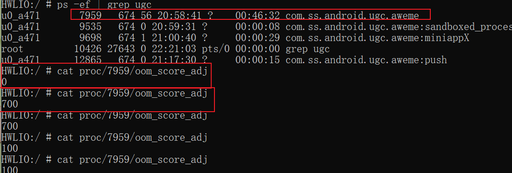
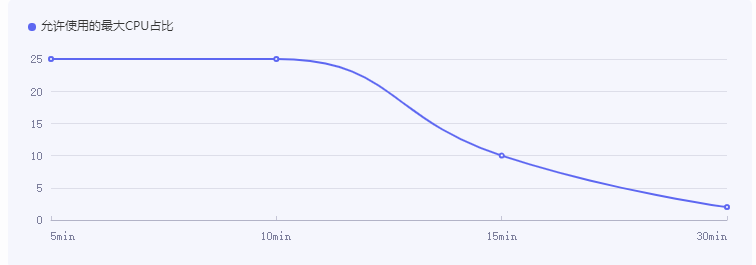

# 目录

[TOC]


# linux进程管理

## 0层


《linux进程管理.emmx》

## 进程调度策略SCHED_FIFO

参考：

> https://www.jianshu.com/p/1d2f6a5bbe76   Android 进程管理篇（五）-调度策略与优先级
>
> https://blog.csdn.net/aqrsxiao/article/details/84070223         linux进程调度策略

linux调度策略（部分依赖于优先级），即：

> <---------   SCHED_FIFO、SCHED_RR、SCHED_NOMAL（SCHED_OTHER）
>
> 详细：
>
> - *实时调度：**针对0-99的RT(实时)进程
>
> > SCHED FIFO:    1、高优先级的终止低优先级的cpu（自然）    2、相同优先级， <font color='red'>先到先服务</font>（Fisrt in First Out，自然）  3、相同优先级下，一旦占据CPU就要到跑完为止（自然，不是轮转）
> >
> > SCHED RR:   1、高优先级的会终止低优先级的cpu（**自然**）     2、  相同优先级，<font color='red'>时间片轮询</font>（）
>
> - --------------> 总之，FIFO和RR 根据相同优先级下，起的名字
>
> **分时调度:** 针对100-139的普通进程，他们按nice值 -20 - 19来算优先级，越nice优先级越低
>
> > SCHED_NOMAL(SCHED OTHER) : 时间片轮询，优先级越高抢占能力越强，越容易获得更多时间片   ----> 感觉更合理，所以NOMAL
> >
> > ```
> >   SCHED BATCH 批处理进程，唤醒不频繁的使用SCHED BATCH，频繁的适合
> > ```

实时与分时的区别：

> 分时：雨露均沾。任意进程都有机会获得cpu？

优先级：承载的量：TODO: 优先级号？？？？？还是nice值？？？？？？

TODO:   具体实现 或者 实现原理

具体设置：

应用例子：TODO：https://blog.csdn.net/aqrsxiao/article/details/84070223    

## cgroup 限制cpu，内存或I/O --->  cpuset

主要参考： https://blog.csdn.net/shift_wwx/article/details/131854291    Android 中 cgroup抽象层详解

cgroups (全称：***control groups***)

位置：

> Linux 内核

作用：

> 限制单个进程或者多个进程所使用资源（CPU、memory）的机制。


## API

参考：https://www.kancloud.cn/alex_wsc/android-deep2/413496

Linux提供了两个API用于设置调度优先级及调度策略:

> 调度优先级设置:  int setpriority(int which, int who, int prio);
>
> 调度策略的函数设置:   int sched_setscheduler(pid_t pid, int policy,conststruct sched_param *param);

向linux侧oom_adj的设置（类似API）：(**注意：oom_adj是安卓魔改的linux才有**)

> 向   /proc/进程id/oom_adj文件中写入对应的oom_adj值
>
> **本质： 进程id ------oom_adj 的映射**


# Android 进程管理

## 0层



《Android进程管理 .emmx》


AMS： 负责Android四大组建的启动和管理，进程的创建和调度。

(任意一个系统) 进程管理,  角度:

> 调度策略、优先级以及 可调度CPU范围

进程管理：

> 1、CPU调度： cpu调度策略-----------进程调度优先级nice值（linux量）：决定CPU资源调度的优先级
>
> 2、内存管理： 进程存活策略---------- 杀死应用，即**内存**释放优先级ADJ（安卓量）：系统根据一定策略先杀优先级最低的进程
>
> 当内存小于X时，结束“oom_adj”大于Y的进程  -----> 如何确定X与Y？ 如何确定oom_adj值？


## cpu调度

cpu调度---------即 线程调度：

> 因为：任一时刻，只有一个线程占用CPU，处于运行状态

线程调度原理：

> 任一时刻，只有一个线程占用CPU，处于运行状态

多线程并发：

> 轮流获取CPU使用权

线程调度模型：

> 1、分时调度模型：轮流获取、均分CPU时间
>
> 2、抢占式调度模型：优先级好的获取，JVM采用这种方式。 **nice值、cgroup**
>
> - --------->TODO: 谁管理的？最终生效在哪里？
>
> ```
>  nice值：
>  1）Process中定义
>  2）值越小，优先级越高
>  3）默认是THREAD_PRIORITY_DEFAULT,0
>  
>  cgroup：
>  1) 更严格的群组调度策略。
>  2) 保证前台线程可以获取到更多的CPU
>  注意点：
>  线程过多会导致CPU频繁切换，降低线程运行效率
>  正确认识任务重要性决定哪种优先级。 （工作量越大优先级越低）
>  优先级具有继承性
> ```
>
> 参考： https://blog.51cto.com/u_16213654/7243574
>
> - -------->TODO: 线程池

安卓侧

Linux侧

联系：



来源： https://blog.51cto.com/u_12218/7412595


## 进程移除：

### 疑问：

参考： https://juejin.cn/post/7220775341605568570#heading-16     AMS的内存管理ADJ算法（Android12）

疑问：

> adj值 与 进程优先级SYSTEM_ADJ之间是什么关系？
>
> adj值 与 进程组  之间是什么关系？

**Android 中，对一个进程   是否会被杀   有三个定义：**

> 进程优先级（越小越重要，越大越容易被杀）CPU调度组  SCHED_GROUP_BACKGROUND （越大越重要，adj 算法只会杀 SCHED_GROUP_BACKGROUND 进程组的进程）进程状态（表示当前进程的运行状态）

答：

1、进程优先级---------adj值  即 优先级的承载

adj值的更新时机：四大组件状态改变时，updateOomAdjLocked。比如：TODO:

2、进程状态 ---------- BACKUP_APP_ADJ  = 300 是 adj值 的一个大致的取值。待细化，比如 adj值 = 301    -------> 理解有问题

3、**CPU调度组**   ------- SCHED_GROUP_BACKGROUND   、 SCHED_GROUP_RESTRICTED、

​           ---------------> 这个影响进程 影响进程的CPU资源调度?????

疑问：   具体如何融合这三个？


来源：https://gityuan.com/2018/05/19/android-process-adj/

LMK侧：

（1） LMK侧拿到AMS给的  一堆adj值的集合

-<font color='red'>进程移除的阈值</font>：~~根据ADJ--剩余Memory（内存阈值）表，如果此时系统内存（比如147MB）小于 221MB，则 900~906 范围都是可杀的  --------> 自然先从adj最大的进程开始，看杀了是否够~~



> 自然，剩余内存非常非常小的时候，才杀ADJ = 0
>
> 来源：https://gityuan.com/2018/05/19/android-process-adj/

其中，进程移除的阈值表

> dumpsys activity o
>
> 
>
> 


### 0层



https://sq.sf.163.com/blog/article/193132570932527104

疑问：

> 更新优先级，到底指的更新的是啥？

### 关注ADJ<0的进程

- NATIVE_ADJ(-1000)：是由init进程fork出来的Native进程，并不受system管控； --------> 牛
- SYSTEM_ADJ(-900)：是指system_server进程；

  

### LRU列表

LRU列表结构：


### updateLruProcessLocked

​         ------------> 作用是啥

### adj

### 展开updateOomAdjLocked

### 杀应用

### 维测-----进程ADJ值查看

查看一个进程的adj 值：

> cat proc/[pid]/oom_score_adj -------> TODO: 为啥会写进文件里？不应该是实时的嘛？这里是整数，比如-900
>
> 例1：surfaceFlinger进程（ ps -ef | grep  surface）
>
> 
>
> 例2：抖音分别在前台和后台时ADJ值(变动值):
>
> > 前台：0
> >
> > 后台：700
> >
> > 
>
> 

查看阈值：

> dumpsys activity o：要杀的进程级别 <-------- 剩余的内存
>
> ```shell
>  OOM levels:
>   -900: SYSTEM_ADJ (   73,728K)
>   -800: PERSISTENT_PROC_ADJ (   73,728K)
>   -700: PERSISTENT_SERVICE_ADJ (   73,728K)
>     0: FOREGROUND_APP_ADJ (   73,728K)
>    100: VISIBLE_APP_ADJ (   92,160K)
>    200: PERCEPTIBLE_APP_ADJ (  110,592K)
>    250: PERCEPTIBLE_LOW_APP_ADJ (  129,024K)
>    300: BACKUP_APP_ADJ (  221,184K)
>    400: HEAVY_WEIGHT_APP_ADJ (  221,184K)
>    500: SERVICE_ADJ (  221,184K)
>    600: HOME_APP_ADJ (  221,184K)
>    700: PREVIOUS_APP_ADJ (  221,184K)
>    800: SERVICE_B_ADJ (  221,184K)
>    900: CACHED_APP_MIN_ADJ (  221,184K)
>    999: CACHED_APP_MAX_ADJ (  322,560K)
> ```
>
> 

其他维测：

> dumpsys meminfo
>
> dumpsys activity p


## 可调度CPU范围cpuset

### 背景：

完全参考：

> https://www.jianshu.com/p/0532e4239703      cpuset负载均衡在AMS中是如何应用的

背景：

> TODO:这里因此逻辑不懂？

### cpuset设置

cpuset设置-------AMS阶段：

> 计算curSchedGroup ：
>
> 设置curSchedGroup ：

cpuset设置-------最终生效：

> 根据不同的cgroup写cpuset对应节点：
>
> 最终生效节点：
>
> 比如：MTK6875，总共7个核心:
>
> > top app 满核随便跑
> >
> > background只能跑在小核上

**总之：**

> （1）AMS计算cgroup
>
> （2）根据不同的cgroup写cpuset对应节点：

其他：

> cpuset开关

TODO：

> 举例子，其如何应用，以及 实际解决的问题

### 维测

top-app组 ： 限定哪些核心使用：

```
 adb shell cat /dev/CPUset/top-app/CPUs
 0-7
 -------> 0-7都可以被top-app使用
```

top-app组  ：有哪些进程和线程是跑在这个组里面：

```
 adb shell cat /dev/CPUset/top-app/tasks
```

cpu:  cat  /proc/cpuinfo     CPU的架构、cpu的名称、核心数

其他方式，限定任务跑在哪个核心上：参考：https://www.cnblogs.com/mikaelzero/p/16916730.html

> taskset -pc 3  pid    表示将进程pid绑定到第3个核上

## 参考：

https://juejin.cn/post/7174713775944138809    AMS是如何动态管理进程的？

https://www.cnblogs.com/andy-songwei/p/9845771.html   [【朝花夕拾】Android性能篇之（六）Android进程管理机制](https://www.cnblogs.com/andy-songwei/p/9845771.html)   ----> 优秀文章

https://gityuan.com/2018/05/19/android-process-adj/      解读Android进程优先级ADJ算法

https://blog.51cto.com/u_16213654/7243574   android cpu调度策略 修改 安卓cpu调度模式

https://blog.51cto.com/u_12218/7412595    android 调试看实时cpu android cpu调度

> https://sq.sf.163.com/blog/article/187631163406041088   利用cgroup来限制进程的资源使用量
>
> 防止出现资源泄漏影响其他应用

https://xiaozhuanlan.com/topic/4135276908

https://sq.sf.163.com/blog/article/193127728117825536   Android后台杀死系列之一：FragmentActivity及PhoneWindow后台杀死处理机制（上篇）

https://sq.sf.163.com/blog/article/193127674185461760   Android后台杀死系列之一：FragmentActivity及PhoneWindow后台杀死处理机制（下篇）

https://sq.sf.163.com/blog/article/193130044973854720   Android后台杀死系列之二：ActivityManagerService与App现场恢复机制（上篇）

https://sq.sf.163.com/blog/article/193129960244719616   Android后台杀死系列之二：ActivityManagerService与App现场恢复机制（下篇）

https://sq.sf.163.com/blog/article/193132570932527104   Android后台杀死系列之三：LowMemoryKiller原理（4.3-6.0）上篇

-------->  注意图

https://sq.sf.163.com/blog/article/193132514978508800   Android后台杀死系列之三：LowMemoryKiller原理（4.3-6.0）下篇

https://www.jianshu.com/p/221f4a246b45?utm_campaign=maleskine&utm_content=note&utm_medium=seo_notes&utm_source=recommendation   Android进程系列第六篇---LowmemoryKiller机制分析(上)


# AMS杀进程场景

## 后台cpu/电量使用checkExcessivePowerUsageLocked

### 规则：

完全参考： https://www.jianshu.com/p/ee027ed53724

AMS 每 5分钟 检查一下异常耗电情况：



简言之：

> 1、随着时间延长，后台应用，占用CPU必须越来越少(30min之后，占用不能超2%)
>
> 2、检测频率：5min

计算方式：

```
 rate = cputimeUsed*100/uptimeSince 一个检查周期内CPU的使用时长 / 检查周期时长
```

### 具体细节&证明：

检测频率：5min，~~即checkExcessivePowerUsageLocked调用频率：~~   TODO:


## adb shell am force-stop


# APP进程内存的限制

## APP进程内存限制---配置

java程序 跑在jvm（dalvik或者art）上 ： https://zhuanlan.zhihu.com/p/655658126

1、一个java APP 对应一个 jvm

2、jvm必须限制内存，比如AS 就会设置最大内存

------> 安卓：

设置位置：

> 代码态：/dalvik/vm/alloc/HeapSource.cpp下找到原型
>
> https://www.cnblogs.com/mengfanrong/p/5186418.html
>
> 系统文件态：/system/build.prop
>
> 运行态：
>
> ```java
>  val manager = getSystemService(Context.ACTIVITY_SERVICE) as ActivityManager
>  manager.memoryClass
> ```

## APP进程内存限制--原理：

> 超出512M，抛出OOM异常
>
> 机制具体代码级流程：TODO: 谁检测，谁抛异常
>
> > https://zhuanlan.zhihu.com/p/652086402    Java OOM 演示

注意：

> 以上设置是针对于 dalvik的---------> 自然，不包括native申请的内存
>
> https://zhuanlan.zhihu.com/p/652086402

## 维测

https://blog.csdn.net/jscese/article/details/37928823   Android——内存调试

### **整体内存 ------ procrank**

https://blog.csdn.net/qinhai1989/article/details/88112715

procrank 安卓命令

> 几种内存：
>
> ```java
>  VSS - Virtual Set Size 虚拟耗用内存（包含共享库占用的内存）
>  RSS - Resident Set Size 实际使用物理内存（包含共享库占用的内存）
>  PSS - Proportional Set Size 实际使用的物理内存（比例分配共享库占用的内存）
>  USS - Unique Set Size 进程独自占用的物理内存（不包含共享库占用的内存）
> ```

### **指定进程 --------- dumpsys meminfo (包名或者PID)**

### 占用内存最多的进程或线程

**top -m 10**     当前占用最高内存的10个进程