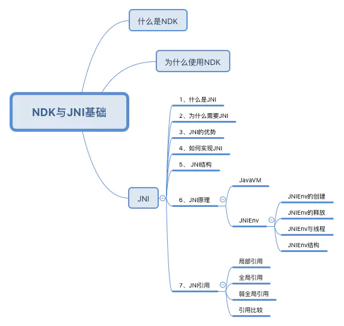
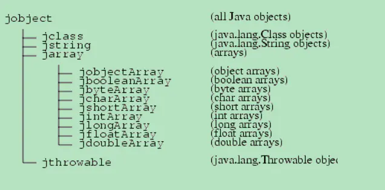

# 目录

[TOC]


# JNI

## 0层



 见： https://www.jianshu.com/p/87ce6f565d37


## JNIEnv结构

JNIEnv: JNI的第一个参数，JNIEnv 的本质是一个与线程相关的结构体，里面存放了大量的 JNI 函数指针：是functions的集合
JNIEnv与线程一一对应


--->所以，JNIEnv的作用：通过这个 JNIEnv* 指针，就可以对 Java 端的代码进行操作：

- 调用 Java 函数

- 操作 Java 对象

  ```cpp
  struct _JNIEnv {
      /**
      * 定义了很多的函数指针
      **/
      const struct JNINativeInterface* functions;
  
  #if defined(__cplusplus)
      /// 通过类的名称(类的全名，这时候包名不是用.号，而是用/来区分的)来获取jclass    
      jclass FindClass(const char* name)
      { return functions->FindClass(this, name); }
  
      //通过
  	jmethodID FromReflectedMethod(jobject method)
      { return functions->FromReflectedMethod(this, method); }
  
      jfieldID FromReflectedField(jobject field)
      { return functions->FromReflectedField(this, field); }
  
      jobject ToReflectedMethod(jclass cls, jmethodID methodID, jboolean isStatic)
      { return functions->ToReflectedMethod(this, cls, methodID, isStatic); }
  
      jclass GetSuperclass(jclass clazz)
      { return functions->GetSuperclass(this, clazz); }
      ...
          
  }  
  
  ```


## JavaVM

JavaVM : JavaVM 是 Java虚拟机在 JNI 层的代表, JNI 全局只有一个

JNIEnv : JavaVM 在线程中的代表, 每个线程都有一个, JNI 中可能有很多个 JNIEnv，同时 JNIEnv 具有线程相关性，也就是 B 线程无法使用 A 线程的 JNIEnv

JVM 的结构图如下：注意：JNIEnv与线程一一对应


## jobject thiz

java对象中的This，比如MainActivity的对象


## JNI基础

### 数据类型对应表

------>作用在于：接口处参数用法，java--->cpp，例如int[] array --->jintArray

```java
//java
public native int setToNativeArray(int[] array);
```

```c++
//jin.cpp
Java_com_example_NativeDemo_MainActivity_setToNativeArray(JNIEnv *env, jobject thiz, jintArray  jintArrs) {
    // TODO: implement setToNativeArray()
}
```

基础数据类型

| Java Type | Native Type | Description      |
| --------- | ----------- | ---------------- |
| boolean   | jboolean    | unsigned 8 bits  |
| byte      | jbyte       | signed 8 bits    |
| char      | jchar       | unsigned 16 bits |
| short     | jshort      | signed 16 bits   |
| int       | jint        | signed 32 bits   |
| long      | jlong       | signed 64 bits   |
| float     | jfloat      | 32 bits          |
| double    | jdouble     | 64 bits          |
| void      | void        | N/A              |

引用类型




### JNI的命名规则

```cpp
extern "C"
JNIEXPORT jint JNICALL
Java_com_example_NativeDemo_MainActivity_setToNativeArray(JNIEnv *env, jobject thiz, jintArray  jintArrs) {
    // TODO: implement setToNativeArray()
    return 0;
}
```

jint是返回值类型
Java_com_example_NativeDemo 是包名
MainActivity 是类名
setToNativeArray是方法名


### Field and Method IDs


## JNI 操作 java 对象

### 操作 jarray

将一个 Java int[] 对象传入 C++ 


### 操作 jstring

### 操作 jobject

### 操作 Field

### 操作 method

### 创建java对象


## 参考文章：

https://juejin.cn/post/6844904192780271630#heading-14

 https://www.jianshu.com/p/87ce6f565d37