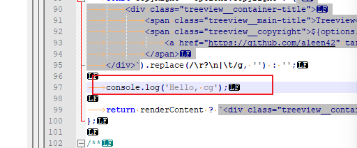
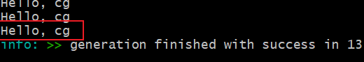
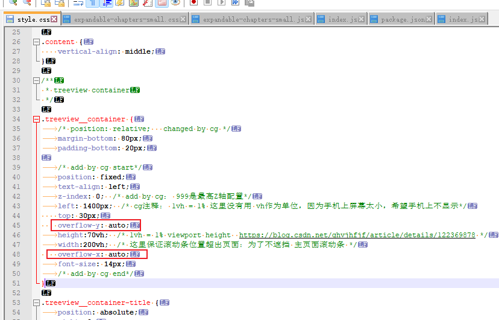

# js语法

https://blog.51cto.com/u_16099196/6441732


## 输入输出log




结果：




其他：

```js
alert()         浏览器弹出警示框
console.log()   浏览器控制台打印输出信息
prompt()		  浏览器弹出输入框，用户可以输入
```


# 控件

## 滚动

overflow属性是控制元素内容超出父级元素可视范围时的表现情况。它的属性值有：

（1）visible：“溢出”部分会呈现在元素框之外。

（2）hidden：隐藏“溢出”的内容。

（3）scroll：“溢出“内容显示滚动条。

（4）auto：自动确定是否需要显示滚动条

例子：




# Web 开发 & 鸿蒙ACE

Web 开发范式中定义一个页面需要**三个文件**，html，css 和 js 文件


鸿蒙ACE（UI框架）：

> https://www.elecfans.com/d/1975305.html
>
> https://blog.csdn.net/weixin_41559503/article/details/128851385   ------> 好文


# 鸿蒙其他


## 应用流转迁移

## 分布式数据库

## 分布式任务调度

RemoteInputAbilitySlice.java   --------->  远程输入法


