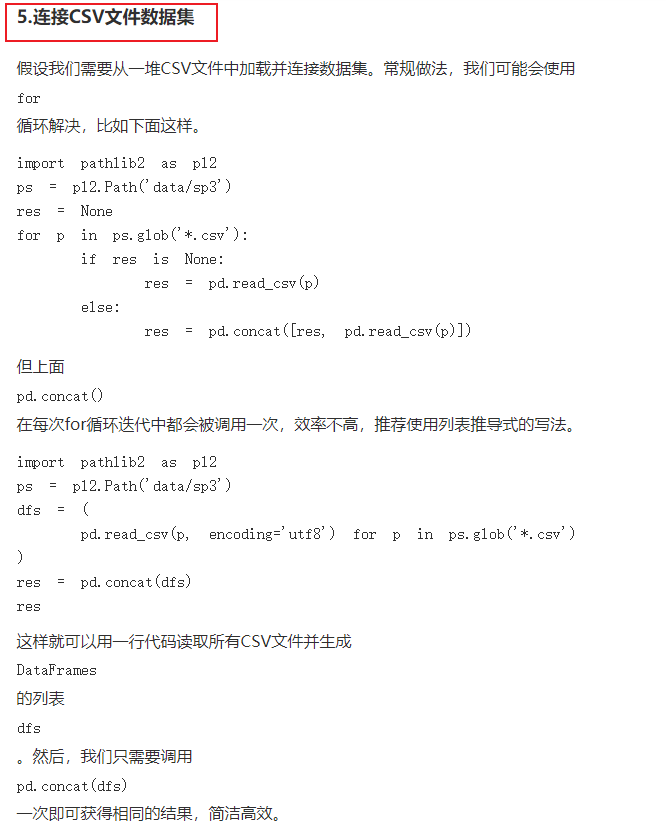

# 连接文件---------> 如何高效？

```python
# 方法一：时间：3h   内存： 3h内存就溢出了
merged_df = pd.DataFrame()
for sample_dic in metadata:
    barcode = sample_dic["associated_entities"][0]["entity_submitter_id"]
    file_name = sample_dic["file_name"][:]
    print("file_name:" )
    print(file_name)
    print("barcode:" )
    print(barcode)
    sample_df = pd.read_table(sample_path + '\\' + file_name, names = [barcode], skiprows=[0,2,3,4,5]) #【1】频繁创建对象
    merged_df = pd.concat([merged_df, sample_df], axis = 1)  #【2】 频繁合并  【3】merged_df增长速度非常快，不知道为啥？几十个G
    print("sample_df:" + str(sys.getsizeof(sample_df)/1024/1024) + " merged_df:" + str(sys.getsizeof(merged_df)/1024/1024))

merged_df.to_csv(root_path + '\\Results.csv')
print("Results are saved to: " + root_path + '\\Results.csv')
```


```python
# 方法二：时间：4min   内存： 4G
dfs = (pd.read_table(sample_path + '\\' + sample_dic["file_name"][:], skiprows=[0,2,3,4,5]) for sample_dic in metadata)   #【5】 连续读取，不存在 频繁合并 【6】内存上：dfs最大值，就是多个文件字节之和
res = pd.concat(dfs)
res.to_csv(root_path + '\\Results.csv')
```

------------------------------>  总之，两种方法，在时间和空间上都是天差地别的：

时间上：方法一多了（1）频繁创建对象  （2）频繁合并操作

空间上：：方法一多了（1）频繁创建对象  （2）merged_df大小急速增加（TODO：不知道为啥）


参考：

> https://www.360doc.com/content/23/0716/10/1088733714_1088733714.shtml
>
> 