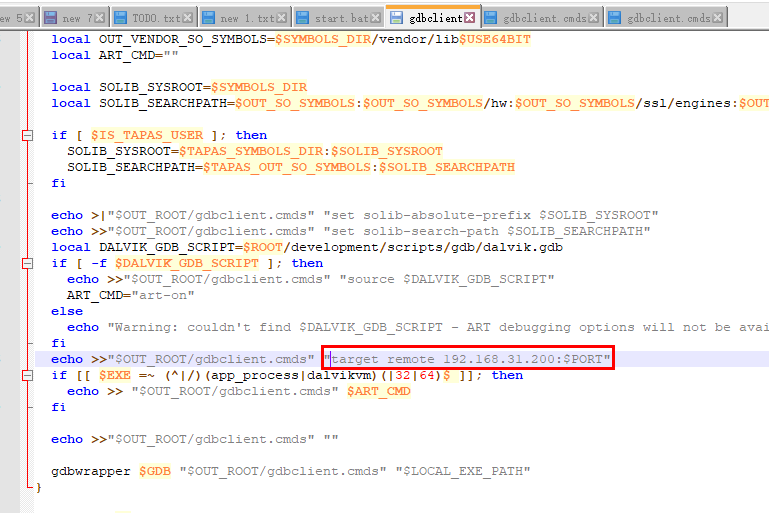
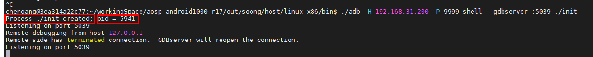
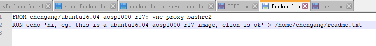
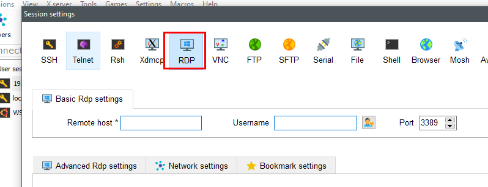
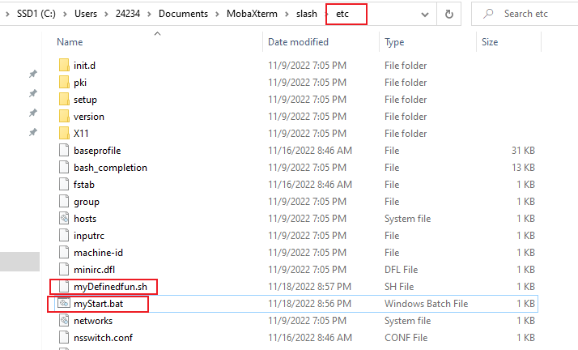
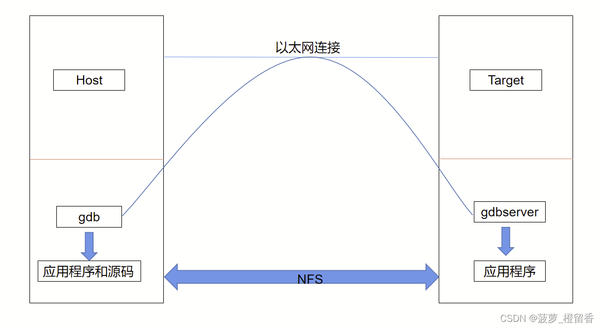

[TOC]


# 命令


## cpp断点调试

```
 ./adb -H 192.168.31.200 -P 9999 root

user@aclgcl-ubnt:/data1/AJ9_3$  ./adb -H 192.168.31.200 -P 9999 forward tcp:5039 tcp:5039 
user@aclgcl-ubnt:/data1/AJ9_3$  ./adb -H 192.168.31.200 -P 9999 shell      ps -ef  |grep systemui
./adb -H 192.168.31.200 -P 9999 shell     gdbserver :5039 --attach 31249
```

或者

```
1|sailfish:/ # ps -ef  |grep systemui
root          1986  1700 0 01:42:08 pts/0 00:00:00 grep systemui
u0_a88       31249   623 4 01:31:53 ?     00:00:24 com.android.systemui
sailfish:/ # gdbserver :5039 --attach 31249
Attached; pid = 31249
Listening on port 5039
```


 set solib-absolute-prefix /home/chen/workingSpace/aosp_android1000_r17/out/target/product/sailfish/symbols/


https://blog.csdn.net/wzy_0556/article/details/51911458

source build/envsetup.sh 和choosecombo命令： 
source build/envsetup.sh;choosecombo
否则汇报错：-bash: gdbclient: command not found

 ~~gdbclient app_process32 :5039         ------>根目录下执行~~
gdbclient 782        ----->根目录下执行
---》这个会执行gdbclient脚本


------.. 因为adb的原因需要修改两处：
（1）/home/chen/workingSpace/aosp_android1000_r17/development/scripts 下所有adb 修改为 adb -H 192.168.31.200 -P 9999  （PC的ip）
（2）最后gdb会执行这一行，需要加上ip，才能连接上，或者删掉（手动：target remote 192.168.31.200:5039 ）



(gdb) target remote 192.168.31.200:5039      ---》PC的ip


https://blog.csdn.net/wangzaieee/article/details/83895089   init进程可以调试成功


 ./adb -H 192.168.31.200 -P 9999 shell   gdbserver64 :5039 ./init             ----------》坑：这里一定要用64位的！！！
重启了init进程，并且打印了pid                                                                     




调试的流程：

```cpp
35        mov x0, sp(gdb) b mainBreakpoint 1 at 0x5555578080: file system/core/init/main.cpp, line 56.(gdb) cContinuing.warning: Could not load shared library symbols for /system/bin/linker64.Do you need "set solib-search-path" or "set sysroot"?Breakpoint 1, main (argc=<optimized out>, argv=0x555557805c <main(int, char**)>) at system/core/init/main.cpp:5656          if (!strcmp(basename(argv[0]), "ueventd")) {(gdb) n60          if (argc > 1) {(gdb) n77          return FirstStageMain(argc, argv);(gdb) nProgram received signal SIGABRT, Aborted.abort () at bionic/libc/bionic/abort.cpp:4949        struct sigaction64 sa = { .sa_handler = SIG_DFL, .sa_flags = SA_RESTART };(gdb) nandroid::init::InstallRebootSignalHandlers()::$_14::__invoke(int) (signal=6) at system/core/init/reboot_utils.cpp:138138         action.sa_handler = [](int signal) {(gdb) n
```


命令：
adb forward tcp:6100 tcp:7100 // PC上所有6100端口通信数据将被重定向到手机端7100端口server上

或者
adb forward tcp:6100 local:logd // PC上所有6100端口通信数据将被重定向到手机端UNIX类型socket上
————————————————
版权声明：本文为CSDN博主「东海陈光剑」的原创文章，遵循CC 4.0 BY-SA版权协议，转载请附上原文出处链接及本声明。
原文链接：https://blog.csdn.net/universsky2015/article/details/83593488


linux 环境变量设置（临时 + 永久）
export adb='adb -H 192.168.31.200 -P 9999'

## ~~cmd(bat)~~ 禁止使用

### 用户输入----set  /p

```shell
echo hello world

echo please enter y/n:
set /p flag=
::echo %flag%
if /i %flag% == y (echo “y”)^
else (echo “stop the procedure!”)
```


### 定义变量set、字符串格式化

```java
// copy.bat
:: 需要输入的参数
set sourcePathRoot=I:\dockerSharedFiles\aosp_android1000_r17\aosp_android1000_r17
set subPath=frameworks\base\core

md %subPath%
xcopy  %sourcePathRoot%\%subPath%    %subPath%  /s/y/h
```


### 拼接字符串 %

见上

### 使用bat批处理文件启动.exe程序

```shell
// myStart.bat
echo "this is myStart.bat"
start E:\Snipaste-2.7.3-Beta-x64\Snipaste.exe
start E:\AutoHotKey\myAutoHotKey.ahk


@ping -n 20 127.1>nul 2>nul
```


### pause 20s


```
::pause 20s
@ping -n 20 127.1>nul 2>nul
```

### 休眠

```
rundll32 powrprof.dll,SetSuspendState
```


### ~~文件夹操作~~

```java
//删除文件夹
rd /s /q D:\local\braphic

//创建文件夹  ------>极优，可以创建多层
md D:\local\braphic

//拷贝（参数h表明包括隐藏文件） 注意：拷贝 bra下所有文件，不包括bra本身
xcopy Y:\foundation\bra  D:\local\braphic\bra    /s/y/h
pause
```


### 文件操作

<font color='red'>1、删除（优）</font>

> del  "H:\docker_install\DockerDesktop\DockerDesktop.vhdx"
>
> **可以解决删除系统文件时报错：**
>
> 
>
> 


复制：


#### 写东西到文件里

例子1:

```powershell
del "H:\docker_install\Dockerfile\Dockerfile"
echo FROM %Image%>> H:\docker_install\Dockerfile\Dockerfile
echo ^RUN^ ^echo^ ^'hi, cg. this is a ubuntu16.04_aosp1000_r17 image, clion is ok'^ ^>^ /home/cg, /readme.txt>> H:\docker_install\Dockerfile\Dockerfile
```

结果




注意：例子2:


结果：


### 获取系统时间，对字符串切片、拼接


```powershell
C:\Users\24234>date
The current date is: 12/04/2022 Sun
--->echo  %date:~0,2%   从0位置开始，共四个
```

结果：


又一个Ex:

```powershell
C:\Users\24234>set date_time="%date:~6,4%%date:~0,2%%date:~3,2%%time:~0,2%%time:~3,2%"

C:\Users\24234>echo %date_time%
"202212041702"

C:\Users\24234>
```


### ~~CMD执行命令行时卡住的问题（假卡）~~

https://blog.csdn.net/qq_34254642/article/details/104641591

Windows下命令行窗口默认开启了“快速编辑模式”，在执行命令的时候我们会不小心在窗口上点一下导致出现一个白色的光标，因为开启了“快速编辑模式”所以只要当鼠标点击Cmd窗口任何区域就会自动进入编辑模式，然后程序向控制台输入内容甚至执行程序都会被阻塞住，导致看到了命令执行停止的现象


### 已经编写好的脚本---复制源代码

有时候，需要把源码从

```cpp
// copy.bat
:: 需要输入的参数
set sourcePathRoot=I:\dockerSharedFiles\aosp_android1000_r17\aosp_android1000_r17
set subPath=frameworks\base\core

md %subPath%
xcopy  %sourcePathRoot%\%subPath%    %subPath%  /s/y/h
```


## linux


### ~~文件夹操作~~

~~删除文件夹~~

> ~~rm -rf ........~~

**递归创建文件夹**-p

> mkdir  -p   files1/files2

拷贝：

> //拷贝文件夹A**下**所有文件 到 文件夹B**下**
> cp -r /home/packageA/* /home/cp/packageB/
> 或
> cp -r /home/packageA/. /home/cp/packageB/
>
> //拷贝文件夹A  到 文件夹B  ---->  packageB文件夹下就有packageA文件夹
> cp -r /home/packageA /home/packageB

-------->   **简言之：下 即  /**


查看文件夹大小（在当前文件夹下）

> du -sh


### 搜索

关于搜索文件、搜索文本内容，  规定：

> -<font color='red'>禁止</font>在window下搜索文件、
>
> -<font color='red'>禁止</font>在IDE中搜索文本（IDE 本身可能File不全、很多File里的文本搜不到）

--------->  win也必须执行linux命令


规定：

> linux的搜索，优很高的精确性   ----->  可以**用来判定有无**

#### 搜索文本

范围：view.java文件

```java
grep   “baidu”  -nr  view.java
```


文件范围：路径下所有文件

```java
grep   “baidu*”  -nr  ./
```


显示范围：

```shell
grep -C 5 ........  显示上下5行

grep -B 5 ........   显示前5行

grep -A 5 ........   显示后5行
```


#### 搜索文件

```java
find  ./   -name  "View*"
```


###  sed 批量替换多个文件中的字符串

原文： https://www.runoob.com/w3cnote/linux-findtoreplace.html

语法格式

```
sed -i "s/原字符串/新字符串/g" `grep 原字符串 -rl 所在目录`

```


例子：

```
在当前目录下查找包含 baidu 的字符串，并将字符串 baidu 替换为 runoob
sed -i "s/baidu/runoob/g" `grep "baidu" -rl ./`

批量替换网址 libs.baidu.com 为 cdn.static.runoob.com：
sed -i "s/https:\/\/libs.baidu.com/https:\/\/cdn.static.runoob.com\/libs/g" `grep -rl "libs.baidu.com" ./`
```


### 文件系统相关

df  -a          disk free   文件系统的free情况（空间使用情况）（虚拟文件系统，如`proc`和`sysfs`）

df -T    /dev/cpu      T是Type      显示文件 所处的文件系统类型

mount         挂载文件系统 ------->  指定  目录

mount  显示已挂载的文件系统

mount /dev/sdb1 /mnt/data    挂设备 -----> 目录

-**<font color='red'>记忆</font>：**mount骑上  -----> 一个文件系统 “骑” 在另一个上面，即挂载


### 自动换源

https://cloud.tencent.com/developer/article/1880981


###  Ubutu 安装可视化界面 ，win10远程

1、步骤

https://blog.csdn.net/qq_15211883/article/details/105314929   windows 远程 ubuntu 桌面,遇到花屏问题的解决方法

https://blog.csdn.net/badboy_1990/article/details/121412618    Ubuntu Server 20.04安装桌面(图形界面)以及远程桌面

2、远程连接



或直接用window的远程桌面登录:输入ip 用户名,密码


注意点：安装xfce4
 TODO:  当docker宿主在window上，这样连不上

### Linux 系统初始化  自动化执行脚本

注：以下都是  系统初始化  级别的，不是用户登录级别的（只有一个系统初始化，但是可以有很多个  用户登录）

参考：  https://blog.csdn.net/weixin_43772810/article/details/126760777      Ubuntu 20.04 设置开机自启脚本


#### 正常linux启动

使用 systemctl：

https://blog.csdn.net/ny19000314/article/details/128833491?spm=1001.2101.3001.6650.3&utm_medium=distribute.pc_relevant.none-task-blog-2%7Edefault%7ECTRLIST%7ERate-3-128833491-blog-127485170.235%5Ev36%5Epc_relevant_default_base3&depth_1-utm_source=distribute.pc_relevant.none-task-blog-2%7Edefault%7ECTRLIST%7ERate-3-128833491-blog-127485170.235%5Ev36%5Epc_relevant_default_base3&utm_relevant_index=6


#### docker镜像下的linux

参考：

https://www.jianshu.com/p/ba9860bec1d4

https://blog.csdn.net/qq_42926722/article/details/127052028    Docker容器进入的4种方式


无法使用systemctl，只能通过docker exec：

```cpp
docker run  --detach .............

docker exec test_my  /bin/bash /home/cjk/start.sh ..........
//start.sh封装你想要 开机执行的一切操作
```


一个注意点： --detach             https://blog.csdn.net/F7ANTY/article/details/112384645  

```
docker run  --detach  正常情况下，run之后直接attach，进入容器了（run之后的脚本没法执行）: --detach使得不进入容器
```

没有detach时，会attach：


### Linux 用户登录  自动化执行脚本

注：以下都是  用户登录  级别的，即:

> ~~新增一个用户登录，执行一次~~


#### 自动执行

先科普下 Linux 系统的四（六）个类似却又不同的文件：

```shell
/etc/profile：系统配置文件，用户登录时读取一次
/etc/bash.bashrc：系统配置文件 ，用户登录时读取一次，每次打开一个新终端会话时读取一次
~/.profile（~/.bash_profile、~/.bash_login）：用户配置文件，用户登录时读取一次
~/.bashrc：用户配置文件，用户登录时读取一次，每次打开一个新终端会话时读取一次
```

**注意：**

1. **系统配置文件作用于全局，而用户配置文件仅针对当前登录的用户**

2. **先读取系统配置文件，再读取用户配置文件，用户配置文件的变量和表达式等都继承自系统配置文件**

3. **我是 Ubuntu OS，如果你是 Red Hat OS，请将 /etc/bash.bashrc 改成 /etc/bashrc**

4. **Ubuntu 本身没有 ~/.bash_profile，需要你自己创建同名文件，它只对 bash 有效，而 ~/.profile 作用于任何绑定的 shell 终端**

5. **对于 ~/.bash_profile、~/.bash_login、~/.profile，如果终端绑定的是 bash，则按照我书写的顺序进行读取**（如果存在，就不继续读取）

   -

出于个性化和最小干预原则考虑，通常我们只对 ~/ 目录下的终端配置文件进行读写操作，也就是
  ~/.profile   **每次登录只读取一次**
  ~/.bashrc   **除了登录时读取，每次打开终端，执行 shell script 时都会读取一次**

----->  **一句话总结**：优先用~/.profile 和  ~/.bashrc

参考：
https://blog.csdn.net/Jessie_Lian/article/details/107917658?spm=1001.2101.3001.6650.2&utm_medium=distribute.pc_relevant.none-task-blog-2%7Edefault%7ECTRLIST%7ERate-2-107917658-blog-115304472.pc_relevant_recovery_v2&depth_1-utm_source=distribute.pc_relevant.none-task-blog-2%7Edefault%7ECTRLIST%7ERate-2-107917658-blog-115304472.pc_relevant_recovery_v2&utm_relevant_index=5   Linux开机自动化执行脚本的四种方法（真实案例分享）


### 运行.sh

标准：  sh  hello.sh


TODO: 如何双击执行呢？


#### 自定义函数，待使用

source + .sh

例子：
见

TODO: 自定義的function，如何自动补全？


### 环境变量设置

1、设置export

```shell
export ALL_PROXY='socks5://172.20.224.1:15901'
```

~~2、查看当前环境变量env （自然）~~

3、删除 unset 

```
unset  ALL_PROXY
```


### win下 全面以linux 命令替代 cmd命令

利用mobaXterm中bash，可以找到win所有路径 ----> 所以，都可以替代

关键问题：

```
//Windows路径----> Linux的路径
```

转化：

```java
function my_win2linux_path
{
	# usage: my_win2linux_path "C:\Users\asus\Anaconda3"

	win_path=$1 # 脚本的第一个参数就是windows路径
	#win_path="C:\Users\asus\Anaconda3" # 一个示例路径

	tmp_path=${win_path/:/} # 将冒号删掉
	tmp_path=${tmp_path//\\/\/} # 将\\替换为/

	disk_id=${tmp_path:0:1} # 取出第一个字母，也就是C盘的C，冒号后面第一个0指的是从下标为0的地方开始提取，第二个冒号后面的1表示提取一个字母
	disk_id=$(echo $disk_id | tr [:upper:] [:lower:]) # 大写转小写
	#echo $disk_id

	other_path=${tmp_path:1} # 路径中除了磁盘以外的部分

	linux_path="/drives/"${disk_id}${other_path} # 需要将/mnt/接在路径最前方
	echo "windows path is "${win_path}
	echo "linux path is "${linux_path}
}
```


## shell 或 MobaXterm

### ~~shell中交互输入自动化~~

```shell
// .sh

#! /bin/bash
read -p "enter number:" no
read -p "enter name:" name
echo you have entered $no, $name
```


### ~~wins  下shell自动化执行脚本~~


执行顺序：


### ~~shell 调用bat~~


注意：bat文件放在sh可以找到的目录下



### Shell脚本之字符串操作

https://blog.csdn.net/xinfeismile123/article/details/119355401


## flutter

1、trace：https://www.bilibili.com/video/av48772383


2、


## 正则

`匹配行`:
 https://blog.csdn.net/billll/article/details/88370333

包含指定单词的行:

包含 单词1或单词2或 单词3 的行:

不包含指定单词 的行：

包含一组单词，并且不包含另一组:

### github


Get started by [creating a new file](https://github.com/KentTJ/AospbaseForSelfish/new/main) or [uploading an existing file](https://github.com/KentTJ/AospbaseForSelfish/upload). We recommend every repository include a [README](https://github.com/KentTJ/AospbaseForSelfish/new/main?readme=1), [LICENSE](https://github.com/KentTJ/AospbaseForSelfish/new/main?filename=LICENSE.md), and [.gitignore](https://github.com/KentTJ/AospbaseForSelfish/new/main?filename=.gitignore).

…or create a new repository on the command line


```
echo "# AospbaseForSelfish" >> README.md
git init
git add README.md
git commit -m "first commit"
git branch -M main
git remote add origin git@github.com:KentTJ/AospbaseForSelfish.git
git push -u origin main
```

…or push an existing repository from the command line


```
git remote add origin git@github.com:KentTJ/AospbaseForSelfish.git
git branch -M main
git push -u origin main
```

…or import code from another repository

You can initialize this repository with code from a Subversion, Mercurial, or TFS project.

[Import code](https://github.com/KentTJ/AospbaseForSelfish/import)


## GDB命令

### 原理

比较完整的参考：  https://blog.csdn.net/Ananas_Orangey/article/details/126219940的

​              linux（win）：                                                                                                                                     手机：




### Tutorial

https://www.sourceware.org/gdb/

https://sourceware.org/gdb/current/onlinedocs/gdb/     GDB manual

### 时机：

何时用gdb？何时用log？何时用调用栈？

### ~~启动gdb~~

gdb main.exe
main.exe为debug版本

###  控制

启动   r（run）

start      开始执行程序，停在main函数第一行语句前面等待命令

跳入函数  s   ~~或 step~~
跳出函数finish      ------>没有简写
下一行 n          ~~或next~~
退出  q                  ~~quit~~

执行上一条命令：Enter键

跳转执行
https://blog.csdn.net/yasi_xi/article/details/12784507

#### 断点相关：

**函数打断点：**      b 函数名   例：   b android::MediaPlayerService::Client::start
**某一行打断点：** b 源文件:行号   
         例如： b c_gdb.c:9

**断点某一线程**：  b android::Looper::wake   thread 12

**条件断点：** 

>     break 断点 if 条件
>
>     continue 断点编号(执行一次表示设定，再次执行表示取消)
>
>     continue 断点编号 条件

 **查看断点：**i  b        ~~或  info b 或  info breakpoint 或  info break~~

  **删除断点：**d 断点号     ~~或 delete 断点号~~
                       d                      ~~或 delete(删除所有断点)~~


  

**禁用/开启断点：**disable/enable breakpoint

 **ignore：**   https://blog.csdn.net/weixin_33904522/article/details/112594152


赋值： 
print n =1
强制调用函数：call 表达式 或 print
https://blog.csdn.net/yasi_xi/article/details/12784507

#### **阻塞线程**

  阻塞其他线程，仅调试当前线程工作：

  set scheduler-locking [on|off|step]

  运行指定线程并允许其他线程并行执行：

  thread apply N command

### **变量操作**

​    设置变量：set var n=47


### **显示**

p（print） 变量名	打印指定变量的值

l（list）                       列出源代码，接着上次的位置往下列，每次列10行

l  200    (~~list 行号~~）     列出从第几行开始的源代码
android::MediaPlayerService::Client::start      ~~list 函数名~~                     列出某个函数的源代码

**查看局部变量：**
(gdb) info locals 
i = 0
sum = 0

**查看调用帧（栈）**
(gdb) bt    ~~backstrace~~

```cpp
#0  digui (n=9) at c_gdb.c:14
#1  0x000055bc7ca566a4 in digui (n=10) at c_gdb.c:19
#2  0x000055bc7ca56663 in main () at c_gdb.c:8
```

在不同frame之间切换：frame 2
----》来查看变量值


**查看当前调试的进程**：info inferiors
**查看线程**：info threads

**查看线程堆栈**

```shell
查看所有线程堆栈：thread apply all bt

查看指定线程堆栈：thread apply thread1 thread2... bt
```

大全：
https://blog.csdn.net/weixin_33904522/article/details/112594152


**显示共享库：**
(gdb) info sharedlibrary


### **gdb调试异常**

----》适用于，程序直接挂了
https://www.cnblogs.com/catmelo/p/7207062.html
使用gdb捕获异常的扔出点（相当于在扔出异常的地方添加断点）：
catch throw
使用gdb捕获线程退出（相当于在线程退出的时候添加断点）：
catch pthread_exit
这样，如果相应的事件发生，gdb就会中断程序的执行， 就可以使用gdb的bt命令来检查出现错误的调用栈了。


**强制函数返回**
return
return <expression>


**disassemble** 反汇编指令
调试函数
https://blog.csdn.net/weixin_33904522/article/details/112594152


## jdb命令

### 用threads查询所有线程： 

命令： 

```none
threads
```

### 选择你感兴趣的线程 

命令： 

```none
thread 0xc1436dd9d0
```


### 暂停线程

命令： 

```none
suspend 0xc1436dd9d0
```

### 显示调用堆栈。 

命令：

```none
wherei
```

结果显示示例： 

```shell
[1] java.lang.Object.wait (本机方法)
[2] java.lang.Object.wait (Object.java：288), pc = 3
[3] android.os.MessageQueue.next (MessageQueue.java：148), pc = 153
[4] android.os.Looper.loop (Looper.java：110), pc = 8
[5] android.os.HandlerThread.run (HandlerThread.java：60), pc = 28
```


### 切换调用堆栈的frame: 

命令： 
up [n 帧] – 向上移动线程的堆栈 
down [n 帧] – 向下移动线程的堆栈 

### 设置断点 

命令： 

```shell
stop at <类>:<行号> 或
stop in <类>.<方法名>[(参数类型,..
```


结果显示示例：

> stop at com.example.BarrierFree_demo.MainActivity:85
> 设置断点com.example.BarrierFree_demo.MainActivity:85

含内部类时：

> stop at com.android.phone.SimContacts$ImportAllThread:124
> 设置 断点 com.android.phone.SimContacts$ImportAllThread:124


#### 显示某个类的信息。

有时要在嵌套类里设置断点，这个命令可能有帮助。 

命令： 
class <类 ID> – 显示已命名的类的详细信息 

结果显示示例：

```none
>class com.android.phone.SimContacts
类：com.android.phone.SimContacts
扩展： com.android.phone.ADNList
嵌套： com.android.phone.SimContacts$ImportAllThread
```

#### 显示变量信息：

查看局部变量，输入locals。


```
# 打印变量
print `基本类型`
dump `对象`
```

#### 运行 

命令： 

```none
step – 进入方法
step up – 执行到当前方法返回到其调用程序
stepi – 执行当前指令
next – step over执行某一行
cont – 从断点处继续执行
```


9.清除断点 
命令：

```none
clear <类 ID>.<方法>[(参数类型,...)] – 清除方法中的断点
clear <类 ID>:<行> – 清除行中的断点
clear – 列出断点
```


#### 查看源代码 

命令： 
list [line number|method] – 输出源代码 

11.jdbshell命令缩写 

```none
command alias:
c — cont
l — list
n — next
r — run
s — step
si — stepi
f — step up
bt — wherei
```


#### 查看当前加载的所有类

classes

#### 其他

成功attach后，help一下，可以看到断点如何下等命令，注意class id 包括类的包名的！

1

luogw@luogw-MacBook-Pro temp$ jdb  -attach 127.0.0.1:7703
设置未捕获的java.lang.Throwable
设置延迟的未捕获的java.lang.Throwable
正在初始化jdb...

> help
> ** 命令列表 **
> connectors                -- 列出此 VM 中可用的连接器和传输

run [class [args]]        -- 开始执行应用程序的主类

threads [threadgroup]     -- 列出线程
thread <thread id>        -- 设置默认线程
suspend [thread id(s)]    -- 挂起线程 (默认值: all)
resume [thread id(s)]     -- 恢复线程 (默认值: all)
where [<thread id> | all] -- 转储线程的堆栈
wherei [<thread id> | all]-- 转储线程的堆栈, 以及 pc 信息
up [n frames]             -- 上移线程的堆栈
down [n frames]           -- 下移线程的堆栈
kill <thread id> <expr>   -- 终止具有给定的异常错误对象的线程
interrupt <thread id>     -- 中断线程

print <expr>              -- 输出表达式的值
dump <expr>               -- 输出所有对象信息
eval <expr>               -- 对表达式求值 (与 print 相同)
set <lvalue> = <expr>     -- 向字段/变量/数组元素分配新值
locals                    -- 输出当前堆栈帧中的所有本地变量

classes                   -- 列出当前已知的类
class <class id>          -- 显示已命名类的详细资料
methods <class id>        -- 列出类的方法
fields <class id>         -- 列出类的字段

threadgroups              -- 列出线程组
threadgroup <name>        -- 设置当前线程组

stop in <class id>.<method>[(argument_type,...)]
                          -- 在方法中设置断点
stop at <class id>:<line> -- 在行中设置断点
clear <class id>.<method>[(argument_type,...)]
                          -- 清除方法中的断点
clear <class id>:<line>   -- 清除行中的断点
clear                     -- 列出断点
catch [uncaught|caught|all] <class id>|<class pattern>
                          -- 出现指定的异常错误时中断
ignore [uncaught|caught|all] <class id>|<class pattern>
                          -- 对于指定的异常错误, 取消 'catch'
watch [access|all] <class id>.<field name>
                          -- 监视对字段的访问/修改
unwatch [access|all] <class id>.<field name>
                          -- 停止监视对字段的访问/修改
trace [go] methods [thread]
                          -- 跟踪方法进入和退出。
                          -- 除非指定 'go', 否则挂起所有线程
trace [go] method exit | exits [thread]
                          -- 跟踪当前方法的退出, 或者所有方法的退出
                          -- 除非指定 'go', 否则挂起所有线程
untrace [methods]         -- 停止跟踪方法进入和/或退出
step                      -- 执行当前行
step up                   -- 一直执行, 直到当前方法返回到其调用方
stepi                     -- 执行当前指令
下一步                      -- 步进一行 (步过调用)
cont                      -- 从断点处继续执行

list [line number|method] -- 输出源代码
use (或 sourcepath) [source file path]
                          -- 显示或更改源路径
exclude [<class pattern>, ... | "none"]
                          -- 对于指定的类, 不报告步骤或方法事件
classpath                 -- 从目标 VM 输出类路径信息

monitor <command>         -- 每次程序停止时执行命令
monitor                   -- 列出监视器
unmonitor <monitor#>      -- 删除监视器
read <filename>           -- 读取并执行命令文件

lock <expr>               -- 输出对象的锁信息
threadlocks [thread id]   -- 输出线程的锁信息

pop                       -- 通过当前帧出栈, 且包含当前帧
reenter                   -- 与 pop 相同, 但重新进入当前帧
redefine <class id> <class file name>
                          -- 重新定义类的代码

disablegc <expr>          -- 禁止对象的垃圾收集
enablegc <expr>           -- 允许对象的垃圾收集

!!                        -- 重复执行最后一个命令
<n> <command>             -- 将命令重复执行 n 次

help (或 ?)               -- 列出命令
version                   -- 输出版本信息
exit (或 quit)            -- 退出调试器

<class id>: 带有程序包限定符的完整类名
<class pattern>: 带有前导或尾随通配符 ('*') 的类名
<thread id>: 'threads' 命令中报告的线程编号
<expr>: Java(TM) 编程语言表达式。
支持大多数常见语法。

可以将启动命令置于 "jdb.ini" 或 ".jdbrc" 中
位于 user.home 或 user.dir 中


## 已经制作好的脚本 备份


### win下   myfun.sh


%accordion%展开%accordion%


```cpp
#! /bin/bash

echo "cg, this is \MobaXterm\slash\etc\myDefinedfun.sh which is sourced by profile!!!"


function my_he 
{
    echo "--------------真机环境信息------------------
         编译时间：adb shell getprop | findstr date 
         adb shell dumpsys package com.byd.btsetting
         adb she11 dumpsys activity activities | findstr Resumed
         adb shell getprop ro.build.type"
	echo "=========================dump=========================
		屏幕尺寸：adb shell um size
		adb shell dumpsys package com.tencent.mm 或 adb shell dumpsys-package | findstr SystemUI
		adb shell dumpsys SurfaceFlinger > SurfaceFlinger.txt ,   HWC l
		adb shell dumpsys display > display.txt, DisplayDeviceinto. displayld
		adb shell dumpsys window windows > windows.txt,   Window #, touchableRegion
		adb shell dumpsys activity activities | findstr Resumed
		adb shell dumpsys input > input.txt     | findstr touchableRegion
		adb shell uiautomator dump -d 0  --compressed /data/local/tmp/uidump.xml & adb pull /data/local/tmp/uidump.xml"

    echo "=========================adb==============================
        adb shell logcat -b events | findstr "am_ wm_"  
        adb shell input keyevent KEYCODE_POWER  
		查看服务： adb shell service 1ist
		Di6切ivi: adb shell switchadb *#9352*232#*
        Di6切ivi: adb shell switchadb *#9352*232#* -s 0
		
		python systrace.py -t 5 -o mynewtrace.html sched freq idle am wm view binder_driver hal dalvik camera input res
		#adb shell am force-stop com.tencent.mm
		#adb shell screencap -p /sdcard/app.png 5 adb pull/sdcard/app.png adb shell screencap pd2/sdcard/app2.png adb puadcard/app2.png
		#adb-shell cmd window tracing start & adb shell-su-root service call Surfaceplinger 1025 i32 1 &&  
		#adb shell screenrecord --time-limit 6 /sdcard/demo.mp4 && adb pull /sdcard/demo.mp4 screenRecord.mp4
		# aub shell and window tracing stop's adb shell no-coot service call Surfaceringer 1025 132 0
		#edb-poll /data/misc/umt.rece/vm trace winscope vm trace winscope & adh pull /data/misc/wmtrace/layers trace.winscope layers trace.wingcope & a

        startDocker.bat
        my_start; my_sleep_pc; my_restart_pc
        my_pause
        my_unpause
        docker_build_save_load.bat
        
        docker images -a
        docker rmi ee7cbd482336
        docker ps -l
        docker pause 2619ca372120
        docker commit  7a0d4b22ae06 cg, /ubuntu16.04_aosp1200_r28:vnc_ok
        docker load -i  F:\VirtualMachine\Docker\ubuntu.tar
        
        docker_build_save_load.bat 替代:
            docker save  cg, /ubuntu16.04_aosp1000_r17:vnc_ok  -o  H:\docker_jarFiles\ubuntu16.04_aosp1000_r17_vnc_20221026.jar
            docker build --squash -t  cg, /ubuntu16.04_aosp1200_r28:as_ok2 ."


    echo "=========================虚拟屏=============================
	adb shell settings put global overlay_display_devices "1920x1080/320,secure" 
    adb shell am start --display 4 com.example.myapplication/.MainActivity (查diaplay1D: adb shell dumpays display | findstr "1080" )
	adb shell input -d 4 tap 250 300 
	"
	
	echo "=========================分身=============================
	创建：adb shell pm create-user --profileOf 0 --managed fensten ; adb shell pm remove-user 10
    所有用户：adb shell pm list users
    激活：adb shell am start-user 10
    分身应用启动：adb shell am start --user 10 --display 2 -n "com.example.myapplication/.MainActivity"

	"


#adb shell am force-stop.com.tencent..mm
#adb shell screencap p/sdcard/app.png & adb pull /sdcard/app.png
#adh shell screencap -p-d 2/sdcard/app2.png adb pull/sdcard/app2.png
#adb shell cmd window tracing startadh shell an root service call SurfaceFlinger 1025 132-1 & adb shell screenrecord --time-limit-fi/sdo
#adb shell cmd window tracing stop s adb-shell su root service call Surfaceringer 1025-132 0
#adb pull-/data/misc/wmtrace/wm trace.Winscope wil trace.winscope & adb purl /data/misc/umtrace/layers trace.winscope layers trace, winscope i
#echo " =虚拟用:
#adb shell settings put global overlay display devices "1920x1080/320, secure" adb shell am start display 4 com.example.myapplication/MainActivity 4diaplay Dr adb shell dumpsys display I findet: "1000"
#adb shell input d 4 tap 250-300"
#Bladb shell pm create-user profileof-0--managed-fenshen adb shell to remove user 10
#: adb shell pm list users id:adb shell am start-user-10-
#DA: adb shell am start user 20-display "com.example.myapplication/ MainActivity" #u10: adb shell dumpays package com.tengent.mt findste installed-
#9 adb shell dumpsys package com.tencent..at findstr installed-"
#echo
#"s Protolog#: 
#adb shell wm logging enable-text WM_DEBUG_ORIENTATION
#Log.i(TAG, "chen, loadKeyboard" + Log.getStackTraceString(new Throwable())); 
#echo
#adb shell setenforce 0
# adb shell getenforce (196ermissive)
#echo "
#Linux
#adb shell ps -A > process.txt #pid Adb shell ps-findst fly adb shell pAT p 7209 pidi Tad shell pa AT F
#动态标记(联合操作识别),线程维度:
#adb shell top-top: Shift+< El Shift+s Fl
#adb shell top-p 7209 限定pid
#双过滤: | grep 7209 | grep Render
#action my keyword
#echo "
#echo "fatal. boot error"
#echo fam
}

function my_start
{
    ./myStart.bat
    echo ""
}

function my_sleep_pc
{
    rundll32.exe powrprof.dll,SetSuspendState 0,1,0
    echo ""
}

function my_restart_pc
{
    {
      docker pause my_container && \
      docker stop $(docker ps -a -q) && \   #全关
      echo "docker 关闭成功"
    } ||  {
      echo "docker 关闭失败"
    }
    sleep 4

    shutdown -r now   #立刻重启
    echo ""
}

function my_pause
{
    docker pause my_container 
}

function my_unpause
{
    docker unpause my_container 
}

function my_adb_win
{
    cp /drives/d/Users/Administrator/AppData/Local/Android/Sdk/adb.exe /drives/d/Users/Administrator/AppData/Local/Android/Sdk/platform-tools/adb.exe
}

function my_adb_linux
{
    rm -rf /drives/d/Users/Administrator/AppData/Local/Android/Sdk/platform-tools/adb.exe
}

function my_win2linuxPath
{
    # usage: my_win2linux_path "C:\Users\asus\Anaconda3"

    win_path=$1 # 脚本的第一个参数就是windows路径
    #win_path="C:\Users\asus\Anaconda3" # 一个示例路径

    tmp_path=${win_path/:/} # 将冒号删掉
    tmp_path=${tmp_path//\\/\/} # 将\\替换为/

    disk_id=${tmp_path:0:1} # 取出第一个字母，也就是C盘的C，冒号后面第一个0指的是从下标为0的地方开始提取，第二个冒号后面的1表示提取一个字母
    disk_id=$(echo $disk_id | tr [:upper:] [:lower:]) # 大写转小写
    #echo $disk_id

    other_path=${tmp_path:1} # 路径中除了磁盘以外的部分

    linux_path="/drives/"${disk_id}${other_path} # 需要将/mnt/接在路径最前方
    echo "windows path is "${win_path}
    echo "linux path is "${linux_path}
}

function my_linux2winPath 
{
    #当前linux路径转win  #比如："./my_Command"
    curr_path=$(pwd)
    Input_path=$1  #
    echo $Input_path
    cd $Input_path

    explorer.exe .  #核心：通过explorer.exe 转换linux路径到win
    cd $curr_path
}

function my_sourceMappath
{
    # usage: my_win2linux_path "C:\Users\asus\Anaconda3"

    win_path=$1 # 脚本的第一个参数就是windows路径
    #win_path="C:\Users\asus\Anaconda3" # 一个示例路径
    echo $win_path
    python myOpenWinPath.py $win_path
    #python myOpenWinPath.py "I:\working_pan\Demo\AOSPsourceCode2_win\sourceroot\packages\apps\Launcher3\iconloaderlib\src\com\android\launcher3\icons\BaseIconFactory.java"
}


```


被引用的 myStart.bat：

```cpp
echo "this is C:\Users\24234\Documents\MobaXterm\slash\etc\myStart.bat"
start E:\Snipaste-2.7.3-Beta-x64\Snipaste.exe
start D:\ddns-go_5.2.0_windows_x86_64\ddns-go.exe
start E:\AutoHotKey\myAutoHotKey.ahk

::启动另一个窗口；  linux 连手机需要，adb 
start "tom" cmd /c "timeout /t 2 && adbkit usb-device-to-tcp -p 7788 FA6930305260 "


::"E:\Program Files\TurboVNC\vncviewerw.bat"


::@ping -n 20 127.1>nul 2>nul
```

被引用的 myOpenWinPath.py：

```cpp
//myOpenWinPath.py
#!/usr/bin/python
# -*- coding: UTF-8 -*-
import os
import sys
IDE_path = sys.argv[1]

#映射map，需要维护
IDERoots=[r'I:\working_pan\Demo\AOSPsourceCode2_win\sourceroot']
remoteRoots=[r'I:\dockerSharedFiles\aosp_android1000_r17\aosp_android1000_r17']

#IDE_path=r"I:\working_pan\Demo\AOSPsourceCode2_win\sourceroot\packages\apps\Launcher3\iconloaderlib\src\com\android\launcher3\icons\BaseIconFactory.java"


def windows_to_linux(windowsPath):
    windowsPathTemp = windowsPath.split(':')[1] # /Code/Shell/test.txt
    diskDrive = windowsPath.split(':')[0] # e
    diskDrive = '/' + diskDrive # /e
    linuxPath = diskDrive + windowsPathTemp # /e/Code/Shell/test.txt
    print(linuxPath)


for i in range(0, len(IDERoots)):
    if (IDE_path.find(IDERoots[i])) == 0:
        relativePath = IDE_path.split(IDERoots[i])[1]
        print(IDE_path.split(IDERoots[i]))
        print("relativePath:" + relativePath)

        remotePath = remoteRoots[i] + relativePath
        print("remotePath: " + remotePath)

        # 利用explorer.exe执行
        os.system("explorer.exe %s" % remotePath)
    else:
        continue
```

传参路径：shell ---> 命令my_linux2winPath ---> python


%/accordion%

### linux下  .myfunction.sh

```cpp
# .myfunction.sh

#!/bin/bash


echo -e "hello,cg! this is myfunction.sh"
echo -e "please enter： my_reStartVnc"

#为了linux能链接到手机
adb connect host.docker.internal:7788  && adb connect host.docker.internal:7788 
echo -e "It has been executed:  adb connect host.docker.internal:7788"

function my_reStartVnc
{
        vncserver -kill :1
        vncserver -kill :2
        vncserver -kill :3
        rm -rf /tmp/.X1-lock
        vncserver :1 -localhost no -geometry=1920x1080
}


function my_he
{
	   echo -e "=============linux relative:======================== \n"
       echo -e "vim ~/.myfunction.sh"
       echo -e "my_reStartVnc"
       echo -e "refresh linux sources:   .  ~/workingSpace/env-config/linux/ubuntu/sources/change-sources.sh"
       echo -e "Ubuntu version:   cat /etc/issue"
       echo -e "grep "baidu" -rl ./"
       echo -e "kill process： ps -ef | grep android   &&   kill -9 19703 "
	   

       echo -e "=============adb relative:======================== \n"
       echo -e "win: adbkit usb-device-to-tcp -p 7788 FA6930305260     ------> 与是否有手机无关"
       echo -e "linux: adb connect host.docker.internal:7788           ------> 与是否有手机无关，已经添加my_start"


       echo -e "=============aosp relative:======================== \n"
       echo -e "source build/envsetup.sh  && lunch  aosp_sailfish-userdebug"

       echo -e "=============gdb relative:======================== \n"
       echo -e "search PID: adb shell ps -ef | grep mediaserver"
       echo -e "Method1: gdbclient.py -p PID"
       echo -e "Method2: adb forward tcp:1235 tcp:1235 && adb shell gdbserver :1235 --attach pid"

       echo -e "breakpoint:  (gdb) b android::MediaPlayerService::Client::start"
       echo -e "breakpoint:  (gdb) b  frameworks/av/media/libmediaplayerservice/MediaPlayerService.cpp:1072"
}
```


### 本地复制代码到远端

%accordion%展开%accordion%

```cpp
#copyLocal2remote.py


#!/usr/bin/python
# -*- coding: UTF-8 -*-
import os
import shutil

# 需要copy的文件，需要维护
IDEFilepaths = [
    r"I:\working_pan\Demo\MyHandlerDemo\app\src\main\java\com\example\myhandlerdemo\MainActivity.java",
    ]

# 映射map，需要维护
IDERoot = r'I:\working_pan\Demo\MyHandlerDemo\app\src\main'
remoteRoot = r'C:\Users\24234\Desktop\Newfolder'


def cp_winFiles_to_linux():
    for i in range(0, len(IDEFilepaths)):
        relativePath = IDEFilepaths[i].split(IDERoot)[1]
        print("relativePath:" + relativePath)

        remotePath = remoteRoot + relativePath
        print("remotePath: " + remotePath)

        # cmd = "xcopy %s %s  /s/y/h " % (IDEFilepaths[i], remotePath)
        # os.system(cmd)
        shutil.copy(IDEFilepaths[i],remotePath)

if __name__ == '__main__':
    cp_winFiles_to_linux()

```


%/accordion%

### 编译aosp相关命令的 封装

技巧：

> 所有的cd ，可以用 my_root= ./   替换（用root路径定位其他路径）
>
> 不要cd到其他路径去执行


```java
function my_rm {
     cp -r $master_root/out/release/java/graphic/* $master_root/interface/java/graphic/;
     cp -r $master_root/out/release/graphic/* $master_root/interface/sdk/graphic/;
}
```


```java
function reposync {
	~/bin/repo forall -c 'git clean -d -fx; git clean -df; git add .;git
	~/bin/repo forall -c 'git clean -d -fx;git clean -df; git add ;git stash; git stash clear'
    ~/bin/repo forall -c 'git reset HEAD --hard'
    repo sync -c
}
```

# 格式

%accordion%~~忽略：~~%accordion%

隐藏


%/accordion%

