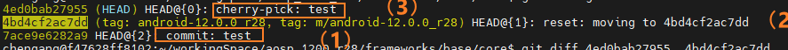
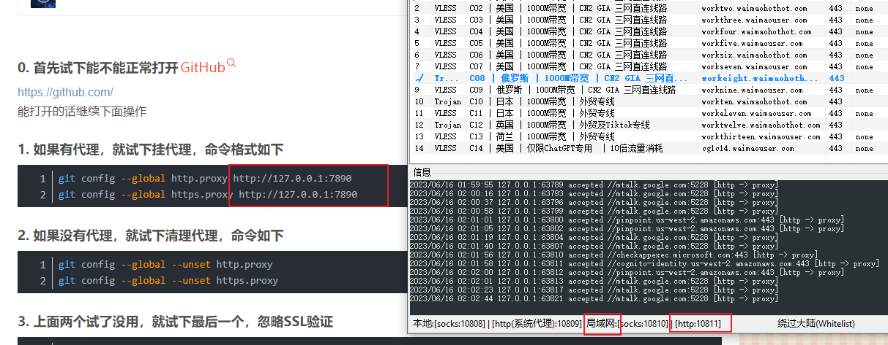

# 结构：


参考： https://www.zhihu.com/question/38305012

可见：

- fech获取时，并未合并到本地仓库

  -------->  推论：cherry-pick需要的commiId，可以利用fech获取


# git

git reflog  -----------历史上所有的commit（`即使被删除了、即使被修改了`）

​                                <font color='red'>记录了所有引起HEAD指针变化的原因</font>：真正commit、或reset、或checkout  或  pull  或 merge  或  clone

> **如何读reflog？**
>
> （1）新增一笔提交 7ace9e6282a9
>
> （2）reset: moving to 4bd4cf2ac7dd  （~~自然from 7ace9e6282a~~）
>
> （3）cherry-pick  test 节点（~~自然，形成新节点~~）
>
> 


范围：


参考： https://www.jianshu.com/p/7e4cef3863e7


git commit 技巧：

```java
git commit --amend --no-edit    ----->   不会弹出commit message (reusing the previous one)
```


在 bash中自定义
见《任意ide（As 或 clion 等）,  默认 Terminal 如何使用 bash?》

```cpp
//.myfunction.sh

#!/bin/bash
#git_rebase

function g_pu0 {
	export a=$(git rev-parse --abbrev-ref HEAD) #
	git.exe push --progress "origin" $a:$a   #注意第一个a是本地分支名，第二个是远程分支名: feature/xa_powerterminal:feature/xa_power
}

function g_pul {
	export a=$(git rev-parse --abbrev-ref HEAD)
	git.exe push --force-with-lease --progress "origin" $a:$a
}

function g_re_f{
	#获得某个分支所对应的远程分支
	export a=$(git rev-parse --abbrev-ref --symbolic-full-name @{u})
	git.exe fetch -v --progress "origin"
	git clean -d -fx
	#git fetch --all
	git reset --hard HEAD~5  #仓有问题的话,有垃圾文件,直接 rebase 远端,可能会冲突。先 reset 本地--->强制 
	git reset --hard $a #仓有问题的话,有垃圾文件,直接 rebase 远端,可能会冲突。先 reset 本地--->强制 rebase 
	remotesBranch="remotes/"$a     #shell拼接字符串 
	git rebase $remotesBranch 
}

function g_re{
	#获得某个分支所对应的远程分支
	#git fetch --all
	git.exe fetch -v --progress "origin"
	export a=$(git rev-parse --abbrev-ref --symbolic-full-name @ {u}) git rebase $remotesBranch
	remotesBranch="remotes/"$a
	git rebase $remotesBranch 
}

function g_co{
	git commit -m "修改"
}

function g_he{
    echo "git.exe fetch -v --progress "origin""
    echo "git log-graph"
    echo ": git rev-parse --abbrev-ref--symbolic-full-name @{u}"
    echo "dos2unix unix2dos filename"
    echo "删除 git 没有track的文件:git clean -d -fx"
    echo "git checkout -b feature/master_enterprise2 remotes/origin/master"
    echo "推送： git push -u origin feature/master_local:main -f; 本地分支：远程分支获取：git branch -a"
    echo  "=========commit==============="
    echo  "git commit -m "TraceNo.:REQ20220“"
    echo "git commit --amend --no-edit ----->   不会弹出commit message (reusing the previous one)"
    echo "删除某个commit: git rebase -i 9fd15a8880fc41290d7dc^  修改pick为drop"
    echo " commit: git rebase -i HEAD~4 s"
    echo "任意调整 commit顺序、任意合并: git rebase -i commitID,id之后的所有commit"
}

function g_st {
	git status
}
function g_fe { 
	git fetch
}
function g_co_am {
	git commit --amend
}
```


总结: 

git restore 文件名 

会撤销到缓存区(如果有,add区域)  或者  当前版本库版本(commit区)


git命令回退  某个文件  到指定的版本：

```cpp
git chekcout 版本号 文件
```


如何合并？TODO


git大文件：

```cpp
git Ifs pull  // 下载大文件

git lfs uninstall
```


管理:

硬件十几个人对软件一个人,提十几个单,修改txt 

---------->   应该让硬件出一个人,软件只对接这个一个人。硬件单提一个


## 两个节点之间差异

```cpp
git diff 8064cff987043e2272746a46e3240e4ea7336e5b 3e62c71ee5dd6c714fc0bdeaa7faf0a2aa226e91  >  /1111.txt
```


两个节点之间差异,  提取所有文件名:

```cpp
git diff 8064cff987043e2272746a46e3240e4ea7336e5b 3e62c71ee5dd6c714fc0bdeaa7faf0a2aa226e91 --name-only >./1111.txt
```


## 本地有代码修改，如何 rebase 主干(或其他分支):

方法一: 新建一个分支(可行):

```cpp
git fetch (必须把远端的拉下来)
git checkout -b feature/sh_c111111_x214  remotes/origin/master
pick之前分支的修改
```


<font color='red'>方法二 (优选):</font>

git fetch (把远端的拉下来,本质: 拉到本地,但是没有合入到本地, git log 不变---》git fetch 对代码没有任何影响)

git rebase origin/master (当前分支的base,同步到本地的 origin/master)

验证:git log,  代码跟新到新,  而且自己的 commit 在第一个


方法三: 命令的小乌龟界面操作:

拉取+小乌龟界面rebase (找到 head origin,右键 rebase)


## git push

提交代码：

```java
git.exe push --progress "origin" 本地分支:远程分支
本地分支:远程分支 由 git branch -a  查得
```


注意：

没有本地分支时（安卓开发中多见），提交代码：

```java
git push origin HEAD:refs/for/branch_master
----》以HEAD替代本地分支？
```


## 配置git + 查看已经配置

参考： https://blog.csdn.net/lovedingd/article/details/121288974

主要配置有：

> 1、user.name、user.email
>
> 2、proxy配置


查看配置：

> 1、git config --list
>
> 2、 .gitconfig文件


## 技巧：git管理之 建立本地git

**技巧：  当本地文件夹   没有git时，可以自己创建git 仓库管理**

> https://blog.csdn.net/qq_33254766/article/details/114095922    本地创建一个 Git 仓库


--------------------->  技巧：  <font color='red'>想要保存两个git仓的改动diff </font>，可以在公共根路径上创建自己的git仓库


## 技巧：用git  diff作为代码的持久化存储

如何保留自己的需求修改？

> 法一：保留需求设计 & ppt
>
> 法二：保留 diff文件（<font color='red'>极优</font>） --------->  （1）很容易复原  （2）diff文件很小


# 报错

## 关于git push   443链接 报错：

```
fatal: unable to access 'https://github.com/KentTJ/-book.git/': Recv failure: Connection was reset

或

fatal: unable to access 'https://github.com/KentTJ/-book.git/': Failed to connect to github.com port 443 
```





参考：

https://blog.csdn.net/qq_42777433/article/details/129026998?spm=1001.2101.3001.6650.1&utm_medium=distribute.pc_relevant.none-task-blog-2%7Edefault%7ECTRLIST%7ERate-1-129026998-blog-123270948.235%5Ev38%5Epc_relevant_default_base3&depth_1-utm_source=distribute.pc_relevant.none-task-blog-2%7Edefault%7ECTRLIST%7ERate-1-129026998-blog-123270948.235%5Ev38%5Epc_relevant_default_base3&utm_relevant_index=2

```java
git config --global http.proxy http://127.0.0.1:7890
git config --global https.proxy http://127.0.0.1:7890
```


# 参考：

https://blog.csdn.net/renfeideboke/article/details/130930418?spm=1001.2101.3001.6661.1&utm_medium=distribute.pc_relevant_t0.none-task-blog-2%7Edefault%7ECTRLIST%7ERate-1-130930418-blog-120540819.235%5Ev38%5Epc_relevant_anti_t3&depth_1-utm_source=distribute.pc_relevant_t0.none-task-blog-2%7Edefault%7ECTRLIST%7ERate-1-130930418-blog-120540819.235%5Ev38%5Epc_relevant_anti_t3&utm_relevant_index=1      Git创建本地分支并关联远程分支

