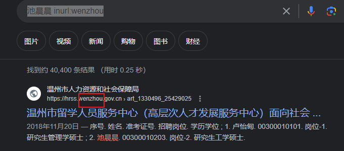
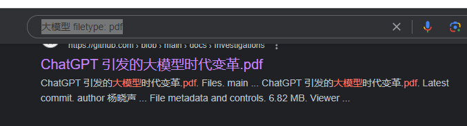

# 目录


# 补充搜索

博客很多情况下，挑选：点赞数、评论数、码年龄大的

失落的夏天：https://blog.csdn.net/rzleilei/category_6506586.html

gityuan

努比亚团队


# 搜索途径：


google > 微信搜一搜 > 公众号 >  细分论坛或APP  >  百度等


# Google网站的搜索

参考：https://blog.csdn.net/u013527834/article/details/134094782  【资源信息获取方法】

默认搜索 = 标题匹配 或 正文匹配

匹配：

> title匹配：
>
> > ~~intitle:iPhone15摄像头进灰~~
> > ----------> ~~相当于在标题中匹配： iPhone15   摄像头   进灰 三个词，不论顺序~~
>
> text匹配：
>
> ```java
> intext:池晨晨浙江大学
> ```
>
> 
>
> 非精准匹配：
>
> > 池晨晨浙江大学 -------> 搜出来有可能是： 池晨晨  浙江工业  大学
>
> 精准匹配：
>
> > "池晨晨"   "浙江大学"
>
> 匹配含空格的：
>
> > "hello kitty"  ------>  自然

限定网站来源：

> 池晨晨 inurl:wenzhou     -----------> 限定温州相关的网站
>
> 

找pdf：（**大多pdf专业文档**）

> 大模型 filetype: pdf
>
> 