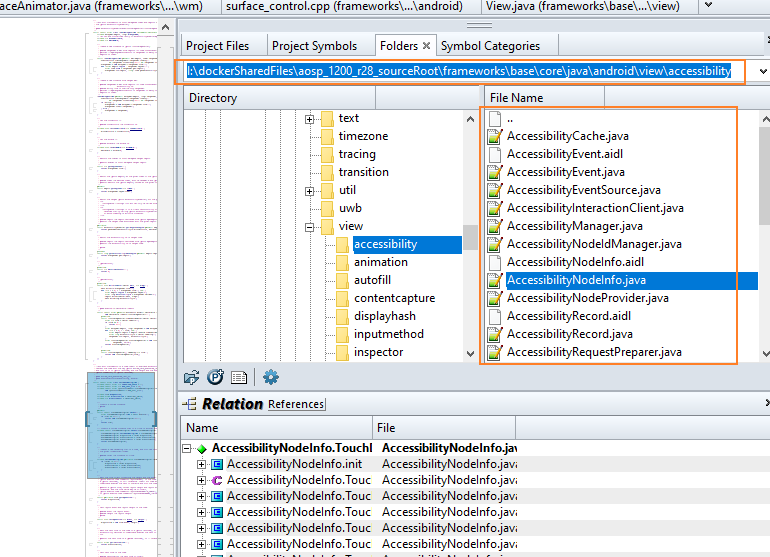

[TOC]

# source insight

## 优缺点：

优点：

1、**极优：**可以source 两个完全不同路径下的代码  （自然，可以取整个aosp多个小部分代码）。AS的source code 必须在工程目录下！！！

2、内存使用是AS的二十分之一    **极优**


3、可以同时java和cpp同时跳转！     **极优**

4、不需要像AS与clion，需要事先搭建一个可以编译环境，然后copy代码

5、对于远程服务器代码，不需要copy！！！！（由第一点决定！！！）   **极优**

6、看代码大杀器-----java、cpp、c同时OK

​      

缺点：

断点调试不行？？？？------>  办法：与AS结合使用！


## TODO:com   导入工程

重点：需要sync(否则，两个文件之间无法跳转)


## 一些设置

### search Bar保留


### 选中高亮：


## 快捷键：


文本replace （当前文件）------> 修改为 ctrl  + R

​                         全局替换 ----------》 修改为 ctrl  + shift + R

~~close file   -------->  ctrl  + W~~

~~copy file path  ------->  ctrl  +shift + c~~

 ctrl  + O : open这个window

​         


### 多行注释

法一：

> Source Insight4.0已有多行注释功能：
>
> 

注释：ctrl  + /     反注释：加shift


法二：利用宏macro

快捷键：  ctrl  + /


%accordion%macro MultiLineComment()%accordion%


```shell
macro MultiLineComment()

{
    hwnd = GetCurrentWnd()
    selection = GetWndSel(hwnd)
    LnFirst =GetWndSelLnFirst(hwnd)      //取首行行号
    LnLast =GetWndSelLnLast(hwnd)      //取末行行号
    hbuf = GetCurrentBuf()

    if(GetBufLine(hbuf, 0) =="//magic-number:tph85666031"){
        stop
    }

    Ln = Lnfirst
    buf = GetBufLine(hbuf, Ln)
    len = strlen(buf)

    while(Ln <= Lnlast) {
        buf = GetBufLine(hbuf, Ln)  //取Ln对应的行
        if(buf ==""){                   //跳过空行
            Ln = Ln + 1
            continue
        }

        if(StrMid(buf, 0, 1) == "/"){       //需要取消注释,防止只有单字符的行
            if(StrMid(buf, 1, 2) == "/"){
                PutBufLine(hbuf, Ln, StrMid(buf, 2, Strlen(buf)))
            }
        }

        if(StrMid(buf,0,1) !="/"){          //需要添加注释
            PutBufLine(hbuf, Ln, Cat("//", buf))
        }
        Ln = Ln + 1
    }
    SetWndSel(hwnd, selection)
}
```


%/accordion%


参考：

https://it.cha138.com/tech/show-390752.html

https://jingyan.baidu.com/article/90808022d313a2fd91c80f93.html


### recent file：

-----> TODO：快捷键一直不生效


退而求其次的方法：

> 1、快捷键CTRL + E ------> File menu
>
> 
>
> 2、把 recent file至于File menu第一个，便可以键盘切换recent file
>
> 
>
> 3、效果：
>
> 


### 查看调用点


或：


## 查找关键字

如果 关键字是符号 ，比较快  -------> SI之前已经做好了

如果不是，会很慢（比AS慢很多）------->  可见，**AS是加载了所有文件，而SI只是符号表**


**技巧：**

> 通过左右来遍历搜索结果，不用切换到results文件
>
> 


## 查看当前文件所处的位置

打开同级其他文件，也很方便



## 背景色设置


## ~~安装~~

### Source Insight 试用过期，激活

参考：https://www.jianshu.com/p/0dd919d660a3

方法：

> 修改激活日期，修改为当天，然后就可以再用90天了
>
> 修改C:\ProgramData\Source Insight\4.0的si4.lic
>
> 


## 参考：

https://www.dandelioncloud.cn/article/details/1578906401210855426