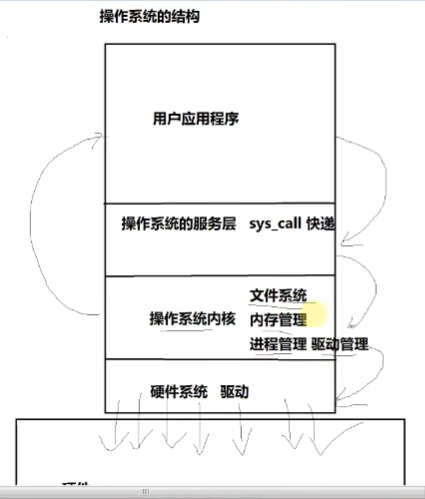
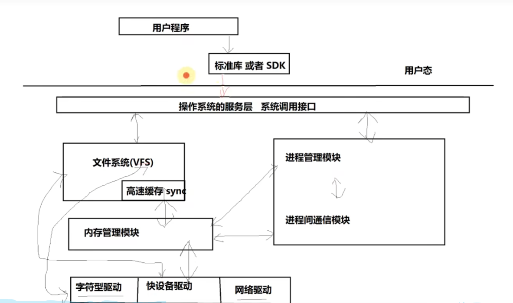
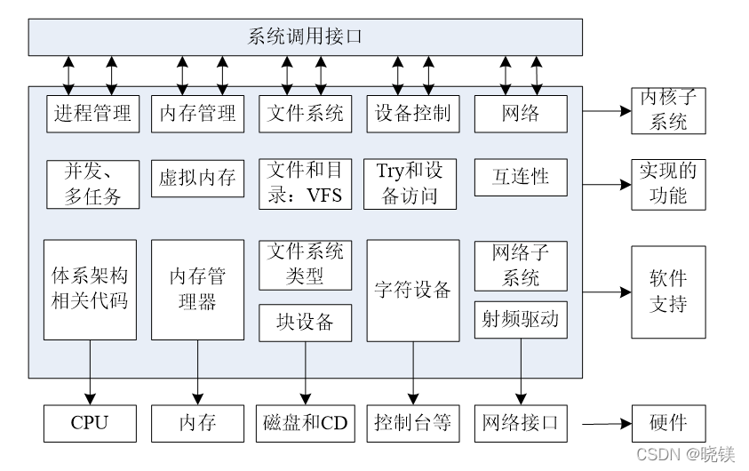

# 目录

[TOC]

#  操作系统工作方式（从一次调用来看）------纵向0层：

一次调用，从上到下:

底层：硬件

操作系统的工作方式: 

1.把操作系统从用户态 切换到 内核态 (用户应用程序 到 内核的流程) 

2.实现操作系统的系统调用(操作系统服务层) 

3.应用操作系统提供的底层函数,进行功能实现 

​      3.1 操作系统的驱动结构

 4.推出后从内核态切换到用户态

# 模块之间的关系（联系）：

高速缓存  其实就是一块内存。。。计算机写文件时，先存储在高速缓存里，最后一把写入硬件磁盘

# 模块之间的独立性（割裂）

独立性：

> 注意区分：管理层与实现层
>
> 提供接口的，不实现；实现的，不提供接口

为什么要这样做呢？

易于维护和升级？？？？ https://www.bilibili.com/video/BV1tQ4y1d7mo?t=3147.4

高版本和低版本内核之间的区别：

> 1、内核驱动的管理模式并没有巨大的改变。一段时间3个阶段的跳段： 零散型 分层型 设备树
>
> ​         ~~多的只是内核驱动的种类~~
>
> 2、进程的管理方式并没有巨大的改变 
>         ~~进程的调度算法发生了改变~~

------>  总之，就是没有大的改变

技巧： 不变的看老版本 -------- 主

​           变化的，看新版本 -------- 次

# ~~linux kernel 功能划分图-----静态~~

[Linux内核](https://so.csdn.net/so/search?q=Linux内核&spm=1001.2101.3001.7020)是linux操作系统的核心部分，它实现了操作系统的五大功能模块：

进程管理

[内存管理](https://so.csdn.net/so/search?q=内存管理&spm=1001.2101.3001.7020)

文件系统

设备控制

网络

CD ------光盘

# 中断

目的：为啥要有中断？

​      1、硬件的中断响应  ----》  内核驱动的中断

​      2、系统调用的函数响应（sys_call） ----》 系统调用

​      3、自定义中断 ----》 软件的软中断模式

​      4、信号中断(kill-signalnum)   ----》 进程间通信（有助于了解信号的使用、创建等）

​      5、系统的异常和错误 ----》 系统的异常获取；了解系统异常的作用

后面的章节，围绕着这五个目的

## Linux的中断机制

分类，自然：

硬件中断：比如：~~电脑主机的8259A类似的硬件中断控制芯片发出的中断、ARM中断控制器发出的中断~~

软件中断：异常：第一类：CPU	自行保留的中断  -------》 TODO: 不懂

​                                               系统调用异常

## 中断工作流程

任意系统中断都有：

----------------保存-------------------------

做CPU工作模式的转化

进行寄存器的拷贝与压栈 ----->  TODO: 这个目的是啥？

设置中断异常向量表

保存正常运行的函数返回值

------------------执行--------------------------

跳转到对应的中断服务函数上运行

------------------恢复-------------------------

进行模式的复原以及寄存器的复原

跳转回正常工作的函数地址继续运行

（对应video： https://www.bilibili.com/video/BV1tQ4y1d7mo?t=1252.7&p=2）

------------->  总之，

字面上来看：

中断就是 中断CPU，做其他事情（运行中断服务函数）

## linux中中断你的工作流程

---------------保存(中断前)-------------------------

1、~~将所有的寄存器值入栈~~  -----》 上面的保存

寄存器比如：

> 8086中的       SS EFLAGS ESP  CS  EIP（错误码）   
>
> ARM中的（r0-r15）

 2、将异常码入栈（中断号）

3、将当前的函数返回值进行入栈(为了在中断执行后能够找到在哪中断的, 能够复原)

------------------执行(中断)--------------------------

4、调用对应的中断服务函数

------------------恢复(中断后)-------------------------

5、出栈函数返回值

6、返回所有入栈的寄存器值

### 代码结构

**重要代码结构：**

|                          | 保存过程（123），恢复过程（56） |   调用？    |       中断的执行过程（4）       |
| ------------------------ | :-----------------------------: | :---------: | :-----------------------------: |
| 硬件中断的处理过程       |              asm.s              | <---------> |             traps.c             |
| 软件及系统调用的处理过程 |          system_call.s          | <---------> | fork.c  signal.c  exit.c  sys.c |

结论：

> 软中断和硬中断，完全两条路
>
> 系统调用 同 软中断

 

### 中断的代码实现

以 asm.s ---》 traps.c为例：

